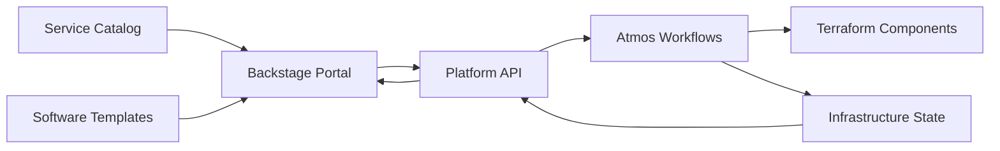

# Monorepo Architecture: Infrastructure + Catalog + Backstage

## ✅ **Strong Suitability Assessment**

Your current Terraform/Atmos repository is **highly suitable** for monorepo evolution due to:

### Existing Monorepo Patterns
- **17 Terraform components** with consistent structure and shared dependencies
- **Cross-component integration** (VPC → EKS → EKS-addons dependency chains)
- **Unified tooling** (Gaia CLI managing all components)
- **Consistent standards** (tagging, security, naming conventions across all components)
- **Atomic changes** (infrastructure updates often require coordinated multi-component changes)

### Natural Integration Points
- **Atmos catalog** → **Backstage service catalog** (direct mapping)
- **Component templates** → **Software templates** (enhancement, not replacement)
- **Gaia CLI** → **Backstage backend APIs** (extension of existing tooling)

## 🏗️ **Recommended Monorepo Structure**

```
tf-atmos/ (Enhanced Monorepo)
├── infrastructure/                    # Current infrastructure code (preserve)
│   ├── components/terraform/          # Existing 17 components
│   │   ├── vpc/
│   │   ├── eks/
│   │   ├── rds/
│   │   ├── backstage/                # NEW: Backstage infrastructure component
│   │   └── ...
│   ├── stacks/                       # Existing Atmos stacks
│   ├── workflows/                    # Existing Atmos workflows  
│   └── gaia/                         # Enhanced Python CLI
│
├── catalog/                          # NEW: Service catalog for IDP
│   ├── services/                     
│   │   ├── compute/
│   │   │   ├── web-service/
│   │   │   │   ├── catalog-info.yaml
│   │   │   │   ├── template.yaml
│   │   │   │   ├── cost-estimate.yaml
│   │   │   │   └── docs/
│   │   │   └── background-job/
│   │   ├── data/
│   │   │   ├── postgres/
│   │   │   ├── redis/
│   │   │   └── s3-bucket/
│   │   └── networking/
│   │       ├── vpc/
│   │       ├── load-balancer/
│   │       └── cdn/
│   ├── templates/                    # Backstage software templates
│   │   ├── full-stack-app/
│   │   ├── microservice/
│   │   ├── data-pipeline/
│   │   └── terraform-component/
│   └── systems/                      # System definitions
│       ├── user-management.yaml
│       ├── payment-processing.yaml
│       └── data-platform.yaml
│
├── platform/                        # NEW: Backstage developer portal
│   ├── backstage/
│   │   ├── app-config.yaml          # Main Backstage configuration
│   │   ├── packages/
│   │   │   ├── backend/             # Custom backend with Atmos integration
│   │   │   │   ├── Dockerfile
│   │   │   │   ├── package.json
│   │   │   │   └── src/
│   │   │   │       ├── plugins/
│   │   │   │       │   ├── atmos/   # Custom Atmos plugin
│   │   │   │       │   ├── cost/    # Cost tracking plugin  
│   │   │   │       │   └── compliance/
│   │   │   │       └── index.ts
│   │   │   └── app/                 # Frontend customizations
│   │   ├── catalog/
│   │   │   ├── all.yaml            # Catalog discovery root
│   │   │   ├── locations.yaml      # External catalog locations
│   │   │   └── defaults/           # Default entities
│   │   └── kubernetes/
│   │       ├── deployment.yaml
│   │       ├── service.yaml
│   │       └── ingress.yaml
│   └── api/                         # NEW: Platform APIs (enhanced Gaia)
│       ├── main.py                  # FastAPI server
│       ├── routers/
│       │   ├── atmos.py            # Atmos workflow endpoints
│       │   ├── catalog.py          # Service catalog endpoints
│       │   ├── cost.py             # Cost analysis endpoints
│       │   └── compliance.py       # Policy compliance endpoints  
│       ├── models/
│       └── tests/
│
├── docs/                            # Enhanced unified documentation
│   ├── platform/                    # Platform usage guides
│   ├── services/                    # Service catalog documentation  
│   ├── infrastructure/              # Existing infrastructure docs
│   └── runbooks/                    # Operational procedures
│
├── tools/                           # Shared tooling and automation
│   ├── scripts/                     # Existing scripts
│   │   ├── list_stacks.sh
│   │   ├── onboard_developer.sh     # NEW
│   │   └── catalog_sync.py          # NEW
│   ├── generators/                  # Code generators
│   │   ├── component_scaffolder.py
│   │   ├── documentation_generator.py
│   │   └── catalog_generator.py
│   └── ci-cd/
│       ├── jenkins/
│       ├── github-actions/          # NEW
│       └── atlantis/
│
├── examples/                        # Working examples and demos
│   ├── full-stack-application/
│   ├── microservice-deployment/
│   └── data-pipeline/
│
└── templates/                       # Enhanced templates
    ├── environments/                # Environment templates  
    ├── components/                  # Component templates
    └── applications/                # Application templates
```

## 🔄 **Migration Strategy**

### Phase 1: Repository Restructuring (Week 1)
```bash
# Preserve all existing functionality
mkdir -p infrastructure platform catalog tools/generators

# Move existing code (preserve git history)
git mv components infrastructure/
git mv stacks infrastructure/
git mv workflows infrastructure/  
git mv gaia infrastructure/
```

### Phase 2: Service Catalog Development (Weeks 2-4)
```yaml
# Transform existing catalog structure
# From: stacks/catalog/terraform/vpc/defaults.yaml
# To: catalog/services/networking/vpc/catalog-info.yaml

apiVersion: backstage.io/v1alpha1
kind: Component
metadata:
  name: vpc-service
  title: Virtual Private Cloud
  description: "Secure, isolated network foundation for AWS workloads"
  annotations:
    atmos.tools/component: vpc
    cost.platform.com/monthly-estimate: "$45-90"
    compliance.platform.com/level: "production"
spec:
  type: infrastructure-service
  lifecycle: production
  owner: platform-team
  system: networking
  providesApis:
    - vpc-api
  consumesApis: []
  dependsOn:
    - resource:aws-account
```

### Phase 3: Backstage Integration (Weeks 5-8) 
```yaml
# platform/backstage/app-config.yaml
app:
  title: Internal Developer Platform
  baseUrl: https://platform.company.com

backend:
  baseUrl: https://api.platform.company.com
  plugins:
    atmos:
      baseUrl: http://localhost:8000/api/v1/atmos

catalog:
  locations:
    # Discover all service definitions
    - type: file
      target: ../../catalog/services/*/catalog-info.yaml
    # Discover infrastructure components
    - type: file  
      target: ../../infrastructure/components/terraform/*/catalog-info.yaml
    # Discover software templates
    - type: file
      target: ../../catalog/templates/*/template.yaml

  rules:
    - allow: [Component, System, API, Resource, Location, Template]
```

### Phase 4: API Integration (Weeks 9-12)
```python
# platform/api/routers/atmos.py
from fastapi import APIRouter, HTTPException
from ..services.atmos_client import AtmosClient

router = APIRouter(prefix="/atmos", tags=["atmos"])
atmos = AtmosClient()

@router.post("/provision")
async def provision_service(request: ServiceRequest):
    """Provision infrastructure via Atmos workflow"""
    
    # Validate request against policies
    validation = await validate_service_request(request)
    if not validation.valid:
        raise HTTPException(400, validation.errors)
    
    # Estimate costs
    cost_estimate = await estimate_cost(request)
    if cost_estimate.monthly > request.budget_limit:
        raise HTTPException(400, f"Cost estimate ${cost_estimate.monthly} exceeds budget")
    
    # Execute Atmos workflow
    job = await atmos.execute_workflow(
        workflow="onboard-environment",
        tenant=request.tenant,
        account=request.account, 
        environment=request.environment,
        variables=request.variables
    )
    
    return ProvisioningResponse(
        job_id=job.id,
        status="provisioning",
        estimated_completion="15 minutes",
        cost_estimate=cost_estimate,
        endpoints=[]
    )
```

## 🔗 **Integration Architecture**

### Atmos ↔ Backstage Integration


### CI/CD Integration Pattern
```yaml
# Enhanced Atmos workflow with Backstage integration
workflows:
  deploy-full-stack:
    description: "Deploy infrastructure + application + update catalog"
    steps:
      # 1. Infrastructure provisioning (existing)
      - name: provision-infrastructure
        command: atmos terraform apply vpc eks rds -s $STACK
        
      # 2. Application deployment (new)
      - name: deploy-application  
        command: |
          cd platform/backstage
          kubectl apply -f kubernetes/
          
      # 3. Catalog synchronization (new)
      - name: sync-catalog
        command: |
          python tools/generators/catalog_generator.py --sync
          curl -X POST $BACKSTAGE_API/catalog/refresh
```

## 💡 **Key Benefits of Monorepo Approach**

### 1. **Unified Developer Experience**
- **Single repository** for all platform interactions
- **Consistent tooling** (enhanced Gaia CLI) across all layers
- **Atomic changes** across infrastructure, catalog, and platform

### 2. **Operational Excellence**  
- **Shared CI/CD pipelines** with appropriate workspace isolation
- **Unified security model** with consistent secrets management
- **Single source of truth** for all platform components

### 3. **Enhanced Integration**
- **Direct file references** between infrastructure and catalog
- **Shared configuration** across all platform layers
- **Consistent versioning** and release management

### 4. **Developer Productivity**
- **Single clone** gives developers access to everything
- **Cross-layer visibility** for troubleshooting and optimization
- **Shared documentation** and examples in one place

## 🛡️ **Workspace Isolation Strategy**

### Access Control via CODEOWNERS
```bash
# .github/CODEOWNERS
/infrastructure/                    @platform-team @infrastructure-leads
/catalog/                          @platform-team @service-owners  
/platform/backstage/               @platform-team @frontend-team
/platform/api/                     @platform-team @backend-team
/docs/                             @platform-team @tech-writers
```

### Selective CI/CD
```yaml
# .github/workflows/infrastructure.yml
on:
  push:
    paths:
      - 'infrastructure/**'
      - 'stacks/**' 
      - 'workflows/**'

# .github/workflows/platform.yml  
on:
  push:
    paths:
      - 'platform/**'
      - 'catalog/**'
```

### Workspace Management
```json
// package.json (monorepo root)
{
  "workspaces": [
    "platform/backstage",
    "platform/api", 
    "tools/generators"
  ],
  "scripts": {
    "build:infrastructure": "cd infrastructure && gaia validate",
    "build:platform": "cd platform/backstage && npm run build",
    "build:api": "cd platform/api && python -m pytest",
    "build:all": "npm run build:infrastructure && npm run build:platform && npm run build:api"
  }
}
```

## 🎯 **Success Metrics**

### Repository Health
- **Build time**: <10 minutes for full monorepo validation
- **Test coverage**: >90% across all workspaces  
- **Documentation**: 100% of services have current docs
- **Dependency management**: Zero vulnerable dependencies

### Developer Experience
- **Clone to productive**: <30 minutes for new developers
- **Cross-layer changes**: Single PR can update infrastructure + catalog + platform
- **Discovery time**: <5 minutes to find relevant service or component
- **Contribution rate**: >10% of changes from non-platform teams

## 🚀 **Implementation Timeline**

- **Week 1-2**: Repository restructuring and preservation
- **Week 3-6**: Service catalog development and component mapping  
- **Week 7-10**: Backstage deployment and configuration
- **Week 11-14**: API development and integration
- **Week 15-16**: Testing, documentation, and rollout

**Result**: A unified monorepo that serves as the single source of truth for your Internal Developer Platform while preserving all existing Atmos excellence and enabling future growth.

Your current repository structure provides an excellent foundation for this evolution - the multi-tenant architecture, component organization, and workflow automation are exactly what's needed for a successful IDP monorepo approach.