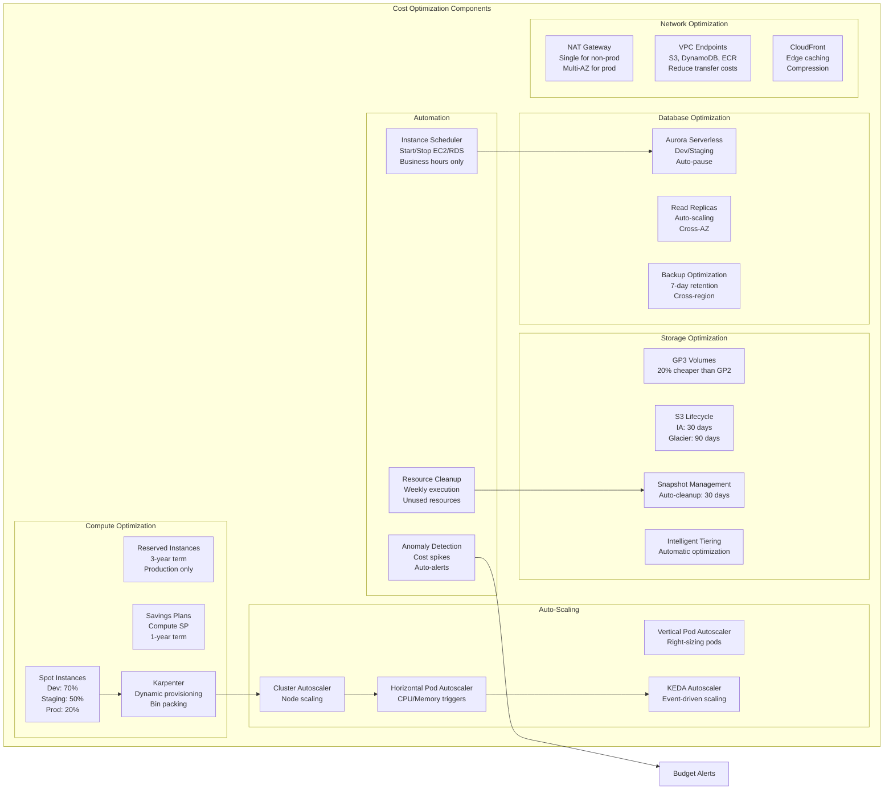
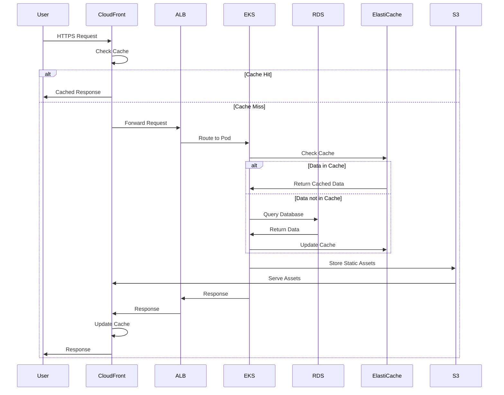
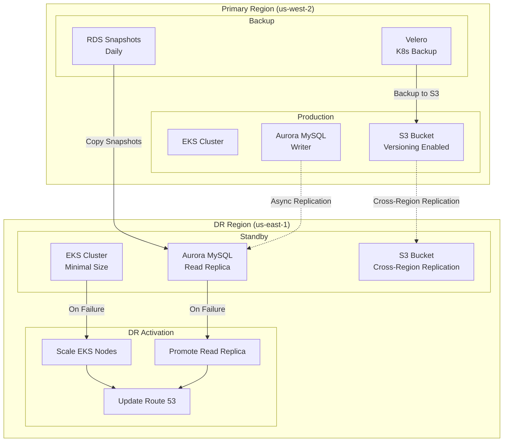
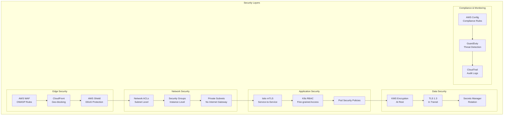
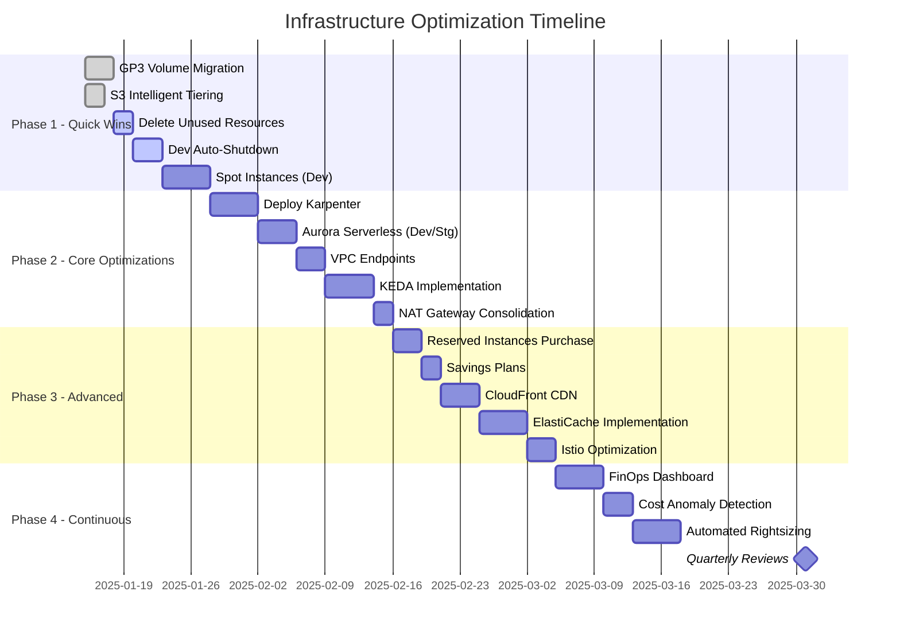

# AWS Infrastructure Architecture - Optimized Design

## High-Level Architecture Diagram

```mermaid
graph TB
    subgraph "Multi-Account Organization"
        subgraph "Management Account"
            ORG[AWS Organizations]
            BILLING[Consolidated Billing]
            SCT[Service Control Policies]
        end
        
        subgraph "Network Account"
            TGW[Transit Gateway]
            VPCEND[VPC Endpoints]
            DX[Direct Connect]
        end
        
        subgraph "Development Account"
            subgraph "Dev VPC - 10.0.0.0/16"
                DEV_PUB[Public Subnets<br/>10.0.1.0/24 - 10.0.3.0/24]
                DEV_PRIV[Private Subnets<br/>10.0.10.0/24 - 10.0.12.0/24]
                DEV_DB[Database Subnets<br/>10.0.20.0/24 - 10.0.22.0/24]
                DEV_NAT[Single NAT Gateway]
                DEV_ALB[Application Load Balancer]
            end
            
            subgraph "Dev Compute"
                DEV_EKS[EKS Cluster<br/>Spot: 70%<br/>On-Demand: 30%]
                DEV_NODES[Node Groups<br/>t3.medium spot<br/>Auto-shutdown]
            end
            
            subgraph "Dev Data"
                DEV_RDS[Aurora Serverless v2<br/>Min: 0.5 ACU<br/>Auto-pause: 10min]
                DEV_CACHE[ElastiCache<br/>t3.micro]
            end
        end
        
        subgraph "Staging Account"
            subgraph "Staging VPC - 10.1.0.0/16"
                STG_PUB[Public Subnets<br/>10.1.1.0/24 - 10.1.3.0/24]
                STG_PRIV[Private Subnets<br/>10.1.10.0/24 - 10.1.12.0/24]
                STG_DB[Database Subnets<br/>10.1.20.0/24 - 10.1.22.0/24]
                STG_NAT[Single NAT Gateway]
                STG_ALB[Application Load Balancer]
            end
            
            subgraph "Staging Compute"
                STG_EKS[EKS Cluster<br/>Spot: 50%<br/>Reserved: 30%<br/>On-Demand: 20%]
                STG_NODES[Node Groups<br/>t3.large mixed<br/>Business hours only]
            end
            
            subgraph "Staging Data"
                STG_RDS[Aurora MySQL<br/>db.t3.medium<br/>No Multi-AZ]
                STG_CACHE[ElastiCache<br/>cache.t3.small]
            end
        end
        
        subgraph "Production Account"
            subgraph "Prod VPC - 10.2.0.0/16"
                PRD_PUB[Public Subnets<br/>10.2.1.0/24 - 10.2.3.0/24]
                PRD_PRIV[Private Subnets<br/>10.2.10.0/24 - 10.2.12.0/24]
                PRD_DB[Database Subnets<br/>10.2.20.0/24 - 10.2.22.0/24]
                PRD_NAT[3x NAT Gateways<br/>One per AZ]
                PRD_ALB[Application Load Balancer<br/>Multi-AZ]
                PRD_NLB[Network Load Balancer]
            end
            
            subgraph "Prod Compute"
                PRD_EKS[EKS Cluster<br/>Reserved: 60%<br/>Savings Plans: 30%<br/>On-Demand: 10%]
                PRD_NODES[Node Groups<br/>m5.xlarge reserved<br/>Karpenter managed]
            end
            
            subgraph "Prod Data"
                PRD_RDS[Aurora MySQL<br/>db.r5.xlarge<br/>Multi-AZ<br/>2 Read Replicas]
                PRD_CACHE[ElastiCache Redis<br/>cache.r6g.large<br/>Cluster mode]
            end
        end
        
        subgraph "Shared Services Account"
            subgraph "Monitoring & Logging"
                CW[CloudWatch<br/>Dashboards]
                XRAY[X-Ray<br/>Tracing]
                ES[OpenSearch<br/>Log Analytics]
            end
            
            subgraph "Security & Compliance"
                SM[Secrets Manager]
                KMS[KMS Keys]
                CONFIG[AWS Config]
                GUARD[GuardDuty]
            end
            
            subgraph "Cost Management"
                COST[Cost Explorer]
                BUDGET[Budgets & Alerts]
                SAVINGS[Savings Plans]
                RI[Reserved Instances]
            end
        end
    end
    
    subgraph "External Services"
        CF[CloudFront CDN]
        R53[Route 53 DNS]
        S3[S3 Buckets<br/>Intelligent Tiering]
        ECR[ECR Registry]
    end
    
    %% Network Connections
    TGW -.-> DEV_PRIV
    TGW -.-> STG_PRIV
    TGW -.-> PRD_PRIV
    
    %% Internet Access
    DEV_NAT --> Internet
    STG_NAT --> Internet
    PRD_NAT --> Internet
    
    %% Load Balancer Connections
    CF --> PRD_ALB
    R53 --> CF
    
    %% VPC Endpoints
    VPCEND -.-> S3
    VPCEND -.-> ECR
    VPCEND -.-> SM
    
    classDef production fill:#ff9999
    classDef staging fill:#ffcc99
    classDef development fill:#99ccff
    classDef shared fill:#99ff99
    classDef external fill:#ffff99
    
    class PRD_EKS,PRD_RDS,PRD_CACHE,PRD_NAT production
    class STG_EKS,STG_RDS,STG_CACHE,STG_NAT staging
    class DEV_EKS,DEV_RDS,DEV_CACHE,DEV_NAT development
    class CW,XRAY,ES,SM,KMS,CONFIG,GUARD,COST,BUDGET,SAVINGS,RI shared
    class CF,R53,S3,ECR external
```

## Cost Optimization Architecture

## Kubernetes Architecture (EKS)

```mermaid
graph TB
    subgraph "EKS Control Plane (Managed)"
        API[API Server]
        ETCD[etcd]
        SCHED[Scheduler]
        CM[Controller Manager]
    end
    
    subgraph "Node Groups"
        subgraph "System Node Group"
            SYS1[Node 1<br/>Reserved Instance]
            SYS2[Node 2<br/>Reserved Instance]
            SYS3[Node 3<br/>Reserved Instance]
        end
        
        subgraph "Application Node Group"
            APP1[Node 1<br/>Spot Instance]
            APP2[Node 2<br/>Spot Instance]
            APP3[Node 3<br/>On-Demand]
        end
        
        subgraph "Batch Node Group"
            BATCH1[Node 1<br/>Spot Instance]
            BATCH2[Node 2<br/>Spot Instance]
        end
    end
    
    subgraph "Add-ons & Controllers"
        subgraph "Networking"
            ALB_CTRL[AWS Load Balancer Controller]
            ISTIO[Istio Service Mesh]
            EXTDNS[External DNS]
        end
        
        subgraph "Scaling"
            KARPENTER[Karpenter]
            KEDA_CTRL[KEDA]
            HPA_CTRL[HPA Controller]
        end
        
        subgraph "Security"
            CERT[Cert Manager]
            SECRETS[External Secrets Operator]
            POL[Network Policies]
        end
        
        subgraph "Observability"
            PROM[Prometheus]
            FLUENTBIT[Fluent Bit]
            ADOT[ADOT Collector]
        end
    end
    
    API --> SYS1
    API --> APP1
    API --> BATCH1
    
    KARPENTER --> APP1
    KARPENTER --> BATCH1
    
    ALB_CTRL --> ISTIO
    CERT --> SECRETS
    PROM --> ADOT
```

## Data Flow Architecture

## Disaster Recovery Architecture

## Security Architecture

## Cost Breakdown by Environment

| Component | Development | Staging | Production |
|-----------|------------|---------|------------|
| **Compute (EKS)** | | | |
| Instance Strategy | 70% Spot, 30% On-Demand | 50% Spot, 30% RI, 20% On-Demand | 60% RI, 30% SP, 10% On-Demand |
| Node Count | 1-10 (auto-scale) | 2-15 (auto-scale) | 3-30 (auto-scale) |
| Instance Types | t3.medium | t3.large | m5.xlarge |
| Monthly Cost | ~$300 | ~$800 | ~$4,000 |
| **Database (RDS)** | | | |
| Type | Aurora Serverless v2 | Aurora MySQL | Aurora MySQL Multi-AZ |
| Instance Class | 0.5-2 ACU | db.t3.medium | db.r5.xlarge |
| Read Replicas | 0 | 0 | 2 |
| Monthly Cost | ~$100 | ~$200 | ~$1,500 |
| **Storage** | | | |
| EBS Type | gp3 | gp3 | gp3 + io2 |
| S3 Lifecycle | Aggressive | Moderate | Conservative |
| Monthly Cost | ~$50 | ~$150 | ~$500 |
| **Network** | | | |
| NAT Gateways | 1 | 1 | 3 |
| Data Transfer | Minimal | Moderate | High |
| Monthly Cost | ~$45 | ~$45 | ~$135 |
| **Total Monthly** | **~$495** | **~$1,195** | **~$6,135** |

## Implementation Timeline

---

**Document Version**: 1.0  
**Created**: 2025-08-16  
**Architecture Review Cycle**: Quarterly  
**Next Review**: Q2 2025