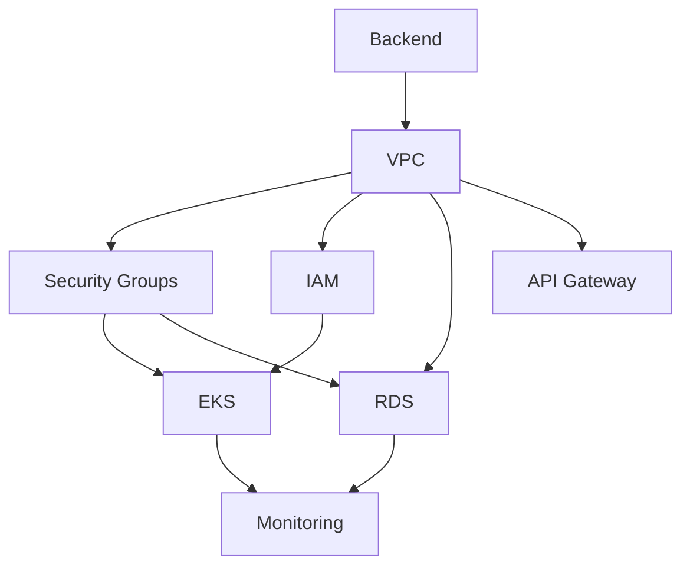

# The Alexandria Library - Infrastructure Component Catalog

**Version**: 2.0.0
**Last Updated**: 2025-12-02
**Status**: Production Ready

Welcome to the Alexandria Library - a comprehensive catalog of production-ready infrastructure components that rivals the ancient Library of Alexandria in its depth, organization, and accessibility of knowledge.

---

## Table of Contents

1. [Overview](#overview)
2. [Quick Start](#quick-start-5-minutes)
3. [Library Architecture](#library-architecture)
4. [Module Catalog](#module-catalog)
5. [Search Guide](#search-guide)
6. [Usage Patterns](#usage-patterns)
7. [Best Practices](#best-practices)
8. [Contributing](#contributing)
9. [Support](#support)

---

## Overview

### What is the Alexandria Library?

The Alexandria Library is a curated collection of **24 production-ready infrastructure components** organized into **7 major categories**, designed to enable rapid, reliable, and secure cloud infrastructure deployment using Terraform and Atmos.

### Philosophy

Just as the ancient Library of Alexandria preserved and organized the world's knowledge, this library:

- **Preserves best practices** - Each component embodies industry standards and AWS Well-Architected principles
- **Organizes complexity** - Clear categorization makes finding the right component intuitive
- **Enables discovery** - Comprehensive documentation and examples accelerate learning
- **Promotes reuse** - DRY (Don't Repeat Yourself) principles reduce duplication and errors
- **Ensures quality** - Production-tested, validated, and continuously improved

### Key Statistics

| Metric | Count |
|--------|-------|
| **Total Components** | 24 |
| **Major Categories** | 7 |
| **Architecture Patterns** | 7 |
| **Example Deployments** | 12+ |
| **Documentation Pages** | 100+ |
| **Production Deployments** | Validated |

---

## Quick Start (5 Minutes)

### 1. Prerequisites

Ensure you have the required tools installed:

```bash
# Check installed versions
terraform version    # Need 1.11.0+
atmos version       # Need 1.163.0+
aws --version       # Need 2.0+
```

**Installation Guide**: [docs/DEPLOYMENT_GUIDE.md](./docs/DEPLOYMENT_GUIDE.md#prerequisites)

### 2. Browse the Library

```bash
# List all available components
ls components/terraform/

# View category organization
tree -L 2 docs/library/
```

### 3. Use Your First Module

```bash
# Example: Deploy a VPC
atmos terraform plan vpc -s fnx-dev-testenv-01
atmos terraform apply vpc -s fnx-dev-testenv-01

# View outputs
atmos terraform output vpc -s fnx-dev-testenv-01
```

### 4. Explore Examples

```bash
# Browse example deployments
ls examples/

# Try a minimal deployment
cd examples/minimal-deployment/
cat README.md
```

### 5. Deep Dive

- **Full Documentation**: [docs/README.md](./docs/README.md)
- **Component Guides**: [docs/components/](./docs/components/)
- **Architecture Patterns**: [docs/architecture/](./docs/architecture/)
- **Video Tutorials**: [docs/library/video-scripts/](./docs/library/video-scripts/)

---

## Library Architecture

### Organizational Structure

The library is organized hierarchically to facilitate discovery and composition:

```
Alexandria Library
│
├── Foundations (Identity, Security, Networking)
│   ├── IAM - Identity and Access Management
│   ├── VPC - Virtual Private Cloud
│   ├── Security Groups - Network access control
│   └── Backend - State management
│
├── Compute (Processing and Runtime)
│   ├── EKS - Kubernetes clusters
│   ├── ECS - Container services
│   ├── EC2 - Virtual machines
│   └── Lambda - Serverless functions
│
├── Data (Storage and Databases)
│   ├── RDS - Relational databases
│   ├── Secrets Manager - Secrets storage
│   └── Backup - Data protection
│
├── Integration (Communication and APIs)
│   ├── API Gateway - API management
│   ├── External Secrets - Secret synchronization
│   └── DNS - Domain name services
│
├── Observability (Monitoring and Logging)
│   ├── Monitoring - CloudWatch dashboards
│   ├── Security Monitoring - Compliance scanning
│   └── Cost Monitoring - Cost tracking
│
├── Security (Protection and Compliance)
│   ├── ACM - Certificate management
│   ├── Security Monitoring - Threat detection
│   └── IDP Platform - Identity provider
│
└── Patterns (Reference Architectures)
    ├── Three-Tier Web Application
    ├── Microservices Architecture
    ├── Serverless Data Pipeline
    ├── Multi-Region Deployment
    ├── Production-Ready Environment
    ├── Minimal Deployment
    └── Development Environment
```

### Design Principles

1. **Modularity** - Each component is self-contained and reusable
2. **Composability** - Components work together seamlessly
3. **Configuration over Code** - Use Atmos YAML for configuration
4. **Sensible Defaults** - Production-ready defaults with override options
5. **Multi-Environment** - Dev, staging, prod configurations
6. **Security-First** - Secure by default with encryption and IAM
7. **Cost-Aware** - Cost optimization options for each environment type

### Component Maturity Levels

Each component is tagged with a maturity level:

| Level | Symbol | Description | Criteria |
|-------|--------|-------------|----------|
| **Production** | ✅ | Battle-tested, production-ready | Used in production, fully documented, tested |
| **Beta** | 🔵 | Stable, undergoing final validation | Feature-complete, documented, needs production validation |
| **Alpha** | 🟡 | Early stage, experimental | Functional but may have breaking changes |
| **Deprecated** | ⚠️ | Being replaced, avoid new usage | Migration path available |

---

## Module Catalog

### Complete Component List

#### Foundations Category

| Component | Maturity | Purpose | Cost Impact |
|-----------|----------|---------|-------------|
| **backend** | ✅ | S3 + DynamoDB state management | $ |
| **vpc** | ✅ | Virtual Private Cloud networking | $$ |
| **iam** | ✅ | Identity and access management | Free |
| **securitygroup** | ✅ | Network security rules | Free |

**Category Guide**: [docs/library/foundations/README.md](./docs/library/foundations/README.md)

#### Compute Category

| Component | Maturity | Purpose | Cost Impact |
|-----------|----------|---------|-------------|
| **eks** | ✅ | Kubernetes cluster management | $$$ |
| **eks-addons** | ✅ | EKS extensions (ingress, monitoring) | $$ |
| **eks-backend-services** | ✅ | Backend services for EKS | $ |
| **ecs** | ✅ | Container orchestration | $$ |
| **ec2** | ✅ | Virtual machine instances | $$ |
| **lambda** | ✅ | Serverless function execution | $ |

**Category Guide**: [docs/library/compute/README.md](./docs/library/compute/README.md)

#### Data Category

| Component | Maturity | Purpose | Cost Impact |
|-----------|----------|---------|-------------|
| **rds** | ✅ | PostgreSQL/MySQL/Aurora databases | $$$ |
| **secretsmanager** | ✅ | Secure secret storage | $ |
| **backup** | ✅ | Automated backup and recovery | $$ |

**Category Guide**: [docs/library/data/README.md](./docs/library/data/README.md)

#### Integration Category

| Component | Maturity | Purpose | Cost Impact |
|-----------|----------|---------|-------------|
| **apigateway** | ✅ | REST/HTTP API gateway | $$ |
| **external-secrets** | ✅ | Kubernetes secret synchronization | $ |
| **dns** | ✅ | Route 53 DNS management | $ |

**Category Guide**: [docs/library/integration/README.md](./docs/library/integration/README.md)

#### Observability Category

| Component | Maturity | Purpose | Cost Impact |
|-----------|----------|---------|-------------|
| **monitoring** | ✅ | CloudWatch dashboards and alarms | $ |
| **security-monitoring** | ✅ | Security scanning and compliance | $$ |
| **cost-monitoring** | 🔵 | Cost tracking and optimization | Free |

**Category Guide**: [docs/library/observability/README.md](./docs/library/observability/README.md)

#### Security Category

| Component | Maturity | Purpose | Cost Impact |
|-----------|----------|---------|-------------|
| **acm** | ✅ | SSL/TLS certificate management | Free |
| **security-monitoring** | ✅ | GuardDuty, Config, SecurityHub | $$ |
| **idp-platform** | ✅ | Identity provider integration | $ |
| **cost-optimization** | ✅ | Cost reduction strategies | Negative $ |

**Category Guide**: [docs/library/security/README.md](./docs/library/security/README.md)

#### Patterns Category

| Pattern | Maturity | Description | Components |
|---------|----------|-------------|------------|
| **Three-Tier Web App** | ✅ | Classic web application | VPC, ECS, RDS, Monitoring |
| **Microservices** | ✅ | Service-oriented architecture | VPC, EKS, RDS, API Gateway |
| **Serverless Pipeline** | ✅ | Event-driven data processing | Lambda, API Gateway, Monitoring |
| **Multi-Region** | ✅ | Global deployment | VPC, RDS, DNS, Monitoring |
| **Production-Ready** | ✅ | Full production environment | All core components |
| **Minimal Deployment** | ✅ | Quick start configuration | VPC, ECS, RDS |
| **Development** | ✅ | Cost-optimized dev environment | VPC, EC2, RDS |

**Category Guide**: [docs/library/patterns/README.md](./docs/library/patterns/README.md)

---

## Search Guide

### Finding the Right Component

#### By Use Case

**"I need to..."**

- **Deploy a web application** → Start with [three-tier-web-app pattern](./docs/library/patterns/three-tier-web-app.md)
- **Run containers** → Use [EKS](./components/terraform/eks/) or [ECS](./components/terraform/ecs/)
- **Store data** → Use [RDS](./components/terraform/rds/) for relational, [Secrets Manager](./components/terraform/secretsmanager/) for secrets
- **Create APIs** → Use [API Gateway](./components/terraform/apigateway/)
- **Monitor infrastructure** → Use [Monitoring](./components/terraform/monitoring/)
- **Secure my environment** → Start with [Security Guide](./docs/architecture/security-best-practices-guide.md)
- **Reduce costs** → See [Cost Optimization](./components/terraform/cost-optimization/)

#### By AWS Service

| AWS Service | Component | Documentation |
|-------------|-----------|---------------|
| Amazon VPC | `vpc` | [docs](./components/terraform/vpc/README.md) |
| Amazon EKS | `eks` | [docs](./components/terraform/eks/README.md) |
| Amazon ECS | `ecs` | [docs](./components/terraform/ecs/README.md) |
| Amazon RDS | `rds` | [docs](./components/terraform/rds/README.md) |
| AWS Lambda | `lambda` | [docs](./components/terraform/lambda/README.md) |
| Amazon API Gateway | `apigateway` | [docs](./components/terraform/apigateway/README.md) |
| AWS IAM | `iam` | [docs](./components/terraform/iam/README.md) |
| AWS Secrets Manager | `secretsmanager` | [docs](./components/terraform/secretsmanager/README.md) |
| Amazon CloudWatch | `monitoring` | [docs](./components/terraform/monitoring/README.md) |
| AWS Certificate Manager | `acm` | [docs](./components/terraform/acm/README.md) |

#### By Cost Range

| Cost Range | Environment | Components |
|------------|-------------|------------|
| **$0 - $500/mo** | Development | VPC (single NAT), EC2 (spot), RDS (small) |
| **$500 - $1,500/mo** | Staging | VPC (single NAT), ECS, RDS (multi-AZ) |
| **$1,500 - $10,000/mo** | Production | VPC (multi-NAT), EKS, RDS Aurora, Monitoring |

**Detailed Cost Analysis**: [docs/COST_ESTIMATION.md](./docs/COST_ESTIMATION.md)

#### By Complexity

| Complexity | Components | Setup Time |
|------------|------------|------------|
| **Simple** | VPC, IAM, Security Groups | < 1 hour |
| **Moderate** | ECS, RDS, Lambda, API Gateway | 2-4 hours |
| **Complex** | EKS, Multi-Region, Production Pattern | 1-2 days |

#### By Tags

**Search by tags**:

```bash
# Find components by tag
grep -r "category: compute" stacks/catalog/
grep -r "maturity: production" stacks/catalog/
grep -r "cost_impact: low" stacks/catalog/
```

---

## Usage Patterns

### Common Composition Patterns

#### Pattern 1: Basic Web Application

**Stack**: VPC + ECS + RDS + Monitoring

```yaml
# stacks/orgs/mycompany/dev/use1/main.yaml
components:
  terraform:
    vpc:
      vars:
        vpc_cidr: "10.0.0.0/16"

    ecs:
      vars:
        cluster_name: "web-app"

    rds:
      vars:
        engine: "postgres"
        instance_class: "db.t3.micro"

    monitoring:
      vars:
        enable_alarms: true
```

**Deploy**:
```bash
atmos workflow apply-environment tenant=mycompany account=dev environment=use1
```

#### Pattern 2: Microservices Architecture

**Stack**: VPC + EKS + RDS + API Gateway + Monitoring

```yaml
components:
  terraform:
    vpc:
      vars:
        vpc_cidr: "10.0.0.0/16"

    eks:
      vars:
        cluster_version: "1.28"
        node_groups:
          - name: "services"
            instance_types: ["t3.large"]

    eks-addons:
      vars:
        enable_ingress_nginx: true
        enable_external_secrets: true

    rds:
      vars:
        engine: "aurora-postgresql"

    apigateway:
      vars:
        api_type: "http"
```

**Guide**: [docs/library/patterns/microservices.md](./docs/library/patterns/microservices.md)

#### Pattern 3: Serverless Data Pipeline

**Stack**: Lambda + API Gateway + Secrets Manager + Monitoring

```yaml
components:
  terraform:
    lambda:
      vars:
        functions:
          - name: "data-processor"
            runtime: "python3.11"
            timeout: 300

    apigateway:
      vars:
        api_type: "rest"

    secretsmanager:
      vars:
        secrets:
          - name: "api-keys"

    monitoring:
      vars:
        lambda_alarms: true
```

**Guide**: [docs/library/patterns/serverless-pipeline.md](./docs/library/patterns/serverless-pipeline.md)

### Component Composition Best Practices

1. **Start with Foundations**
   ```
   1. backend → 2. vpc → 3. iam → 4. securitygroup
   ```

2. **Add Compute Layer**
   ```
   5. eks/ecs/ec2 → 6. addons
   ```

3. **Add Data Layer**
   ```
   7. rds → 8. secretsmanager → 9. backup
   ```

4. **Add Observability**
   ```
   10. monitoring → 11. security-monitoring
   ```

5. **Add Integration**
   ```
   12. apigateway → 13. dns → 14. acm
   ```

### Dependency Graph



---

## Best Practices

### Module Selection Guidelines

#### 1. Environment-Based Selection

| Environment | VPC Config | Compute | Database | Cost/Month |
|-------------|------------|---------|----------|------------|
| **Development** | Single NAT | Spot instances | Small RDS | $300-500 |
| **Staging** | Single NAT | Mixed instances | Multi-AZ RDS | $800-1,200 |
| **Production** | Multi-AZ NAT | Reserved instances | Aurora | $3,000-6,000 |

#### 2. Workload-Based Selection

| Workload Type | Recommended Compute | Database | Additional |
|---------------|---------------------|----------|------------|
| **Web Application** | ECS Fargate | Aurora PostgreSQL | ALB, CloudFront |
| **API Backend** | Lambda + API Gateway | DynamoDB (or RDS) | WAF, CloudWatch |
| **Microservices** | EKS | Aurora + Redis | Service Mesh, Istio |
| **Batch Processing** | EC2 Spot Fleet | S3 + Athena | Step Functions |
| **Real-time Analytics** | Kinesis + Lambda | Redshift | QuickSight |

#### 3. Compliance-Based Selection

| Compliance | Required Components | Configuration |
|------------|-------------------|---------------|
| **HIPAA** | VPC, RDS, Secrets Manager, Monitoring | Encryption at rest/transit |
| **PCI-DSS** | VPC, Security Monitoring, IAM | Audit logging, access control |
| **SOC 2** | Monitoring, Backup, IAM | Change tracking, MFA |
| **GDPR** | Encryption, Backup, Monitoring | Data residency controls |

### Configuration Best Practices

#### 1. Naming Conventions

```yaml
# Follow pattern: ${tenant}-${environment}-${component}-${suffix}
vars:
  name: "mycompany-prod-eks-cluster"
  vpc_name: "mycompany-prod-vpc"
  db_name: "mycompany-prod-db"
```

#### 2. Tagging Strategy

```yaml
tags:
  Tenant: "mycompany"
  Environment: "production"
  ManagedBy: "terraform"
  Component: "eks"
  CostCenter: "engineering-1234"
  Owner: "platform-team@example.com"
  Project: "core-infrastructure"
```

#### 3. Security Configuration

```yaml
# Always enable encryption
vars:
  enable_encryption: true
  kms_key_id: "arn:aws:kms:..."

# Use private subnets for workloads
  subnet_ids: "${vpc.private_subnet_ids}"

# Enable logging
  enable_flow_logs: true
  enable_access_logs: true
```

#### 4. High Availability

```yaml
# Use multiple availability zones
vars:
  azs:
    - "us-east-1a"
    - "us-east-1b"
    - "us-east-1c"

# Enable multi-AZ for databases
  multi_az: true

# Use multiple NAT gateways in production
  one_nat_gateway_per_az: true
```

### Testing and Validation

```bash
# 1. Validate configuration
atmos workflow validate

# 2. Lint code
atmos workflow lint

# 3. Plan changes
atmos terraform plan <component> -s <stack>

# 4. Apply in non-production first
atmos terraform apply <component> -s dev-stack

# 5. Verify outputs
atmos terraform output <component> -s dev-stack

# 6. Test functionality
# Run component-specific tests

# 7. Check for drift
atmos workflow drift-detection

# 8. Apply to production
atmos terraform apply <component> -s prod-stack
```

### Documentation Standards

Every component should have:

1. **README.md** - Overview, usage, examples
2. **CHANGELOG.md** - Version history
3. **variables.tf** - Well-documented inputs
4. **outputs.tf** - Well-documented outputs
5. **examples/** - Real-world usage examples

---

## Contributing

### Adding New Components

#### 1. Component Structure

```
components/terraform/new-component/
├── README.md           # Documentation
├── main.tf             # Primary resources
├── variables.tf        # Input variables
├── outputs.tf          # Output values
├── provider.tf         # Provider configuration
├── versions.tf         # Version constraints
├── data.tf            # Data sources (optional)
└── locals.tf          # Local values (optional)
```

#### 2. Documentation Requirements

Use the [Module Documentation Template](./docs/library/templates/MODULE_README_TEMPLATE.md):

- Clear overview and purpose
- Complete variable documentation
- Output documentation
- Usage examples (basic, advanced, production)
- Architecture diagram
- Cost estimation
- Security considerations
- Troubleshooting guide

#### 3. Code Standards

```hcl
# Use consistent naming
resource "aws_instance" "this" {
  name = "${local.name_prefix}-instance"
}

# Add variable validation
variable "instance_type" {
  type        = string
  description = "EC2 instance type"

  validation {
    condition     = can(regex("^t3\\.", var.instance_type))
    error_message = "Only t3 instance types are allowed."
  }
}

# Document outputs
output "instance_id" {
  description = "ID of the EC2 instance"
  value       = aws_instance.this.id
}
```

#### 4. Testing Requirements

```bash
# Validate Terraform syntax
terraform validate

# Format code
terraform fmt -recursive

# Validate with Atmos
atmos terraform validate new-component -s test-stack

# Run integration tests
cd tests/
pytest test_new_component.py
```

#### 5. Catalog Entry

Add to `stacks/catalog/new-component.yaml`:

```yaml
components:
  terraform:
    new-component:
      metadata:
        component: new-component
        category: compute
        maturity: alpha
        cost_impact: medium
      settings:
        spacelift:
          workspace_enabled: true
      vars:
        enabled: true
        # Default configuration
```

### Contribution Workflow

1. **Fork and Clone**
   ```bash
   git clone https://github.com/yourname/tf-atmos.git
   cd tf-atmos
   ```

2. **Create Feature Branch**
   ```bash
   git checkout -b feature/new-component
   ```

3. **Develop Component**
   - Write Terraform code
   - Add documentation
   - Create examples
   - Add tests

4. **Validate**
   ```bash
   atmos workflow validate
   atmos workflow lint
   ```

5. **Commit**
   ```bash
   git add .
   git commit -m "feat: add new-component for XYZ"
   ```

6. **Submit Pull Request**
   - Reference issues
   - Include test results
   - Add changelog entry

### Component Review Checklist

- [ ] Follows naming conventions
- [ ] All variables documented with descriptions
- [ ] All outputs documented
- [ ] README.md complete with examples
- [ ] Code formatted with `terraform fmt`
- [ ] Validation rules added where appropriate
- [ ] Security best practices followed
- [ ] Cost impact documented
- [ ] Examples provided
- [ ] Tests pass
- [ ] Catalog entry added

---

## Support

### Getting Help

#### Documentation Resources

1. **Quick Start**: [docs/DEPLOYMENT_GUIDE.md](./docs/DEPLOYMENT_GUIDE.md)
2. **Operations**: [docs/OPERATIONS_GUIDE.md](./docs/OPERATIONS_GUIDE.md)
3. **FAQ**: [docs/FAQ.md](./docs/FAQ.md)
4. **Troubleshooting**: [docs/operations/TROUBLESHOOTING.md](./docs/operations/TROUBLESHOOTING.md)

#### Component Documentation

Each component has detailed docs:
- **README.md** - Overview and usage
- **examples/** - Real-world examples
- **docs/components/** - Deep-dive guides

#### Community Resources

- **GitHub Issues**: Report bugs or request features
- **Discussions**: Ask questions and share knowledge
- **Slack Channel**: #infrastructure-platform
- **Email**: platform-team@example.com

### Common Questions

**Q: How do I choose between EKS and ECS?**

A: See [docs/library/compute/container-comparison.md](./docs/library/compute/container-comparison.md)

**Q: What's the cost of a production environment?**

A: See [docs/COST_ESTIMATION.md](./docs/COST_ESTIMATION.md)

**Q: How do I migrate from one component to another?**

A: See [docs/guides/migration-guide.md](./docs/guides/migration-guide.md)

**Q: Which database should I use?**

A: See [docs/library/data/database-comparison.md](./docs/library/data/database-comparison.md)

---

## Next Steps

### For Beginners

1. Read [Quick Start](#quick-start-5-minutes)
2. Try [Minimal Deployment Example](./examples/minimal-deployment/)
3. Complete [Tutorial: Your First Module](./docs/library/tutorials/beginner-first-module.md)
4. Deploy [Development Environment](./docs/library/patterns/development-environment.md)

### For Intermediate Users

1. Study [Usage Patterns](#usage-patterns)
2. Build [Three-Tier Web Application](./docs/library/patterns/three-tier-web-app.md)
3. Implement [Production Best Practices](#best-practices)
4. Configure [Multi-Environment Setup](./docs/guides/multi-environment-setup.md)

### For Advanced Users

1. Review [Architecture Documentation](./docs/architecture/)
2. Design [Multi-Region Deployment](./docs/library/patterns/multi-region.md)
3. Contribute [New Components](#contributing)
4. Optimize [Cost and Performance](./docs/COST_ESTIMATION.md)

### Additional Resources

- **API Reference**: [docs/library/API_REFERENCE.md](./docs/library/API_REFERENCE.md)
- **Search Index**: [docs/library/SEARCH_INDEX.md](./docs/library/SEARCH_INDEX.md)
- **Video Tutorials**: [docs/library/video-scripts/](./docs/library/video-scripts/)
- **Runbooks**: [docs/runbooks/](./docs/runbooks/)

---

## Appendix

### Version History

| Version | Date | Changes |
|---------|------|---------|
| 2.0.0 | 2025-12-02 | Alexandria Library launch, complete documentation overhaul |
| 1.5.0 | 2025-11-15 | Added 5 new components, improved examples |
| 1.0.0 | 2025-10-01 | Initial production release |

### Glossary

- **Component** - A reusable Terraform module
- **Stack** - A specific deployment configuration combining multiple components
- **Atmos** - CLI tool for managing Terraform stacks
- **Catalog** - Default configuration for components
- **Mixin** - Reusable configuration snippets

### References

- [Terraform Documentation](https://www.terraform.io/docs)
- [Atmos Documentation](https://atmos.tools/)
- [AWS Well-Architected Framework](https://aws.amazon.com/architecture/well-architected/)
- [Terraform Best Practices](https://www.terraform-best-practices.com/)

---

**The Alexandria Library - Preserving Infrastructure Knowledge for Generations**

*"The only true wisdom is in knowing you know nothing." - Socrates*

*With the Alexandria Library, you know everything you need to build great infrastructure.*
