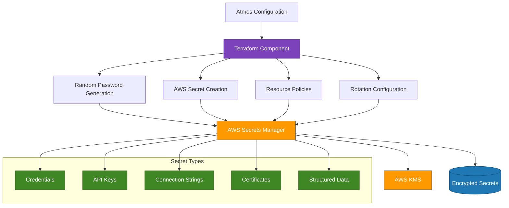

# AWS Secrets Manager Component

This component provides a comprehensive solution for managing secrets in AWS Secrets Manager with hierarchical organization, automatic rotation, and fine-grained access control. It supports multiple secret types, structured data, and cross-account access patterns.

## Architecture

The AWS Secrets Manager component implements the following architecture:



### Secret Path Structure

All secrets follow a hierarchical path structure:

```
<context_name>/<environment>/<path>/<name>
```

For example:
- `myapp/dev/database/credentials`
- `infrastructure/prod/network/vpn-config`

This structure ensures easy organization, discovery, and access control for all secrets.

## Features

- **Hierarchical Secret Structure**: Organizes secrets with a consistent path structure
- **Multiple Secrets Management**: Create and manage multiple secrets in a single component
- **Random Password Generation**: Automatically generate secure random passwords with configurable complexity
- **KMS Encryption**: Enforces encryption using customer-managed KMS keys
- **Secret Rotation**: Configure automatic secret rotation with AWS Lambda functions
- **IAM Policies**: Apply resource-based policies to control access to secrets
- **Structured Data**: Store structured JSON data in secrets
- **Cross-Account Access**: Manage cross-account access to secrets
- **Certificate Management**: Store and manage certificates with integration to ACM

## Usage

### Basic Secret Management

```yaml
components:
  terraform:
    secretsmanager:
      vars:
        enabled: true
        context_name: "myapp"
        name: "app-secrets"
        default_kms_key_id: "${output.kms.key_id}"
        
        secrets:
          db_password:
            name: "db-password"
            description: "Database password for application"
            path: "database"
            generate_random_password: true
          
          api_key:
            name: "api-key"
            description: "External API key"
            path: "integration"
            secret_data: "your-predefined-secret-value"
```

### Structured Data in Secrets

```yaml
components:
  terraform:
    secretsmanager:
      vars:
        context_name: "myapp"
        name: "oauth-config"
        default_kms_key_id: "${output.kms.key_id}"
        
        secrets:
          oauth_config:
            name: "config"
            description: "OAuth configuration"
            path: "auth"
            secret_data: |
              {
                "clientId": "client-id-value",
                "clientSecret": "client-secret-value",
                "tokenEndpoint": "https://auth.example.com/oauth/token",
                "authorizeEndpoint": "https://auth.example.com/oauth/authorize",
                "callbackUrl": "https://api.example.com/callback",
                "scopes": "read write"
              }
```

### Database Credentials Pattern

```yaml
components:
  terraform:
    secretsmanager_db:
      vars:
        context_name: "myapp"
        name: "database-secrets"
        default_kms_key_id: "${output.kms.key_id}"
        
        secrets:
          master_credentials:
            name: "master-credentials"
            description: "RDS master credentials"
            path: "rds"
            generate_random_password: true
          
          connection_string:
            name: "connection-string"
            description: "Database connection string"
            path: "rds"
            secret_data: "postgresql://admin:${output.secretsmanager_db.generated_passwords.master_credentials}@${output.rds.endpoint}:5432/myapp"
```

### Secret Rotation Configuration

```yaml
components:
  terraform:
    secretsmanager:
      vars:
        context_name: "myapp"
        name: "rotating-secrets"
        default_kms_key_id: "${output.kms.key_id}"
        
        secrets:
          rotation_example:
            name: "api-token"
            description: "API token with automatic rotation"
            path: "integration"
            generate_random_password: true
            rotation_automatically: true
            rotation_days: 30
            rotation_lambda_arn: "${output.lambda.rotation_function_arn}"
```

### Cross-Account Access

```yaml
components:
  terraform:
    secretsmanager:
      vars:
        context_name: "shared"
        name: "cross-account-secrets"
        default_kms_key_id: "${output.kms.key_id}"
        
        secrets:
          shared_config:
            name: "shared-config"
            description: "Configuration shared across accounts"
            path: "global"
            secret_data: "shared-configuration-data"
            policy: "${templatefile("${path.module}/policies/cross-account-secret-policy.json.tpl", {
              cross_account_principals = [
                "arn:aws:iam::111122223333:role/cross-account-reader",
                "arn:aws:iam::444455556666:role/cross-account-reader"
              ]
            })}"
```

## Examples

### Integration with RDS

```yaml
# First, create the random password
components:
  terraform:
    secretsmanager:
      vars:
        context_name: "myapp"
        name: "database-secrets"
        secrets:
          db_password:
            name: "password"
            path: "rds"
            generate_random_password: true

# Then, use the generated password for RDS
components:
  terraform:
    rds:
      vars:
        master_password: "${output.secretsmanager.generated_passwords.db_password}"

# Finally, store the complete connection information
components:
  terraform:
    secretsmanager_connection:
      vars:
        context_name: "myapp"
        name: "connection-info"
        secrets:
          db_connection:
            name: "connection"
            path: "rds"
            secret_data: |
              {
                "host": "${output.rds.endpoint}",
                "port": 5432,
                "username": "${output.rds.master_username}",
                "password": "${output.secretsmanager.generated_passwords.db_password}",
                "database": "${output.rds.db_name}"
              }
```

### Integration with EKS and External Secrets

```yaml
# Store certificates in Secrets Manager
components:
  terraform:
    secretsmanager:
      vars:
        context_name: "myapp"
        name: "tls-certificates"
        secrets:
          wildcard_cert:
            name: "wildcard-cert"
            path: "certificates"
            secret_data: |
              {
                "tls.crt": "${ssm:/certificates/wildcard/cert}",
                "tls.key": "${ssm:/certificates/wildcard/key}"
              }

# Use External Secrets to sync to Kubernetes
# Create an ExternalSecret Kubernetes manifest:
apiVersion: external-secrets.io/v1beta1
kind: ExternalSecret
metadata:
  name: wildcard-tls
  namespace: istio-system
spec:
  refreshInterval: "1h"
  secretStoreRef:
    name: aws-secretsmanager
    kind: ClusterSecretStore
  target:
    name: wildcard-tls
  data:
  - secretKey: tls.crt
    remoteRef:
      key: "myapp/dev/certificates/wildcard-cert"
      property: tls.crt
  - secretKey: tls.key
    remoteRef:
      key: "myapp/dev/certificates/wildcard-cert"
      property: tls.key
```

## Accessing Secrets

### From AWS CLI

```bash
aws secretsmanager get-secret-value --secret-id myapp/dev/database/password
```

### From AWS SDK (JavaScript)

```javascript
const AWS = require('aws-sdk');
const secretsManager = new AWS.SecretsManager();

async function getSecret(secretId) {
  const data = await secretsManager.getSecretValue({ SecretId: secretId }).promise();
  return data.SecretString;
}

// Usage
getSecret('myapp/dev/database/password')
  .then(secret => console.log(secret))
  .catch(err => console.error(err));
```

### From Terraform

```hcl
data "aws_secretsmanager_secret" "db_password" {
  name = "myapp/dev/database/password"
}

data "aws_secretsmanager_secret_version" "db_password" {
  secret_id = data.aws_secretsmanager_secret.db_password.id
}

# Access the secret value
locals {
  db_password = data.aws_secretsmanager_secret_version.db_password.secret_string
}
```

### From ECS Task Definition

```json
{
  "containerDefinitions": [
    {
      "name": "app",
      "secrets": [
        {
          "name": "DB_PASSWORD",
          "valueFrom": "arn:aws:secretsmanager:region:account:secret:myapp/dev/database/password-AbCdEf"
        }
      ]
    }
  ]
}
```

## Inputs

| Name | Description | Type | Default | Required |
|------|-------------|------|---------|:--------:|
| `context_name` | Context name for secret path hierarchy | `string` | n/a | yes |
| `secrets` | Map of secrets to create | `map(any)` | `{}` | yes |
| `default_kms_key_id` | Default KMS key ID for encrypting secrets | `string` | `null` | yes |
| `secrets_enabled` | Enable/disable the secrets manager component | `bool` | `true` | no |
| `default_rotation_days` | Default days between rotations | `number` | `30` | no |
| `default_rotation_automatically` | Default auto-rotation setting | `bool` | `false` | no |
| `default_recovery_window_in_days` | Recovery window for deleted secrets | `number` | `30` | no |
| `random_password_length` | Length of generated random passwords | `number` | `32` | no |
| `random_password_special` | Whether to include special characters | `bool` | `true` | no |
| `random_password_override_special` | Custom special characters list | `string` | `"!#$%&*()-_=+[]{}<>:?"` | no |
| `random_password_min_lower` | Min lowercase characters in passwords | `number` | `5` | no |
| `random_password_min_upper` | Min uppercase characters in passwords | `number` | `5` | no |
| `random_password_min_numeric` | Min numeric characters in passwords | `number` | `5` | no |
| `random_password_min_special` | Min special characters in passwords | `number` | `5` | no |

## Outputs

| Name | Description |
|------|-------------|
| `secret_arns` | Map of secret names to their ARNs |
| `secret_ids` | Map of secret names to their secret IDs |
| `secret_names` | Map of secret names to their full path names |
| `secret_versions` | Map of secret names to their version IDs |
| `secret_values` | Map of secret names to their values (sensitive) |
| `generated_passwords` | Map of secret names to their generated random passwords |
| `secret_policies` | Map of secret names to their attached policies |
| `rotation_enabled_secrets` | Map of secret names with rotation enabled |

## Security Best Practices

1. **Never store secrets in code or configuration files**. Always use Secrets Manager.
2. **Always specify a KMS key** for encrypting secrets to ensure granular access control.
3. **Enable rotation** for sensitive secrets to reduce the risk of compromise.
4. **Apply least privilege policies** to limit access to secrets.
5. **Use resource policies** for cross-account access rather than sharing credentials.
6. **Monitor and audit** access to secrets through CloudTrail and CloudWatch.
7. **Define recovery window** to prevent accidental deletion.
8. **Use strong password generation** settings with appropriate complexity.
9. **Organize secrets hierarchically** to manage access control effectively.
10. **Implement secret reference patterns** to ensure consistent secret usage across applications.

## Troubleshooting

### Common Issues and Solutions

| Issue | Possible Solution |
|-------|-------------------|
| **Access Denied Error** | Check IAM permissions for the caller, verify KMS key policy allows the caller to use the key for encryption/decryption |
| **Secret Not Found** | Verify the secret path and name, ensure you're using the complete secret path including context, environment, path, and name |
| **"KMS key not found"** | Verify the KMS key exists and is accessible in the current region and account |
| **Rotation Lambda Failures** | Check Lambda execution role permissions, network configuration, and timeout settings |
| **Cross-Account Access Issues** | Verify resource policy allows the external account and principal, check KMS key policy for cross-account access |
| **GetSecretValue Permission Denied** | Add secretsmanager:GetSecretValue permission to the calling identity's policy |

### Debugging Steps

1. **Enable CloudTrail** to track API calls and identify permission issues
2. **Check CloudWatch Logs** for detailed error messages from rotation Lambdas
3. **Verify IAM Policies** have the correct permissions and resource ARNs
4. **Test Access** using the AWS CLI with the same role as your application
5. **Inspect KMS Key Policies** to ensure they allow the necessary operations

## Related Resources

- [AWS Secrets Manager Documentation](https://docs.aws.amazon.com/secretsmanager/latest/userguide/intro.html)
- [KMS Component](../kms) - For creating encryption keys used with Secrets Manager
- [Lambda Component](../lambda) - For creating rotation functions
- [RDS Component](../rds) - For database integration patterns
- [External Secrets](../external-secrets) - For Kubernetes integration