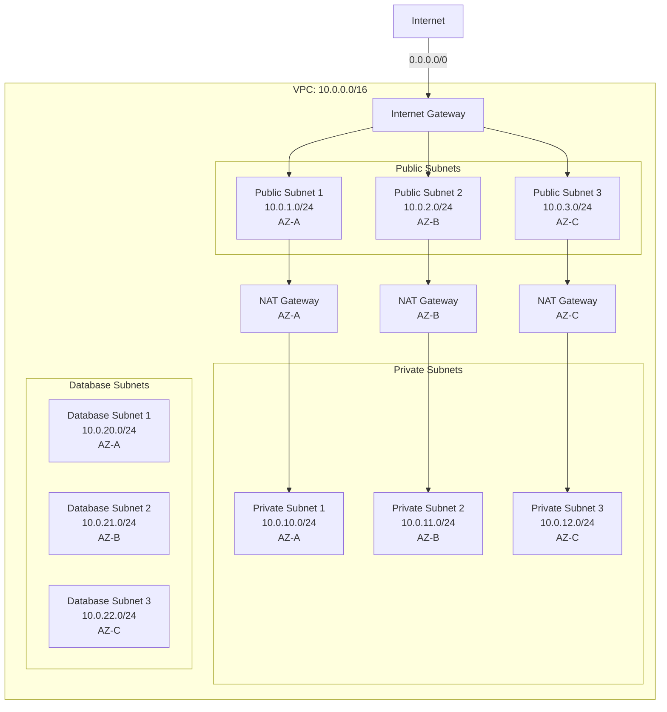
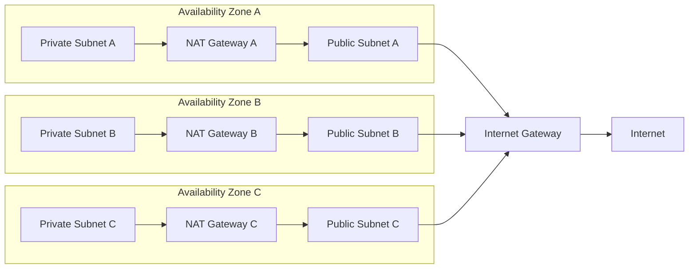
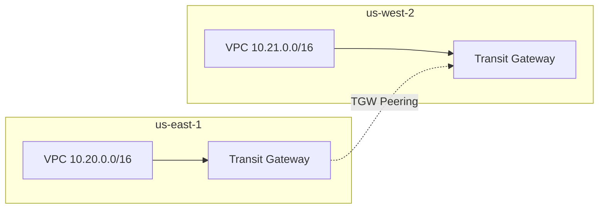

# Network Architecture

Comprehensive network design and implementation guide for the multi-tenant infrastructure platform.

## Table of Contents

1. [Overview](#overview)
2. [VPC Design](#vpc-design)
3. [Subnet Strategy](#subnet-strategy)
4. [Routing Architecture](#routing-architecture)
5. [NAT Gateway Strategy](#nat-gateway-strategy)
6. [VPC Endpoints](#vpc-endpoints)
7. [Security](#security)
8. [Flow Logs](#flow-logs)
9. [Multi-Region Architecture](#multi-region-architecture)
10. [Network Optimization](#network-optimization)

---

## Overview

### Design Principles

1. **Isolation**: Each environment has dedicated VPC
2. **High Availability**: Multi-AZ deployment across 3 availability zones
3. **Security**: Private subnets for workloads, public only for load balancers
4. **Scalability**: CIDR blocks allow for future growth
5. **Cost Optimization**: Right-sized NAT Gateway deployment per environment

### Network Hierarchy

```
Organization
├── Development Account
│   ├── VPC (10.0.0.0/16)
│   └── Environments: dev-01, dev-02, etc.
├── Staging Account
│   ├── VPC (10.10.0.0/16)
│   └── Environments: stg-01, stg-02, etc.
└── Production Account
    ├── VPC (10.20.0.0/16)
    └── Environments: prod-01, prod-02, etc.
```

---

## VPC Design

### CIDR Allocation Strategy

#### Development VPCs (10.0.0.0/8 range)

```
dev-01:  10.0.0.0/16   (65,536 IPs)
dev-02:  10.1.0.0/16   (65,536 IPs)
dev-03:  10.2.0.0/16   (65,536 IPs)
...
dev-09:  10.9.0.0/16   (65,536 IPs)
```

#### Staging VPCs (10.10.0.0/8 range)

```
stg-01:  10.10.0.0/16  (65,536 IPs)
stg-02:  10.11.0.0/16  (65,536 IPs)
stg-03:  10.12.0.0/16  (65,536 IPs)
```

#### Production VPCs (10.20.0.0/8 range)

```
prod-01: 10.20.0.0/16  (65,536 IPs)
prod-02: 10.21.0.0/16  (65,536 IPs)
prod-03: 10.22.0.0/16  (65,536 IPs)
```

### VPC Architecture Diagram



### VPC Configuration

```yaml
# Development Environment
vpc:
  cidr: 10.0.0.0/16
  enable_dns_hostnames: true
  enable_dns_support: true
  enable_flow_logs: true

  tags:
    Environment: dev
    Tier: development
    ManagedBy: terraform

# Production Environment
vpc:
  cidr: 10.20.0.0/16
  enable_dns_hostnames: true
  enable_dns_support: true
  enable_flow_logs: true
  enable_network_firewall: true

  tags:
    Environment: prod
    Tier: production
    ManagedBy: terraform
    Compliance: required
```

---

## Subnet Strategy

### Subnet Layout per VPC

```
VPC: 10.0.0.0/16 (65,536 IPs)
├── Public Subnets (for load balancers, NAT gateways)
│   ├── 10.0.1.0/24 (AZ-A) - 256 IPs
│   ├── 10.0.2.0/24 (AZ-B) - 256 IPs
│   └── 10.0.3.0/24 (AZ-C) - 256 IPs
│
├── Private Subnets (for EKS, EC2, Lambda)
│   ├── 10.0.10.0/24 (AZ-A) - 256 IPs
│   ├── 10.0.11.0/24 (AZ-B) - 256 IPs
│   └── 10.0.12.0/24 (AZ-C) - 256 IPs
│
├── Database Subnets (for RDS, ElastiCache)
│   ├── 10.0.20.0/24 (AZ-A) - 256 IPs
│   ├── 10.0.21.0/24 (AZ-B) - 256 IPs
│   └── 10.0.22.0/24 (AZ-C) - 256 IPs
│
└── Reserved for future use
    └── 10.0.30.0/20 - 10.0.255.0/20
```

### Subnet Types

#### Public Subnets

**Purpose**: Internet-facing resources
- Application Load Balancers
- Network Load Balancers
- NAT Gateways
- Bastion hosts (if required)

**Characteristics**:
- Has route to Internet Gateway (0.0.0.0/0)
- Auto-assign public IP enabled
- Minimal resources to reduce attack surface

**Route Table**:
```
Destination         Target
10.0.0.0/16        local
0.0.0.0/0          igw-xxxxx
```

#### Private Subnets

**Purpose**: Internal workloads
- EKS worker nodes
- EC2 instances
- Lambda functions (VPC attached)
- Internal load balancers

**Characteristics**:
- No direct internet access
- Route through NAT Gateway for outbound
- Majority of workloads run here

**Route Table**:
```
Destination         Target
10.0.0.0/16        local
0.0.0.0/0          nat-xxxxx (per AZ)
```

#### Database Subnets

**Purpose**: Data persistence layer
- RDS instances
- Aurora clusters
- ElastiCache clusters
- DocumentDB clusters

**Characteristics**:
- Isolated from public internet
- No NAT Gateway route (optional based on requirements)
- Strict security group rules

**Route Table**:
```
Destination         Target
10.0.0.0/16        local
# No internet route
```

### Subnet Sizing Guidelines

| Environment | Subnet Size | IPs Available | Use Case |
|------------|-------------|---------------|----------|
| **Development** | /24 | 251 | Small workloads, few nodes |
| **Staging** | /23 | 507 | Medium workloads, moderate nodes |
| **Production** | /22 | 1019 | Large workloads, many nodes |

---

## Routing Architecture

### Route Tables

#### Public Route Table

```hcl
resource "aws_route_table" "public" {
  vpc_id = aws_vpc.main.id

  route {
    cidr_block = "0.0.0.0/0"
    gateway_id = aws_internet_gateway.main.id
  }

  route {
    cidr_block = "10.0.0.0/16"
    gateway_id = "local"
  }

  tags = {
    Name = "public-rt"
    Type = "public"
  }
}
```

#### Private Route Tables (one per AZ)

```hcl
resource "aws_route_table" "private_az1" {
  vpc_id = aws_vpc.main.id

  route {
    cidr_block     = "0.0.0.0/0"
    nat_gateway_id = aws_nat_gateway.az1.id
  }

  route {
    cidr_block = "10.0.0.0/16"
    gateway_id = "local"
  }

  tags = {
    Name = "private-rt-az1"
    Type = "private"
    AZ   = "us-east-1a"
  }
}
```

#### Database Route Table

```hcl
resource "aws_route_table" "database" {
  vpc_id = aws_vpc.main.id

  # Only local routes, no internet access
  route {
    cidr_block = "10.0.0.0/16"
    gateway_id = "local"
  }

  tags = {
    Name = "database-rt"
    Type = "database"
  }
}
```

### Routing Best Practices

1. **Separate route tables per AZ** for private subnets (NAT Gateway failure isolation)
2. **Single route table** for all public subnets
3. **Dedicated route table** for database subnets (no internet access)
4. **Use local routes** for VPC-internal traffic
5. **Minimize routes** to reduce complexity

---

## NAT Gateway Strategy

### Deployment Strategy by Environment

#### Development: Single NAT Gateway

```yaml
Configuration:
  NAT Gateways: 1 (in single AZ)
  Cost: $32.85/month + data processing
  High Availability: No
  Recommendation: Acceptable for dev environments

Rationale:
  - Cost optimization priority
  - Minimal uptime requirements
  - Easy to recreate if failed
```

#### Staging: Single NAT Gateway

```yaml
Configuration:
  NAT Gateways: 1 (in single AZ)
  Cost: $32.85/month + data processing
  High Availability: No
  Recommendation: Acceptable for staging

Rationale:
  - Balance cost vs availability
  - Can tolerate brief outages
  - Backup plan: deploy second NAT if needed
```

#### Production: Multi-AZ NAT Gateways

```yaml
Configuration:
  NAT Gateways: 3 (one per AZ)
  Cost: $98.55/month + data processing
  High Availability: Yes
  Recommendation: Required for production

Rationale:
  - No single point of failure
  - AZ-independent internet access
  - Required for production SLA
```

### NAT Gateway Architecture



### NAT Gateway Configuration

```hcl
# Create NAT Gateway per AZ
resource "aws_nat_gateway" "main" {
  for_each = var.single_nat_gateway ? { "az1" = aws_subnet.public[0] } : {
    for idx, az in var.availability_zones :
    "az${idx + 1}" => aws_subnet.public[idx]
  }

  allocation_id = aws_eip.nat[each.key].id
  subnet_id     = each.value.id

  tags = merge(
    var.tags,
    {
      Name = "nat-${each.key}"
      AZ   = each.value.availability_zone
    }
  )

  depends_on = [aws_internet_gateway.main]
}
```

---

## VPC Endpoints

### Why VPC Endpoints?

Benefits:
1. **Cost Savings**: Reduce data transfer costs
2. **Performance**: Lower latency, no internet traversal
3. **Security**: Traffic stays within AWS network
4. **Compliance**: Data doesn't leave AWS backbone

### Gateway Endpoints (Free)

#### S3 Gateway Endpoint

```hcl
resource "aws_vpc_endpoint" "s3" {
  vpc_id       = aws_vpc.main.id
  service_name = "com.amazonaws.${var.region}.s3"

  route_table_ids = [
    aws_route_table.private_az1.id,
    aws_route_table.private_az2.id,
    aws_route_table.private_az3.id,
  ]

  tags = {
    Name = "s3-gateway-endpoint"
    Type = "gateway"
  }
}
```

**Savings**: ~$0.09/GB for data transfer out = $90/month for 1TB

#### DynamoDB Gateway Endpoint

```hcl
resource "aws_vpc_endpoint" "dynamodb" {
  vpc_id       = aws_vpc.main.id
  service_name = "com.amazonaws.${var.region}.dynamodb"

  route_table_ids = [
    aws_route_table.private_az1.id,
    aws_route_table.private_az2.id,
    aws_route_table.private_az3.id,
  ]

  tags = {
    Name = "dynamodb-gateway-endpoint"
    Type = "gateway"
  }
}
```

### Interface Endpoints (Paid: $7.30/month per AZ)

#### ECR Endpoints (for EKS)

```hcl
resource "aws_vpc_endpoint" "ecr_api" {
  vpc_id              = aws_vpc.main.id
  service_name        = "com.amazonaws.${var.region}.ecr.api"
  vpc_endpoint_type   = "Interface"
  subnet_ids          = aws_subnet.private[*].id
  security_group_ids  = [aws_security_group.vpc_endpoints.id]
  private_dns_enabled = true

  tags = {
    Name = "ecr-api-endpoint"
    Type = "interface"
  }
}

resource "aws_vpc_endpoint" "ecr_dkr" {
  vpc_id              = aws_vpc.main.id
  service_name        = "com.amazonaws.${var.region}.ecr.dkr"
  vpc_endpoint_type   = "Interface"
  subnet_ids          = aws_subnet.private[*].id
  security_group_ids  = [aws_security_group.vpc_endpoints.id]
  private_dns_enabled = true

  tags = {
    Name = "ecr-dkr-endpoint"
    Type = "interface"
  }
}
```

**Cost**: $7.30/AZ × 3 AZs = $21.90/month
**Savings**: Eliminates NAT Gateway data processing for ECR pulls

### Recommended VPC Endpoints

| Service | Type | Cost | Priority | Savings |
|---------|------|------|----------|---------|
| **S3** | Gateway | Free | High | $90/month |
| **DynamoDB** | Gateway | Free | Medium | $20/month |
| **ECR API** | Interface | $22/month | High | $50/month |
| **ECR DKR** | Interface | $22/month | High | $50/month |
| **CloudWatch Logs** | Interface | $22/month | Medium | $10/month |
| **Secrets Manager** | Interface | $22/month | Medium | $5/month |
| **STS** | Interface | $22/month | Low | $2/month |

**Total Cost**: $110/month
**Total Savings**: $227/month
**Net Savings**: $117/month

---

## Security

### Network ACLs (NACLs)

#### Public Subnet NACL

```hcl
resource "aws_network_acl" "public" {
  vpc_id     = aws_vpc.main.id
  subnet_ids = aws_subnet.public[*].id

  # Allow HTTP/HTTPS inbound
  ingress {
    protocol   = "tcp"
    rule_no    = 100
    action     = "allow"
    cidr_block = "0.0.0.0/0"
    from_port  = 80
    to_port    = 80
  }

  ingress {
    protocol   = "tcp"
    rule_no    = 110
    action     = "allow"
    cidr_block = "0.0.0.0/0"
    from_port  = 443
    to_port    = 443
  }

  # Allow ephemeral ports
  ingress {
    protocol   = "tcp"
    rule_no    = 120
    action     = "allow"
    cidr_block = "0.0.0.0/0"
    from_port  = 1024
    to_port    = 65535
  }

  # Allow all outbound
  egress {
    protocol   = "-1"
    rule_no    = 100
    action     = "allow"
    cidr_block = "0.0.0.0/0"
    from_port  = 0
    to_port    = 0
  }

  tags = {
    Name = "public-nacl"
  }
}
```

#### Private Subnet NACL

```hcl
resource "aws_network_acl" "private" {
  vpc_id     = aws_vpc.main.id
  subnet_ids = aws_subnet.private[*].id

  # Allow VPC traffic
  ingress {
    protocol   = "-1"
    rule_no    = 100
    action     = "allow"
    cidr_block = var.vpc_cidr
    from_port  = 0
    to_port    = 0
  }

  # Allow return traffic
  ingress {
    protocol   = "tcp"
    rule_no    = 110
    action     = "allow"
    cidr_block = "0.0.0.0/0"
    from_port  = 1024
    to_port    = 65535
  }

  # Allow all outbound
  egress {
    protocol   = "-1"
    rule_no    = 100
    action     = "allow"
    cidr_block = "0.0.0.0/0"
    from_port  = 0
    to_port    = 0
  }

  tags = {
    Name = "private-nacl"
  }
}
```

### Security Groups

Security groups are stateful and should be used for instance-level security. See [SECURITY_ARCHITECTURE.md](./SECURITY_ARCHITECTURE.md) for details.

---

## Flow Logs

### Enable VPC Flow Logs

```hcl
resource "aws_flow_log" "main" {
  vpc_id          = aws_vpc.main.id
  traffic_type    = "ALL"
  iam_role_arn    = aws_iam_role.flow_logs.arn
  log_destination = aws_cloudwatch_log_group.flow_logs.arn

  tags = {
    Name = "vpc-flow-logs"
  }
}

resource "aws_cloudwatch_log_group" "flow_logs" {
  name              = "/aws/vpc/flow-logs"
  retention_in_days = 30

  tags = {
    Name = "vpc-flow-logs"
  }
}
```

### Flow Log Analysis

Query patterns for common scenarios:

```sql
-- Top talkers
SELECT srcaddr, COUNT(*) as count
FROM flow_logs
WHERE action = 'ACCEPT'
GROUP BY srcaddr
ORDER BY count DESC
LIMIT 10

-- Rejected connections
SELECT srcaddr, dstaddr, dstport, COUNT(*) as attempts
FROM flow_logs
WHERE action = 'REJECT'
GROUP BY srcaddr, dstaddr, dstport
ORDER BY attempts DESC
LIMIT 20

-- Data transfer by source
SELECT srcaddr, SUM(bytes) as total_bytes
FROM flow_logs
GROUP BY srcaddr
ORDER BY total_bytes DESC
LIMIT 10
```

---

## Multi-Region Architecture

### Cross-Region Connectivity



### VPC Peering (Alternative)

```hcl
resource "aws_vpc_peering_connection" "peer" {
  vpc_id      = aws_vpc.main.id
  peer_vpc_id = data.aws_vpc.peer.id
  peer_region = "us-west-2"
  auto_accept = false

  tags = {
    Name = "vpc-peering-useast1-uswest2"
  }
}
```

---

## Network Optimization

### Bandwidth Optimization

1. **Use VPC Endpoints**: Eliminate NAT Gateway data processing
2. **CloudFront**: Cache static assets at edge
3. **Transfer Acceleration**: S3 Transfer Acceleration for large files
4. **Direct Connect**: For hybrid cloud, high bandwidth needs

### Latency Optimization

1. **Multi-AZ deployment**: Distribute across availability zones
2. **Local zones**: For ultra-low latency (if available)
3. **Regional caching**: ElastiCache in each region
4. **Route 53 latency routing**: Route to closest region

### Cost Optimization

1. **Single NAT Gateway**: For non-production environments
2. **VPC Endpoints**: Reduce data transfer costs
3. **S3 Gateway Endpoint**: Always use (free)
4. **Right-size bandwidth**: Monitor and adjust

---

## Network Monitoring

### Key Metrics

- **Data Transfer**: Ingress/Egress by subnet
- **NAT Gateway Utilization**: Active connections, bytes processed
- **VPC Endpoint Usage**: Requests, bytes transferred
- **Connection States**: Established, time wait, close wait
- **Packet Loss**: Monitor for network issues

### CloudWatch Metrics

```bash
# NAT Gateway bytes processed
aws cloudwatch get-metric-statistics \
  --namespace AWS/NATGateway \
  --metric-name BytesOutToSource \
  --dimensions Name=NatGatewayId,Value=nat-xxxxx \
  --start-time 2025-01-01T00:00:00Z \
  --end-time 2025-01-31T23:59:59Z \
  --period 3600 \
  --statistics Sum

# VPC Endpoint metrics
aws cloudwatch get-metric-statistics \
  --namespace AWS/PrivateLinkEndpoints \
  --metric-name BytesProcessed \
  --dimensions Name=VPC Endpoint Id,Value=vpce-xxxxx \
  --start-time 2025-01-01T00:00:00Z \
  --end-time 2025-01-31T23:59:59Z \
  --period 3600 \
  --statistics Sum
```

---

## Additional Resources

- [AWS VPC Documentation](https://docs.aws.amazon.com/vpc/)
- [VPC Component README](../../components/terraform/vpc/README.md)
- [Security Architecture](./SECURITY_ARCHITECTURE.md)
- [Cost Estimation](../COST_ESTIMATION.md)

---

**Document Version**: 1.0
**Last Updated**: 2025-12-02
**Architecture Review**: Quarterly
**Next Review**: Q1 2026
