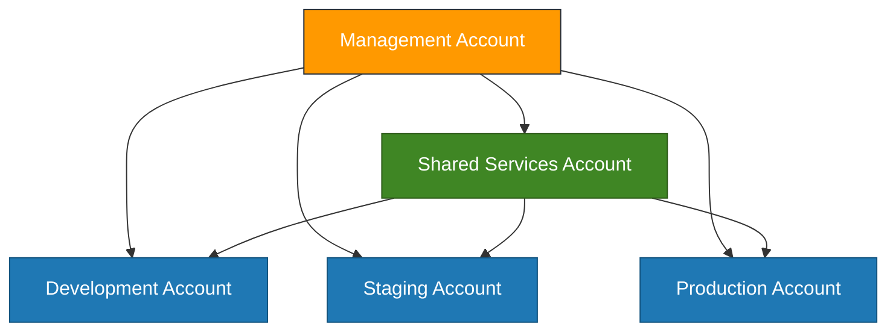
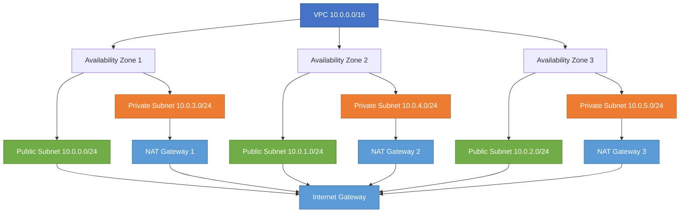
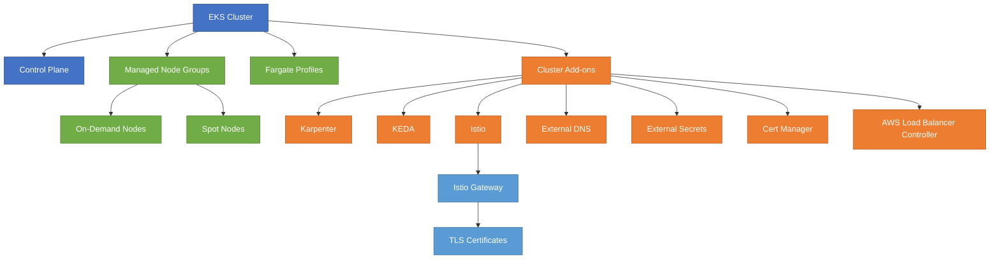
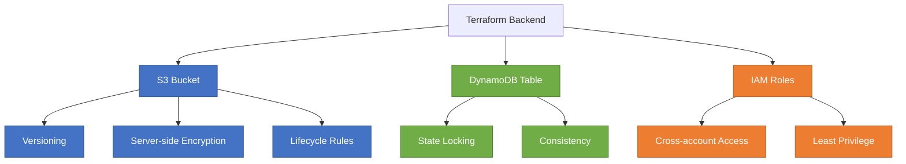
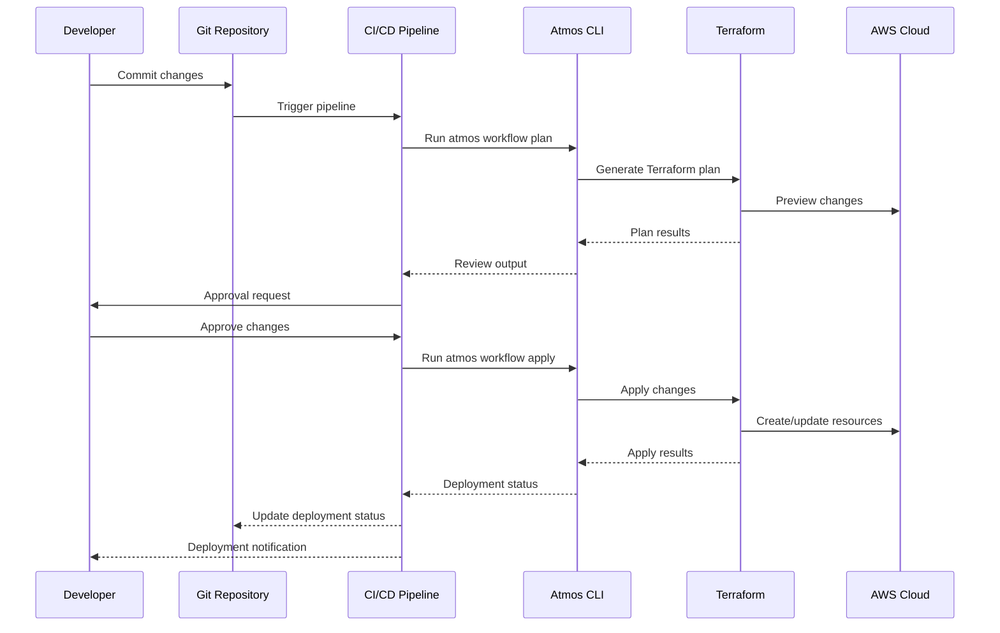

# Architecture Overview

_Last Updated: March 10, 2025_

This document provides a detailed overview of the Atmos-managed AWS infrastructure architecture.

## Table of Contents

- [Multi-Account Architecture](#multi-account-architecture)
- [Component Architecture](#component-architecture)
- [VPC Networking](#vpc-networking)
- [Kubernetes Architecture (EKS)](#kubernetes-architecture-eks)
- [Terraform State Management](#terraform-state-management)
- [CI/CD Pipeline Integration](#cicd-pipeline-integration)
- [Folder Structure](#folder-structure)
- [Technology Stack](#technology-stack)
- [For More Information](#for-more-information)

## Multi-Account Architecture

The infrastructure follows AWS's recommended multi-account strategy for isolation and security:



## Component Architecture

The infrastructure is organized into layers, with components in each layer:

```mermaid
graph TD
    classDef network fill:#4472C4,stroke:#31538D,color:white;
    classDef infra fill:#70AD47,stroke:#507E33,color:white;
    classDef security fill:#ED7D31,stroke:#B85D23,color:white;
    classDef services fill:#5B9BD5,stroke:#406E94,color:white;
    classDef ops fill:#A6761D,stroke:#7C571A,color:white;
    
    NetworkLayer[Network Layer]:::network
    InfraLayer[Infrastructure Layer]:::infra
    SecurityLayer[Security Layer]:::security
    ServicesLayer[Services Layer]:::services
    OpsLayer[Operations Layer]:::ops
    
    NetworkLayer --> VPC[VPC]:::network
    NetworkLayer --> DNS[DNS]:::network
    NetworkLayer --> SG[Security Groups]:::network
    NetworkLayer --> TGW[Transit Gateway]:::network
    
    InfraLayer --> EC2[EC2]:::infra
    InfraLayer --> ECS[ECS]:::infra
    InfraLayer --> EKS[EKS]:::infra
    InfraLayer --> RDS[RDS]:::infra
    InfraLayer --> Lambda[Lambda]:::infra
    
    SecurityLayer --> IAM[IAM]:::security
    SecurityLayer --> Secrets[Secrets Manager]:::security
    SecurityLayer --> ACM[Certificate Manager]:::security
    
    ServicesLayer --> API[API Gateway]:::services
    ServicesLayer --> ALB[Load Balancer]:::services
    ServicesLayer --> CF[CloudFront]:::services
    ServicesLayer --> Istio[Istio]:::services
    
    OpsLayer --> Monitoring[CloudWatch]:::ops
    OpsLayer --> Backend[Terraform Backend]:::ops
    OpsLayer --> CI[CI/CD]:::ops
```



## VPC Networking

Each environment has its own VPC with public and private subnets across multiple availability zones:



## Kubernetes Architecture (EKS)

The EKS implementation follows best practices for scalability and security:



## Terraform State Management

The backend component manages Terraform state for all environments:



## CI/CD Pipeline Integration

The infrastructure can be deployed and managed via CI/CD pipelines:



## Folder Structure

The project organization follows a logical structure to separate reusable components from specific implementations:

```
tf-atmos/
├── components/          # Reusable Terraform modules
│   └── terraform/       # Component implementations
├── docs/                # Documentation
├── examples/            # Example configurations
├── stacks/              # Stack configurations
│   ├── account/         # Account-specific stacks
│   ├── catalog/         # Reusable stack definitions
│   └── schemas/         # JSON schemas
├── templates/           # Templates for new components
└── workflows/           # Atmos workflow definitions
```

## Technology Stack

| Category | Technology | Purpose |
|----------|------------|---------|
| Infrastructure as Code | Terraform | Resource provisioning |
| Orchestration | Atmos | Configuration and workflow management |
| Containers | EKS, ECS | Container orchestration |
| Serverless | Lambda | Function-as-a-Service |
| Networking | VPC, Transit Gateway | Network infrastructure |
| Security | IAM, Secrets Manager | Identity and secrets management |
| Databases | RDS, DynamoDB | Data persistence |
| API Management | API Gateway | API endpoints |
| Certificate Management | ACM, cert-manager | TLS certificates |
| Service Mesh | Istio | Microservice communication |
| Autoscaling | Karpenter, KEDA | Automated scaling |

## For More Information

- [Component Catalog](terraform-component-catalog.md) - Detailed descriptions of components
- [Workflow Reference](workflows.md) - Available workflows and usage
- [Security Best Practices](security-best-practices-guide.md) - Security design and best practices
- [Environment Onboarding](environment-guide.md) - Adding new environments