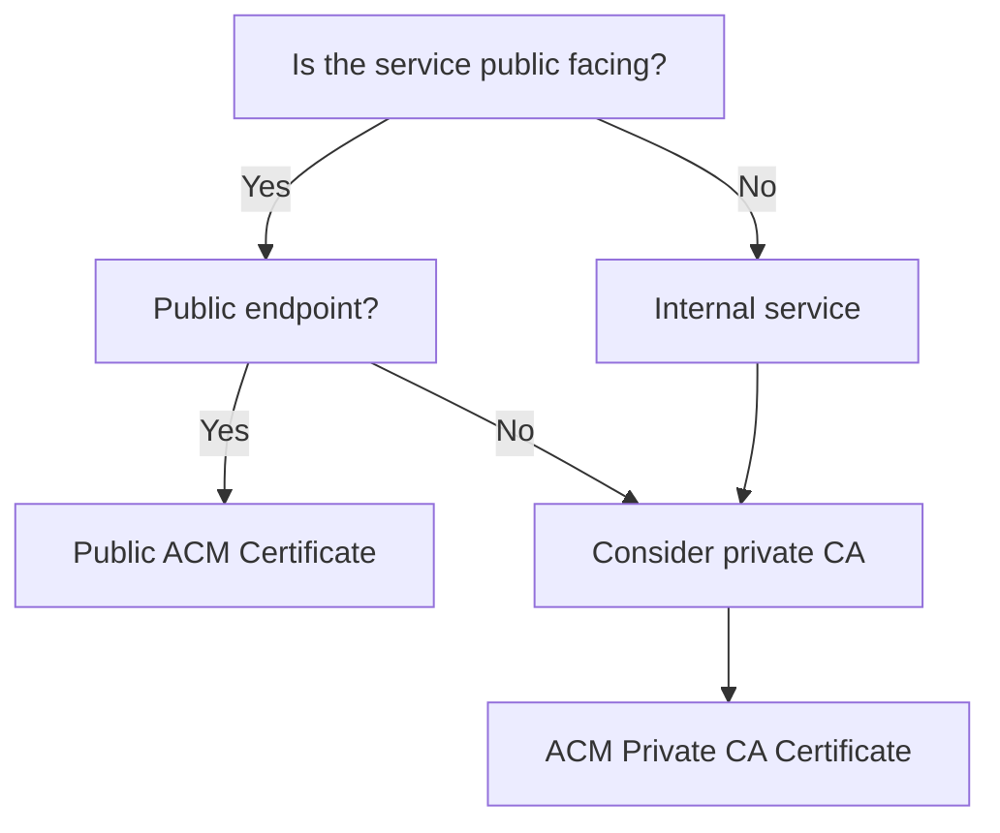

# Certificate Management Guide

_Last Updated: March 2, 2025_

This guide provides comprehensive information on managing SSL/TLS certificates in AWS environments using the Atmos framework, covering ACM certificate provisioning, validation, renewal, and integration with other AWS services.

## Table of Contents

- [Overview](#overview)
- [Certificate Types and Use Cases](#certificate-types-and-use-cases)
- [ACM Component](#acm-component)
- [Certificate Provisioning](#certificate-provisioning)
- [DNS Validation](#dns-validation)
- [Certificate Renewal](#certificate-renewal)
- [Cross-Region Certificates](#cross-region-certificates)
- [Private CA Certificates](#private-ca-certificates)
- [Certificate Monitoring](#certificate-monitoring)
- [Integration with AWS Services](#integration-with-aws-services)
- [Kubernetes Integration](#kubernetes-integration)
- [Troubleshooting](#troubleshooting)
- [Scripts and Automation](#scripts-and-automation)
- [Best Practices](#best-practices)
- [References](#references)

## Overview

### Certificate Management in AWS

AWS Certificate Manager (ACM) provides centralized certificate management for AWS services. The Atmos framework's ACM component makes it easy to:

- Provision and manage public and private certificates
- Automate DNS validation
- Handle certificate renewal
- Monitor certificate expiration
- Deploy certificates to supported AWS services and Kubernetes

### Benefits of Using ACM with Atmos

- **Automated Lifecycle**: Handles provisioning, validation, and renewal
- **Cost Efficiency**: Free for public certificates used with AWS services
- **Integration**: Native integration with ELB, CloudFront, API Gateway, etc.
- **Security**: Private key material is protected by AWS
- **Operational Efficiency**: Reduces manual certificate management tasks

## Certificate Types and Use Cases

| Certificate Type | Provider | Use Cases | Validation Method | Renewal |
|------------------|----------|-----------|-------------------|---------|
| Public Certificates | ACM | Public-facing websites and APIs | DNS or Email | Automatic (DNS) or Manual (Email) |
| Private Certificates | ACM Private CA | Internal services, microservices | Not required | Automatic |
| Imported Certificates | External CA | Legacy systems, specific requirements | Pre-validated | Manual |

### Choosing Certificate Types



## ACM Component

### Configuration

The [acm component](../components/terraform/acm) provides a consistent way to manage certificates:

```yaml
# Example configuration in stack file
components:
  terraform:
    acm:
      vars:
        domain_name: "example.com"
        subject_alternative_names:
          - "www.example.com"
          - "api.example.com"
        validation_method: "DNS"
        zone_id: "${dependency.dns.outputs.zone_id}"
        wait_for_validation: true
        tags:
          Environment: "production"
          ManagedBy: "terraform"
```

### Component Outputs

The following outputs are available from the ACM component:

```hcl
output "certificate_arn" {
  description = "The ARN of the certificate"
  value       = aws_acm_certificate.default.arn
}

output "domain_validation_options" {
  description = "Domain validation options for the certificate"
  value       = aws_acm_certificate.default.domain_validation_options
}
```

## Certificate Provisioning

### Public Certificates

To provision a public certificate:

1. **Create Certificate Request**: Define domain and validation method
2. **Perform Validation**: Complete DNS or email validation
3. **Certificate Issuance**: ACM issues the certificate after validation

```hcl
# Example Terraform code for provisioning a public certificate
resource "aws_acm_certificate" "public_cert" {
  domain_name               = var.domain_name
  subject_alternative_names = var.subject_alternative_names
  validation_method         = "DNS"
  
  lifecycle {
    create_before_destroy = true
  }
  
  tags = merge(
    var.tags,
    {
      Name = "${var.domain_name}-certificate"
    }
  )
}
```

### Imported Certificates

For certificates issued by external CAs:

```hcl
# Example Terraform code for importing a certificate
resource "aws_acm_certificate" "imported" {
  private_key       = file("${path.module}/certs/private_key.pem")
  certificate_body  = file("${path.module}/certs/certificate.pem")
  certificate_chain = file("${path.module}/certs/certificate_chain.pem")
  
  tags = var.tags
}
```

## DNS Validation

### Automatic DNS Validation

The ACM component automates DNS validation by creating the required DNS records:

```hcl
# Example of DNS validation record creation
resource "aws_route53_record" "validation" {
  for_each = {
    for dvo in aws_acm_certificate.default.domain_validation_options : dvo.domain_name => {
      name   = dvo.resource_record_name
      record = dvo.resource_record_value
      type   = dvo.resource_record_type
    }
  }

  allow_overwrite = true
  name            = each.value.name
  records         = [each.value.record]
  ttl             = 60
  type            = each.value.type
  zone_id         = var.zone_id
}

# Certificate validation
resource "aws_acm_certificate_validation" "default" {
  certificate_arn         = aws_acm_certificate.default.arn
  validation_record_fqdns = [for record in aws_route53_record.validation : record.fqdn]
}
```

### Manual Validation Options

For scenarios where automated DNS validation isn't possible:

1. **Email Validation**: Use email-based validation if DNS is managed externally
2. **Manual DNS Records**: Create DNS records outside of Terraform

## Certificate Renewal

### Automatic Renewal Process

ACM manages certificate renewal automatically when:

1. Certificate was issued by ACM (not imported)
2. Certificate uses DNS validation
3. Domain is still resolvable
4. Certificate is in use by at least one AWS service

### Handling Imported Certificates

For imported certificates, implement renewal alerting:

```hcl
# Example CloudWatch alert for certificate expiration
resource "aws_cloudwatch_metric_alarm" "certificate_expiration" {
  alarm_name          = "acm-certificate-expiration"
  comparison_operator = "LessThanThreshold"
  evaluation_periods  = "1"
  metric_name         = "DaysToExpiry"
  namespace           = "AWS/ACM"
  period              = "86400"  # 1 day
  statistic           = "Minimum"
  threshold           = "45"     # 45 days before expiration
  alarm_description   = "This alarm monitors ACM certificate expiration"
  
  dimensions = {
    CertificateArn = aws_acm_certificate.imported.arn
  }
  
  alarm_actions = [var.sns_topic_arn]
}
```

## Cross-Region Certificates

### Certificate Distribution

ACM certificates are region-specific. For multi-region deployments:

1. **CloudFront Distribution**: Use certificates in us-east-1 for global distributions
2. **Regional Services**: Create certificates in each region

```hcl
# Example of multi-region certificate provisioning
provider "aws" {
  alias  = "us_east_1"
  region = "us-east-1"
}

provider "aws" {
  alias  = "us_west_2"
  region = "us-west-2"
}

# Certificate for CloudFront (must be in us-east-1)
module "cloudfront_certificate" {
  source = "../modules/acm"
  providers = {
    aws = aws.us_east_1
  }
  
  domain_name = "cdn.example.com"
  # Other variables
}

# Certificate for regional ALB
module "alb_certificate" {
  source = "../modules/acm"
  providers = {
    aws = aws.us_west_2
  }
  
  domain_name = "api.example.com"
  # Other variables
}
```

## Private CA Certificates

### Creating a Private CA

Use the AWS Private Certificate Authority for internal services:

```hcl
# Example Private CA configuration
resource "aws_acmpca_certificate_authority" "private_ca" {
  certificate_authority_configuration {
    key_algorithm     = "RSA_4096"
    signing_algorithm = "SHA512WITHRSA"
    
    subject {
      common_name = "example.com"
      organization = "Example Organization"
      organizational_unit = "Security"
      country = "US"
      state = "Washington"
      locality = "Seattle"
    }
  }
  
  permanent_deletion_time_in_days = 7
  type = "ROOT"
  
  tags = var.tags
}
```

### Issuing Private Certificates

Issue certificates from your private CA:

```hcl
# Example issuing a certificate from a private CA
resource "aws_acm_certificate" "private_cert" {
  domain_name               = "internal.example.com"
  certificate_authority_arn = aws_acmpca_certificate_authority.private_ca.arn
  
  subject_alternative_names = [
    "service.internal.example.com",
    "api.internal.example.com"
  ]
  
  tags = var.tags
}
```

## Certificate Monitoring

### Expiration Monitoring

Set up proactive monitoring for certificate expiration:

```hcl
# Example monitoring dashboard for certificates
module "certificate_dashboard" {
  source = "../modules/monitoring"
  
  dashboard_name = "certificate-monitoring"
  
  widgets = [
    {
      type = "metric"
      properties = {
        metrics = [
          ["AWS/ACM", "DaysToExpiry", "CertificateArn", aws_acm_certificate.default.arn]
        ]
        period = 86400
        stat = "Minimum"
        title = "Days to Certificate Expiry"
        view = "timeSeries"
        yAxis = {
          left = {
            min = 0
            max = 365
          }
        }
      }
    }
  ]
}
```

### Automated Certificate Monitoring

The framework includes a comprehensive script for monitoring certificates and SSH keys:

```bash
# Basic usage monitoring all certificates and SSH keys
./scripts/certificates/monitor-certificates.sh -r us-west-2

# Set custom thresholds (warning at 45 days, critical at 14 days)
./scripts/certificates/monitor-certificates.sh -w 45 -c 14

# Send notifications to Slack
./scripts/certificates/monitor-certificates.sh --slack https://hooks.slack.com/services/XXX/YYY/ZZZ

# Generate JSON report and send to SNS
./scripts/certificates/monitor-certificates.sh --output json -f certificates-report.json --sns arn:aws:sns:us-west-2:123456789012:CertAlerts

# Skip checking SSH keys and only monitor certificates
./scripts/certificates/monitor-certificates.sh --no-ssh
```

The script provides these key features:
- Monitors ACM certificates, certificate secrets in Secrets Manager, and SSH keys
- Configurable warning and critical thresholds (defaults: 30 and 14 days)
- Multiple output formats: text, JSON, and HTML
- Notification options: Slack, SNS, Email, and Jira tickets
- Automatic detection of certificates in various formats

### Alerting Framework

Implement a complete alerting framework:

1. **CloudWatch Metrics**: Track certificate-related metrics
2. **CloudWatch Alarms**: Set thresholds for expiration windows
3. **SNS Notifications**: Send alerts to appropriate channels (see monitor-certificates.sh)
4. **Automated Remediation**: Trigger automated renewal where possible
5. **Scheduled Monitoring**: Run the monitoring script on a schedule using CloudWatch Events/EventBridge

#### Setting Up Scheduled Monitoring

Create a scheduled task to run the certificate monitor:

```bash
# Create an EventBridge rule that runs daily
aws events put-rule \
  --name "DailyCertificateMonitoring" \
  --schedule-expression "cron(0 8 * * ? *)" \
  --description "Runs certificate monitoring daily at 8:00 AM UTC"

# Configure the target (Lambda function, ECS task, etc.)
aws events put-targets \
  --rule "DailyCertificateMonitoring" \
  --targets file://certificate-monitor-target.json
```

## Integration with AWS Services

### Supported AWS Services

ACM certificates integrate with these AWS services:

| Service | Integration Method | Key Considerations |
|---------|-------------------|-------------------|
| CloudFront | Distribution configuration | Must be in us-east-1 |
| Elastic Load Balancing | Listener configuration | Region-specific |
| API Gateway | Custom domain name | Region-specific |
| Amazon CloudFront | Viewer certificate | Must be in us-east-1 |
| AWS Elastic Beanstalk | Environment configuration | Region-specific |
| AppSync | Custom domain name | Region-specific |

### Service Integration Patterns

```hcl
# Example ALB HTTPS listener with ACM certificate
resource "aws_lb_listener" "https" {
  load_balancer_arn = aws_lb.default.arn
  port              = "443"
  protocol          = "HTTPS"
  ssl_policy        = "ELBSecurityPolicy-TLS-1-2-2017-01"
  certificate_arn   = aws_acm_certificate.default.arn
  
  default_action {
    type             = "forward"
    target_group_arn = aws_lb_target_group.default.arn
  }
}

# Example CloudFront distribution with ACM certificate
resource "aws_cloudfront_distribution" "default" {
  # Other configuration
  
  viewer_certificate {
    acm_certificate_arn = aws_acm_certificate.cloudfront.arn
    ssl_support_method  = "sni-only"
    minimum_protocol_version = "TLSv1.2_2021"
  }
}
```

## Kubernetes Integration

### External Secrets Operator

Use External Secrets Operator to sync ACM certificates to Kubernetes:

```yaml
# Example ExternalSecret for ACM certificate
apiVersion: external-secrets.io/v1beta1
kind: ExternalSecret
metadata:
  name: tls-certificate
  namespace: istio-system
spec:
  refreshInterval: "1h"
  secretStoreRef:
    name: aws-secretsmanager
    kind: ClusterSecretStore
  target:
    name: example-com-tls
    template:
      type: kubernetes.io/tls
  data:
  - secretKey: tls.crt
    remoteRef:
      key: certificates/example-com
      property: certificate
  - secretKey: tls.key
    remoteRef:
      key: certificates/example-com
      property: private_key
```

### Certificate Export Workflow

Use the [certificate export workflow](../scripts/certificates/export-cert.sh) to:

1. Export certificate from ACM
2. Store in AWS Secrets Manager
3. Sync to Kubernetes via External Secrets Operator
4. Update Istio gateways or ingress resources

## Troubleshooting

### Common Issues and Solutions

| Issue | Common Causes | Solutions |
|-------|--------------|-----------|
| DNS validation pending | DNS propagation delay, incorrect record | Verify DNS record matches validation details |
| Email validation not received | Email going to incorrect domain contact | Check WHOIS record for domain contacts |
| Certificate renewal failure | DNS changes, unused certificate | Ensure certificate is in use, DNS still valid |
| Cross-region certificate errors | Wrong region | Ensure CloudFront certificates are in us-east-1 |
| "Certificate not found" errors | ARN reference issues | Verify ARN format and region |

### Validation Troubleshooting

If DNS validation is not completing:

```bash
#!/usr/bin/env bash
# Verify DNS record creation
aws acm describe-certificate --certificate-arn ${CERTIFICATE_ARN} \
  --query 'Certificate.DomainValidationOptions[].ResourceRecord'

# Check if DNS record is properly set
dig +short ${VALIDATION_RECORD_NAME} TXT
```

## Scripts and Automation

### Certificate Management Scripts

The Atmos framework includes a comprehensive set of scripts for certificate and SSH key management:

#### Certificate Export Script

Export certificates from ACM to Secrets Manager:

```bash
# Export certificate to Secrets Manager
./scripts/certificates/export-cert.sh -a arn:aws:acm:us-west-2:123456789012:certificate/abcd1234-abcd-1234-abcd-1234abcd5678 -u

# Export with custom output directory and secret name
./scripts/certificates/export-cert.sh -a arn:aws:acm:us-west-2:123456789012:certificate/abcd1234 -o ./certs -s certificates/wildcard-example-com
```

#### Certificate Rotation Script

For rotating certificates in Kubernetes:

```bash
# Rotate certificate with a new ACM certificate
./scripts/certificates/rotate-cert.sh -s certificates/example-com -n istio-system -a arn:aws:acm:us-west-2:123456789012:certificate/abcd1234

# Force refresh of ExternalSecret without changing certificate
./scripts/certificates/rotate-cert.sh -s certificates/example-com -n istio-system
```

#### SSH Key Management Scripts

The framework also includes scripts for SSH key management that follow similar security practices:

```bash
# Generate a new SSH key and store in Secrets Manager
./scripts/certificates/generate-ssh-key.sh -n myapp-ssh-key -e 'user@example.com' -s dev/ssh-keys/myapp

# Export an SSH key from Secrets Manager
./scripts/certificates/export-ssh-key.sh -s dev/ssh-keys/myapp -o ~/.ssh/myapp_key

# Rotate an SSH key
./scripts/certificates/rotate-ssh-key.sh -s dev/ssh-keys/myapp -e 'user@example.com'
```

#### Certificate Monitoring Script

Monitor certificates and SSH keys for expiration:

```bash
# Monitor all certificates and SSH keys
./scripts/certificates/monitor-certificates.sh -r us-west-2

# Create HTML report with expiration warnings
./scripts/certificates/monitor-certificates.sh -o html -f certificate-report.html

# Send Slack notifications for expiring certificates
./scripts/certificates/monitor-certificates.sh --slack https://hooks.slack.com/services/XXX/YYY/ZZZ
```

## Best Practices

1. **Domain Validation**: Always use DNS validation for automatic renewal
2. **Wildcard Usage**: Limit wildcard certificates for security best practices
3. **Management**: Create a specific stack for certificate management
4. **Naming**: Use consistent naming for certificates across environments
5. **Documentation**: Document certificate purposes and integrations
6. **Monitoring**: Set up alerts for certificate expiration 45-90 days in advance
7. **Automation**: Automate certificate deployments and rotations
8. **Approval Process**: Establish approval process for new certificates
9. **Inventory**: Maintain an inventory of all certificates
10. **Regular Audits**: Conduct quarterly audits of certificate usage

## References

- [AWS Certificate Manager Documentation](https://docs.aws.amazon.com/acm/)
- [ACM Private CA Documentation](https://docs.aws.amazon.com/privateca/)
- [Terraform ACM Provider](https://registry.terraform.io/providers/hashicorp/aws/latest/docs/resources/acm_certificate)
- [External Secrets Operator](https://external-secrets.io/latest/)
- [Security Best Practices Guide](security-best-practices-guide.md)
- [Istio Service Mesh Guide](istio-service-mesh-guide.md)
- [Secrets Manager Guide](secrets-manager-guide.md)
- [Environment Onboarding Guide](environment-onboarding.md)
- [SSH Key Management Scripts](../scripts/certificates/README.md)