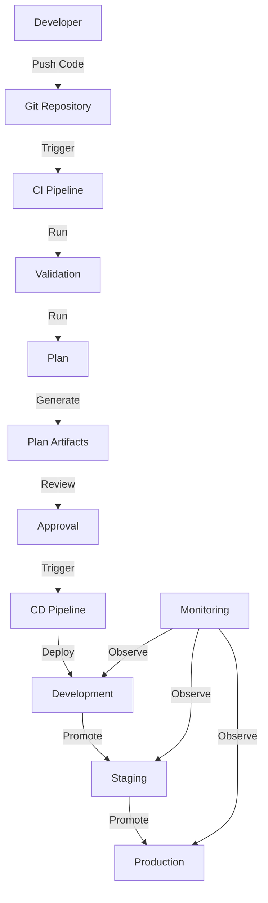

# CI/CD Integration Guide

_Last Updated: March 2, 2025_

This guide provides detailed information on integrating the Atmos infrastructure framework with CI/CD pipelines to automate infrastructure deployment, validation, and management.

## Table of Contents

- [Introduction](#introduction)
- [CI/CD Architecture](#cicd-architecture)
- [Jenkins Integration](#jenkins-integration)
- [GitHub Actions Integration](#github-actions-integration)
- [GitLab CI Integration](#gitlab-ci-integration)
- [Atlantis Integration](#atlantis-integration)
- [AWS CodePipeline Integration](#aws-codepipeline-integration)
- [Branch Strategy](#branch-strategy)
- [Environment Promotion](#environment-promotion)
- [Testing Strategy](#testing-strategy)
- [Approval Workflows](#approval-workflows)
- [Security Considerations](#security-considerations)
- [Monitoring and Observability](#monitoring-and-observability)
- [Best Practices](#best-practices)
- [Troubleshooting](#troubleshooting)
- [References](#references)

## Introduction

### Benefits of CI/CD for Infrastructure

Implementing CI/CD for infrastructure with Atmos provides several advantages:

- **Consistency**: Ensures infrastructure is deployed in a consistent manner
- **Auditability**: Creates an audit trail of changes and approvals
- **Automation**: Reduces manual errors and improves deployment speed
- **Validation**: Ensures infrastructure changes are validated before deployment
- **Collaboration**: Enables team collaboration through pull request workflows
- **Rollbacks**: Simplifies rollback to previous infrastructure states
- **Documentation**: Self-documenting infrastructure changes through code

### CI/CD Workflow Overview

The typical CI/CD workflow for Atmos follows these steps:

1. **Code**: Developer creates/modifies infrastructure code
2. **Commit**: Changes are committed to a feature branch
3. **Pull Request**: PR is created for review
4. **Validation**: Automated tests validate the changes
5. **Review**: Team reviews the changes
6. **Approval**: Changes are approved
7. **Merge**: Changes are merged to main branch
8. **Deploy**: Changes are deployed to environments in sequence
9. **Verify**: Deployment is verified through tests
10. **Promote**: Successfully deployed changes are promoted to next environment

## CI/CD Architecture

### Component Architecture



### Environment Isolation

The architecture maintains strict environment isolation:

- Each environment has its own Terraform state
- Environment-specific variables are managed in stack configurations
- Promotion between environments requires explicit approval
- Lower environments have no access to higher environments
- Production deployments require additional approval gates

## Jenkins Integration

### Pipeline Configuration

The Atmos framework includes a [Jenkins integration](../integrations/jenkins) that provides:

```groovy
// Example Jenkinsfile
pipeline {
    agent {
        docker {
            image 'hashicorp/terraform:latest'
            args '-v /var/run/docker.sock:/var/run/docker.sock'
        }
    }
    
    parameters {
        string(name: 'TENANT', defaultValue: 'mycompany')
        string(name: 'ACCOUNT', defaultValue: 'dev')
        string(name: 'ENVIRONMENT', defaultValue: 'testenv-01')
        booleanParam(name: 'AUTO_APPROVE', defaultValue: false)
    }
    
    stages {
        stage('Setup') {
            steps {
                sh '''
                    #!/usr/bin/env bash
                    curl -s https://raw.githubusercontent.com/cloudposse/atmos/master/scripts/install.sh | bash
                    export PATH=$PATH:$HOME/.atmos/bin
                '''
            }
        }
        
        stage('Validate') {
            steps {
                sh "atmos workflow validate tenant=${params.TENANT} account=${params.ACCOUNT} environment=${params.ENVIRONMENT}"
            }
        }
        
        stage('Plan') {
            steps {
                sh "atmos workflow plan-environment tenant=${params.TENANT} account=${params.ACCOUNT} environment=${params.ENVIRONMENT}"
            }
        }
        
        stage('Approval') {
            when {
                not { expression { return params.AUTO_APPROVE } }
            }
            steps {
                input message: 'Apply changes?', ok: 'Apply'
            }
        }
        
        stage('Apply') {
            steps {
                sh "atmos workflow apply-environment tenant=${params.TENANT} account=${params.ACCOUNT} environment=${params.ENVIRONMENT} auto_approve=true"
            }
        }
    }
    
    post {
        success {
            echo 'Pipeline completed successfully'
        }
        failure {
            echo 'Pipeline failed'
        }
    }
}
```

### AWS Authentication

Jenkins uses AWS credentials through assumed roles:

```groovy
// AWS authentication with assumed roles
withCredentials([string(credentialsId: "${params.ACCOUNT}-role-arn", variable: 'AWS_ROLE_ARN')]) {
    sh """
        export AWS_ROLE_ARN=${AWS_ROLE_ARN}
        export AWS_ROLE_SESSION_NAME=Jenkins-Atmos-${env.BUILD_NUMBER}
        aws sts assume-role --role-arn \$AWS_ROLE_ARN --role-session-name \$AWS_ROLE_SESSION_NAME > credentials.json
        export AWS_ACCESS_KEY_ID=\$(cat credentials.json | jq -r '.Credentials.AccessKeyId')
        export AWS_SECRET_ACCESS_KEY=\$(cat credentials.json | jq -r '.Credentials.SecretAccessKey')
        export AWS_SESSION_TOKEN=\$(cat credentials.json | jq -r '.Credentials.SessionToken')
        
        atmos workflow apply-environment tenant=${params.TENANT} account=${params.ACCOUNT} environment=${params.ENVIRONMENT}
    """
}
```

### Parallel Deployment

For complex infrastructures, use parallel deployments:

```groovy
// Parallel deployment of components
stage('Deploy Components') {
    parallel {
        stage('Network') {
            steps {
                sh "atmos terraform apply vpc -s ${params.STACK_NAME}"
            }
        }
        stage('Security') {
            steps {
                sh "atmos terraform apply iam -s ${params.STACK_NAME}"
            }
        }
        stage('Compute') {
            steps {
                sh "atmos terraform apply eks -s ${params.STACK_NAME}"
            }
        }
    }
}
```

## GitHub Actions Integration

### Workflow Configuration

A typical GitHub Actions workflow for Atmos:

```yaml
# .github/workflows/terraform.yml
name: Terraform

on:
  push:
    branches: [ main ]
  pull_request:
    branches: [ main ]

jobs:
  validate:
    name: Validate
    runs-on: ubuntu-latest
    steps:
      - name: Checkout
        uses: actions/checkout@v3
      
      - name: Setup Terraform
        uses: hashicorp/setup-terraform@v2
      
      - name: Install Atmos
        run: |
          #!/usr/bin/env bash
          curl -s https://raw.githubusercontent.com/cloudposse/atmos/master/scripts/install.sh | bash
          echo "$HOME/.atmos/bin" >> $GITHUB_PATH
      
      - name: Configure AWS Credentials
        uses: aws-actions/configure-aws-credentials@v1
        with:
          aws-access-key-id: ${{ secrets.AWS_ACCESS_KEY_ID }}
          aws-secret-access-key: ${{ secrets.AWS_SECRET_ACCESS_KEY }}
          aws-region: us-west-2
          role-to-assume: ${{ secrets.AWS_ROLE_ARN }}
          role-duration-seconds: 900
          role-session-name: GithubActionsAtmos
      
      - name: Validate
        run: |
          atmos workflow validate tenant=mycompany account=dev environment=testenv-01
  
  plan:
    name: Plan
    needs: validate
    runs-on: ubuntu-latest
    steps:
      # Similar setup steps
      
      - name: Plan
        run: |
          atmos workflow plan-environment tenant=mycompany account=dev environment=testenv-01
  
  apply:
    name: Apply
    needs: plan
    if: github.ref == 'refs/heads/main' && github.event_name == 'push'
    runs-on: ubuntu-latest
    environment: development # Uses GitHub Environments for approvals
    steps:
      # Similar setup steps
      
      - name: Apply
        run: |
          atmos workflow apply-environment tenant=mycompany account=dev environment=testenv-01 auto_approve=true
```

### Matrix Strategy for Multiple Environments

For multiple environments, use a matrix strategy:

```yaml
jobs:
  deploy:
    name: Deploy
    runs-on: ubuntu-latest
    strategy:
      matrix:
        environment: [dev, staging, prod]
        include:
          - environment: dev
            tenant: mycompany
            account: development
            auto_approve: true
          - environment: staging
            tenant: mycompany
            account: staging
            auto_approve: false
          - environment: prod
            tenant: mycompany
            account: production
            auto_approve: false
    
    environment: ${{ matrix.environment }} # Uses GitHub Environments for approvals
    
    steps:
      # Setup steps
      
      - name: Deploy
        run: |
          atmos workflow apply-environment tenant=${{ matrix.tenant }} account=${{ matrix.account }} environment=${{ matrix.environment }} auto_approve=${{ matrix.auto_approve }}
```

### PR Commenting

Add automated PR comments with Terraform plan output:

```yaml
- name: Comment on PR
  uses: actions/github-script@v6
  if: github.event_name == 'pull_request'
  with:
    github-token: ${{ secrets.GITHUB_TOKEN }}
    script: |
      const fs = require('fs');
      const planOutput = fs.readFileSync('plan.txt', 'utf8');
      const truncatedOutput = planOutput.length > 65000 
        ? planOutput.substring(0, 65000) + '\n\n... Output truncated ...'
        : planOutput;
      
      github.rest.issues.createComment({
        issue_number: context.issue.number,
        owner: context.repo.owner,
        repo: context.repo.repo,
        body: '## Terraform Plan\n```\n' + truncatedOutput + '\n```'
      });
```

## GitLab CI Integration

### Pipeline Configuration

Configure GitLab CI for Atmos with the following `.gitlab-ci.yml`:

```yaml
# .gitlab-ci.yml
image: hashicorp/terraform:latest

stages:
  - validate
  - plan
  - apply

variables:
  TENANT: mycompany
  ACCOUNT: dev
  ENVIRONMENT: testenv-01

.setup_atmos: &setup_atmos
  before_script:
    - |
      #!/usr/bin/env bash
      # Install Atmos
      curl -s https://raw.githubusercontent.com/cloudposse/atmos/master/scripts/install.sh | bash
      export PATH=$PATH:$HOME/.atmos/bin
      
      # Configure AWS credentials
      mkdir -p ~/.aws
      echo "[default]" > ~/.aws/credentials
      echo "aws_access_key_id = ${AWS_ACCESS_KEY_ID}" >> ~/.aws/credentials
      echo "aws_secret_access_key = ${AWS_SECRET_ACCESS_KEY}" >> ~/.aws/credentials
      echo "aws_session_token = ${AWS_SESSION_TOKEN}" >> ~/.aws/credentials

validate:
  stage: validate
  <<: *setup_atmos
  script:
    - atmos workflow validate tenant=$TENANT account=$ACCOUNT environment=$ENVIRONMENT
  rules:
    - if: $CI_PIPELINE_SOURCE == 'merge_request_event'
    - if: $CI_COMMIT_BRANCH == $CI_DEFAULT_BRANCH

plan:
  stage: plan
  <<: *setup_atmos
  script:
    - atmos workflow plan-environment tenant=$TENANT account=$ACCOUNT environment=$ENVIRONMENT
    - atmos terraform plan vpc -s $TENANT-$ACCOUNT-$ENVIRONMENT --output=json > plan.json
  artifacts:
    paths:
      - plan.json
  rules:
    - if: $CI_PIPELINE_SOURCE == 'merge_request_event'
    - if: $CI_COMMIT_BRANCH == $CI_DEFAULT_BRANCH

apply:
  stage: apply
  <<: *setup_atmos
  script:
    - atmos workflow apply-environment tenant=$TENANT account=$ACCOUNT environment=$ENVIRONMENT auto_approve=true
  rules:
    - if: $CI_COMMIT_BRANCH == $CI_DEFAULT_BRANCH
      when: manual
```

### Environment Deployments

For multi-environment deployments with approvals:

```yaml
# Environment deployments
.deploy_template: &deploy_template
  <<: *setup_atmos
  script:
    - atmos workflow apply-environment tenant=$TENANT account=$ACCOUNT environment=$ENVIRONMENT auto_approve=true

deploy:dev:
  stage: apply
  <<: *deploy_template
  variables:
    ACCOUNT: dev
    ENVIRONMENT: dev
  rules:
    - if: $CI_COMMIT_BRANCH == $CI_DEFAULT_BRANCH

deploy:staging:
  stage: apply
  <<: *deploy_template
  variables:
    ACCOUNT: staging
    ENVIRONMENT: staging
  rules:
    - if: $CI_COMMIT_BRANCH == $CI_DEFAULT_BRANCH
      when: manual

deploy:prod:
  stage: apply
  <<: *deploy_template
  variables:
    ACCOUNT: prod
    ENVIRONMENT: prod
  rules:
    - if: $CI_COMMIT_BRANCH == $CI_DEFAULT_BRANCH
      when: manual
  environment:
    name: production
    url: https://example.com
```

## Atlantis Integration

### Server Configuration

The [Atlantis integration](../integrations/atlantis) automates Terraform workflows via pull requests:

```yaml
# atlantis.yaml
version: 3
automerge: false
parallel_plan: true
parallel_apply: true
projects:
- name: vpc
  dir: .
  workflow: atmos
  terraform_version: v1.3.0
  autoplan:
    when_modified: ["*.tf", "*.tfvars", "*.yaml"]
    enabled: true
  apply_requirements:
    - approved
    - mergeable

workflows:
  atmos:
    plan:
      steps:
      - run: atmos-wrapper.sh terraform plan $PROJECT_NAME -s $STACK_NAME
    apply:
      steps:
      - run: atmos-wrapper.sh terraform apply $PROJECT_NAME -s $STACK_NAME
```

### Custom Docker Image

Use a custom Atlantis Docker image with Atmos:

```dockerfile
# Dockerfile
FROM ghcr.io/runatlantis/atlantis:v0.23.3

# Install dependencies
RUN apk add --no-cache curl jq bash

# Install Atmos
RUN curl -s https://raw.githubusercontent.com/cloudposse/atmos/master/scripts/install.sh | bash
ENV PATH="${PATH}:/root/.atmos/bin"

# Copy helper scripts
COPY scripts/atmos-wrapper.sh /usr/local/bin/atmos-wrapper.sh
COPY scripts/assume-role.sh /usr/local/bin/assume-role.sh

RUN chmod +x /usr/local/bin/atmos-wrapper.sh /usr/local/bin/assume-role.sh
```

### Helper Scripts

Create helper scripts for AWS authentication:

```bash
#!/usr/bin/env bash
# assume-role.sh
ACCOUNT_ID=$(jq -r ".$ACCOUNT // empty" /atlantis/accounts.json)
ROLE_ARN="arn:aws:iam::${ACCOUNT_ID}:role/${ROLE_NAME}"
TEMP_CREDS=$(aws sts assume-role \
  --role-arn "${ROLE_ARN}" \
  --role-session-name "${SESSION_NAME}" \
  --duration-seconds "${DURATION}" \
  --output json)

export AWS_ACCESS_KEY_ID=$(echo $TEMP_CREDS | jq -r .Credentials.AccessKeyId)
export AWS_SECRET_ACCESS_KEY=$(echo $TEMP_CREDS | jq -r .Credentials.SecretAccessKey)
export AWS_SESSION_TOKEN=$(echo $TEMP_CREDS | jq -r .Credentials.SessionToken)
```

## AWS CodePipeline Integration

### Pipeline Structure

Integrate with AWS CodePipeline for a fully managed AWS solution:

```hcl
# Example CodePipeline
resource "aws_codepipeline" "terraform" {
  name     = "terraform-pipeline"
  role_arn = aws_iam_role.codepipeline.arn

  artifact_store {
    location = aws_s3_bucket.artifacts.bucket
    type     = "S3"
  }

  stage {
    name = "Source"

    action {
      name             = "Source"
      category         = "Source"
      owner            = "AWS"
      provider         = "CodeStarSourceConnection"
      version          = "1"
      output_artifacts = ["source_output"]

      configuration = {
        ConnectionArn    = aws_codestarconnections_connection.github.arn
        FullRepositoryId = "your-org/tf-atmos"
        BranchName       = "main"
      }
    }
  }

  stage {
    name = "Validate"

    action {
      name            = "Validate"
      category        = "Build"
      owner           = "AWS"
      provider        = "CodeBuild"
      input_artifacts = ["source_output"]
      version         = "1"

      configuration = {
        ProjectName = aws_codebuild_project.validate.name
      }
    }
  }

  stage {
    name = "Plan"

    action {
      name            = "Plan"
      category        = "Build"
      owner           = "AWS"
      provider        = "CodeBuild"
      input_artifacts = ["source_output"]
      output_artifacts = ["plan_output"]
      version         = "1"

      configuration = {
        ProjectName = aws_codebuild_project.plan.name
      }
    }
  }

  stage {
    name = "Approval"

    action {
      name     = "Approval"
      category = "Approval"
      owner    = "AWS"
      provider = "Manual"
      version  = "1"
    }
  }

  stage {
    name = "Apply"

    action {
      name            = "Apply"
      category        = "Build"
      owner           = "AWS"
      provider        = "CodeBuild"
      input_artifacts = ["source_output", "plan_output"]
      version         = "1"

      configuration = {
        ProjectName = aws_codebuild_project.apply.name
      }
    }
  }
}
```

### CodeBuild Configuration

Configure CodeBuild projects for Atmos:

```hcl
# Example CodeBuild project
resource "aws_codebuild_project" "plan" {
  name          = "atmos-plan"
  description   = "Plan infrastructure changes with Atmos"
  build_timeout = "60"
  service_role  = aws_iam_role.codebuild.arn

  artifacts {
    type = "CODEPIPELINE"
  }

  environment {
    compute_type                = "BUILD_GENERAL1_SMALL"
    image                       = "aws/codebuild/amazonlinux2-x86_64-standard:3.0"
    type                        = "LINUX_CONTAINER"
    image_pull_credentials_type = "CODEBUILD"
    privileged_mode             = true

    environment_variable {
      name  = "TENANT"
      value = "mycompany"
    }

    environment_variable {
      name  = "ACCOUNT"
      value = "dev"
    }

    environment_variable {
      name  = "ENVIRONMENT"
      value = "testenv-01"
    }
  }

  source {
    type      = "CODEPIPELINE"
    buildspec = "buildspecs/plan.yml"
  }
}
```

### BuildSpec Example

Create BuildSpec files for each stage:

```yaml
# buildspecs/plan.yml
version: 0.2

phases:
  install:
    runtime-versions:
      python: 3.9
    commands:
      - curl -s https://raw.githubusercontent.com/cloudposse/atmos/master/scripts/install.sh | bash
      - export PATH=$PATH:$HOME/.atmos/bin
  
  build:
    commands:
      - atmos workflow plan-environment tenant=$TENANT account=$ACCOUNT environment=$ENVIRONMENT
      - mkdir -p /artifacts
      - cp planfile.binary /artifacts/

artifacts:
  files:
    - planfile.binary
  base-directory: /artifacts
```

## Branch Strategy

### Git Flow

Use a Git Flow branching strategy for Atmos infrastructure:

```
main              (production-ready state)
  develop      (integration branch)
      feature/vpc-peering
      feature/lambda-integration
      feature/eks-addons
  release/v1.0 (release branch)
  hotfix/security-patch
```

### Environment Branches

For simple workflows, consider environment branches:

```
main    (production environment)
staging (staging environment)
develop (development environment)
```

### Feature Branch Workflow

1. Create feature branch from develop
2. Make infrastructure changes
3. Open pull request to develop
4. CI pipeline validates and plans changes
5. Team reviews changes
6. Merge to develop (deploys to development environment)
7. Merge develop to staging branch (deploys to staging environment)
8. Merge staging to main (deploys to production environment)

## Environment Promotion

### Promotion Process

The recommended promotion process across environments:

1. **Development**: Automatic deployment on merge to develop branch
2. **Testing/QA**: Scheduled or manual promotion from development
3. **Staging**: Manual approval required for deployment
4. **Production**: Manual approval required with additional safeguards

### Stack Inheritance

Use Atmos stack inheritance for environment promotion:

```yaml
# Base component configuration (catalog/network.yaml)
components:
  terraform:
    vpc:
      vars:
        cidr_block: "10.0.0.0/16"
        availability_zones: ["us-west-2a", "us-west-2b", "us-west-2c"]
        vpc_flow_logs_enabled: true

# Dev environment (account/dev/us-west-2/network.yaml)
import:
  - catalog/network.yaml

components:
  terraform:
    vpc:
      vars:
        name: "dev-vpc"
        environment: "dev"
        nat_gateway_enabled: true
        nat_instance_enabled: false
        instance_tenancy: "default"

# Staging environment (account/staging/us-west-2/network.yaml)
import:
  - catalog/network.yaml

components:
  terraform:
    vpc:
      vars:
        name: "staging-vpc"
        environment: "staging"
        nat_gateway_enabled: true
        nat_instance_enabled: false
        instance_tenancy: "default"
        vpc_flow_logs_retention_period: 90

# Production environment (account/prod/us-west-2/network.yaml)
import:
  - catalog/network.yaml

components:
  terraform:
    vpc:
      vars:
        name: "prod-vpc"
        environment: "prod"
        nat_gateway_enabled: true
        nat_instance_enabled: false
        instance_tenancy: "default"
        vpc_flow_logs_retention_period: 365
        vpc_flow_logs_traffic_type: "ALL"
```

## Testing Strategy

### Infrastructure Testing Layers

Implement a comprehensive testing strategy:

1. **Static Analysis**: Terraform validation, linting, security scanning
2. **Unit Testing**: Component-specific tests with Terratest
3. **Integration Testing**: Cross-component interaction tests
4. **End-to-End Testing**: Complete environment provisioning and testing
5. **Compliance Testing**: Policy and compliance validation

### Test Implementation

```go
// Example Terratest implementation for VPC component
package test

import (
    "testing"
    "github.com/gruntwork-io/terratest/modules/terraform"
    "github.com/stretchr/testify/assert"
)

func TestVPCComponent(t *testing.T) {
    terraformOptions := terraform.WithDefaultRetryableErrors(t, &terraform.Options{
        TerraformDir: "../components/terraform/vpc",
        Vars: map[string]interface{}{
            "name":       "test-vpc",
            "cidr_block": "10.0.0.0/16",
            "availability_zones": []string{
                "us-west-2a",
                "us-west-2b",
            },
        },
    })

    defer terraform.Destroy(t, terraformOptions)
    terraform.InitAndApply(t, terraformOptions)

    vpcID := terraform.Output(t, terraformOptions, "vpc_id")
    assert.NotEmpty(t, vpcID, "VPC ID should not be empty")
    
    privateSubnetIDs := terraform.OutputList(t, terraformOptions, "private_subnet_ids")
    assert.Equal(t, 2, len(privateSubnetIDs), "There should be 2 private subnets")
}
```

### Pre-Commit Hooks

Implement pre-commit hooks for local testing:

```yaml
# .pre-commit-config.yaml
repos:
  - repo: https://github.com/pre-commit/pre-commit-hooks
    rev: v4.4.0
    hooks:
      - id: trailing-whitespace
      - id: end-of-file-fixer
      - id: check-yaml
      - id: check-added-large-files

  - repo: https://github.com/antonbabenko/pre-commit-terraform
    rev: v1.77.1
    hooks:
      - id: terraform_fmt
      - id: terraform_docs
      - id: terraform_tflint
      - id: terraform_validate
      - id: terraform_checkov
```

## Approval Workflows

### Multi-Level Approvals

Implement multi-level approvals for production environments:

```yaml
# GitHub Actions approval workflow
jobs:
  plan:
    name: Plan
    runs-on: ubuntu-latest
    steps:
      # Plan steps
  
  approve_dev:
    name: Approve Development
    needs: plan
    runs-on: ubuntu-latest
    if: github.ref == 'refs/heads/develop'
    environment: development-approval
    steps:
      - name: Approval Gate
        run: echo "Development deployment approved"
  
  approve_staging:
    name: Approve Staging
    needs: plan
    runs-on: ubuntu-latest
    if: github.ref == 'refs/heads/staging'
    environment: staging-approval
    steps:
      - name: Approval Gate
        run: echo "Staging deployment approved"
  
  approve_production:
    name: Approve Production
    needs: [plan, security_check]
    runs-on: ubuntu-latest
    if: github.ref == 'refs/heads/main'
    environment: production-approval
    steps:
      - name: Approval Gate
        run: echo "Production deployment approved"
  
  security_check:
    name: Security Validation
    needs: plan
    runs-on: ubuntu-latest
    if: github.ref == 'refs/heads/main'
    steps:
      - name: Security Scan
        run: |
          # Run additional security checks for production
          checkov -d .
          tfsec .
```

### Approval Documentation

Create a system to document approvals:

```hcl
# Example custom approval resource
resource "aws_dynamodb_table" "approval_log" {
  name         = "terraform-approvals"
  billing_mode = "PAY_PER_REQUEST"
  hash_key     = "id"
  
  attribute {
    name = "id"
    type = "S"
  }
  
  attribute {
    name = "environment"
    type = "S"
  }
  
  global_secondary_index {
    name            = "environment-index"
    hash_key        = "environment"
    projection_type = "ALL"
  }
  
  tags = {
    Name = "terraform-approvals"
  }
}

# Log approval in CodeBuild
resource "aws_codebuild_project" "log_approval" {
  name = "log-terraform-approval"
  
  environment {
    compute_type = "BUILD_GENERAL1_SMALL"
    image        = "aws/codebuild/amazonlinux2-x86_64-standard:3.0"
    type         = "LINUX_CONTAINER"
  }
  
  source {
    type      = "NO_SOURCE"
    buildspec = <<-EOF
      version: 0.2
      phases:
        build:
          commands:
            - aws dynamodb put-item --table-name terraform-approvals --item '{"id": {"S": "$CODEPIPELINE_EXECUTION_ID"}, "environment": {"S": "$ENVIRONMENT"}, "approver": {"S": "$APPROVER"}, "timestamp": {"S": "'$(date -u +"%Y-%m-%dT%H:%M:%SZ")'"}}'
      EOF
  }
  
  service_role = aws_iam_role.codebuild_approval_role.arn
}
```

## Security Considerations

### Secure Pipeline Configuration

Implement these security measures in CI/CD pipelines:

1. **Least Privilege**: Use role-based access with minimal permissions
2. **Secrets Management**: Never store credentials in code or pipeline configuration
3. **Artifact Validation**: Validate artifacts with checksums and signatures
4. **Temporary Credentials**: Use short-lived credentials with automatic rotation
5. **Immutable References**: Use immutable references (commit SHA) for external dependencies
6. **Pipeline Isolation**: Run pipelines in isolated environments

### Security Scanning

Integrate security scanning into CI/CD:

```yaml
# Security scanning in GitHub Actions
jobs:
  security_scan:
    name: Security Scan
    runs-on: ubuntu-latest
    steps:
      - name: Checkout
        uses: actions/checkout@v3
      
      - name: tfsec
        uses: aquasecurity/tfsec-action@v1.0.0
      
      - name: checkov
        uses: bridgecrewio/checkov-action@master
        with:
          directory: components/
          framework: terraform
      
      - name: terrascan
        uses: accurics/terrascan-action@v1
        with:
          iac_type: terraform
          iac_dir: components/
          only_warn: true
```

### Drift Detection

Implement regular drift detection:

```yaml
# Scheduled drift detection workflow
name: Detect Infrastructure Drift

on:
  schedule:
    - cron: '0 6 * * *'  # Run daily at 6 AM UTC

jobs:
  detect_drift:
    name: Detect Drift
    runs-on: ubuntu-latest
    strategy:
      matrix:
        environment: [dev, staging, prod]
    steps:
      - name: Checkout
        uses: actions/checkout@v3
      
      # Setup steps
      
      - name: Detect Drift
        run: |
          atmos workflow drift-detection tenant=mycompany account=${{ matrix.environment }} environment=${{ matrix.environment }}
      
      - name: Notify on Drift
        if: failure()
        uses: actions/github-script@v6
        with:
          github-token: ${{ secrets.GITHUB_TOKEN }}
          script: |
            const issueTitle = `Infrastructure Drift Detected in ${process.env.ENVIRONMENT}`;
            const issueBody = `Infrastructure drift has been detected in the ${process.env.ENVIRONMENT} environment.\n\nPlease investigate and reconcile the differences.`;
            
            github.rest.issues.create({
              owner: context.repo.owner,
              repo: context.repo.repo,
              title: issueTitle,
              body: issueBody,
              labels: ['drift', 'infrastructure', process.env.ENVIRONMENT]
            });
        env:
          ENVIRONMENT: ${{ matrix.environment }}
```

## Monitoring and Observability

### Pipeline Metrics

Monitor CI/CD pipeline performance:

```hcl
# CloudWatch dashboard for pipeline metrics
resource "aws_cloudwatch_dashboard" "pipeline_metrics" {
  dashboard_name = "pipeline-metrics"
  
  dashboard_body = jsonencode({
    widgets = [
      {
        type   = "metric"
        x      = 0
        y      = 0
        width  = 12
        height = 6
        properties = {
          metrics = [
            ["AWS/CodePipeline", "SucceededPipelines", "PipelineName", "terraform-pipeline"],
            ["AWS/CodePipeline", "FailedPipelines", "PipelineName", "terraform-pipeline"]
          ]
          period = 300
          stat   = "Sum"
          region = var.aws_region
          title  = "Pipeline Success/Failure Rate"
        }
      },
      {
        type   = "metric"
        x      = 12
        y      = 0
        width  = 12
        height = 6
        properties = {
          metrics = [
            ["AWS/CodePipeline", "PipelineExecutionTime", "PipelineName", "terraform-pipeline"]
          ]
          period = 300
          stat   = "Average"
          region = var.aws_region
          title  = "Pipeline Execution Time"
        }
      }
    ]
  })
}
```

### Deployment Tracking

Track deployments across environments:

```hcl
# DynamoDB table for deployment tracking
resource "aws_dynamodb_table" "deployments" {
  name         = "infrastructure-deployments"
  billing_mode = "PAY_PER_REQUEST"
  hash_key     = "id"
  
  attribute {
    name = "id"
    type = "S"
  }
  
  attribute {
    name = "environment"
    type = "S"
  }
  
  attribute {
    name = "component"
    type = "S"
  }
  
  global_secondary_index {
    name            = "environment-index"
    hash_key        = "environment"
    projection_type = "ALL"
  }
  
  global_secondary_index {
    name            = "component-index"
    hash_key        = "component"
    projection_type = "ALL"
  }
  
  tags = {
    Name = "infrastructure-deployments"
  }
}
```

## Best Practices

1. **Immutable Infrastructure**: Treat infrastructure as immutable and deploy full replacements
2. **Infrastructure as Code**: All infrastructure changes must be through code
3. **Peer Review**: Require peer review for all infrastructure changes
4. **Automated Testing**: Implement comprehensive automated testing
5. **Incremental Changes**: Make small, incremental changes to reduce risk
6. **Documentation**: Document all infrastructure components and changes
7. **Secure Pipelines**: Implement security controls in CI/CD pipelines
8. **Environment Parity**: Maintain consistency across environments
9. **Drift Detection**: Regularly check for infrastructure drift
10. **Rollback Planning**: Have automated rollback mechanisms in place
11. **Artifact Management**: Store deployment artifacts securely
12. **Dependency Management**: Lock and manage dependencies
13. **Secret Management**: Handle secrets securely in pipelines
14. **Separate Credentials**: Use different credentials for each environment
15. **Monitoring**: Monitor pipeline and deployment performance

## Troubleshooting

### Common Issues

| Issue | Cause | Solution |
|-------|-------|----------|
| Pipeline Authentication Failure | Expired or invalid credentials | Rotate credentials, check permissions |
| State Locking Timeout | Concurrent operations or abandoned lock | Check for running operations, manually release lock |
| Failed Dependency Downloads | Network issues, version conflicts | Use artifact caching, lock versions |
| Plan/Apply Discrepancy | Changes between plan and apply phases | Use plan artifacts, run drift detection |
| Cross-Account Access Denied | IAM role issues | Verify trust relationships, check permissions |
| Timeout During Provisioning | Long-running operations | Increase timeout settings, break into smaller operations |

### Pipeline Debugging

Debug pipeline issues with these techniques:

```bash
#!/usr/bin/env bash
# Debug pipeline authentication
aws sts get-caller-identity

# Check for state locks
aws dynamodb scan \
  --table-name terraform-state-lock \
  --attributes-to-get LockID State \
  --filter-expression "attribute_exists(LockID)"

# Force unlock state (use with caution)
terraform force-unlock LOCK_ID

# View detailed plan output
terraform show -json planfile.binary | jq
```

## References

- [Atmos Workflow Documentation](workflows.md)
- [Pull Request Workflow Guide](pull-request-workflow-guide.md)
- [Security Best Practices Guide](security-best-practices-guide.md)
- [Jenkins Documentation](https://www.jenkins.io/doc/)
- [GitHub Actions Documentation](https://docs.github.com/en/actions)
- [GitLab CI Documentation](https://docs.gitlab.com/ee/ci/)
- [Atlantis Documentation](https://www.runatlantis.io/docs/)
- [AWS CodePipeline Documentation](https://docs.aws.amazon.com/codepipeline/latest/userguide/)