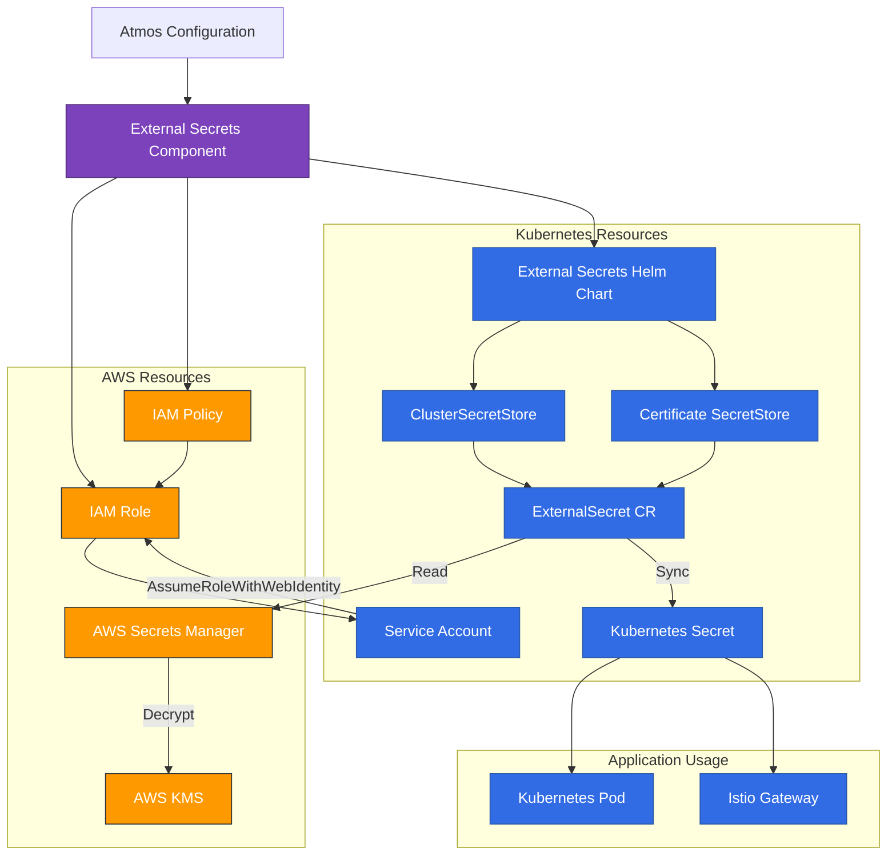
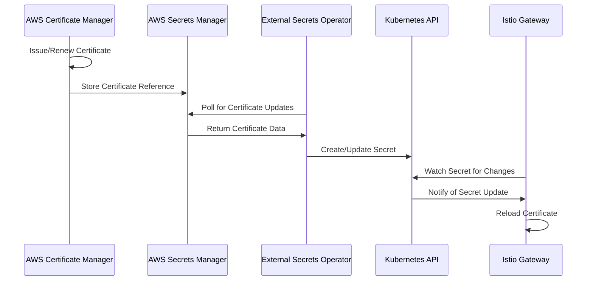

# External Secrets Operator Component

This component deploys and configures the External Secrets Operator in a Kubernetes cluster, enabling secure integration between Kubernetes and external secret management systems such as AWS Secrets Manager.

## Architecture

The External Secrets component implements the following architecture:



### Certificate Management with External Secrets



## Features

- **Secure Secret Integration**: Synchronize secrets from AWS Secrets Manager to Kubernetes securely
- **IAM Role Creation**: Configures proper IRSA (IAM Roles for Service Accounts) for Kubernetes workloads
- **Multiple Secret Stores**: Supports different SecretStores for various purposes (general, certificates)
- **Certificate Management**: Dedicated flows for TLS certificate management
- **Automatic Secret Rotation**: Secrets automatically update in Kubernetes when changed in AWS Secrets Manager
- **Namespace Isolation**: Control access to secrets with namespace-specific configurations
- **Helm-Based Installation**: Uses official Helm chart with customizable options
- **Integration with Istio**: Seamless certificate management for Istio Gateways

## Usage

### Basic Component Configuration

```yaml
components:
  terraform:
    external-secrets:
      vars:
        enabled: true
        cluster_name: ${eks.outputs.cluster_name}
        host: ${eks.outputs.cluster_endpoint}
        cluster_ca_certificate: ${eks.outputs.cluster_certificate_authority_data}
        oidc_provider_arn: ${eks.outputs.oidc_provider_arn}
        oidc_provider_url: ${eks.outputs.oidc_provider_url}
        namespace: "external-secrets"
        service_account_name: "external-secrets"
        chart_version: "0.9.9"
        create_default_cluster_secret_store: true
        create_certificate_secret_store: true
        tags:
          Environment: ${environment}
          Component: "external-secrets"
```

### Kubernetes Secret Synchronization

After the component is deployed, create ExternalSecret resources to sync secrets:

```yaml
apiVersion: external-secrets.io/v1beta1
kind: ExternalSecret
metadata:
  name: db-credentials
  namespace: my-application
spec:
  refreshInterval: "15m"
  secretStoreRef:
    name: aws-secretsmanager
    kind: ClusterSecretStore
  target:
    name: db-credentials
    creationPolicy: Owner
  data:
  - secretKey: username
    remoteRef:
      key: "myapp/dev/database/credentials"
      property: username
  - secretKey: password
    remoteRef:
      key: "myapp/dev/database/credentials"
      property: password
```

### Certificate Management for Istio

Create an ExternalSecret for TLS certificates:

```yaml
apiVersion: external-secrets.io/v1beta1
kind: ExternalSecret
metadata:
  name: tls-certificate
  namespace: istio-ingress
spec:
  refreshInterval: "1h"
  secretStoreRef:
    name: aws-certificate-store
    kind: ClusterSecretStore
  target:
    name: tls-certificate
    creationPolicy: Owner
  data:
  - secretKey: tls.crt
    remoteRef:
      key: "certificates/example-com"
      property: tls.crt
  - secretKey: tls.key
    remoteRef:
      key: "certificates/example-com"
      property: tls.key
```

Configure Istio Gateway to use this certificate:

```yaml
apiVersion: networking.istio.io/v1beta1
kind: Gateway
metadata:
  name: app-gateway
  namespace: istio-ingress
spec:
  selector:
    istio: ingressgateway
  servers:
  - port:
      number: 443
      name: https
      protocol: HTTPS
    tls:
      mode: SIMPLE
      credentialName: tls-certificate # References the Kubernetes secret created by ExternalSecret
    hosts:
    - "*.example.com"
```

## Examples

### Syncing Database Credentials to Multiple Namespaces

```yaml
# Create credentials in AWS Secrets Manager using the secretsmanager component
components:
  terraform:
    secretsmanager:
      vars:
        context_name: "myapp"
        name: "shared-database"
        secrets:
          rds_credentials:
            name: "credentials"
            path: "database"
            generate_random_password: true
            secret_data: |
              {
                "username": "admin",
                "password": "${output.secretsmanager.generated_passwords.db_password}"
              }

# Sync these credentials to multiple namespaces using ExternalSecret CRs
# For namespace: frontend
apiVersion: external-secrets.io/v1beta1
kind: ExternalSecret
metadata:
  name: db-credentials
  namespace: frontend
spec:
  refreshInterval: "15m"
  secretStoreRef:
    name: aws-secretsmanager
    kind: ClusterSecretStore
  target:
    name: db-credentials
  data:
  - secretKey: DB_USERNAME
    remoteRef:
      key: "myapp/dev/database/credentials"
      property: username
  - secretKey: DB_PASSWORD
    remoteRef:
      key: "myapp/dev/database/credentials"
      property: password

# For namespace: backend
apiVersion: external-secrets.io/v1beta1
kind: ExternalSecret
metadata:
  name: db-credentials
  namespace: backend
spec:
  refreshInterval: "15m"
  secretStoreRef:
    name: aws-secretsmanager
    kind: ClusterSecretStore
  target:
    name: db-credentials
  data:
  - secretKey: DB_USERNAME
    remoteRef:
      key: "myapp/dev/database/credentials"
      property: username
  - secretKey: DB_PASSWORD
    remoteRef:
      key: "myapp/dev/database/credentials"
      property: password
```

### Managing Multiple TLS Certificates for Different Domains

```yaml
# Store multiple certificates in AWS Secrets Manager
components:
  terraform:
    secretsmanager_certs:
      vars:
        context_name: "certs"
        name: "domain-certificates"
        secrets:
          example_com:
            name: "example-com"
            path: "certificates"
            secret_data: |
              {
                "tls.crt": "${ssm:/certificates/example-com/cert}",
                "tls.key": "${ssm:/certificates/example-com/key}"
              }
          api_example_com:
            name: "api-example-com"
            path: "certificates"
            secret_data: |
              {
                "tls.crt": "${ssm:/certificates/api-example-com/cert}",
                "tls.key": "${ssm:/certificates/api-example-com/key}"
              }

# Create ExternalSecrets for each certificate
# Main domain
apiVersion: external-secrets.io/v1beta1
kind: ExternalSecret
metadata:
  name: example-com-tls
  namespace: istio-ingress
spec:
  refreshInterval: "1h"
  secretStoreRef:
    name: aws-certificate-store
    kind: ClusterSecretStore
  target:
    name: example-com-tls
  data:
  - secretKey: tls.crt
    remoteRef:
      key: "certs/dev/certificates/example-com"
      property: tls.crt
  - secretKey: tls.key
    remoteRef:
      key: "certs/dev/certificates/example-com"
      property: tls.key

# API subdomain
apiVersion: external-secrets.io/v1beta1
kind: ExternalSecret
metadata:
  name: api-example-com-tls
  namespace: istio-ingress
spec:
  refreshInterval: "1h"
  secretStoreRef:
    name: aws-certificate-store
    kind: ClusterSecretStore
  target:
    name: api-example-com-tls
  data:
  - secretKey: tls.crt
    remoteRef:
      key: "certs/dev/certificates/api-example-com"
      property: tls.crt
  - secretKey: tls.key
    remoteRef:
      key: "certs/dev/certificates/api-example-com"
      property: tls.key
```

## Integration with Other Components

### RDS Component

Securely use database credentials:

```yaml
# 1. Generate database password with secretsmanager component
components:
  terraform:
    secretsmanager:
      vars:
        context_name: "myapp"
        name: "database-secrets"
        secrets:
          db_password:
            name: "password"
            path: "rds"
            generate_random_password: true

# 2. Create RDS instance using the password
components:
  terraform:
    rds:
      vars:
        master_password: "${output.secretsmanager.generated_passwords.db_password}"

# 3. Sync the password to Kubernetes using External Secrets
# Create an ExternalSecret in Kubernetes
apiVersion: external-secrets.io/v1beta1
kind: ExternalSecret
metadata:
  name: rds-credentials
  namespace: app
spec:
  refreshInterval: "15m"
  secretStoreRef:
    name: aws-secretsmanager
    kind: ClusterSecretStore
  target:
    name: rds-credentials
  data:
  - secretKey: password
    remoteRef:
      key: "myapp/dev/rds/password"
```

### ACM Component

Manage TLS certificates for Istio Gateways:

```yaml
# 1. ACM creates and manages certificates
components:
  terraform:
    acm:
      vars:
        dns_domains:
          main_domain:
            domain_name: "example.com"
            validation_method: "DNS"

# 2. Reference certificates in Secrets Manager
components:
  terraform:
    secretsmanager:
      vars:
        context_name: "certs"
        name: "tls-certificates"
        secrets:
          example_com:
            name: "example-com"
            path: "certificates"
            secret_data: |
              {
                "acm_arn": "${acm.outputs.certificate_arns.main_domain}",
                "tls.crt": "${ssm:/certs/example-com/cert}",
                "tls.key": "${ssm:/certs/example-com/key}"
              }

# 3. Sync certificates to Kubernetes using External Secrets
# (See ExternalSecret example above)
```

## Inputs

| Name | Description | Type | Default | Required |
|------|-------------|------|---------|:--------:|
| `region` | AWS region | `string` | n/a | yes |
| `enabled` | Whether the component is enabled | `bool` | `true` | no |
| `cluster_name` | EKS cluster name | `string` | n/a | yes |
| `host` | Kubernetes host | `string` | n/a | yes |
| `cluster_ca_certificate` | Kubernetes cluster CA certificate | `string` | n/a | yes |
| `oidc_provider_arn` | OIDC provider ARN for the EKS cluster | `string` | n/a | yes |
| `oidc_provider_url` | OIDC provider URL for the EKS cluster | `string` | n/a | yes |
| `namespace` | Kubernetes namespace to install external-secrets | `string` | `"external-secrets"` | no |
| `create_namespace` | Whether to create the namespace | `bool` | `true` | no |
| `service_account_name` | Name of service account for external-secrets | `string` | `"external-secrets"` | no |
| `chart_version` | Version of the external-secrets Helm chart | `string` | `"0.9.9"` | no |
| `certificate_secret_path_template` | Template for certificate secrets path | `string` | `"certificates/{name}"` | no |
| `create_default_cluster_secret_store` | Create default cluster secret store | `bool` | `true` | no |
| `create_certificate_secret_store` | Create dedicated secret store for certificates | `bool` | `true` | no |
| `tags` | Tags to apply to resources | `map(string)` | `{}` | no |

## Outputs

| Name | Description |
|------|-------------|
| `external_secrets_role_arn` | ARN of the IAM role for external-secrets |
| `external_secrets_role_name` | Name of the IAM role for external-secrets |
| `external_secrets_policy_arn` | ARN of the IAM policy for external-secrets |
| `external_secrets_policy_name` | Name of the IAM policy for external-secrets |
| `external_secrets_service_account` | Name of the service account for external-secrets |
| `external_secrets_namespace` | Namespace where external-secrets is installed |
| `default_cluster_secret_store_name` | Name of the default ClusterSecretStore |
| `certificate_secret_store_name` | Name of the certificate ClusterSecretStore |

## Security Best Practices

1. **IAM Role Configuration**: The component creates an IAM role with the least privilege required to access secrets.
2. **ClusterSecretStore Isolation**: Dedicated secret stores are created for different types of secrets (general vs certificates).
3. **Namespace-Bound Secrets**: Secrets are created in specific namespaces and not cluster-wide.
4. **Secret Rotation**: Automatic updates when secrets change in AWS Secrets Manager.
5. **Encryption**: All secrets are encrypted at rest in AWS Secrets Manager and Kubernetes.
6. **Controlled Access**: Only authorized pods can access secrets through proper RBAC configuration.
7. **Certificate Management**: Special handling for TLS certificates to ensure proper rotation.
8. **Audit Trail**: All access to secrets is logged in AWS CloudTrail.

## Troubleshooting

### Common Issues

| Issue | Solution |
|-------|----------|
| **External Secret not syncing** | Check IAM role permissions, verify the secret exists in AWS Secrets Manager, check the ExternalSecret CR for correct configuration |
| **Incorrect IAM role configuration** | Verify OIDC provider setup, check service account annotations, ensure IAM policy allows access to required secrets |
| **TLS certificate not being updated** | Check refresh interval, verify certificate path in Secrets Manager, check for ACM integration issues |
| **"AccessDenied" errors in logs** | Check IAM policies, verify secret ARNs match the pattern in the policy, ensure KMS key access is configured |
| **Gateway reports certificate errors** | Check the credentialName matches the secret name, verify TLS certificate format, check secret exists in the correct namespace |

### Debugging Steps

1. Check External Secrets Operator logs:
   ```bash
   kubectl logs -n external-secrets -l app.kubernetes.io/name=external-secrets
   ```

2. Check status of ExternalSecret resources:
   ```bash
   kubectl get externalsecrets -A
   kubectl describe externalsecret <name> -n <namespace>
   ```

3. Verify IAM role and service account configuration:
   ```bash
   kubectl describe serviceaccount external-secrets -n external-secrets
   aws iam get-role --role-name <role-name>
   ```

4. Test Secret Manager access:
   ```bash
   aws secretsmanager list-secrets
   aws secretsmanager describe-secret --secret-id <secret-path>
   ```

5. Check ClusterSecretStore configuration:
   ```bash
   kubectl get clustersecretstore
   kubectl describe clustersecretstore aws-secretsmanager
   ```

## Related Resources

- [AWS Secrets Manager Component](../secretsmanager) - For creating and managing secrets in AWS Secrets Manager
- [EKS Component](../eks) - For creating the Kubernetes cluster
- [EKS Addons Component](../eks-addons) - For managing other Kubernetes add-ons
- [ACM Component](../acm) - For certificate management
- [External Secrets Operator Documentation](https://external-secrets.io/latest/) - Official documentation
- [Istio Service Mesh Guide](../../docs/istio-service-mesh-guide.md) - For Istio integration details