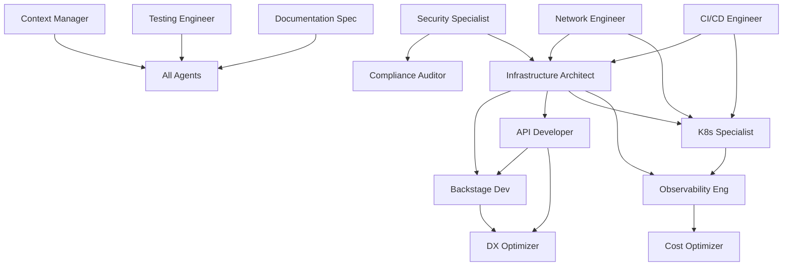

# Agent Coordination Framework
## Multi-Agent Orchestration for Terraform/Atmos Infrastructure Platform

---

## 1. Framework Overview

### Purpose
This framework establishes the operational protocols, communication patterns, and coordination mechanisms for 14+ specialized agents working on the Terraform/Atmos infrastructure platform transformation.

### Core Principles
1. **Autonomous Operation**: Agents work independently within defined boundaries
2. **Collaborative Integration**: Seamless handoffs and dependency management
3. **Context Preservation**: Continuous state management across sessions
4. **Conflict Prevention**: Clear ownership and escalation paths
5. **Quality Assurance**: Built-in validation at every handoff point

---

## 2. Agent Registry & Responsibilities

### Tier 1: Coordination Layer
```yaml
context_manager:
  id: agent-001
  role: Master Coordinator
  responsibilities:
    - Maintain global project state
    - Coordinate agent activities
    - Resolve conflicts
    - Track progress
    - Manage context distribution
  authority: FULL
  dependencies: []
  communication: ALL_AGENTS
```

### Tier 2: Infrastructure Layer
```yaml
infrastructure_architect:
  id: agent-002
  role: Terraform/Atmos Optimization
  responsibilities:
    - Review component architecture
    - Optimize resource definitions
    - Ensure best practices
    - Validate configurations
  ownership:
    - components/terraform/*
    - stacks/*
    - workflows/*
  dependencies: [context_manager]

security_specialist:
  id: agent-003
  role: Security & Compliance
  responsibilities:
    - Implement security controls
    - Audit configurations
    - Manage certificates
    - Ensure compliance
  ownership:
    - security/*
    - All IAM policies
    - Certificate management
  dependencies: [context_manager, infrastructure_architect]

network_engineer:
  id: agent-004
  role: Network Architecture
  responsibilities:
    - VPC design optimization
    - Network segmentation
    - Traffic flow management
    - DNS configuration
  ownership:
    - components/terraform/vpc/*
    - components/terraform/dns/*
    - Network security groups
  dependencies: [infrastructure_architect]
```

### Tier 3: Platform Layer
```yaml
backstage_developer:
  id: agent-005
  role: IDP Implementation
  responsibilities:
    - Complete Backstage setup
    - Develop custom plugins
    - Integrate with infrastructure
    - Create developer portal
  ownership:
    - platform/backstage/*
    - plugins/*
    - catalog/*
  dependencies: [api_developer, infrastructure_architect]

api_developer:
  id: agent-006
  role: Platform APIs
  responsibilities:
    - Build REST APIs
    - Implement GraphQL gateway
    - Create webhooks
    - Develop SDKs
  ownership:
    - platform/api/*
    - API specifications
    - Integration contracts
  dependencies: [infrastructure_architect]

kubernetes_specialist:
  id: agent-007
  role: Container Platform
  responsibilities:
    - EKS optimization
    - Addon management
    - Service mesh implementation
    - Workload optimization
  ownership:
    - components/terraform/eks/*
    - components/terraform/eks-addons/*
    - k8s/*
  dependencies: [infrastructure_architect, network_engineer]
```

### Tier 4: Operations Layer
```yaml
observability_engineer:
  id: agent-008
  role: Monitoring & Logging
  responsibilities:
    - Implement monitoring stack
    - Configure alerting
    - Setup logging pipeline
    - Create dashboards
  ownership:
    - components/terraform/monitoring/*
    - monitoring/*
    - Observability configurations
  dependencies: [infrastructure_architect, kubernetes_specialist]

cicd_engineer:
  id: agent-009
  role: Automation & Pipelines
  responsibilities:
    - Optimize workflows
    - Implement GitOps
    - Configure Atlantis
    - Setup Jenkins pipelines
  ownership:
    - workflows/*
    - integrations/*
    - .github/workflows/*
  dependencies: [infrastructure_architect]

cost_optimizer:
  id: agent-010
  role: FinOps Implementation
  responsibilities:
    - Cost analysis
    - Resource optimization
    - Budget alerts
    - Chargeback implementation
  ownership:
    - Cost policies
    - Resource tagging
    - Optimization scripts
  dependencies: [observability_engineer]
```

### Tier 5: Quality & Documentation
```yaml
testing_engineer:
  id: agent-011
  role: Quality Assurance
  responsibilities:
    - Infrastructure testing
    - Integration testing
    - Performance testing
    - Security testing
  ownership:
    - Test frameworks
    - Test scenarios
    - Quality gates
  dependencies: [all_development_agents]

documentation_specialist:
  id: agent-012
  role: Technical Documentation
  responsibilities:
    - Maintain documentation
    - Create user guides
    - Update READMEs
    - Generate API docs
  ownership:
    - docs/*
    - All README.md files
    - API documentation
  dependencies: [all_agents]

dx_optimizer:
  id: agent-013
  role: Developer Experience
  responsibilities:
    - Simplify workflows
    - Create golden paths
    - Improve onboarding
    - Gather feedback
  ownership:
    - Developer workflows
    - Templates
    - CLI tools
  dependencies: [backstage_developer, api_developer]

compliance_auditor:
  id: agent-014
  role: Compliance & Governance
  responsibilities:
    - SOC2 compliance
    - ISO27001 alignment
    - Policy enforcement
    - Audit reporting
  ownership:
    - Compliance policies
    - Audit reports
    - Governance frameworks
  dependencies: [security_specialist]
```

---

## 3. Communication Protocols

### 3.1 Context File Structure
```yaml
context_directory: .context/
structure:
  global/
    - project_state.yaml      # Overall project status
    - dependency_map.yaml     # Component dependencies
    - risk_register.yaml      # Active risks
  
  agents/
    - agent-{id}/
      - status.yaml           # Agent current status
      - tasks.yaml           # Assigned tasks
      - handoffs.yaml        # Pending handoffs
      - outputs/             # Generated artifacts
  
  components/
    - {component}/
      - state.yaml           # Component status
      - changes.log          # Change history
      - owners.yaml          # Ownership matrix
```

### 3.2 Message Format
```yaml
message_schema:
  header:
    id: uuid
    from: agent_id
    to: agent_id | ALL
    timestamp: ISO8601
    priority: P0|P1|P2|P3
    type: REQUEST|RESPONSE|UPDATE|ALERT
  
  body:
    subject: string
    content: markdown
    artifacts: 
      - path: string
        type: code|config|document
    dependencies:
      - agent: agent_id
        artifact: string
        status: required|optional
  
  metadata:
    correlation_id: uuid
    thread_id: uuid
    tags: [string]
```

### 3.3 Handoff Protocol
```yaml
handoff_process:
  1_initiation:
    - Complete current task
    - Update component state
    - Generate handoff summary
    
  2_validation:
    - Run validation checks
    - Ensure artifacts complete
    - Document known issues
    
  3_transfer:
    - Create handoff document
    - Update context files
    - Notify receiving agent
    
  4_acknowledgment:
    - Receiving agent confirms
    - Reviews artifacts
    - Accepts or requests clarification
    
  5_completion:
    - Original agent archives
    - Context manager logs
    - Progress tracker updates
```

---

## 4. Conflict Resolution Framework

### 4.1 Conflict Types & Resolution
```yaml
technical_conflicts:
  detection: Automated via git hooks
  resolution:
    L1: Agent consensus (2+ agree)
    L2: Context manager decision
    L3: Technical review board
  escalation_time: 4 hours per level

design_conflicts:
  detection: Design review process
  resolution:
    L1: Working group discussion
    L2: Architecture review
    L3: Platform steering committee
  escalation_time: 1 day per level

priority_conflicts:
  detection: Resource contention
  resolution:
    L1: Context manager prioritization
    L2: Business value assessment
    L3: Executive decision
  escalation_time: 2 hours per level

ownership_conflicts:
  detection: Overlapping changes
  resolution:
    L1: Primary owner decision
    L2: Shared ownership agreement
    L3: Context manager assignment
  escalation_time: Immediate
```

### 4.2 Escalation Matrix
| Conflict Type | L1 Authority | L2 Authority | L3 Authority | SLA |
|--------------|--------------|--------------|--------------|-----|
| Code Merge | Agents | Context Manager | Tech Lead | 4h |
| Architecture | Architect | Review Board | CTO | 24h |
| Security | Security Spec | CISO | Executive | 2h |
| Priority | Context Mgr | Product Owner | Executive | 4h |
| Resource | Context Mgr | Finance | Executive | 8h |

---

## 5. Dependency Management

### 5.1 Dependency Graph


### 5.2 Dependency Rules
```yaml
blocking_dependencies:
  # Must complete before dependent can start
  infrastructure_changes:
    blocks: [api_development, backstage_setup]
    timeout: 24h
    
  security_approval:
    blocks: [production_deployment]
    timeout: 4h
    
  network_setup:
    blocks: [service_deployment]
    timeout: 8h

non_blocking_dependencies:
  # Can proceed with warnings
  documentation_updates:
    warns: [all_agents]
    timeout: 72h
    
  testing_completion:
    warns: [deployment_agents]
    timeout: 48h
```

---

## 6. Progress Tracking

### 6.1 Task States
```yaml
task_lifecycle:
  states:
    - CREATED: Task defined
    - ASSIGNED: Agent assigned
    - IN_PROGRESS: Active work
    - BLOCKED: Waiting on dependency
    - REVIEW: Under review
    - COMPLETED: Successfully done
    - FAILED: Requires intervention
    
  transitions:
    CREATED -> ASSIGNED: Context manager assigns
    ASSIGNED -> IN_PROGRESS: Agent begins work
    IN_PROGRESS -> BLOCKED: Dependency not met
    BLOCKED -> IN_PROGRESS: Dependency resolved
    IN_PROGRESS -> REVIEW: Work complete
    REVIEW -> COMPLETED: Approved
    REVIEW -> IN_PROGRESS: Changes requested
    * -> FAILED: Unrecoverable error
```

### 6.2 Progress Metrics
```yaml
metrics:
  velocity:
    - Tasks completed per day
    - Story points per sprint
    - Components delivered per week
    
  quality:
    - Defect rate
    - Rework percentage
    - Review pass rate
    
  collaboration:
    - Handoff success rate
    - Conflict resolution time
    - Communication effectiveness
    
  efficiency:
    - Blocked time percentage
    - Context switch frequency
    - Automation coverage
```

---

## 7. Quality Gates

### 7.1 Component Completion Criteria
```yaml
component_gates:
  code_complete:
    - Terraform validates
    - Follows naming conventions
    - Includes variables.tf, outputs.tf
    - Has README.md
    
  security_approved:
    - No critical vulnerabilities
    - IAM policies least privilege
    - Encryption enabled
    - Secrets properly managed
    
  testing_passed:
    - Unit tests pass
    - Integration tests pass
    - No regression detected
    
  documentation_complete:
    - README updated
    - Examples provided
    - API documented
    - Runbooks created
```

### 7.2 Handoff Quality Checks
```yaml
handoff_validation:
  mandatory:
    - [ ] Context files updated
    - [ ] Artifacts accessible
    - [ ] Dependencies documented
    - [ ] Known issues listed
    - [ ] Success criteria defined
    
  automated_checks:
    - Syntax validation
    - Security scanning
    - Dependency analysis
    - Documentation completeness
```

---

## 8. Emergency Procedures

### 8.1 Incident Response
```yaml
incident_levels:
  P0_critical:
    description: Production down, data loss risk
    response_time: 15 minutes
    authority: Any agent can trigger
    coordination: Context manager leads
    
  P1_high:
    description: Service degraded, security issue
    response_time: 1 hour
    authority: Senior agents
    coordination: Domain expert leads
    
  P2_medium:
    description: Non-critical issues
    response_time: 4 hours
    authority: All agents
    coordination: Standard process
```

### 8.2 Recovery Procedures
```yaml
rollback_process:
  1_detection:
    - Automated monitoring alerts
    - Agent identifies issue
    - Impact assessment
    
  2_decision:
    - Evaluate rollback vs fix-forward
    - Get approvals if needed
    - Prepare rollback plan
    
  3_execution:
    - Execute rollback
    - Verify system stability
    - Document incident
    
  4_review:
    - Root cause analysis
    - Update procedures
    - Implement preventions
```

---

## 9. Performance Optimization

### 9.1 Agent Efficiency
```yaml
optimization_strategies:
  parallel_execution:
    - Independent components
    - Non-blocking tasks
    - Concurrent testing
    
  resource_pooling:
    - Shared environments
    - Reusable artifacts
    - Cached dependencies
    
  automation:
    - Repetitive tasks
    - Validation checks
    - Report generation
```

### 9.2 Communication Optimization
```yaml
communication_efficiency:
  batch_updates:
    frequency: Every 4 hours
    format: Consolidated summary
    
  async_communication:
    tools: Context files, PR comments
    response_sla: 4 hours
    
  sync_points:
    daily_standup: 09:00 UTC
    weekly_review: Friday 15:00 UTC
```

---

## 10. Success Criteria

### 10.1 Project Success Metrics
```yaml
project_goals:
  delivery:
    - All 17 components optimized
    - Backstage portal operational
    - Platform APIs functional
    - 90% automation coverage
    
  quality:
    - Zero critical security issues
    - 95% uptime achieved
    - < 5% defect rate
    - 100% documentation coverage
    
  timeline:
    - Phase 1: Week 1-2
    - Phase 2: Week 3-4
    - Phase 3: Week 5-6
    - Production ready: Week 8
```

### 10.2 Agent Performance Metrics
```yaml
agent_kpis:
  productivity:
    - Tasks completed: > 90% on time
    - Quality score: > 4.5/5
    - Collaboration: No escalations
    
  communication:
    - Response time: < 4 hours
    - Handoff success: > 95%
    - Context quality: Complete
```

---

## Appendix A: Agent Startup Checklist

```yaml
agent_initialization:
  1_orientation:
    - [ ] Read this framework document
    - [ ] Review project state assessment
    - [ ] Understand dependencies
    - [ ] Set up context directory
    
  2_setup:
    - [ ] Clone repository
    - [ ] Install dependencies
    - [ ] Configure credentials
    - [ ] Verify access permissions
    
  3_coordination:
    - [ ] Register with context manager
    - [ ] Review assigned tasks
    - [ ] Identify dependencies
    - [ ] Plan execution approach
    
  4_execution:
    - [ ] Begin assigned tasks
    - [ ] Update context regularly
    - [ ] Communicate blockers
    - [ ] Request reviews as needed
```

## Appendix B: Communication Templates

### Task Handoff Template
```markdown
# Task Handoff: [Component/Feature Name]

## From: [Agent ID]
## To: [Agent ID]
## Date: [ISO 8601]

### Completed Work
- [List completed items]

### Artifacts
- Path: [location]
- Type: [code/config/doc]
- Status: [final/draft]

### Known Issues
- [Issue description and impact]

### Dependencies
- [Required dependencies]

### Success Criteria
- [Acceptance criteria]

### Notes
[Additional context]
```

---

**Framework Version**: 1.0  
**Effective Date**: 2024-01-16  
**Review Cycle**: Weekly  
**Owner**: Context Manager Agent (agent-001)