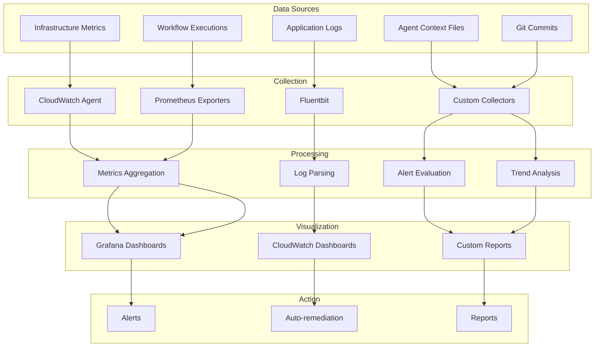

# Multi-Agent Project Monitoring Strategy
## Comprehensive Health Monitoring and Progress Tracking

---

## 1. Monitoring Architecture Overview

### 1.1 Monitoring Layers
```yaml
monitoring_stack:
  infrastructure_layer:
    tools:
      - CloudWatch (AWS native)
      - Prometheus (metrics collection)
      - Grafana (visualization)
    metrics:
      - Resource utilization
      - Service availability
      - Network performance
      - Cost tracking
  
  application_layer:
    tools:
      - OpenTelemetry (tracing)
      - ELK Stack (logging)
      - APM solutions
    metrics:
      - API latency
      - Error rates
      - Transaction volumes
      - User experience
  
  project_layer:
    tools:
      - Context files (custom)
      - Git analytics
      - JIRA/GitHub Issues
    metrics:
      - Task completion
      - Agent productivity
      - Dependency resolution
      - Communication effectiveness
```

### 1.2 Monitoring Flow


---

## 2. Project Health Dashboard

### 2.1 Executive Dashboard
```yaml
executive_dashboard:
  url: /dashboards/executive
  refresh: 5 minutes
  
  widgets:
    project_progress:
      type: progress_bar
      metric: Components completed / Total
      current: 0/17
      target: 17/17
      color_coding:
        green: > 80%
        yellow: 50-80%
        red: < 50%
    
    timeline_status:
      type: gantt_chart
      shows:
        - Planned vs Actual
        - Critical path
        - Milestones
      status: ON_TRACK | AT_RISK | DELAYED
    
    cost_tracker:
      type: line_graph
      metrics:
        - Daily spend
        - Cumulative cost
        - Budget remaining
      alerts: > 80% budget consumed
    
    risk_matrix:
      type: heatmap
      dimensions: [probability, impact]
      risks: Active risks plotted
      threshold: > 10 risk score
    
    agent_activity:
      type: activity_map
      shows:
        - Active agents
        - Tasks in progress
        - Blockers
      update: Real-time
```

### 2.2 Technical Dashboard
```yaml
technical_dashboard:
  url: /dashboards/technical
  refresh: 1 minute
  
  widgets:
    infrastructure_health:
      components:
        backend: 
          status: HEALTHY | DEGRADED | DOWN
          metrics: [availability, latency]
        vpc:
          status: HEALTHY | DEGRADED | DOWN
          metrics: [packet_loss, bandwidth]
        eks:
          status: HEALTHY | DEGRADED | DOWN
          metrics: [api_availability, node_health]
        rds:
          status: HEALTHY | DEGRADED | DOWN
          metrics: [connections, cpu, storage]
    
    deployment_metrics:
      frequency:
        current: 2/week
        target: 10/day
        trend: INCREASING | STABLE | DECREASING
      
      success_rate:
        current: 85%
        target: 95%
        last_10: [✓,✓,✗,✓,✓,✓,✗,✓,✓,✓]
      
      rollback_rate:
        current: 15%
        target: < 5%
        causes: [config_error, test_failure, performance]
    
    security_posture:
      vulnerabilities:
        critical: 0
        high: 3
        medium: 12
        low: 45
      
      compliance:
        soc2: 60%
        iso27001: 55%
        cis: 70%
      
      certificates:
        expiring_30d: 2
        expiring_7d: 0
        expired: 0
    
    performance_metrics:
      api_latency:
        p50: 45ms
        p95: 120ms
        p99: 250ms
        target: < 200ms p99
      
      error_rate:
        current: 2.3%
        target: < 1%
        by_service: {api: 1.2%, web: 3.1%, db: 0.5%}
```

---

## 3. Agent Performance Monitoring

### 3.1 Individual Agent Metrics
```yaml
agent_metrics:
  agent-001_context_manager:
    status: ACTIVE
    health: GREEN
    current_tasks: 3
    completed_today: 5
    
    productivity:
      velocity: 5 tasks/day
      quality_score: 4.8/5.0
      on_time_delivery: 100%
    
    collaboration:
      messages_sent: 23
      avg_response_time: 18 min
      handoffs_completed: 4
    
    workload:
      utilization: 75%
      blocked_time: 5%
      overhead_time: 20%
  
  agent-002_infrastructure_architect:
    status: ACTIVE
    health: YELLOW
    current_tasks: 5
    completed_today: 2
    blockers: ["Waiting for security review"]
    
    component_progress:
      vpc: COMPLETED
      iam: COMPLETED
      eks: IN_PROGRESS (60%)
      rds: NOT_STARTED
    
    code_metrics:
      lines_modified: 1,234
      components_updated: 3
      validation_passes: 12/13
```

### 3.2 Team Performance Metrics
```yaml
team_metrics:
  overall_velocity:
    current_sprint: 45 points
    previous_sprint: 38 points
    trending: IMPROVING
    
  collaboration_index:
    handoff_success: 94%
    knowledge_sharing: HIGH
    conflict_rate: 0.5/week
    
  quality_metrics:
    defect_escape_rate: 3%
    rework_percentage: 8%
    review_coverage: 100%
    
  efficiency_metrics:
    automation_ratio: 65%
    manual_overhead: 35%
    context_switches: 2.3/day
```

---

## 4. Component Health Monitoring

### 4.1 Component Status Matrix
```yaml
component_health:
  vpc:
    terraform_state: SYNCED
    drift_detected: NO
    last_modified: 2024-01-15
    validation: PASSED
    dependencies_met: YES
    issues: []
    
  eks:
    terraform_state: SYNCED
    drift_detected: YES
    last_modified: 2024-01-14
    validation: PASSED
    dependencies_met: YES
    issues: ["Node group sizing drift"]
    
  rds:
    terraform_state: SYNCED
    drift_detected: NO
    last_modified: 2024-01-10
    validation: PASSED
    dependencies_met: YES
    issues: ["Backup retention needs update"]
```

### 4.2 Dependency Health
```yaml
dependency_health:
  critical_path:
    status: HEALTHY
    components: [backend, vpc, iam, eks]
    bottlenecks: []
    estimated_completion: ON_TIME
    
  integration_points:
    vpc_to_eks: HEALTHY
    eks_to_monitoring: PENDING
    rds_to_secretsmanager: HEALTHY
    lambda_to_apigateway: NOT_CONFIGURED
    
  circular_dependencies:
    detected: NO
    components: []
    resolution: N/A
```

---

## 5. Workflow Execution Monitoring

### 5.1 Workflow Performance
```yaml
workflow_metrics:
  execution_stats:
    validate:
      runs_today: 15
      success_rate: 93%
      avg_duration: 2m 15s
      failures: ["Component X validation"]
      
    plan_environment:
      runs_today: 5
      success_rate: 100%
      avg_duration: 5m 30s
      resource_changes: 23
      
    apply_environment:
      runs_today: 2
      success_rate: 100%
      avg_duration: 15m 45s
      resources_created: 18
      resources_modified: 5
      
    drift_detection:
      runs_today: 3
      drift_found: YES
      affected_components: [eks, monitoring]
      auto_remediated: NO
```

### 5.2 Workflow Queue
```yaml
workflow_queue:
  pending:
    - workflow: apply_environment
      environment: staging
      priority: P1
      scheduled: 2024-01-16T18:00:00Z
      
    - workflow: rotate_certificate
      component: acm
      priority: P2
      scheduled: 2024-01-17T00:00:00Z
  
  running:
    - workflow: plan_environment
      environment: dev
      started: 2024-01-16T14:30:00Z
      progress: 60%
      eta: 3 minutes
  
  blocked:
    - workflow: destroy_environment
      environment: test
      blocker: "Approval required"
      waiting_since: 2024-01-16T10:00:00Z
```

---

## 6. Alert Configuration

### 6.1 Alert Rules
```yaml
alert_rules:
  infrastructure:
    backend_unavailable:
      condition: S3 or DynamoDB unreachable
      severity: CRITICAL
      channels: [pagerduty, slack-critical]
      runbook: docs/runbooks/backend-recovery.md
      
    high_drift:
      condition: > 10% resources drifted
      severity: WARNING
      channels: [slack-infra]
      runbook: docs/runbooks/drift-remediation.md
      
    cost_spike:
      condition: Daily spend > 150% average
      severity: WARNING
      channels: [email-finance, slack-cost]
      runbook: docs/runbooks/cost-investigation.md
  
  project:
    agent_inactive:
      condition: No activity > 4 hours
      severity: WARNING
      channels: [context-manager]
      action: Check agent status
      
    task_overdue:
      condition: Task past due date
      severity: WARNING
      channels: [agent, context-manager]
      action: Review and reassign
      
    milestone_at_risk:
      condition: < 80% complete 24h before due
      severity: HIGH
      channels: [all-agents, stakeholders]
      action: Emergency planning session
  
  quality:
    high_error_rate:
      condition: Error rate > 5%
      severity: HIGH
      channels: [slack-eng, pagerduty]
      runbook: docs/runbooks/error-investigation.md
      
    validation_failures:
      condition: > 3 failures in 1 hour
      severity: WARNING
      channels: [slack-eng]
      action: Review and fix
```

### 6.2 Alert Routing
```yaml
alert_routing:
  channels:
    pagerduty:
      integration: REST API
      severities: [CRITICAL]
      schedule: 24/7
      escalation: Yes
      
    slack-critical:
      webhook: https://hooks.slack.com/xxx
      channel: "#incidents"
      severities: [CRITICAL, HIGH]
      mentions: ["@oncall", "@team-lead"]
      
    slack-infra:
      webhook: https://hooks.slack.com/yyy
      channel: "#infrastructure"
      severities: [WARNING, INFO]
      
    email-finance:
      smtp: smtp.company.com
      recipients: ["finance@company.com"]
      severities: [WARNING, HIGH]
      
    context-manager:
      method: Context file update
      location: .context/alerts/
      severities: ALL
```

---

## 7. Progress Tracking

### 7.1 Milestone Tracking
```yaml
milestones:
  current_milestone:
    name: "Foundation Complete"
    due: 2024-01-20
    progress: 35%
    
    deliverables:
      - name: "Core Infrastructure"
        status: COMPLETED
        completion: 100%
        
      - name: "Platform APIs"
        status: IN_PROGRESS
        completion: 30%
        blockers: ["API design review"]
        
      - name: "Monitoring Stack"
        status: NOT_STARTED
        completion: 0%
        dependencies: ["EKS ready"]
    
    risks:
      - description: "EKS addon compatibility"
        probability: MEDIUM
        impact: HIGH
        mitigation: "Test in dev first"
  
  upcoming_milestones:
    - name: "Platform Operational"
      due: 2024-02-01
      dependencies: ["Foundation Complete"]
      
    - name: "Production Ready"
      due: 2024-02-15
      dependencies: ["Platform Operational", "Security Audit"]
```

### 7.2 Velocity Tracking
```yaml
velocity_metrics:
  sprint_velocity:
    current: 45 points
    average: 42 points
    trend: STABLE
    
  burndown:
    total_points: 200
    completed: 75
    remaining: 125
    on_track: YES
    
  cycle_time:
    average: 2.5 days
    median: 2 days
    improving: YES
    
  throughput:
    tasks_per_day: 8.5
    trending: INCREASING
    bottlenecks: ["Code review", "Testing"]
```

---

## 8. Automated Remediation

### 8.1 Auto-Remediation Rules
```yaml
auto_remediation:
  infrastructure:
    instance_unhealthy:
      detection: ELB health check fail
      action: Terminate and replace
      approval: AUTOMATIC
      cooldown: 5 minutes
      
    disk_space_low:
      detection: > 90% utilized
      action: Clean temp files, expand volume
      approval: AUTOMATIC
      notification: slack-infra
      
    certificate_expiring:
      detection: < 30 days remaining
      action: Renew certificate
      approval: AUTOMATIC
      notification: email-security
  
  workflows:
    validation_failure:
      detection: Terraform validate fails
      action: Run terraform fmt, retry
      approval: AUTOMATIC
      max_retries: 2
      
    state_lock:
      detection: Lock held > 30 minutes
      action: Force unlock if no active operation
      approval: MANUAL
      notification: slack-infra
  
  project:
    context_desync:
      detection: Conflict in context files
      action: Merge and reconcile
      approval: MANUAL
      notification: context-manager
```

---

## 9. Reporting Schedule

### 9.1 Automated Reports
```yaml
reports:
  daily:
    project_status:
      time: 09:00 UTC
      recipients: [all-agents, stakeholders]
      format: Summary dashboard link
      contents:
        - Task completion
        - Active blockers
        - Health status
        - Next 24h priorities
    
    cost_report:
      time: 10:00 UTC
      recipients: [finance, project-manager]
      format: CSV + charts
      contents:
        - Daily spend
        - Budget utilization
        - Cost trends
        - Optimization opportunities
  
  weekly:
    progress_report:
      day: Friday
      time: 15:00 UTC
      recipients: [executives, stakeholders]
      format: Detailed markdown
      contents:
        - Milestone progress
        - Completed deliverables
        - Risk assessment
        - Next week plan
    
    quality_report:
      day: Monday
      time: 09:00 UTC
      recipients: [tech-lead, qa-team]
      format: Metrics dashboard
      contents:
        - Defect trends
        - Test coverage
        - Code quality
        - Security findings
  
  monthly:
    executive_summary:
      day: Last Friday
      recipients: [c-suite]
      format: Presentation
      contents:
        - Overall progress
        - Budget status
        - Major achievements
        - Strategic recommendations
```

---

## 10. Continuous Improvement

### 10.1 Monitoring Effectiveness
```yaml
monitoring_health:
  coverage:
    infrastructure: 95%
    applications: 85%
    workflows: 100%
    agents: 100%
    target: 100% all categories
    
  alert_quality:
    false_positive_rate: 5%
    alert_fatigue_score: LOW
    actionable_alerts: 92%
    target: < 2% false positives
    
  dashboard_usage:
    executive: Daily views
    technical: Continuous
    project: Hourly
    adoption: 100%
    
  report_effectiveness:
    on_time_delivery: 98%
    stakeholder_satisfaction: 4.5/5
    action_items_completed: 85%
```

### 10.2 Optimization Opportunities
```yaml
optimizations:
  identified:
    - description: "Consolidate CloudWatch dashboards"
      impact: Cost reduction $500/month
      effort: 2 days
      priority: MEDIUM
      
    - description: "Implement predictive alerting"
      impact: Prevent 30% of incidents
      effort: 1 week
      priority: HIGH
      
    - description: "Automate report generation"
      impact: Save 10 hours/week
      effort: 3 days
      priority: HIGH
    
  in_progress:
    - "Migration to Prometheus for metrics"
    - "Custom context file analyzer"
    - "Automated dependency mapper"
    
  completed:
    - "CloudWatch to Grafana integration"
    - "Slack alert consolidation"
    - "Git commit analytics"
```

---

## Appendix A: Monitoring Tools Configuration

### Prometheus Configuration
```yaml
global:
  scrape_interval: 15s
  evaluation_interval: 15s

scrape_configs:
  - job_name: 'kubernetes-pods'
    kubernetes_sd_configs:
      - role: pod
    relabel_configs:
      - source_labels: [__meta_kubernetes_pod_annotation_prometheus_io_scrape]
        action: keep
        regex: true

  - job_name: 'terraform-metrics'
    static_configs:
      - targets: ['localhost:9090']
    metrics_path: '/metrics'

alerting:
  alertmanagers:
    - static_configs:
        - targets: ['alertmanager:9093']

rule_files:
  - 'alerts/*.yml'
  - 'rules/*.yml'
```

### Grafana Dashboard JSON (excerpt)
```json
{
  "dashboard": {
    "title": "Multi-Agent Project Health",
    "panels": [
      {
        "id": 1,
        "title": "Project Progress",
        "type": "graph",
        "targets": [
          {
            "expr": "sum(tasks_completed) / sum(tasks_total) * 100",
            "legendFormat": "Progress %"
          }
        ]
      }
    ]
  }
}
```

---

**Document Version**: 1.0  
**Last Updated**: 2024-01-16  
**Review Frequency**: Daily  
**Owner**: Context Manager Agent