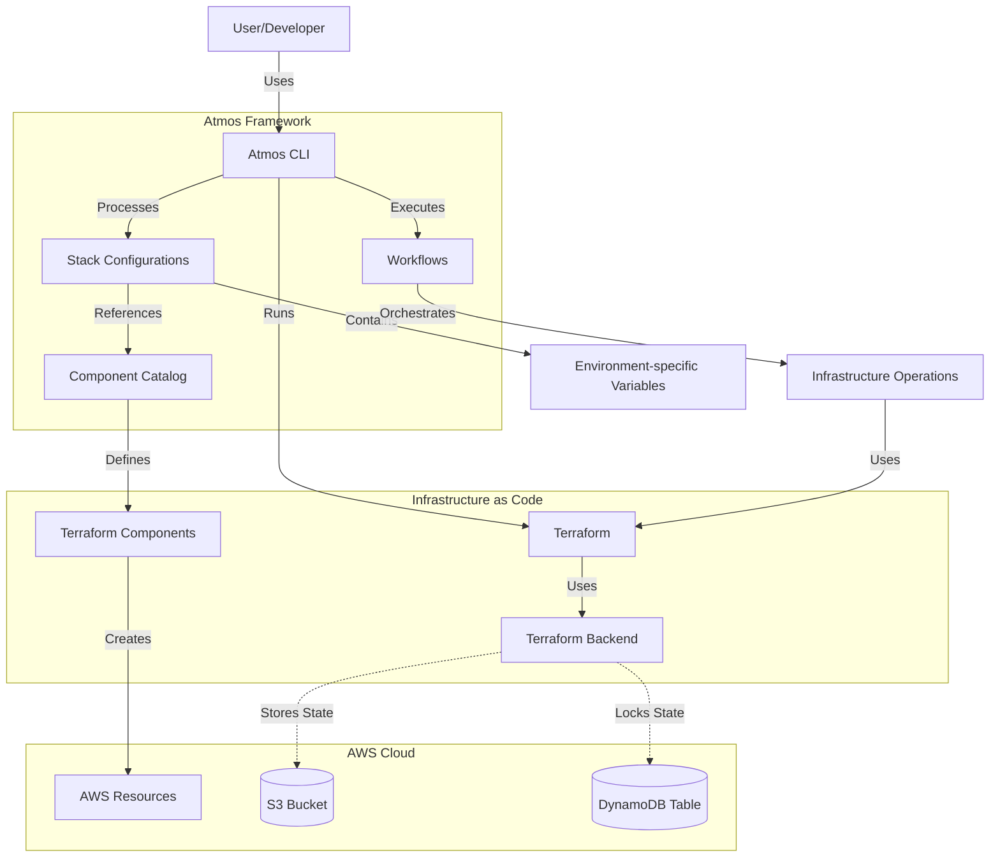
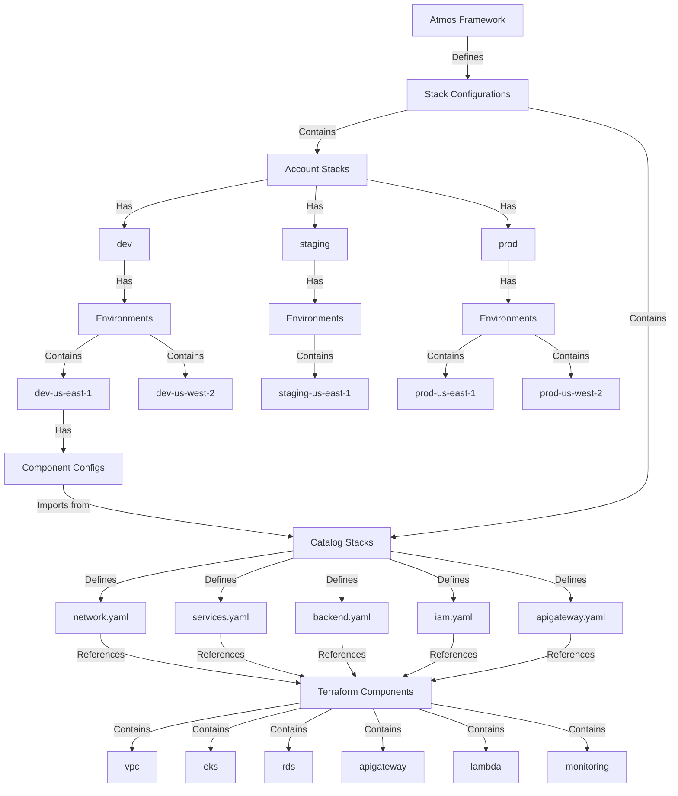
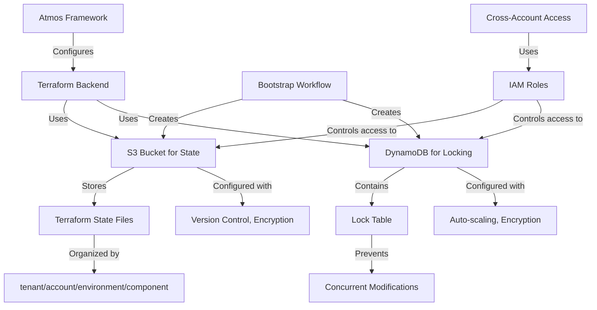
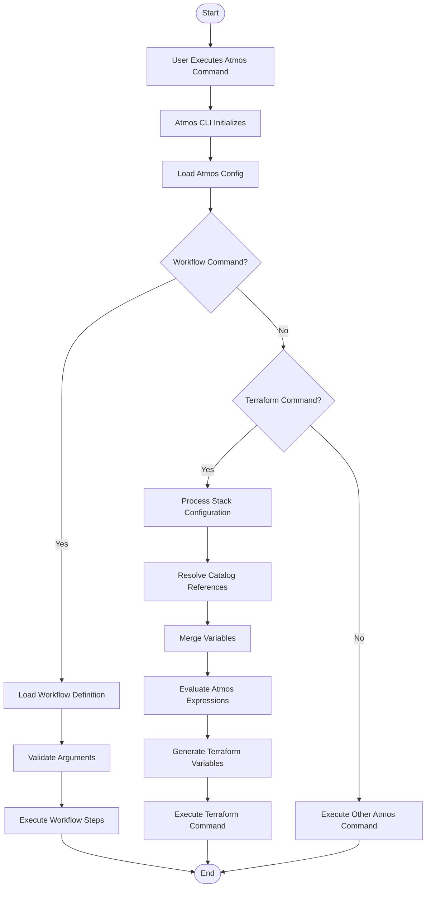
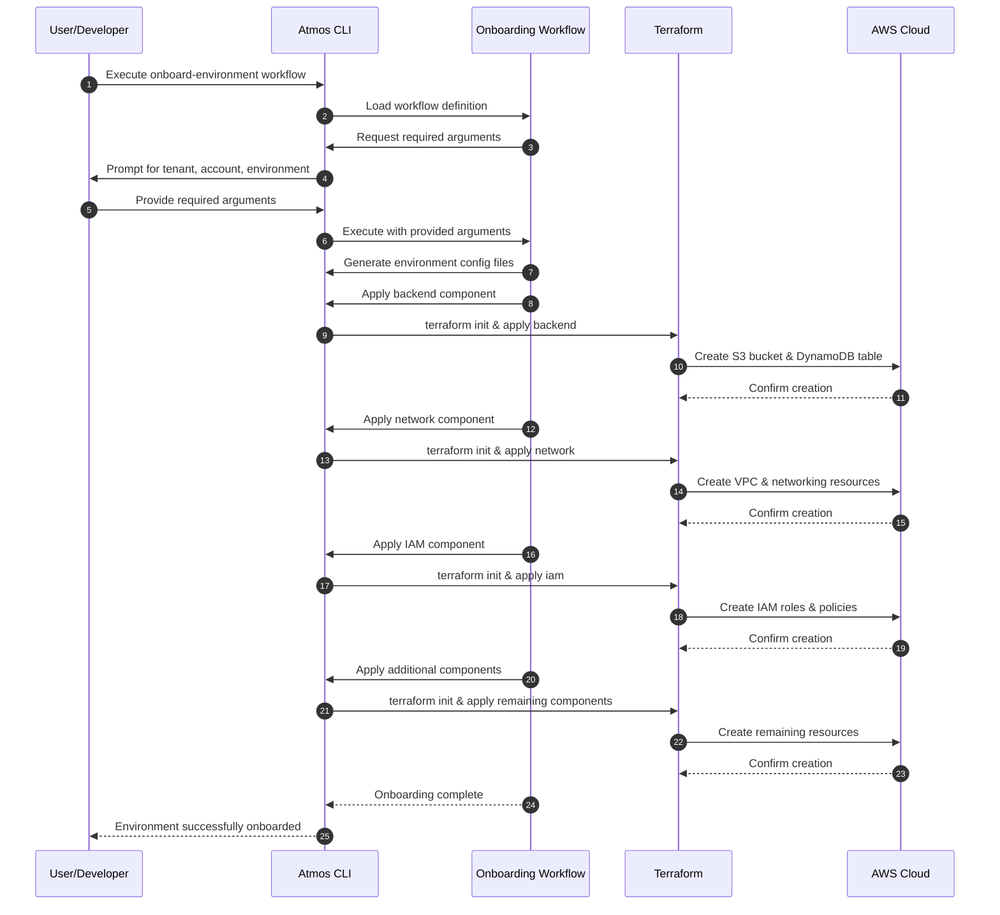
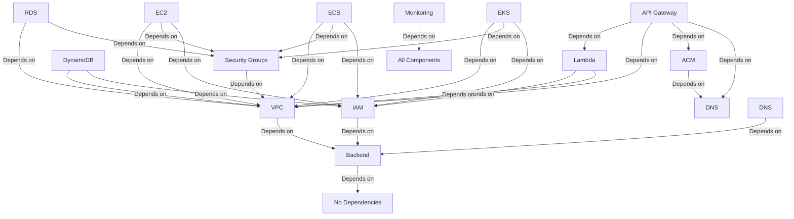
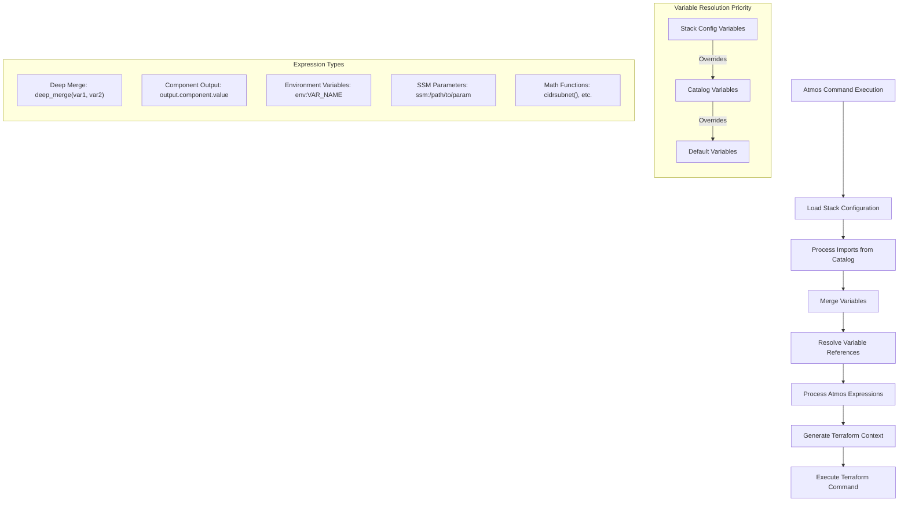
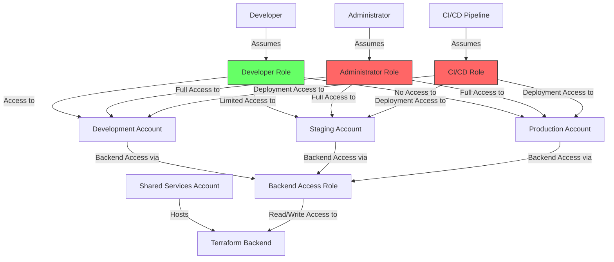
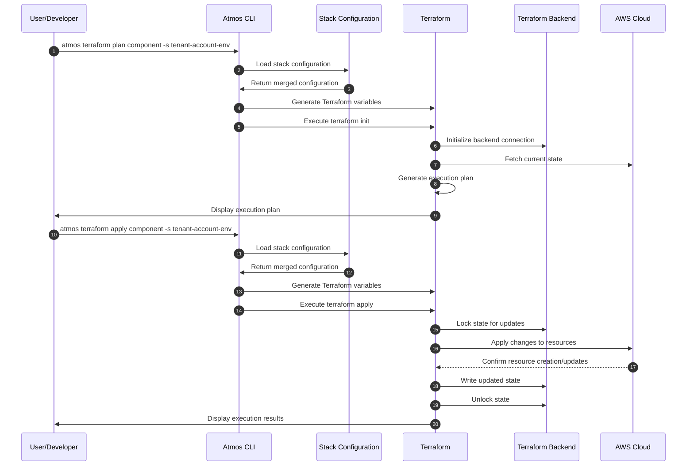

# Atmos Architecture Diagrams

This document contains Mermaid diagrams that visualize the architecture, workflows, and design of the Atmos framework with Terraform.

## 1. Atmos Framework Overview

## 2. Multi-Environment Architecture

```mermaid
graph TD
    classDef dev fill:#baf,stroke:#333,stroke-width:1px
    classDef staging fill:#fba,stroke:#333,stroke-width:1px
    classDef prod fill:#fdc,stroke:#333,stroke-width:1px
    classDef shared fill:#dfd,stroke:#333,stroke-width:1px
    
    Atmos[Atmos Framework] -->|Manages| DevAccount[Development Account]
    Atmos -->|Manages| StagingAccount[Staging Account]
    Atmos -->|Manages| ProdAccount[Production Account]
    Atmos -->|Manages| SharedAccount[Shared Services Account]
    
    DevAccount -->|Contains| DevVPC[VPC]
    DevAccount -->|Contains| DevEKS[EKS]
    DevAccount -->|Contains| DevRDS[RDS]
    DevAccount -->|Contains| DevAPI[API Gateway]
    
    StagingAccount -->|Contains| StagingVPC[VPC]
    StagingAccount -->|Contains| StagingEKS[EKS]
    StagingAccount -->|Contains| StagingRDS[RDS]
    StagingAccount -->|Contains| StagingAPI[API Gateway]
    
    ProdAccount -->|Contains| ProdVPC[VPC]
    ProdAccount -->|Contains| ProdEKS[EKS]
    ProdAccount -->|Contains| ProdRDS[RDS]
    ProdAccount -->|Contains| ProdAPI[API Gateway]
    
    SharedAccount -->|Contains| TerraformBackend[Terraform Backend]
    SharedAccount -->|Contains| DNS[Route53 DNS]
    SharedAccount -->|Contains| Monitoring[CloudWatch Monitoring]
    SharedAccount -->|Contains| SecurityServices[Security Services]
    
    class DevVPC,DevEKS,DevRDS,DevAPI dev
    class StagingVPC,StagingEKS,StagingRDS,StagingAPI staging
    class ProdVPC,ProdEKS,ProdRDS,ProdAPI prod
    class TerraformBackend,DNS,Monitoring,SecurityServices shared
```

## 3. Stack and Component Structure

## 4. Terraform Backend Architecture

## 5. Atmos Workflow Process

## 6. Environment Onboarding Process

## 7. Component Dependency Graph

## 8. Atmos Variable Resolution Process

## 9. Atmos Multi-Account Security Model

## 10. Atmos Deployment Workflow

