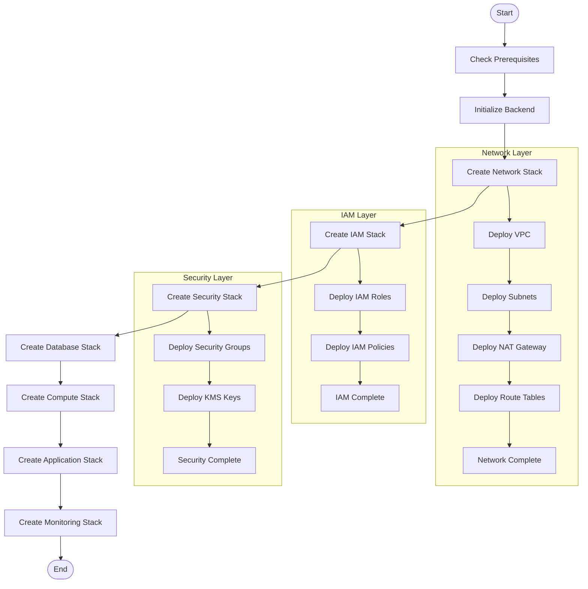
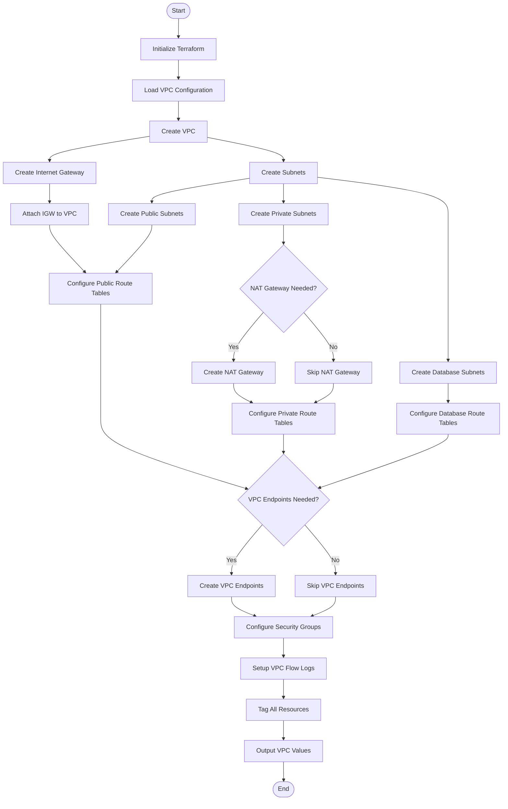
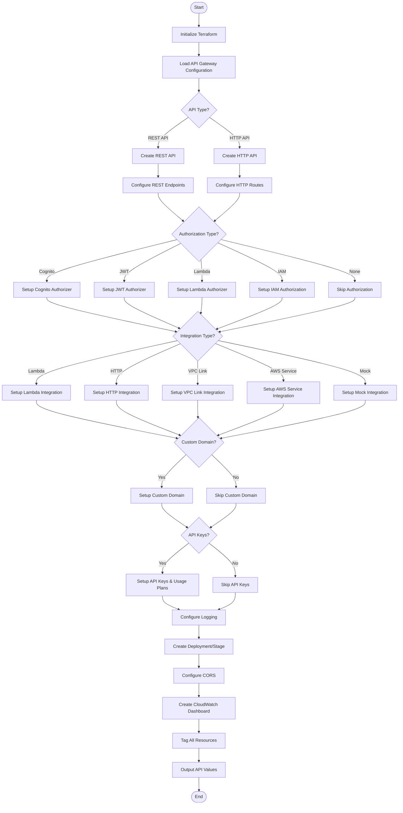
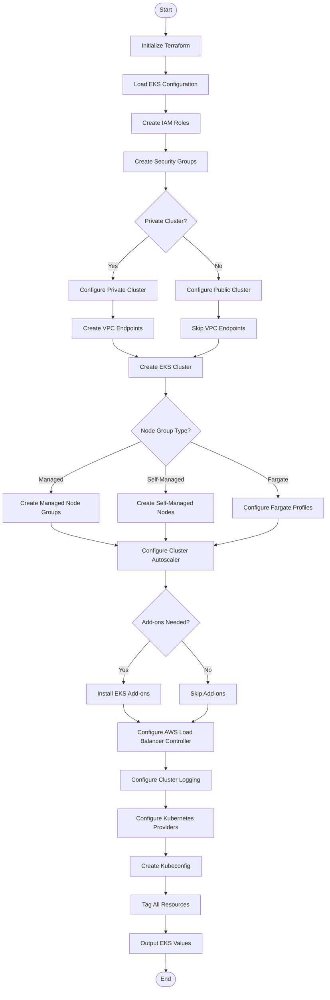
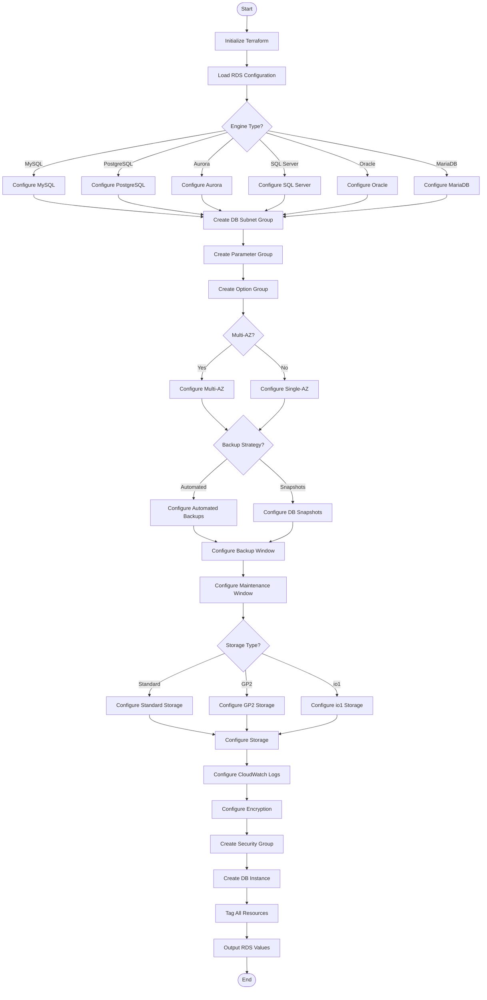
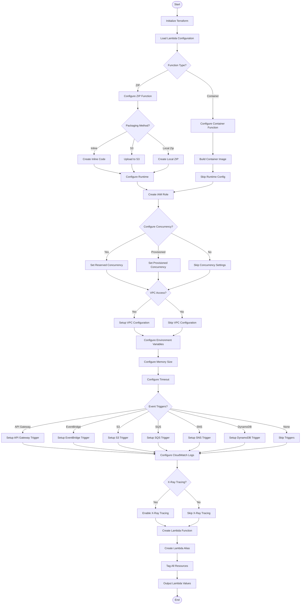
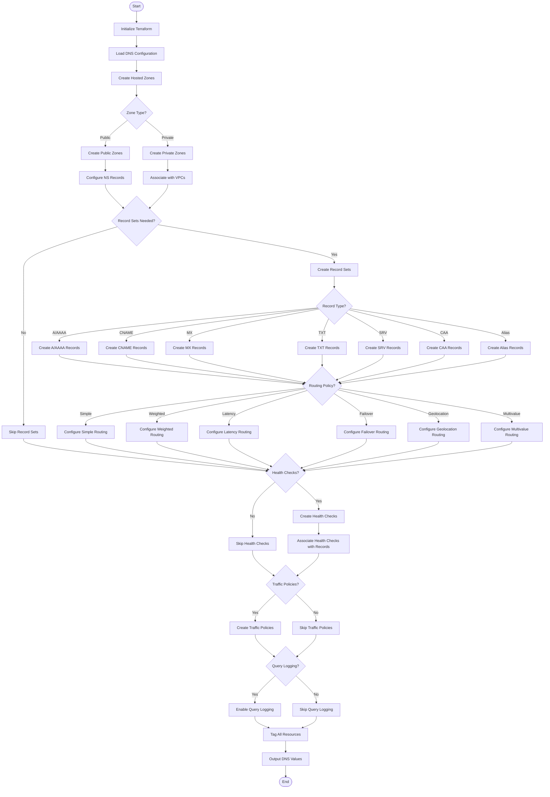
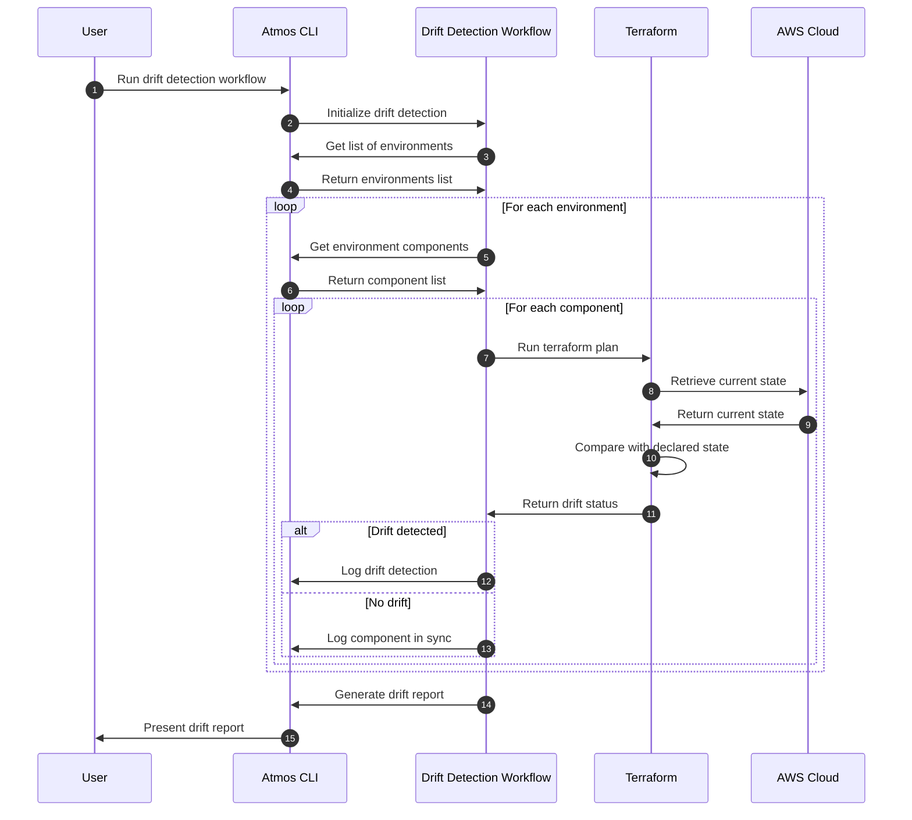
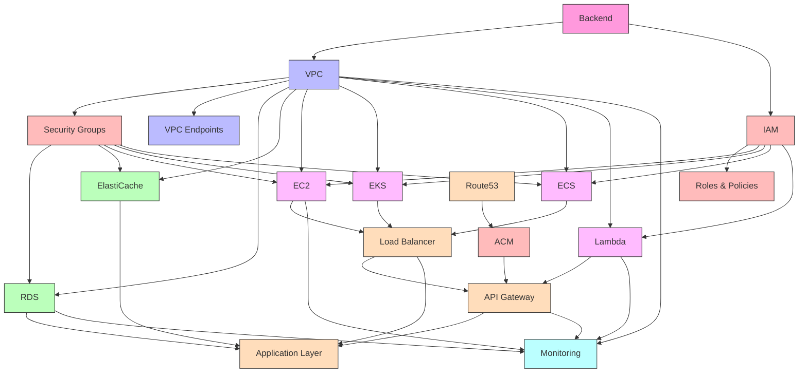

# Atmos Component Workflows

This document contains Mermaid diagrams that illustrate the workflows for different Atmos components and their interactions.

## 1. Environment Onboarding Workflow

## 2. VPC Component Workflow

## 3. API Gateway Component Workflow

## 4. EKS Component Workflow

## 5. RDS Component Workflow

## 6. Lambda Component Workflow

## 7. Route53 DNS Component Workflow

## 8. Atmos Drift Detection Workflow

## 9. Infrastructure Dependency Graph

## 10. Terraform State Management Workflow

```mermaid
flowchart TD
    Start([Start]) --> InitBackend[Initialize S3 Backend]
    InitBackend --> BackendExists{Backend Exists?}
    
    BackendExists -->|Yes| UseExistingBackend[Use Existing Backend]
    BackendExists -->|No| BootstrapBackend[Bootstrap New Backend]
    
    BootstrapBackend --> CreateS3Bucket[Create S3 Bucket]
    CreateS3Bucket --> ConfigureS3Versioning[Configure S3 Versioning]
    ConfigureS3Versioning --> ConfigureS3Encryption[Configure S3 Encryption]
    ConfigureS3Encryption --> CreateDynamoDBTable[Create DynamoDB Table]
    CreateDynamoDBTable --> ConfigureDynamoDBEncryption[Configure DynamoDB Encryption]
    ConfigureDynamoDBEncryption --> EnableKeyRotation[Enable KMS Key Rotation]
    EnableKeyRotation --> UseExistingBackend
    
    UseExistingBackend --> ConfigureLocking[Configure State Locking]
    
    ConfigureLocking --> StatePath{State Organization}
    
    StatePath -->|By Component| OrganizeByComponent[tenant/account/env/component]
    StatePath -->|By Environment| OrganizeByEnvironment[tenant/account/env]
    
    OrganizeByComponent --> ConfigureBackendBlock[Configure Backend Block]
    OrganizeByEnvironment --> ConfigureBackendBlock
    
    ConfigureBackendBlock --> UseIAMRoles[Use IAM Roles for Access]
    
    UseIAMRoles --> SetupCrossAccount[Setup Cross-Account Access]
    
    SetupCrossAccount --> ImportExists{Import Needed?}
    
    ImportExists -->|Yes| ImportResources[Import Existing Resources]
    ImportExists -->|No| SkipImport[Skip Import]
    
    ImportResources --> TerraformInit[Run Terraform Init]
    SkipImport --> TerraformInit
    
    TerraformInit --> TerraformApply[Run Terraform Apply]
    
    TerraformApply --> StateBackupNeeded{State Backup?}
    
    StateBackupNeeded -->|Yes| BackupState[Backup Terraform State]
    StateBackupNeeded -->|No| SkipBackup[Skip Backup]
    
    BackupState --> End([End])
    SkipBackup --> End
```

