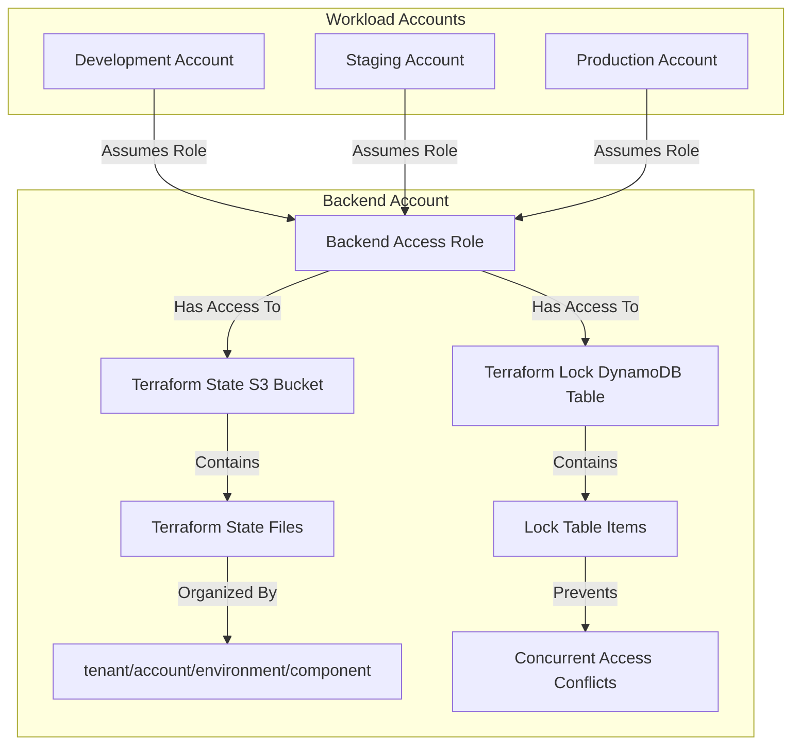
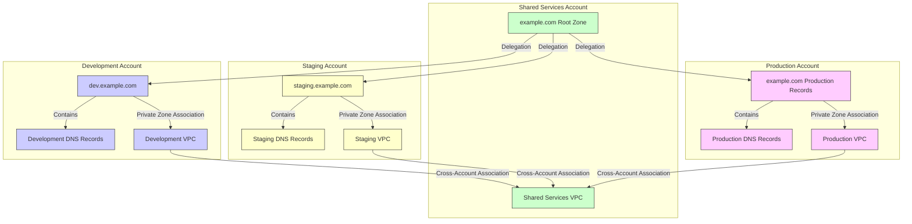
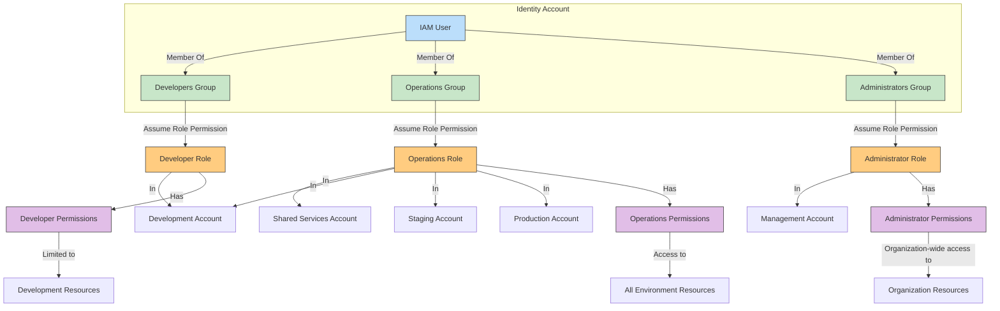
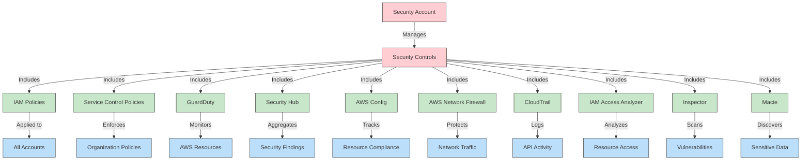
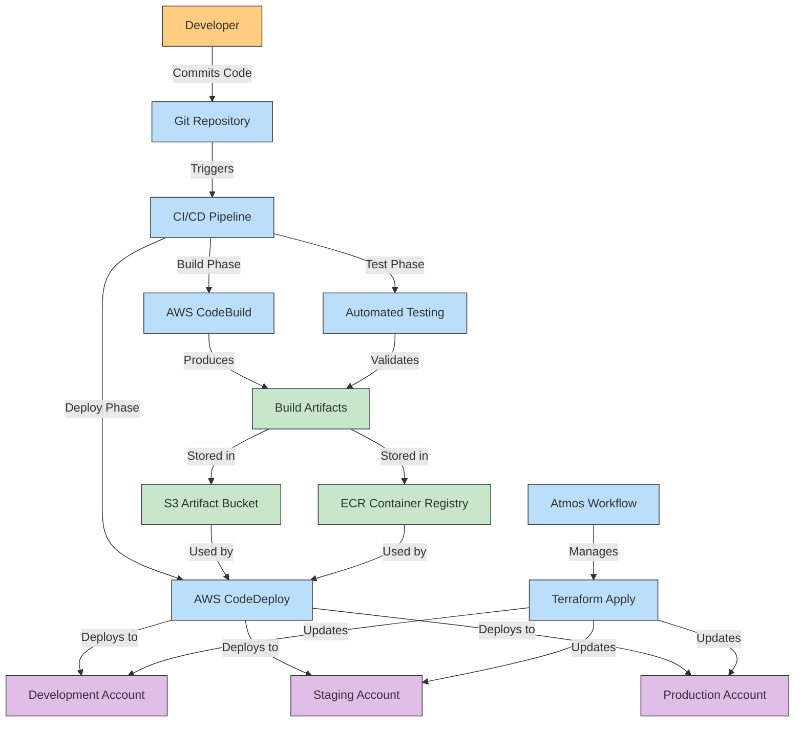
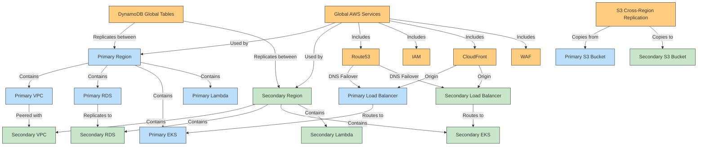

# Atmos Multi-Account Architecture

This document contains Mermaid diagrams that illustrate the multi-account architecture patterns enabled by the Atmos framework.

## 1. AWS Multi-Account Organization Structure

```mermaid
graph TD
    classDef mgmt fill:#ffcccc,stroke:#333,stroke-width:1px
    classDef shared fill:#ccffcc,stroke:#333,stroke-width:1px
    classDef network fill:#ccccff,stroke:#333,stroke-width:1px
    classDef sec fill:#ffffcc,stroke:#333,stroke-width:1px
    classDef dev fill:#ccffff,stroke:#333,stroke-width:1px
    classDef stage fill:#ffccff,stroke:#333,stroke-width:1px
    classDef prod fill:#ffddbb,stroke:#333,stroke-width:1px
    
    Root[AWS Organization Root]
    Root --> Management[Management Account]
    Root --> SharedServices[Shared Services OU]
    Root --> Workloads[Workloads OU]
    Root --> Security[Security OU]
    Root --> Sandbox[Sandbox OU]
    
    Management --> Logging[Logging Account]
    Management --> Security[Security Account]
    
    SharedServices --> NetworkAccount[Network Account]
    SharedServices --> SharedTools[Shared Tools Account]
    SharedServices --> BackendAccount[Backend Account]
    
    Workloads --> Dev[Development OU]
    Workloads --> Staging[Staging OU]
    Workloads --> Production[Production OU]
    
    Dev --> DevAccount1[Dev Account 1]
    Dev --> DevAccount2[Dev Account 2]
    
    Staging --> StagingAccount1[Staging Account 1]
    Staging --> StagingAccount2[Staging Account 2]
    
    Production --> ProdAccount1[Production Account 1]
    Production --> ProdAccount2[Production Account 2]
    
    Sandbox --> SandboxAccount1[Sandbox Account 1]
    Sandbox --> SandboxAccount2[Sandbox Account 2]
    
    class Management,Logging mgmt
    class SharedServices,NetworkAccount,SharedTools,BackendAccount shared
    class NetworkAccount network
    class Security sec
    class Dev,DevAccount1,DevAccount2,Sandbox,SandboxAccount1,SandboxAccount2 dev
    class Staging,StagingAccount1,StagingAccount2 stage
    class Production,ProdAccount1,ProdAccount2 prod
```

## 2. Terraform Backend Cross-Account Access

## 3. Networking Architecture

```mermaid
graph TD
    classDef transit fill:#ffcccc,stroke:#333,stroke-width:1px
    classDef shared fill:#ccffcc,stroke:#333,stroke-width:1px
    classDef dev fill:#ccccff,stroke:#333,stroke-width:1px
    classDef stage fill:#ffffcc,stroke:#333,stroke-width:1px
    classDef prod fill:#ffccff,stroke:#333,stroke-width:1px
    
    TransitGateway[Transit Gateway] -->|Attachment| SharedVPC[Shared Services VPC]
    TransitGateway -->|Attachment| DevVPC[Development VPC]
    TransitGateway -->|Attachment| StageVPC[Staging VPC]
    TransitGateway -->|Attachment| ProdVPC[Production VPC]
    TransitGateway -->|Attachment| OnPremises[On-Premises Network]
    
    SharedVPC -->|Contains| SharedPublic[Public Subnets]
    SharedVPC -->|Contains| SharedPrivate[Private Subnets]
    SharedVPC -->|Contains| SharedEndpoints[VPC Endpoints]
    
    DevVPC -->|Contains| DevPublic[Public Subnets]
    DevVPC -->|Contains| DevPrivate[Private Subnets]
    DevVPC -->|Contains| DevEndpoints[VPC Endpoints]
    
    StageVPC -->|Contains| StagePublic[Public Subnets]
    StageVPC -->|Contains| StagePrivate[Private Subnets]
    StageVPC -->|Contains| StageEndpoints[VPC Endpoints]
    
    ProdVPC -->|Contains| ProdPublic[Public Subnets]
    ProdVPC -->|Contains| ProdPrivate[Private Subnets]
    ProdVPC -->|Contains| ProdEndpoints[VPC Endpoints]
    
    SharedPublic -->|Internet Access| IGW[Internet Gateway]
    DevPublic -->|Internet Access| IGW
    StagePublic -->|Internet Access| IGW
    ProdPublic -->|Internet Access| IGW
    
    OnPremises -->|Connected To| CustomerGateway[Customer Gateway]
    CustomerGateway -->|VPN Connection| TransitGateway
    
    class TransitGateway,OnPremises,CustomerGateway transit
    class SharedVPC,SharedPublic,SharedPrivate,SharedEndpoints shared
    class DevVPC,DevPublic,DevPrivate,DevEndpoints dev
    class StageVPC,StagePublic,StagePrivate,StageEndpoints stage
    class ProdVPC,ProdPublic,ProdPrivate,ProdEndpoints prod
```

## 4. DNS Architecture

## 5. Cross-Account IAM Access

## 6. Centralized Logging Architecture

```mermaid
graph TD
    classDef dev fill:#bbdefb,stroke:#333,stroke-width:1px
    classDef stage fill:#c8e6c9,stroke:#333,stroke-width:1px
    classDef prod fill:#ffcc80,stroke:#333,stroke-width:1px
    classDef log fill:#e1bee7,stroke:#333,stroke-width:1px
    classDef security fill:#ffcdd2,stroke:#333,stroke-width:1px
    
    DevLogs[Development Account Logs] -->|Streams to| CentralLogAccount[Central Logging Account]
    StageLogs[Staging Account Logs] -->|Streams to| CentralLogAccount
    ProdLogs[Production Account Logs] -->|Streams to| CentralLogAccount
    
    DevLogs -->|Contains| DevCloudTrail[CloudTrail Logs]
    DevLogs -->|Contains| DevCloudWatch[CloudWatch Logs]
    DevLogs -->|Contains| DevVPCFlow[VPC Flow Logs]
    DevLogs -->|Contains| DevS3Access[S3 Access Logs]
    DevLogs -->|Contains| DevALBLogs[ALB Access Logs]
    
    StageLogs -->|Contains| StageCloudTrail[CloudTrail Logs]
    StageLogs -->|Contains| StageCloudWatch[CloudWatch Logs]
    StageLogs -->|Contains| StageVPCFlow[VPC Flow Logs]
    StageLogs -->|Contains| StageS3Access[S3 Access Logs]
    StageLogs -->|Contains| StageALBLogs[ALB Access Logs]
    
    ProdLogs -->|Contains| ProdCloudTrail[CloudTrail Logs]
    ProdLogs -->|Contains| ProdCloudWatch[CloudWatch Logs]
    ProdLogs -->|Contains| ProdVPCFlow[VPC Flow Logs]
    ProdLogs -->|Contains| ProdS3Access[S3 Access Logs]
    ProdLogs -->|Contains| ProdALBLogs[ALB Access Logs]
    
    CentralLogAccount -->|Stores in| LoggingBucket[Centralized S3 Bucket]
    CentralLogAccount -->|Aggregates in| CloudWatchLogs[Centralized CloudWatch Logs]
    
    LoggingBucket -->|Lifecycle Policy| ArchiveBucket[Log Archive Bucket]
    LoggingBucket -->|Analyzed by| SecurityAccount[Security Account]
    CloudWatchLogs -->|Analyzed by| SecurityAccount
    
    SecurityAccount -->|Uses| SIEM[SIEM Solution]
    SecurityAccount -->|Configures| Alerts[Security Alerts]
    SecurityAccount -->|Runs| Compliance[Compliance Checks]
    
    class DevLogs,DevCloudTrail,DevCloudWatch,DevVPCFlow,DevS3Access,DevALBLogs dev
    class StageLogs,StageCloudTrail,StageCloudWatch,StageVPCFlow,StageS3Access,StageALBLogs stage
    class ProdLogs,ProdCloudTrail,ProdCloudWatch,ProdVPCFlow,ProdS3Access,ProdALBLogs prod
    class CentralLogAccount,LoggingBucket,CloudWatchLogs,ArchiveBucket log
    class SecurityAccount,SIEM,Alerts,Compliance security
```

## 7. Shared Services Architecture

```mermaid
graph TD
    classDef shared fill:#bbdefb,stroke:#333,stroke-width:1px
    classDef consumer fill:#c8e6c9,stroke:#333,stroke-width:1px
    
    SharedServices[Shared Services Account] -->|Provides| SharedInfra[Shared Infrastructure]
    
    SharedInfra -->|Includes| DNS[Route53 DNS]
    SharedInfra -->|Includes| Monitoring[Centralized Monitoring]
    SharedInfra -->|Includes| Backend[Terraform Backend]
    SharedInfra -->|Includes| ServiceCatalog[Service Catalog]
    SharedInfra -->|Includes| CodeArtifact[Code Artifact Repository]
    SharedInfra -->|Includes| ECR[Container Registry]
    SharedInfra -->|Includes| SSO[Single Sign-On]
    SharedInfra -->|Includes| SecretsMgr[Secrets Manager]
    SharedInfra -->|Includes| Networking[Shared Networking]
    
    DevAccount[Development Account] -->|Consumes| DNS
    StagingAccount[Staging Account] -->|Consumes| DNS
    ProdAccount[Production Account] -->|Consumes| DNS
    
    DevAccount -->|Consumes| Monitoring
    StagingAccount -->|Consumes| Monitoring
    ProdAccount -->|Consumes| Monitoring
    
    DevAccount -->|Consumes| Backend
    StagingAccount -->|Consumes| Backend
    ProdAccount -->|Consumes| Backend
    
    DevAccount -->|Consumes| ServiceCatalog
    StagingAccount -->|Consumes| ServiceCatalog
    ProdAccount -->|Consumes| ServiceCatalog
    
    DevAccount -->|Consumes| CodeArtifact
    StagingAccount -->|Consumes| CodeArtifact
    ProdAccount -->|Consumes| CodeArtifact
    
    DevAccount -->|Consumes| ECR
    StagingAccount -->|Consumes| ECR
    ProdAccount -->|Consumes| ECR
    
    DevAccount -->|Consumes| SSO
    StagingAccount -->|Consumes| SSO
    ProdAccount -->|Consumes| SSO
    
    DevAccount -->|Consumes| SecretsMgr
    StagingAccount -->|Consumes| SecretsMgr
    ProdAccount -->|Consumes| SecretsMgr
    
    DevAccount -->|Consumes| Networking
    StagingAccount -->|Consumes| Networking
    ProdAccount -->|Consumes| Networking
    
    class SharedServices,SharedInfra,DNS,Monitoring,Backend,ServiceCatalog,CodeArtifact,ECR,SSO,SecretsMgr,Networking shared
    class DevAccount,StagingAccount,ProdAccount consumer
```

## 8. Security Controls Architecture

## 9. CI/CD Pipeline Architecture

## 10. Multi-Region Architecture

