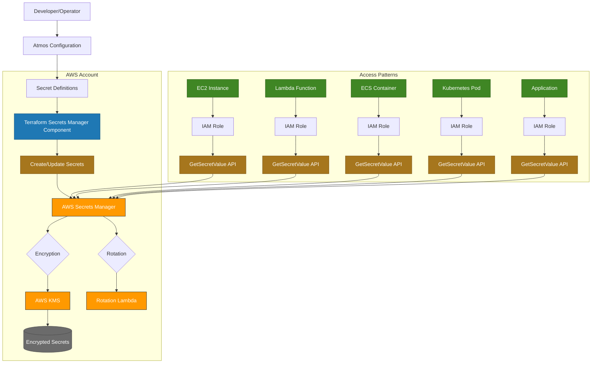
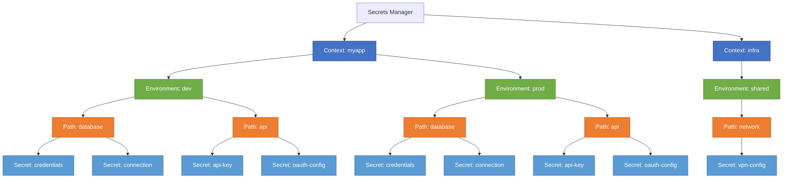
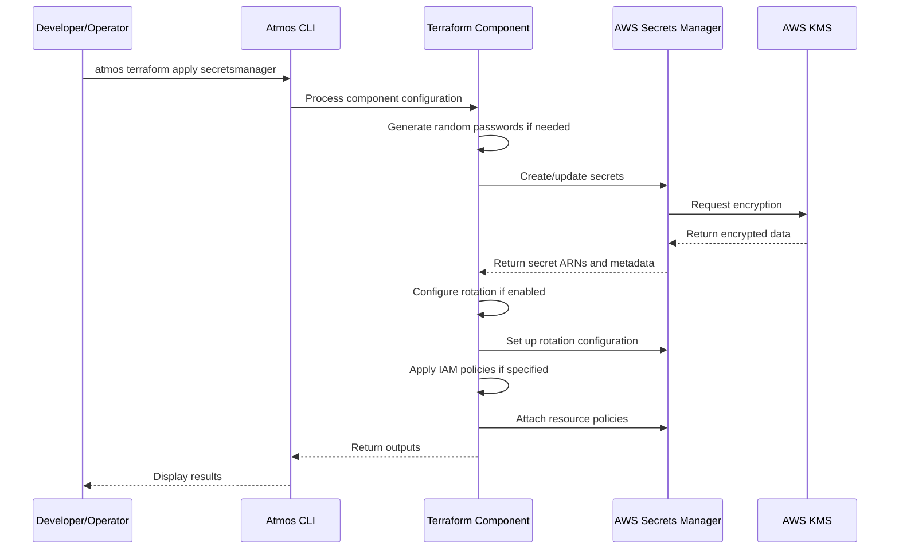
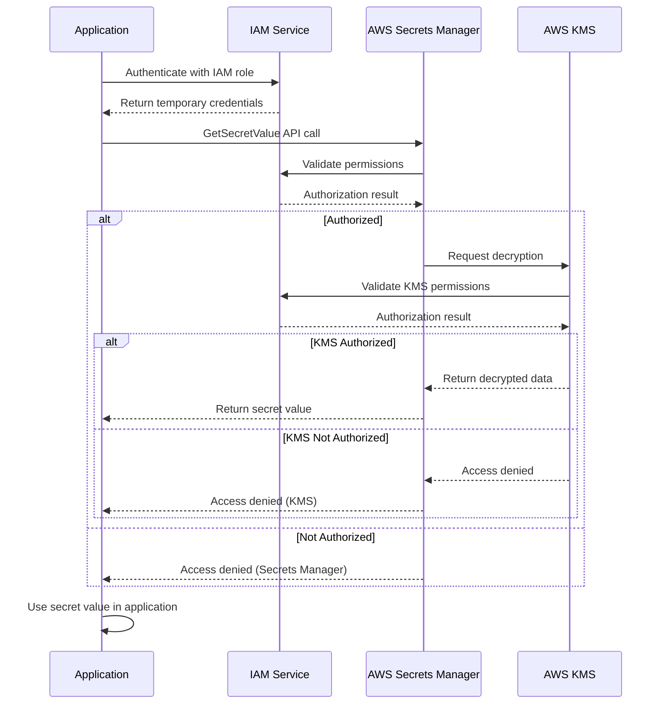
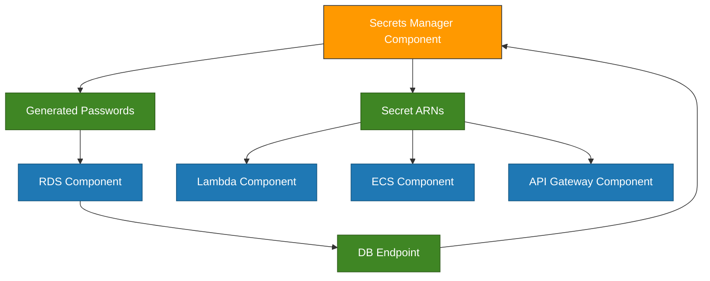

# AWS Secrets Manager Architecture and Workflows

This document provides architectural diagrams for AWS Secrets Manager integration with the Atmos framework.

## 1. Secret Management Architecture



## 2. Secret Hierarchy and Organization



## 3. Secret Creation Workflow



## 4. Secret Access Workflow



## 5. Cross-Account Secret Access

```mermaid
graph TD
    classDef account1 fill:#FF9900,stroke:#232F3E,color:white;
    classDef account2 fill:#3F8624,stroke:#2E5B1A,color:white;
    classDef service fill:#1F78B4,stroke:#12537E,color:white;
    classDef policy fill:#A6761D,stroke:#7C571A,color:white;

    subgraph "Account A - Secret Owner":::account1
        SecretManager[AWS Secrets Manager]:::service
        Secret[(Secret)]
        ResourcePolicy[Resource Policy]:::policy
        
        SecretManager --> Secret
        ResourcePolicy --> SecretManager
    end
    
    subgraph "Account B - Secret Consumer":::account2
        App[Application]:::service
        IAMRole[IAM Role]:::policy
        
        App --> IAMRole
        IAMRole --> CrossAccountAccess[Cross-Account API Call]
    end
    
    CrossAccountAccess --> SecretManager
    ResourcePolicy -.-> CrossAccountAccess
```

## 6. Integration with Other Components

