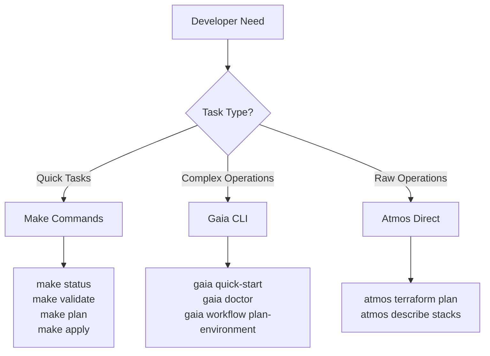
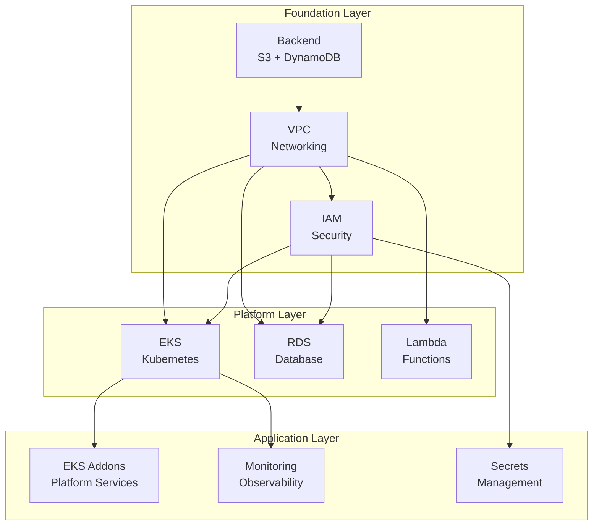

# 🌍 Terraform/Atmos Infrastructure Developer Guide

Welcome to the comprehensive developer guide for our Terraform/Atmos infrastructure project! This guide will take you from zero to productive in record time.

## 🚀 Quick Start

### For Absolute Beginners (10 minutes)
```bash
# 1. Run the automated onboarding
./scripts/onboard-developer.sh

# 2. Check that everything works
make doctor

# 3. Get familiar with the system
gaia quick-start
```

### For Experienced Developers (2 minutes)
```bash
# Install Gaia CLI and validate setup
make setup && make validate

# Check available environments
make list-stacks

# View system status
make status
```

## 📚 Table of Contents

- [🎯 Core Concepts](#-core-concepts)
- [🛠️ Essential Tools](#️-essential-tools)
- [📋 Common Workflows](#-common-workflows)
- [🏗️ Architecture Overview](#️-architecture-overview)
- [🔧 Development Patterns](#-development-patterns)
- [🚨 Troubleshooting](#-troubleshooting)
- [📖 Advanced Topics](#-advanced-topics)

---

## 🎯 Core Concepts

### What is This Project?

This is a **production-ready Infrastructure as Code (IaC) platform** that provides:

- **🏗️ 17 Terraform Components**: VPC, EKS, RDS, Lambda, monitoring, and more
- **🌍 Multi-Environment Management**: Dev, staging, production with isolation
- **🔄 16 Automated Workflows**: From validation to deployment
- **🐍 Enhanced Developer Experience**: Gaia CLI, Makefiles, and automation
- **🔒 Security First**: IAM, encryption, compliance built-in
- **📊 Observability Ready**: Monitoring, logging, alerting integrated

### Key Technologies

| Technology | Purpose | Why We Use It |
|------------|---------|---------------|
| **Terraform** | Infrastructure as Code | Industry standard, declarative, state management |
| **Atmos** | Multi-environment orchestration | DRY configurations, environment isolation |
| **Gaia CLI** | Developer experience layer | User-friendly commands, error handling |
| **Make** | Task automation | Universal, simple, fast shortcuts |
| **Docker** | Development environment | Consistent, isolated, reproducible |
| **AWS** | Cloud provider | Scalable, reliable, extensive services |

### Environment Structure

```
fnx-testenv-01-dev     ← Your friendly environment name
│
├── 🌐 VPC & Networking     (vpc, security groups)
├── ⚙️  Compute             (eks, ec2, lambda)  
├── 💾 Data                 (rds, secretsmanager)
├── 🔍 Monitoring           (cloudwatch, grafana)
└── 🔐 Security             (iam, certificates)
```

---

## 🛠️ Essential Tools

### Your Development Toolkit

#### 1. Make - The Universal Interface
```bash
make help              # Show all available commands
make doctor            # Run comprehensive diagnostics
make status            # Check infrastructure state
make validate          # Validate configurations (always safe)
make plan              # Preview changes (always safe)
make apply             # Apply changes (with confirmation)
```

#### 2. Gaia CLI - Enhanced Experience
```bash
gaia --help                    # Show all Gaia commands
gaia quick-start              # Interactive getting started guide
gaia doctor                   # System health check
gaia status -t fnx -a dev -e testenv-01    # Environment status
gaia workflow validate        # Enhanced validation with better errors
```

#### 3. Direct Atmos Commands
```bash
atmos list stacks             # Show raw stack names
atmos describe stacks -s <stack>    # Stack details
atmos terraform plan vpc -s <stack> # Plan specific component
```

### Tool Hierarchy (What to Use When)



**Rule of Thumb**: 
- Start with `make` for simplicity
- Use `gaia` for enhanced experience  
- Use `atmos` directly for advanced operations

---

## 📋 Common Workflows

### 🔍 Daily Development Workflow

#### 1. Start Your Day
```bash
# Check system health and current state
make doctor

# View your environment status
make status

# Check if there are any configuration changes
make plan
```

#### 2. Make Infrastructure Changes
```bash
# Always validate before making changes
make validate

# Preview what will change (always safe to run)
make plan

# If changes look good, apply them
make apply
```

#### 3. Work with Specific Components
```bash
# Plan changes to just the VPC
make plan-component COMPONENT=vpc

# Apply changes to just EKS
make apply-component COMPONENT=eks

# Plan changes to RDS
make plan-component COMPONENT=rds
```

### 🏗️ Environment Management

#### Create a New Environment
```bash
# Quick onboarding with defaults
make onboard

# Custom environment with specific CIDR
make onboard-custom VPC_CIDR=10.2.0.0/16

# Interactive onboarding with Gaia
gaia workflow onboard-environment --tenant mycompany --account staging --environment staging-01
```

#### Switch Between Environments
```bash
# Work with development environment
make plan TENANT=fnx ACCOUNT=dev ENVIRONMENT=testenv-01

# Work with staging environment  
make plan TENANT=fnx ACCOUNT=staging ENVIRONMENT=staging-01

# Work with production environment
make plan TENANT=fnx ACCOUNT=prod ENVIRONMENT=production
```

### 🐳 Development Environment

#### Local Development Stack
```bash
# Start all local services (Backstage, Grafana, etc.)
make dev-start

# Check logs from all services
make dev-logs

# Check logs from specific service
make dev-logs backstage

# Stop all services
make dev-stop

# Reset everything (removes data)
make dev-reset
```

### 🔧 Maintenance Tasks

#### Regular Maintenance
```bash
# Check for configuration drift
make drift

# Update documentation
make update-docs

# Clean temporary files
make clean

# Security and compliance checks
make check-security
```

---

## 🏗️ Architecture Overview

### Component Dependencies

Our infrastructure follows a strict dependency order:



### Component Descriptions

| Component | Purpose | Dependencies | Typical Size |
|-----------|---------|--------------|--------------|
| **backend** | Terraform state storage | None | S3 bucket + DynamoDB |
| **vpc** | Network foundation | backend | VPC + 6 subnets |
| **iam** | Security & permissions | vpc | 10-20 roles/policies |
| **eks** | Kubernetes platform | vpc, iam | 1 cluster + node groups |
| **rds** | Database services | vpc, iam | 1-3 database instances |
| **lambda** | Serverless functions | vpc, iam | Per-function basis |
| **eks-addons** | Platform services | eks | 15+ Kubernetes addons |
| **monitoring** | Observability | eks | Prometheus + Grafana |
| **secretsmanager** | Secret storage | iam | Per-secret basis |

---

## 🔧 Development Patterns

### 🎯 Safe Development Practices

#### The Golden Rule: Always Plan First
```bash
# ✅ ALWAYS DO THIS
make plan                    # See what will change
# Review the output carefully
make apply                   # Only apply after reviewing

# ❌ NEVER DO THIS  
make apply                   # Without planning first
```

#### Environment Isolation
```bash
# Work in development first
make plan ENVIRONMENT=testenv-01

# Test thoroughly, then promote to staging
make plan ENVIRONMENT=staging-01  

# Finally, carefully promote to production
make plan ENVIRONMENT=production
```

#### Component-by-Component Development
```bash
# Start with foundation
make plan-component COMPONENT=vpc
make apply-component COMPONENT=vpc

# Add security
make plan-component COMPONENT=iam
make apply-component COMPONENT=iam

# Add platform
make plan-component COMPONENT=eks
make apply-component COMPONENT=eks
```

### 📁 Code Organization

#### Directory Structure Best Practices
```
components/terraform/
├── vpc/                    # Foundation networking
│   ├── main.tf            # Primary resources
│   ├── variables.tf       # Input parameters
│   ├── outputs.tf         # Export values
│   └── README.md          # Documentation
├── eks/                   # Kubernetes platform
└── rds/                   # Database services

stacks/                    # Environment configurations
├── orgs/fnx/dev/         # Development environments  
├── orgs/fnx/staging/     # Staging environments
└── orgs/fnx/prod/        # Production environments
```

#### Configuration Patterns

**Variables Pattern:**
```hcl
# variables.tf - Always include description and validation
variable "vpc_cidr" {
  description = "CIDR block for VPC (e.g., 10.0.0.0/16)"
  type        = string
  validation {
    condition     = can(cidrhost(var.vpc_cidr, 0))
    error_message = "The vpc_cidr must be a valid CIDR block."
  }
}
```

**Outputs Pattern:**
```hcl
# outputs.tf - Export everything other components might need
output "vpc_id" {
  description = "ID of the VPC"
  value       = aws_vpc.main.id
}

output "private_subnet_ids" {
  description = "IDs of private subnets"
  value       = aws_subnet.private[*].id
}
```

**Naming Pattern:**
```hcl
# Use consistent naming with local.name_prefix
locals {
  name_prefix = "${var.tenant}-${var.environment}-${var.account}"
}

resource "aws_vpc" "main" {
  cidr_block = var.vpc_cidr
  
  tags = merge(var.tags, {
    Name = "${local.name_prefix}-vpc"
  })
}
```

### 🔒 Security Patterns

#### IAM Best Practices
```hcl
# Always use least privilege
resource "aws_iam_role_policy" "lambda_logs" {
  name = "${local.name_prefix}-lambda-logs"
  role = aws_iam_role.lambda.id

  policy = jsonencode({
    Version = "2012-10-17"
    Statement = [
      {
        Effect = "Allow"
        Action = [
          "logs:CreateLogGroup",
          "logs:CreateLogStream", 
          "logs:PutLogEvents"
        ]
        Resource = "arn:aws:logs:${data.aws_region.current.name}:${data.aws_caller_identity.current.account_id}:*"
      }
    ]
  })
}
```

#### Secret Management
```hcl
# Store secrets in AWS Secrets Manager
resource "aws_secretsmanager_secret" "db_password" {
  name        = "${local.name_prefix}-db-password"
  description = "Database password for ${local.name_prefix}"
  
  tags = var.tags
}

# Reference in other components
data "aws_secretsmanager_secret_version" "db_password" {
  secret_id = "fnx-testenv-01-dev-db-password"
}
```

---

## 🚨 Troubleshooting

### 🔧 Common Issues and Quick Fixes

#### AWS Credentials Issues
```bash
# Symptom: "Unable to locate credentials"
# Quick fix:
aws sts get-caller-identity    # Test current credentials
aws configure                  # Set up new credentials
export AWS_PROFILE=dev         # Use specific profile
```

#### Atmos Configuration Issues
```bash
# Symptom: "Stack not found"
# Quick fix:
make list-stacks              # See available stacks
make doctor                   # Full diagnostic
```

#### Docker Issues
```bash
# Symptom: "Cannot connect to Docker daemon"
# Quick fix:
open -a Docker               # Start Docker Desktop (macOS)
docker info                  # Test Docker connectivity
make dev-reset               # Reset development environment
```

#### State Lock Issues  
```bash
# Symptom: "Error acquiring the state lock"
# Quick fix: Wait 5-10 minutes for automatic unlock
# Emergency fix (BE CAREFUL):
terraform force-unlock <LOCK_ID> -force
```

### 🔍 Diagnostic Tools

#### System Health Check
```bash
make doctor                  # Comprehensive system check
```
This checks:
- ✅ Tool installations (terraform, atmos, aws)
- ✅ AWS connectivity and permissions
- ✅ Project structure and configuration
- ✅ Development environment status

#### Gaia Diagnostics
```bash
gaia doctor                  # Enhanced diagnostics with user-friendly output
```

#### Component-Specific Debugging
```bash
# Check specific component
make plan-component COMPONENT=vpc

# Validate single component
atmos terraform validate vpc -s orgs/fnx/dev/eu-west-2/testenv-01

# Get component outputs
atmos terraform output vpc -s orgs/fnx/dev/eu-west-2/testenv-01
```

### 📞 Getting Help

#### Self-Service Resources
1. **Quick Start**: Run `gaia quick-start` for interactive guidance
2. **Documentation**: Check `docs/` directory for detailed guides  
3. **Examples**: Look in `examples/` for working configurations
4. **Logs**: Review `logs/` directory for detailed error information

#### Information to Collect for Support
```bash
# System information
make doctor > system-info.txt

# Error logs
ls -la logs/
cat logs/workflow-*.log

# Configuration status
atmos describe stacks -s <your-stack>
```

---

## 📖 Advanced Topics

### 🎯 Multi-Environment Strategies

#### Environment Promotion Pipeline
```
Development → Staging → Production
    ↓            ↓         ↓
 testenv-01   staging-01  production
    ↓            ↓         ↓
 Quick tests   Full tests  Monitored rollout
```

#### Configuration Inheritance
```yaml
# Atmos allows configuration inheritance
# Base configuration in _defaults.yaml
# Environment-specific overrides in environment files
```

### 🔧 Custom Workflows

#### Creating New Workflows
```yaml
# workflows/custom-deployment.yaml
workflows:
  custom-deployment:
    description: "Custom deployment workflow"
    steps:
      - name: validate
        command: make validate
      - name: security-check  
        command: make check-security
      - name: apply
        command: make apply
```

### 🚀 Performance Optimization

#### Parallel Operations
```bash
# Use parallel flag for faster operations
make validate PARALLEL=true

# Run multiple components simultaneously
make plan-component COMPONENT=vpc &
make plan-component COMPONENT=iam &
wait  # Wait for both to complete
```

#### State Management
```bash
# Regular maintenance
terraform state list          # See all resources in state
terraform state show <resource>  # Inspect specific resource
terraform refresh             # Sync state with reality
```

### 🔒 Advanced Security

#### Compliance Automation
```bash
# Check compliance status
make compliance-check

# Security scanning
make check-security

# Certificate management
make rotate-certs
```

#### Audit and Monitoring
```bash
# Check recent changes
git log --oneline -10 

# View infrastructure changes
terraform show terraform.tfplan

# Monitor resource usage
aws cloudwatch get-metric-statistics --namespace AWS/EC2 --metric-name CPUUtilization
```

---

## 🎓 Learning Path

### For New Terraform Developers
1. **Week 1**: Get familiar with `make` commands and basic workflow
2. **Week 2**: Learn Gaia CLI and understand component structure  
3. **Week 3**: Practice with development environment, understand dependencies
4. **Week 4**: Work with staging environment, learn troubleshooting

### For Experienced Infrastructure Engineers
1. **Day 1**: Run `make doctor`, understand the architecture
2. **Day 2**: Explore components, understand Atmos configuration patterns
3. **Day 3**: Practice with advanced workflows, contribute improvements

### Continuous Learning Resources
- **Terraform Documentation**: https://terraform.io/docs
- **Atmos Documentation**: https://atmos.tools
- **AWS Well-Architected**: https://aws.amazon.com/architecture/well-architected/
- **Project Documentation**: `docs/` directory in this repository

---

## 🤝 Contributing

### Development Workflow for Contributors
1. **Fork and Clone**: Standard GitHub workflow
2. **Setup**: Run `./scripts/onboard-developer.sh`
3. **Develop**: Make changes, test with `make validate` and `make plan`
4. **Test**: Ensure all tests pass with `make test`
5. **Submit**: Create pull request with clear description

### Code Standards
- **Terraform**: Follow HashiCorp style guide
- **Documentation**: Update READMEs for any component changes
- **Security**: Never commit secrets or sensitive data
- **Testing**: Validate all changes before committing

---

## 📞 Support and Community  

### Getting Help
- **Quick Issues**: Use `make doctor` and `gaia troubleshoot`
- **Complex Issues**: Check documentation in `docs/`
- **Emergencies**: Contact platform team with system info from `make doctor`

### Contributing Back
- **Bug Reports**: Include output from `make doctor`
- **Feature Requests**: Describe use case and benefit
- **Documentation**: Help improve this guide with your learnings
- **Code**: Follow contribution guidelines above

---

*This guide is living documentation - it improves with your feedback and contributions! 🌟*