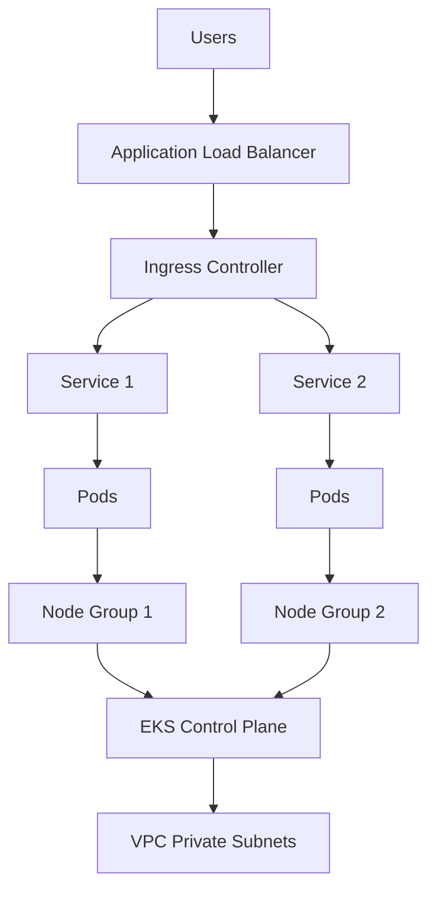
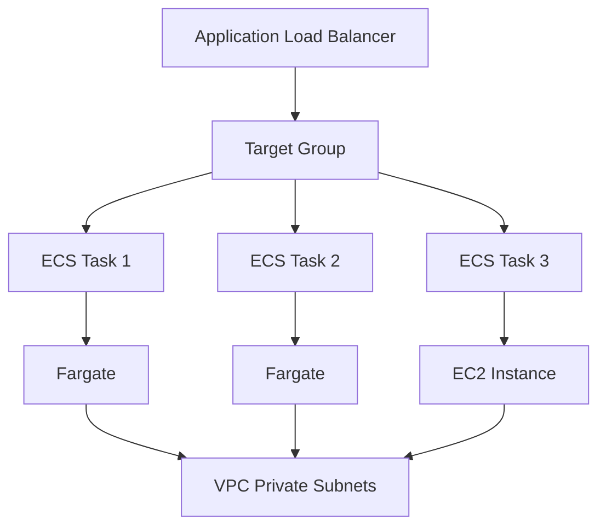
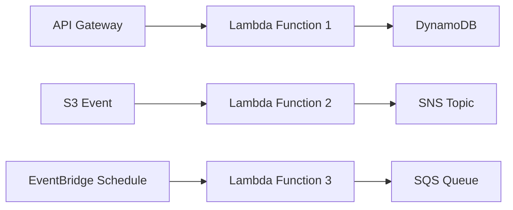
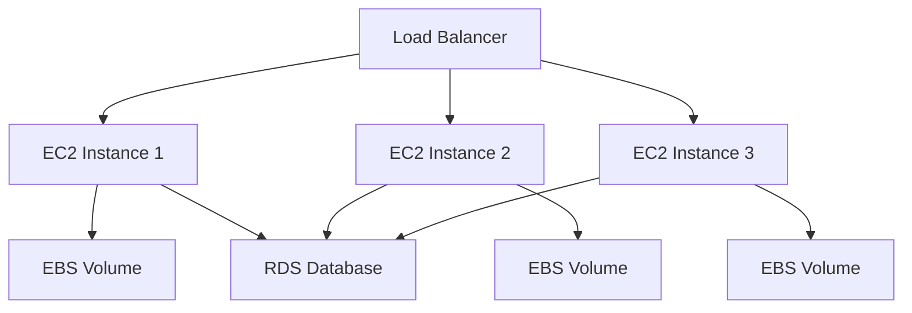
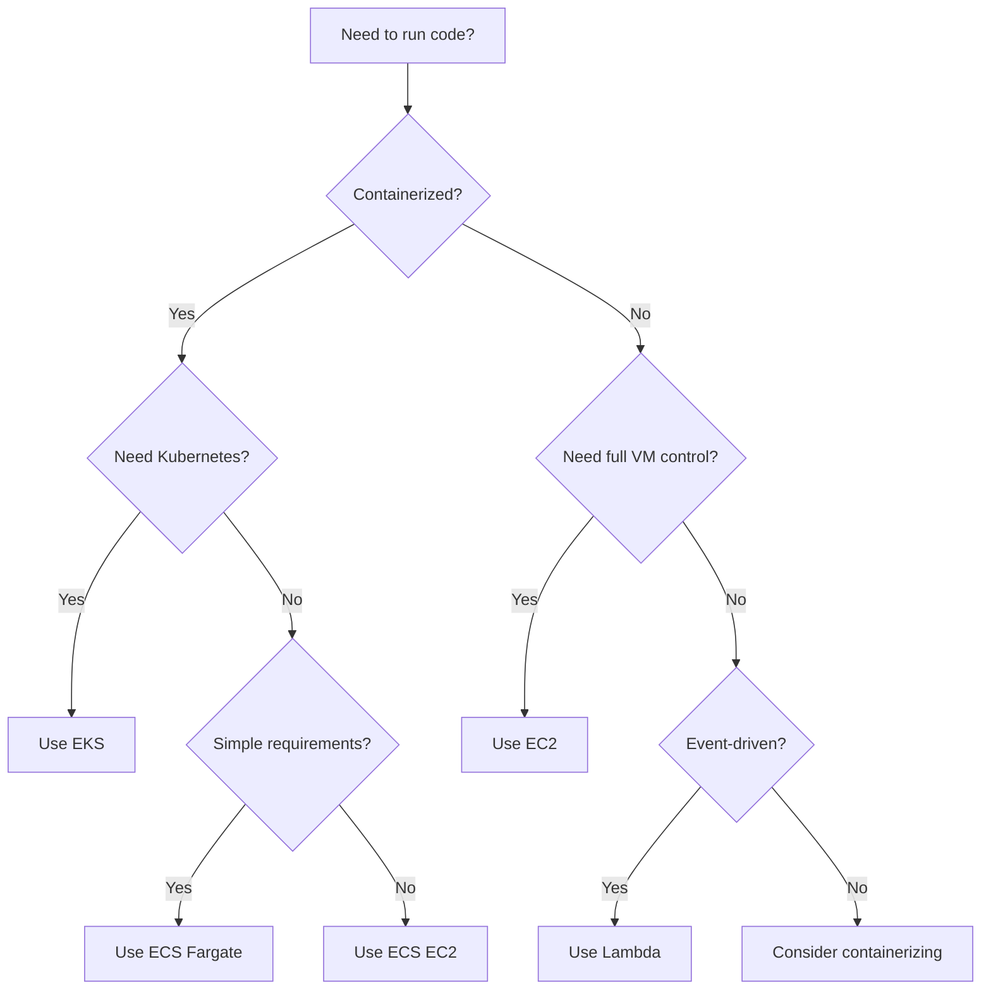

# Compute Category

**The Processing Power of Your Infrastructure**

The Compute category contains components for running application workloads, from containerized microservices on Kubernetes to serverless functions and traditional virtual machines. These are the engines that power your applications.

---

## Overview

### What's in Compute?

Compute components handle:
- **Container Orchestration** - Kubernetes and ECS
- **Serverless Execution** - Lambda functions
- **Virtual Machines** - EC2 instances
- **Container Add-ons** - Ingress, monitoring, autoscaling

### When to Use Compute?

After establishing foundations (VPC, IAM, security), Compute components run your applications:
1. **Microservices** → Use EKS
2. **Containerized Apps** → Use ECS
3. **Event-Driven Processing** → Use Lambda
4. **Traditional Apps** → Use EC2

---

## Components in This Category

### Component Matrix

| Component | Purpose | Maturity | Cost | Complexity |
|-----------|---------|----------|------|------------|
| **eks** | Kubernetes cluster management | ✅ | $$$ | High |
| **eks-addons** | Ingress, monitoring, autoscaling for EKS | ✅ | $$ | Medium |
| **eks-backend-services** | Supporting services for EKS | ✅ | $ | Low |
| **ecs** | Container orchestration | ✅ | $$ | Medium |
| **ec2** | Virtual machine instances | ✅ | $$ | Low |
| **lambda** | Serverless function execution | ✅ | $ | Low |

---

## Component Comparison

### Quick Selection Guide

| Need | Recommendation | Why |
|------|----------------|-----|
| **Complex microservices** | EKS | Full Kubernetes features, service mesh support |
| **Simple containerized apps** | ECS Fargate | Less operational overhead, simpler pricing |
| **Event-driven processing** | Lambda | Pay per use, zero management |
| **Legacy applications** | EC2 | Full control, lift-and-shift compatible |
| **Batch processing** | EC2 Spot + Lambda | Cost-effective, fault-tolerant |
| **Real-time APIs** | ECS or EKS | Predictable performance, always-on |

### Feature Comparison

| Feature | EKS | ECS Fargate | ECS EC2 | Lambda | EC2 |
|---------|-----|-------------|---------|--------|-----|
| **Management Overhead** | High | Low | Medium | None | High |
| **Control** | Full | Limited | Medium | Limited | Full |
| **Cost** | $$$ | $$ | $ | $ | $$ |
| **Scaling** | Excellent | Excellent | Good | Automatic | Manual |
| **Cold Start** | N/A | ~10s | ~30s | 0-5s | N/A |
| **Max Duration** | Unlimited | Unlimited | Unlimited | 15 min | Unlimited |
| **Ecosystem** | Huge | Growing | Growing | Massive | Universal |

### Cost Comparison (Monthly)

**Small Application (2 vCPU, 4 GB RAM, 24/7)**:
- EKS: ~$400 (cluster + 2 nodes)
- ECS Fargate: ~$120 (2 tasks)
- ECS EC2: ~$70 (t3.medium)
- Lambda: ~$30 (if < 1M requests)
- EC2: ~$60 (t3.medium)

**Medium Application (10 vCPU, 20 GB RAM, 24/7)**:
- EKS: ~$800 (cluster + 5 nodes)
- ECS Fargate: ~$600 (10 tasks)
- ECS EC2: ~$300 (3x t3.large)
- Lambda: ~$150 (if < 5M requests)
- EC2: ~$450 (3x t3.xlarge)

**Detailed Cost Analysis**: [docs/COST_ESTIMATION.md](../../COST_ESTIMATION.md)

---

## Component Deep Dive

### 1. EKS (Elastic Kubernetes Service)

**Purpose**: Managed Kubernetes clusters for complex containerized workloads

**What It Creates**:
- EKS control plane (managed by AWS)
- Node groups (managed EC2 instances)
- Fargate profiles (serverless nodes, optional)
- VPC integration
- OIDC provider for IRSA (IAM Roles for Service Accounts)
- Cluster security group
- CloudWatch logging

**Best For**:
- Microservices architectures
- Multi-tenant applications
- Service mesh requirements (Istio, Linkerd)
- Complex deployment patterns
- Teams with Kubernetes expertise
- Applications needing advanced orchestration

**Architecture**:


**Key Features**:
- Kubernetes 1.28+ support
- Managed control plane (automatic updates)
- Multiple node group types (on-demand, spot, GPU)
- Fargate serverless nodes
- Native AWS integration (IAM, CloudWatch, ALB)
- Auto-scaling with Cluster Autoscaler or Karpenter
- Encryption at rest and in transit

**Configuration**:
```yaml
components:
  terraform:
    eks:
      vars:
        cluster_name: "mycompany-prod-eks"
        cluster_version: "1.28"

        # Node groups
        node_groups:
          general:
            instance_types: ["t3.large", "t3.xlarge"]
            min_size: 2
            max_size: 10
            desired_size: 3
            capacity_type: "ON_DEMAND"

          spot:
            instance_types: ["t3.large", "t3a.large"]
            min_size: 0
            max_size: 20
            desired_size: 5
            capacity_type: "SPOT"

        # Fargate profiles (optional)
        fargate_profiles:
          default:
            namespaces: ["default", "kube-system"]

        # Enable logging
        cluster_enabled_log_types:
          - "api"
          - "audit"
          - "authenticator"
```

**Cost**:
- Control plane: $73/month
- Nodes (t3.large): ~$60/month per node
- Fargate: ~$30/vCPU/month + $3/GB/month
- Development: ~$300/month (cluster + 2 nodes)
- Production: ~$800-2,000/month (cluster + autoscaling nodes)

**Documentation**: [components/terraform/eks/README.md](../../../components/terraform/eks/README.md)

---

### 2. EKS Add-ons

**Purpose**: Essential extensions for production EKS clusters

**What It Creates**:
- AWS Load Balancer Controller (for ALB/NLB)
- Ingress NGINX Controller
- External Secrets Operator
- Cluster Autoscaler or Karpenter
- Metrics Server
- AWS EBS CSI Driver
- AWS EFS CSI Driver

**Best For**:
- Any EKS cluster
- Production-grade capabilities
- Simplified operations

**Add-ons Included**:

| Add-on | Purpose | When to Enable |
|--------|---------|----------------|
| **ALB Controller** | AWS Load Balancer integration | Always (for ingress) |
| **Ingress NGINX** | NGINX ingress controller | If using NGINX ingress |
| **External Secrets** | Sync secrets from AWS Secrets Manager | Always (for security) |
| **Cluster Autoscaler** | Auto-scale nodes based on demand | For dynamic workloads |
| **Karpenter** | Advanced node autoscaling | For large clusters |
| **Metrics Server** | Resource metrics for HPA | Always |
| **EBS CSI Driver** | Persistent volumes with EBS | If using stateful apps |
| **EFS CSI Driver** | Shared file storage with EFS | If needing shared storage |

**Configuration**:
```yaml
components:
  terraform:
    eks-addons:
      vars:
        cluster_name: "${eks.cluster_name}"

        # Load balancer
        enable_aws_load_balancer_controller: true

        # Ingress
        enable_ingress_nginx: true

        # Secrets management
        enable_external_secrets: true
        external_secrets_secrets_manager_arns:
          - "arn:aws:secretsmanager:*:*:secret:myapp/*"

        # Autoscaling
        enable_karpenter: true  # Or enable_cluster_autoscaler: true

        # Storage
        enable_ebs_csi_driver: true
        enable_efs_csi_driver: false

        # Monitoring
        enable_metrics_server: true
```

**Cost**:
- Add-ons: ~$50-100/month (mostly compute overhead)
- ALB: ~$20/month per ALB
- EBS volumes: ~$0.10/GB/month
- EFS: ~$0.30/GB/month

**Documentation**: [components/terraform/eks-addons/README.md](../../../components/terraform/eks-addons/README.md)

---

### 3. ECS (Elastic Container Service)

**Purpose**: Simplified container orchestration without Kubernetes complexity

**What It Creates**:
- ECS cluster
- Task definitions
- ECS services
- Application Load Balancer (optional)
- Auto-scaling policies
- CloudWatch log groups
- IAM roles for tasks

**Best For**:
- Containerized applications without Kubernetes needs
- Teams without Kubernetes expertise
- Simpler deployment requirements
- Cost-sensitive projects

**Launch Types**:

**Fargate (Serverless)**:
- No server management
- Pay per task
- Simple pricing
- Quick start
- Use when: Simplicity > cost optimization

**EC2**:
- More control
- Lower cost at scale
- Bin-packing efficiency
- Use when: Cost optimization > simplicity

**Architecture**:


**Configuration**:

**ECS Fargate (Simple)**:
```yaml
components:
  terraform:
    ecs:
      vars:
        cluster_name: "mycompany-prod-ecs"

        # Fargate service
        services:
          webapp:
            task_definition:
              family: "webapp"
              cpu: "256"
              memory: "512"
              containers:
                - name: "app"
                  image: "nginx:latest"
                  port_mappings:
                    - container_port: 80

            desired_count: 3
            launch_type: "FARGATE"

            # Load balancer
            load_balancer:
              target_group_arn: "${alb.target_group_arn}"
              container_name: "app"
              container_port: 80

            # Auto-scaling
            auto_scaling:
              min_capacity: 2
              max_capacity: 10
              cpu_target: 70
              memory_target: 80
```

**ECS EC2 (Cost-Optimized)**:
```yaml
components:
  terraform:
    ecs:
      vars:
        cluster_name: "mycompany-prod-ecs"

        # EC2 capacity provider
        capacity_providers:
          - name: "ec2"
            auto_scaling_group_arn: "${asg.arn}"
            managed_scaling:
              target_capacity: 80

        # Service
        services:
          webapp:
            # ... task definition ...
            launch_type: "EC2"
            capacity_provider_strategy:
              - capacity_provider: "ec2"
                weight: 100
```

**Cost**:
- Fargate: ~$30/vCPU/month + $3.50/GB/month
- EC2: Instance cost + overhead
- Development (Fargate, 2 tasks): ~$60/month
- Production (EC2, 5 instances): ~$300/month

**Documentation**: [components/terraform/ecs/README.md](../../../components/terraform/ecs/README.md)

---

### 4. Lambda

**Purpose**: Serverless function execution for event-driven architectures

**What It Creates**:
- Lambda functions
- IAM execution roles
- CloudWatch log groups
- Event source mappings
- Function URLs (optional)
- Layers (optional)
- Aliases and versions

**Best For**:
- Event-driven processing
- API backends (with API Gateway)
- Scheduled tasks
- Data transformation
- Webhooks
- Microservice glue logic

**Architecture**:


**Key Features**:
- Pay per invocation
- Auto-scaling (built-in)
- Multiple runtime support (Python, Node.js, Go, Java, .NET, Ruby)
- 15-minute maximum execution time
- VPC integration
- Environment variables and secrets
- Container image support

**Configuration**:
```yaml
components:
  terraform:
    lambda:
      vars:
        functions:
          api_handler:
            function_name: "api-handler"
            runtime: "python3.11"
            handler: "main.handler"
            timeout: 30
            memory_size: 512

            # Code
            source_dir: "./src"

            # Environment
            environment_variables:
              TABLE_NAME: "${dynamodb.table_name}"
              REGION: "us-east-1"

            # Permissions
            iam_policy_statements:
              - effect: "Allow"
                actions: ["dynamodb:PutItem", "dynamodb:GetItem"]
                resources: ["${dynamodb.table_arn}"]

            # Triggers
            event_sources:
              api_gateway:
                type: "api_gateway"
                http_method: "POST"
                path: "/api/handler"

          event_processor:
            function_name: "event-processor"
            runtime: "nodejs18.x"
            handler: "index.handler"
            timeout: 300

            # Event source
            event_sources:
              s3_trigger:
                type: "s3"
                bucket: "${s3.bucket_id}"
                events: ["s3:ObjectCreated:*"]
                filter_prefix: "uploads/"
```

**Cost**:
- First 1M requests: Free
- Additional requests: $0.20 per 1M
- Compute: $0.0000166667 per GB-second
- Example: 5M requests/month, 512 MB, 1s avg = ~$30/month

**Documentation**: [components/terraform/lambda/README.md](../../../components/terraform/lambda/README.md)

---

### 5. EC2

**Purpose**: Virtual machine instances for traditional and specialized workloads

**What It Creates**:
- EC2 instances
- Elastic IPs (optional)
- EBS volumes
- Instance profiles
- User data scripts
- Key pairs for SSH access

**Best For**:
- Legacy applications
- Applications requiring specific OS configurations
- GPU workloads
- High-performance computing
- Lift-and-shift migrations
- Testing and development

**Architecture**:


**Instance Types**:

| Type | Use Case | Cost |
|------|----------|------|
| **t3.micro** | Development, testing | ~$7/month |
| **t3.small** | Light workloads | ~$15/month |
| **t3.medium** | General purpose | ~$30/month |
| **t3.large** | Medium workloads | ~$60/month |
| **c5.xlarge** | Compute-intensive | ~$120/month |
| **r5.xlarge** | Memory-intensive | ~$180/month |
| **g4dn.xlarge** | GPU workloads | ~$400/month |

**Configuration**:
```yaml
components:
  terraform:
    ec2:
      vars:
        instances:
          web:
            count: 3
            instance_type: "t3.medium"
            ami: "ami-0c55b159cbfafe1f0"  # Amazon Linux 2

            # Network
            subnet_ids: "${vpc.private_subnet_ids}"
            security_group_ids:
              - "${securitygroup.web_sg_id}"

            # Storage
            root_volume:
              size: 30
              type: "gp3"
              encrypted: true

            # User data
            user_data: |
              #!/bin/bash
              yum update -y
              yum install -y httpd
              systemctl start httpd

            # IAM
            iam_instance_profile: "${iam.instance_profile_name}"

            # Monitoring
            monitoring: true

            # Tags
            tags:
              Name: "web-server"
              Environment: "production"
```

**Cost Optimization**:
- **Spot Instances**: 70-90% savings
- **Reserved Instances**: 30-75% savings (1-3 year commitment)
- **Savings Plans**: 20-72% savings (flexible)
- **Right-sizing**: Match instance type to workload

**Documentation**: [components/terraform/ec2/README.md](../../../components/terraform/ec2/README.md)

---

## Architecture Patterns

### Pattern 1: Microservices on EKS

**Use Case**: Complex application with multiple services, requiring orchestration and service discovery

**Stack**:
```yaml
components:
  terraform:
    eks:
      vars:
        cluster_version: "1.28"
        node_groups:
          general:
            instance_types: ["t3.large"]
            min_size: 3
            max_size: 10

    eks-addons:
      vars:
        enable_aws_load_balancer_controller: true
        enable_external_secrets: true
        enable_karpenter: true

    rds:
      vars:
        engine: "aurora-postgresql"
        serverless_v2: true

    monitoring:
      vars:
        enable_container_insights: true
```

**Cost**: ~$1,000-2,000/month
**Complexity**: High
**Best For**: Large teams, complex apps

---

### Pattern 2: Simple Web App on ECS Fargate

**Use Case**: Containerized web application with simple requirements

**Stack**:
```yaml
components:
  terraform:
    ecs:
      vars:
        launch_type: "FARGATE"
        services:
          webapp:
            desired_count: 3
            auto_scaling:
              min_capacity: 2
              max_capacity: 10

    rds:
      vars:
        engine: "postgres"
        instance_class: "db.t3.small"

    monitoring:
      vars:
        enable_ecs_monitoring: true
```

**Cost**: ~$200-400/month
**Complexity**: Low
**Best For**: Small teams, simple apps

---

### Pattern 3: Serverless API

**Use Case**: Event-driven API with variable traffic

**Stack**:
```yaml
components:
  terraform:
    lambda:
      vars:
        functions:
          api_handler:
            runtime: "python3.11"
            memory_size: 512

    apigateway:
      vars:
        api_type: "http"

    secretsmanager:
      vars:
        secrets:
          - name: "api-keys"

    monitoring:
      vars:
        enable_lambda_insights: true
```

**Cost**: ~$50-200/month (depending on traffic)
**Complexity**: Low
**Best For**: Variable traffic, event-driven

---

### Pattern 4: Hybrid Compute

**Use Case**: Combine different compute types for optimal cost and performance

**Stack**:
```yaml
components:
  terraform:
    ecs:
      vars:
        # Main application
        services:
          webapp:
            launch_type: "FARGATE"

    lambda:
      vars:
        # Background processing
        functions:
          processor:
            runtime: "python3.11"

    ec2:
      vars:
        # Specialized workloads
        instances:
          ml_worker:
            instance_type: "g4dn.xlarge"  # GPU
```

**Cost**: Varies by workload mix
**Complexity**: Medium
**Best For**: Diverse workload requirements

---

## Decision Tree



---

## Best Practices

### EKS Best Practices

1. **Use multiple node groups** for different workload types
2. **Enable IRSA** for pod-level IAM permissions
3. **Use Karpenter** for efficient autoscaling
4. **Implement resource quotas** to prevent resource exhaustion
5. **Use namespaces** for multi-tenancy
6. **Enable Pod Security Standards**
7. **Use private subnets** for nodes
8. **Enable audit logging**

### ECS Best Practices

1. **Use Fargate for simplicity** unless cost is critical
2. **Implement health checks** for all services
3. **Use task IAM roles** for granular permissions
4. **Enable Container Insights** for monitoring
5. **Use ALB for load balancing**
6. **Implement auto-scaling** based on metrics
7. **Use secrets manager** for sensitive data

### Lambda Best Practices

1. **Keep functions small and focused**
2. **Use environment variables** for configuration
3. **Implement proper error handling**
4. **Use Lambda Layers** for shared dependencies
5. **Enable X-Ray tracing** for debugging
6. **Set appropriate timeout and memory**
7. **Use async invocation** for long-running tasks
8. **Monitor cold start times**

### EC2 Best Practices

1. **Use Auto Scaling Groups** for high availability
2. **Implement automated patching**
3. **Use spot instances** for fault-tolerant workloads
4. **Enable detailed monitoring**
5. **Use Systems Manager** for management
6. **Implement backup strategies**
7. **Right-size instances** regularly

---

## Cost Optimization

### Container Workloads

**EKS Cost Optimization**:
- Use spot nodes for non-critical workloads (70% savings)
- Use Karpenter for efficient bin-packing
- Use Fargate for small, bursty workloads
- Right-size node instances
- Use Cluster Autoscaler to scale down

**ECS Cost Optimization**:
- Use EC2 launch type at scale (vs Fargate)
- Use spot instances with ECS capacity providers
- Implement efficient task packing
- Use appropriate CPU/memory allocations

### Serverless Cost Optimization

**Lambda**:
- Optimize memory allocation (affects cost and performance)
- Reduce package size (faster cold starts)
- Use ARM64 for 20% cost reduction
- Implement efficient code (reduce execution time)
- Use reserved concurrency sparingly

### VM Cost Optimization

**EC2**:
- Use Savings Plans or Reserved Instances
- Use spot instances (70-90% savings)
- Right-size instances (use AWS Compute Optimizer)
- Use AMD instances for 10% savings
- Use ARM-based Graviton instances for 20% savings
- Implement auto-stop for dev/test environments

---

## Security Considerations

### Container Security

**EKS/ECS**:
- Use private ECR repositories
- Scan container images for vulnerabilities
- Use minimal base images (Alpine, Distroless)
- Don't run containers as root
- Use read-only file systems
- Implement network policies
- Use secrets management (not environment variables)

### Serverless Security

**Lambda**:
- Use least privilege IAM roles
- Enable VPC integration for database access
- Use secrets manager for credentials
- Implement input validation
- Enable AWS X-Ray for monitoring
- Use Lambda@Edge for edge security

### VM Security

**EC2**:
- Use Systems Manager Session Manager (no SSH keys)
- Enable IMDSv2
- Implement regular patching
- Use security groups restrictively
- Enable CloudWatch Logs
- Implement host-based firewalls

---

## Monitoring

### EKS Monitoring

```yaml
monitoring:
  vars:
    enable_container_insights: true

    eks_alarms:
      node_cpu:
        threshold: 80
      node_memory:
        threshold: 85
      pod_restart:
        threshold: 5
      api_server_latency:
        threshold: 1000  # ms
```

### ECS Monitoring

```yaml
monitoring:
  vars:
    enable_ecs_insights: true

    ecs_alarms:
      cpu_utilization:
        threshold: 80
      memory_utilization:
        threshold: 85
      task_count:
        min_threshold: 2
```

### Lambda Monitoring

```yaml
monitoring:
  vars:
    lambda_alarms:
      errors:
        threshold: 10
        evaluation_periods: 2
      duration:
        threshold: 5000  # ms
      throttles:
        threshold: 5
```

---

## Examples

- [EKS Example](../../../examples/eks/)
- [ECS Example](../../../examples/minimal-deployment/)
- [Lambda Example](../../../examples/lambda/)
- [EC2 Example](../../../examples/ec2-with-ssh-keys/)

---

## Related Documentation

- **[Foundations Category](../foundations/README.md)** - VPC, IAM, Security Groups
- **[Data Category](../data/README.md)** - RDS, Secrets, Backups
- **[Container Comparison](./container-comparison.md)** - Detailed EKS vs ECS comparison
- **[Cost Estimation](../../COST_ESTIMATION.md)** - Detailed cost analysis

---

**Category**: Compute
**Components**: 6
**Complexity**: Low to High
**Monthly Cost**: $50 - $5,000+
