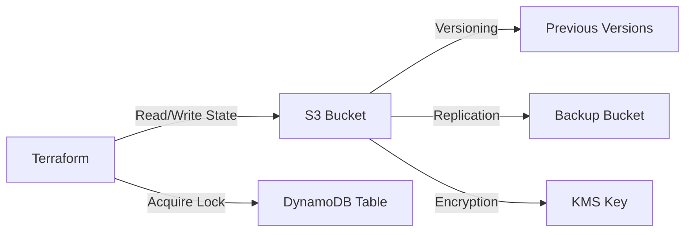
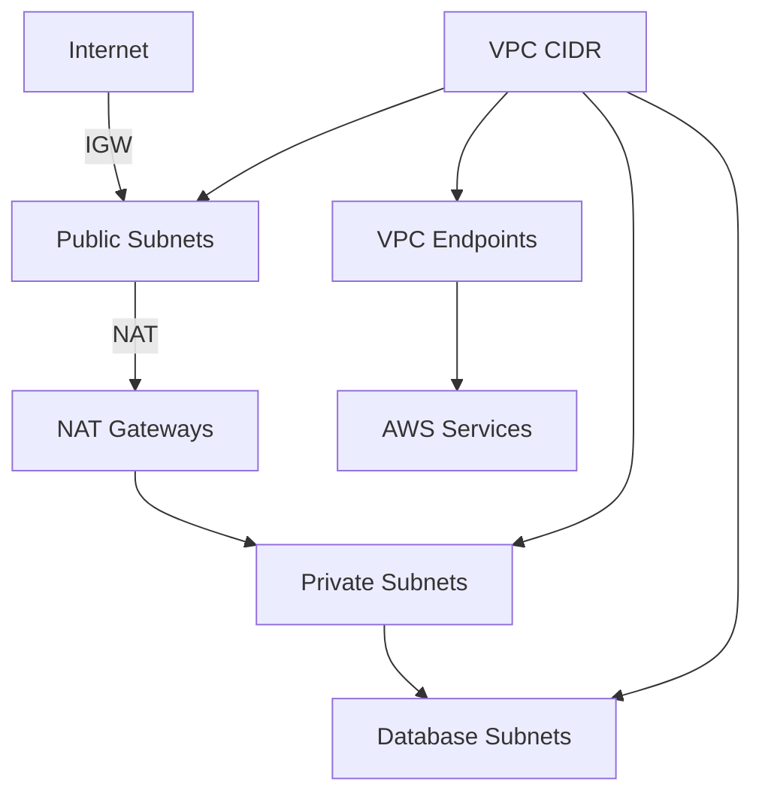
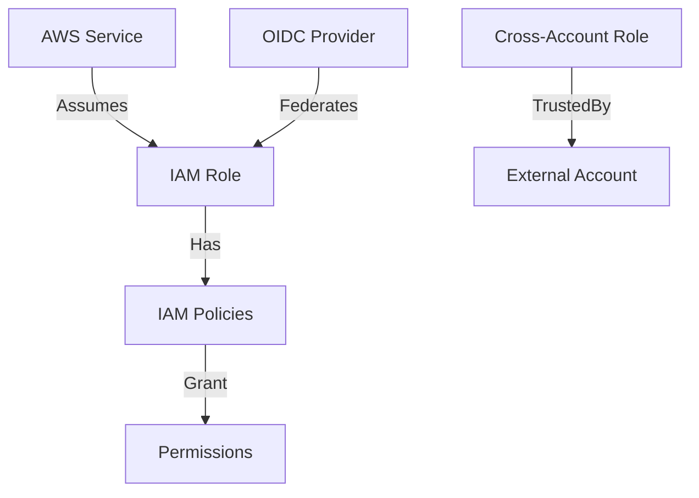
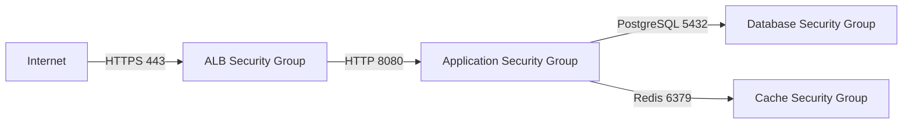

# Foundations Category

**The Bedrock of Your Infrastructure**

The Foundations category contains essential infrastructure components that form the base layer of any cloud deployment. These components provide identity, networking, security, and state management - the fundamental building blocks upon which all other infrastructure is built.

---

## Overview

### What's in Foundations?

Foundations components handle:
- **Identity & Access Management** - Who can do what
- **Networking** - How resources communicate
- **Security** - Network-level protection
- **State Management** - Infrastructure state storage

### Why Start Here?

Every infrastructure deployment should begin with Foundations components because:
1. **Dependencies** - Other components require these as prerequisites
2. **Security** - Establish security boundaries from the start
3. **Organization** - Set up proper structure before complexity increases
4. **Best Practices** - Implement security and networking correctly from day one

---

## Components in This Category

### Component Matrix

| Component | Purpose | Maturity | Cost | Setup Time |
|-----------|---------|----------|------|------------|
| **backend** | Terraform state storage (S3 + DynamoDB) | ✅ | $ | 15 min |
| **vpc** | Virtual Private Cloud networking | ✅ | $$ | 30 min |
| **iam** | Identity and access management | ✅ | Free | 20 min |
| **securitygroup** | Network firewall rules | ✅ | Free | 10 min |

---

## Component Deep Dive

### 1. Backend Component

**Purpose**: Secure, reliable Terraform state storage and locking

**What It Creates**:
- S3 bucket for state files (encrypted, versioned, lifecycle policies)
- DynamoDB table for state locking
- IAM policies for state access
- S3 bucket for backup
- Replication configuration (optional)

**When to Use**:
- **Always** - This is the first component you deploy
- Required for team collaboration
- Required for CI/CD pipelines

**Architecture**:


**Key Features**:
- Encryption at rest with KMS
- Versioning for state rollback
- State locking to prevent conflicts
- Automated backups
- Cross-region replication (optional)
- Lifecycle policies for cost optimization

**Cost Estimate**:
- Development: $5-10/month
- Production: $20-50/month (with replication)

**Example**:
```yaml
components:
  terraform:
    backend:
      vars:
        region: us-east-1
        name: "mycompany-terraform-state"
        enable_versioning: true
        enable_replication: true
        replication_region: "us-west-2"
```

**Documentation**: [components/terraform/backend/README.md](../../../components/terraform/backend/README.md)

---

### 2. VPC Component

**Purpose**: Complete Virtual Private Cloud with subnets, routing, and gateways

**What It Creates**:
- VPC with custom CIDR
- Public subnets (with IGW access)
- Private subnets (with NAT gateway access)
- Database subnets (isolated tier)
- Internet Gateway
- NAT Gateways (configurable count)
- Route tables
- VPC endpoints (optional)
- Flow logs (optional)
- Transit Gateway attachments (optional)

**When to Use**:
- **Every environment** needs a VPC
- First networking component to deploy
- Before any compute or data services

**Architecture**:


**Key Features**:
- Multi-AZ deployment for high availability
- Separate subnet tiers (public, private, database)
- Configurable NAT gateway strategy
- VPC endpoints for AWS service access
- Flow logs for traffic analysis
- IPv6 support (optional)

**Cost Estimate**:
- Development (1 NAT): $35-45/month
- Staging (1 NAT): $35-45/month
- Production (3 NATs): $105-135/month

**Architecture Patterns**:

**Development (Cost-Optimized)**:
```yaml
vars:
  vpc_cidr: "10.1.0.0/16"
  azs: ["us-east-1a", "us-east-1b"]
  enable_nat_gateway: true
  single_nat_gateway: true  # Single NAT for cost savings
```

**Production (High-Availability)**:
```yaml
vars:
  vpc_cidr: "10.0.0.0/16"
  azs: ["us-east-1a", "us-east-1b", "us-east-1c"]
  enable_nat_gateway: true
  one_nat_gateway_per_az: true  # NAT in each AZ
  enable_flow_logs: true
  enable_endpoints: true
  endpoint_services: ["s3", "dynamodb", "ec2", "ecr.api", "ecr.dkr"]
```

**Documentation**: [components/terraform/vpc/README.md](../../../components/terraform/vpc/README.md)

---

### 3. IAM Component

**Purpose**: Identity and access management for AWS resources

**What It Creates**:
- IAM roles for services (EKS, ECS, Lambda, EC2)
- IAM policies (managed and inline)
- Instance profiles for EC2
- OIDC provider for EKS
- Service-linked roles
- Cross-account assume roles

**When to Use**:
- After VPC, before compute services
- For service-to-service authentication
- For cross-account access
- For least-privilege security

**Architecture**:


**Key Features**:
- Least privilege principle
- Service-specific roles
- Cross-account access patterns
- OIDC federation for Kubernetes
- Managed policy attachments
- Inline policy definitions

**Cost Estimate**:
- **Free** (IAM has no cost)

**Common Roles**:

**EKS Cluster Role**:
```yaml
components:
  terraform:
    iam:
      vars:
        eks_cluster_role:
          name: "eks-cluster-role"
          managed_policies:
            - "arn:aws:iam::aws:policy/AmazonEKSClusterPolicy"
```

**Lambda Execution Role**:
```yaml
lambda_execution_role:
  name: "lambda-execution-role"
  managed_policies:
    - "arn:aws:iam::aws:policy/service-role/AWSLambdaBasicExecutionRole"
  inline_policies:
    s3_access:
      effect: "Allow"
      actions: ["s3:GetObject", "s3:PutObject"]
      resources: ["arn:aws:s3:::my-bucket/*"]
```

**Documentation**: [components/terraform/iam/README.md](../../../components/terraform/iam/README.md)

---

### 4. Security Group Component

**Purpose**: Network access control and firewall rules

**What It Creates**:
- Security groups with ingress/egress rules
- Rule descriptions and metadata
- Named rule sets for common patterns
- Inter-service communication rules

**When to Use**:
- After VPC, alongside IAM
- Before deploying compute resources
- Define once, reference everywhere

**Architecture**:


**Key Features**:
- Least privilege network access
- Named rules for clarity
- Source security group references
- CIDR-based rules
- Protocol-specific rules
- Stateful firewall behavior

**Cost Estimate**:
- **Free** (Security groups have no cost)

**Common Patterns**:

**Web Application Tier**:
```yaml
components:
  terraform:
    securitygroup:
      vars:
        security_groups:
          alb:
            name: "alb-sg"
            description: "Security group for ALB"
            ingress_rules:
              - from_port: 443
                to_port: 443
                protocol: "tcp"
                cidr_blocks: ["0.0.0.0/0"]
                description: "HTTPS from internet"

          app:
            name: "app-sg"
            description: "Security group for application"
            ingress_rules:
              - from_port: 8080
                to_port: 8080
                protocol: "tcp"
                source_security_group_id: "${securitygroup.alb.id}"
                description: "HTTP from ALB"

          database:
            name: "database-sg"
            description: "Security group for database"
            ingress_rules:
              - from_port: 5432
                to_port: 5432
                protocol: "tcp"
                source_security_group_id: "${securitygroup.app.id}"
                description: "PostgreSQL from application"
```

**Documentation**: [components/terraform/securitygroup/README.md](../../../components/terraform/securitygroup/README.md)

---

## Component Comparison

### When to Use Each Component

| Scenario | Backend | VPC | IAM | Security Groups |
|----------|---------|-----|-----|-----------------|
| **Team collaboration** | Required | - | - | - |
| **Any AWS deployment** | Required | Required | Required | Required |
| **Compute services** | - | Required | Required | Required |
| **Database services** | - | Required | Required | Required |
| **Cross-account access** | - | Optional | Required | - |

### Deployment Order

**Recommended sequence**:

```
1. Backend (first - enables team collaboration)
   ↓
2. VPC (networking foundation)
   ↓
3. IAM (identity and permissions)
   ↓
4. Security Groups (network access control)
   ↓
5. Ready for Compute/Data/Integration components
```

**Command sequence**:
```bash
# 1. Backend
atmos terraform apply backend -s mycompany-dev-use1

# 2. VPC
atmos terraform apply vpc -s mycompany-dev-use1

# 3. IAM
atmos terraform apply iam -s mycompany-dev-use1

# 4. Security Groups
atmos terraform apply securitygroup -s mycompany-dev-use1

# 5. Verify
atmos terraform output vpc -s mycompany-dev-use1
atmos terraform output iam -s mycompany-dev-use1
```

---

## Architecture Patterns

### Pattern 1: Basic Development Environment

**Use Case**: Simple development environment for testing

**Components**:
- Backend
- VPC (2 AZs, single NAT)
- IAM (basic roles)
- Security Groups (permissive for development)

**Cost**: ~$50/month

**Configuration**:
```yaml
# Development stack
components:
  terraform:
    backend:
      vars:
        name: "dev-terraform-state"
        enable_replication: false

    vpc:
      vars:
        vpc_cidr: "10.1.0.0/16"
        azs: ["us-east-1a", "us-east-1b"]
        single_nat_gateway: true

    iam:
      vars:
        create_instance_profile: true

    securitygroup:
      vars:
        # More permissive rules for dev
```

---

### Pattern 2: Production Environment

**Use Case**: High-availability production infrastructure

**Components**:
- Backend (with replication)
- VPC (3 AZs, one NAT per AZ, VPC endpoints)
- IAM (least privilege roles)
- Security Groups (restrictive rules)

**Cost**: ~$150/month

**Configuration**:
```yaml
# Production stack
components:
  terraform:
    backend:
      vars:
        name: "prod-terraform-state"
        enable_replication: true
        enable_backup: true

    vpc:
      vars:
        vpc_cidr: "10.0.0.0/16"
        azs: ["us-east-1a", "us-east-1b", "us-east-1c"]
        one_nat_gateway_per_az: true
        enable_flow_logs: true
        enable_endpoints: true
        endpoint_services: ["s3", "dynamodb", "ec2", "ecr.api", "ecr.dkr"]

    iam:
      vars:
        # Least privilege policies
        create_instance_profile: true
        enable_mfa: true

    securitygroup:
      vars:
        # Strict ingress/egress rules
        default_egress_deny: true
```

---

### Pattern 3: Multi-Account Setup

**Use Case**: Separate AWS accounts for dev/staging/prod

**Components**:
- Backend (per account)
- VPC (per account)
- IAM (with cross-account roles)
- Security Groups (per account)

**Configuration**:
```yaml
# Central account IAM
components:
  terraform:
    iam:
      vars:
        cross_account_roles:
          dev_admin:
            trusted_account_id: "111111111111"  # Dev account
          prod_readonly:
            trusted_account_id: "222222222222"  # Prod account
```

---

## Best Practices

### VPC Design

**CIDR Planning**:
```
Development:   10.1.0.0/16
Staging:       10.2.0.0/16
Production:    10.0.0.0/16
DR Site:       10.10.0.0/16
```

**Subnet Sizing**:
```
Public Subnets:    /24 (254 IPs per AZ)
Private Subnets:   /20 (4,094 IPs per AZ) - for workloads
Database Subnets:  /24 (254 IPs per AZ)
```

**Reserved Ranges**:
- `.0` - Network address
- `.1` - VPC router
- `.2` - DNS server
- `.3` - Future use
- `.255` - Broadcast address

### IAM Best Practices

1. **Least Privilege**: Grant minimum necessary permissions
2. **Role-Based**: Use roles, not user credentials
3. **MFA**: Enable MFA for sensitive operations
4. **Rotate**: Rotate credentials regularly
5. **Audit**: Enable CloudTrail logging
6. **Separate**: Different roles for different purposes

### Security Group Best Practices

1. **Deny by Default**: Only allow necessary traffic
2. **Named Rules**: Use descriptions for all rules
3. **Security Group References**: Prefer SG references over CIDR blocks
4. **Least Privilege**: Minimal port ranges
5. **Egress Control**: Don't leave egress wide open
6. **Documentation**: Document the purpose of each rule

### Backend Best Practices

1. **Encryption**: Always enable encryption at rest
2. **Versioning**: Enable state versioning
3. **Locking**: Use DynamoDB for state locking
4. **Backup**: Enable automated backups
5. **Replication**: Use cross-region replication for production
6. **Access Control**: Strict IAM policies for state bucket

---

## Cost Optimization

### Development Environment

**Strategy**: Minimize costs while maintaining functionality

```yaml
# Cost-optimized development
vpc:
  vars:
    single_nat_gateway: true          # $35/mo vs $105/mo
    enable_endpoints: false           # Save endpoint costs

backend:
  vars:
    enable_replication: false         # Save replication costs
    lifecycle_rules:
      - transition_days: 30
        storage_class: "GLACIER"      # Cheaper storage for old states
```

**Savings**: ~$70/month

---

### Production Environment

**Strategy**: Balance cost and availability

```yaml
# Optimized production
vpc:
  vars:
    one_nat_gateway_per_az: true      # High availability
    enable_endpoints: true            # Reduce data transfer costs
    endpoint_services:
      - s3                            # Save $0.01/GB
      - dynamodb
      - ecr.api
      - ecr.dkr
```

**Savings**: ~$50-100/month (through reduced data transfer)

---

## Security Considerations

### Network Security

**Multi-Layer Defense**:
```
1. VPC isolation (network boundary)
2. Network ACLs (subnet boundary)
3. Security Groups (instance boundary)
4. Application firewalls (application boundary)
```

**Private Subnet Strategy**:
- All workloads in private subnets
- No direct internet access
- NAT gateway for outbound only
- VPC endpoints for AWS services

### IAM Security

**Least Privilege Example**:
```yaml
# Good: Specific permissions
inline_policies:
  s3_read:
    effect: "Allow"
    actions: ["s3:GetObject"]
    resources: ["arn:aws:s3:::my-app-bucket/config/*"]

# Bad: Overly broad permissions
inline_policies:
  s3_all:
    effect: "Allow"
    actions: ["s3:*"]
    resources: ["*"]
```

### State Security

**Backend Security Checklist**:
- [ ] S3 bucket encryption enabled (KMS)
- [ ] S3 bucket versioning enabled
- [ ] S3 bucket public access blocked
- [ ] DynamoDB table encrypted
- [ ] IAM policies restrict access
- [ ] CloudTrail logging enabled
- [ ] MFA delete enabled

---

## Monitoring & Compliance

### VPC Monitoring

**Key Metrics**:
- NAT Gateway bandwidth utilization
- VPC Flow Logs for traffic analysis
- Unused/Idle NAT gateways

**CloudWatch Alarms**:
```yaml
monitoring:
  vars:
    vpc_alarms:
      nat_gateway_bytes:
        threshold: 10000000000  # 10 GB
        evaluation_periods: 1

      nat_gateway_errors:
        threshold: 100
        evaluation_periods: 2
```

### IAM Monitoring

**Compliance Checks**:
- Unused IAM roles
- Overly permissive policies
- Missing MFA on sensitive roles
- Credential age

**AWS Config Rules**:
```yaml
security_monitoring:
  vars:
    config_rules:
      - iam-user-mfa-enabled
      - iam-policy-no-statements-with-admin-access
      - iam-role-managed-policy-check
```

---

## Troubleshooting

### Common VPC Issues

**Issue**: Resources can't access internet
```bash
# Check NAT gateway
aws ec2 describe-nat-gateways --filter "Name=vpc-id,Values=vpc-xxx"

# Check route tables
aws ec2 describe-route-tables --filter "Name=vpc-id,Values=vpc-xxx"

# Verify security group egress rules
aws ec2 describe-security-groups --group-ids sg-xxx
```

**Issue**: VPC endpoint not working
```bash
# Check endpoint status
aws ec2 describe-vpc-endpoints --filters "Name=vpc-id,Values=vpc-xxx"

# Check route table associations
aws ec2 describe-route-tables --filters "Name=vpc-endpoint-id,Values=vpce-xxx"
```

---

### Common IAM Issues

**Issue**: Permission denied errors
```bash
# Check effective permissions
aws iam simulate-principal-policy \
  --policy-source-arn arn:aws:iam::ACCOUNT:role/ROLE \
  --action-names ACTION \
  --resource-arns RESOURCE_ARN

# Check trust relationship
aws iam get-role --role-name ROLE_NAME
```

---

## Examples

### Complete Foundation Stack

See [examples/minimal-deployment/](../../../examples/minimal-deployment/) for a complete working example.

### Quick Start

```bash
# 1. Clone repository
git clone https://github.com/example/tf-atmos.git
cd tf-atmos

# 2. Deploy foundations
atmos terraform apply backend -s mycompany-dev-use1
atmos terraform apply vpc -s mycompany-dev-use1
atmos terraform apply iam -s mycompany-dev-use1
atmos terraform apply securitygroup -s mycompany-dev-use1

# 3. Verify
atmos terraform output vpc -s mycompany-dev-use1
```

---

## Related Documentation

- **[Compute Category](../compute/README.md)** - Next layer: EKS, ECS, Lambda
- **[Data Category](../data/README.md)** - Storage: RDS, S3, Backups
- **[Security Guide](../../architecture/security-best-practices-guide.md)** - Security deep dive
- **[Network Architecture](../../architecture/NETWORK_ARCHITECTURE.md)** - Network design guide
- **[Cost Estimation](../../COST_ESTIMATION.md)** - Detailed cost analysis

---

## Support

- **Documentation**: [docs/README.md](../../README.md)
- **FAQ**: [docs/FAQ.md](../../FAQ.md)
- **Troubleshooting**: [docs/operations/TROUBLESHOOTING.md](../../operations/TROUBLESHOOTING.md)
- **Email**: platform-team@example.com

---

**Category**: Foundations
**Components**: 4
**Total Setup Time**: ~75 minutes
**Monthly Cost**: $50 (dev) - $150 (prod)
