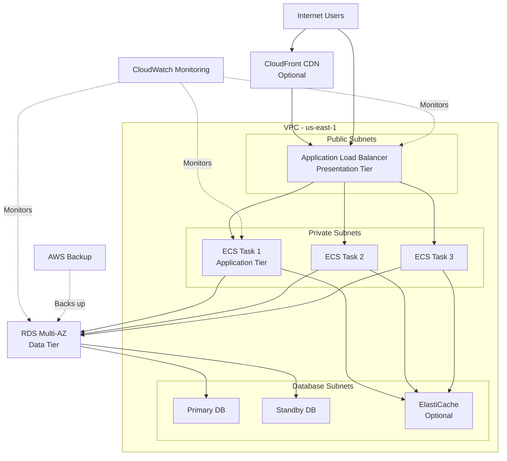

# Pattern: Three-Tier Web Application

**Classic web application architecture with presentation, application, and data tiers**

---

## Overview

### What Is This Pattern?

A three-tier web application architecture separates concerns into three logical layers:

1. **Presentation Tier** - Load balancer and edge services
2. **Application Tier** - Business logic and application servers
3. **Data Tier** - Database and data storage

This pattern is ideal for traditional web applications, APIs, and service-oriented architectures.

### When to Use This Pattern

Use this pattern when you need:
- Traditional web application hosting
- Clear separation of concerns
- Scalable, maintainable architecture
- Support for multiple application instances
- Database-backed applications

### Architecture Characteristics

| Characteristic | Rating | Notes |
|----------------|--------|-------|
| **Scalability** | High | Horizontal scaling at each tier |
| **Availability** | High | Multi-AZ deployment, auto-recovery |
| **Cost** | Medium | $200-500/month depending on scale |
| **Complexity** | Medium | Standard web architecture |
| **Maintenance** | Medium | Regular updates, monitoring |

---

## Architecture Diagram



---

## Component Breakdown

### Tier 1: Presentation Layer

**Components**:
- **Application Load Balancer (ALB)**
  - Routes traffic to application tier
  - SSL/TLS termination
  - Health checking
  - DDoS protection via AWS Shield

- **CloudFront (Optional)**
  - CDN for static assets
  - Global edge locations
  - Reduced origin load

**Configuration**:
```yaml
# ALB configuration (created with ECS component)
ecs:
  vars:
    load_balancer:
      type: "application"
      internal: false
      subnets: "${vpc.public_subnet_ids}"
      ssl_certificate_arn: "${acm.certificate_arn}"
```

---

### Tier 2: Application Layer

**Components**:
- **ECS Fargate Tasks**
  - Containerized application
  - Auto-scaling based on CPU/memory
  - No server management
  - Multi-AZ deployment

**Configuration**:
```yaml
components:
  terraform:
    ecs:
      vars:
        cluster_name: "webapp-prod"

        services:
          webapp:
            # Task definition
            task_definition:
              family: "webapp"
              cpu: "512"      # 0.5 vCPU
              memory: "1024"  # 1 GB
              containers:
                - name: "app"
                  image: "123456789.dkr.ecr.us-east-1.amazonaws.com/webapp:latest"
                  port_mappings:
                    - container_port: 8080
                      protocol: "tcp"
                  environment:
                    - name: "DB_HOST"
                      value: "${rds.db_instance_endpoint}"
                    - name: "REDIS_HOST"
                      value: "${elasticache.endpoint}"
                  secrets:
                    - name: "DB_PASSWORD"
                      value_from: "${secretsmanager.db_password_arn}"

            # Service configuration
            desired_count: 3
            launch_type: "FARGATE"

            # Network
            network_configuration:
              subnets: "${vpc.private_subnet_ids}"
              security_groups: ["${securitygroup.app_sg_id}"]

            # Load balancer integration
            load_balancer:
              target_group_arn: "${alb.target_group_arn}"
              container_name: "app"
              container_port: 8080

            # Auto-scaling
            auto_scaling:
              min_capacity: 2
              max_capacity: 10
              cpu_target: 70
              memory_target: 80
              scale_in_cooldown: 300
              scale_out_cooldown: 60
```

---

### Tier 3: Data Layer

**Components**:
- **RDS Multi-AZ**
  - PostgreSQL or MySQL
  - Automatic failover
  - Automated backups
  - Read replicas (optional)

- **ElastiCache (Optional)**
  - Redis or Memcached
  - Session storage
  - Application caching

**Configuration**:
```yaml
components:
  terraform:
    rds:
      vars:
        identifier: "webapp-prod-db"
        engine: "postgres"
        engine_version: "15.4"
        instance_class: "db.t3.medium"

        # Storage
        allocated_storage: 100
        storage_type: "gp3"
        iops: 3000
        storage_encrypted: true

        # Database
        db_name: "webapp"
        username: "admin"
        password: "${secretsmanager.db_password}"

        # High availability
        multi_az: true

        # Backup
        backup_retention_period: 7
        backup_window: "03:00-04:00"
        maintenance_window: "mon:04:00-mon:05:00"

        # Monitoring
        enabled_cloudwatch_logs_exports:
          - "postgresql"
        monitoring_interval: 60

        # Network
        vpc_id: "${vpc.vpc_id}"
        subnet_ids: "${vpc.database_subnet_ids}"
        security_group_ids: ["${securitygroup.db_sg_id}"]
```

---

## Complete Stack Configuration

### Directory Structure

```
stacks/orgs/mycompany/prod/use1/
├── main.yaml                    # Stack entry point
├── vpc.yaml                     # Network configuration
├── iam.yaml                     # IAM roles
├── securitygroup.yaml           # Security groups
├── ecs.yaml                     # Application tier
├── rds.yaml                     # Database tier
├── acm.yaml                     # SSL certificates
├── monitoring.yaml              # Observability
└── backup.yaml                  # Backup configuration
```

### main.yaml

```yaml
import:
  - mixins/region/us-east-1
  - mixins/tags/common
  - catalog/backend
  - orgs/mycompany/prod/use1/vpc
  - orgs/mycompany/prod/use1/iam
  - orgs/mycompany/prod/use1/securitygroup
  - orgs/mycompany/prod/use1/ecs
  - orgs/mycompany/prod/use1/rds
  - orgs/mycompany/prod/use1/acm
  - orgs/mycompany/prod/use1/monitoring
  - orgs/mycompany/prod/use1/backup

vars:
  tenant: "mycompany"
  account: "prod"
  environment: "use1"
  region: "us-east-1"

  # Application configuration
  app_name: "webapp"
  app_version: "1.0.0"
  domain_name: "webapp.mycompany.com"

tags:
  Tenant: "mycompany"
  Environment: "production"
  Application: "webapp"
  ManagedBy: "terraform"
  CostCenter: "engineering"
```

### securitygroup.yaml

```yaml
components:
  terraform:
    securitygroup:
      vars:
        vpc_id: "${vpc.vpc_id}"

        security_groups:
          # ALB security group
          alb:
            name: "webapp-alb-sg"
            description: "Security group for ALB"
            ingress_rules:
              - from_port: 443
                to_port: 443
                protocol: "tcp"
                cidr_blocks: ["0.0.0.0/0"]
                description: "HTTPS from internet"
              - from_port: 80
                to_port: 80
                protocol: "tcp"
                cidr_blocks: ["0.0.0.0/0"]
                description: "HTTP from internet (redirect to HTTPS)"
            egress_rules:
              - from_port: 0
                to_port: 0
                protocol: "-1"
                cidr_blocks: ["0.0.0.0/0"]
                description: "All outbound traffic"

          # Application security group
          app:
            name: "webapp-app-sg"
            description: "Security group for application"
            ingress_rules:
              - from_port: 8080
                to_port: 8080
                protocol: "tcp"
                source_security_group_id: "${securitygroup.alb.id}"
                description: "HTTP from ALB"
            egress_rules:
              - from_port: 5432
                to_port: 5432
                protocol: "tcp"
                source_security_group_id: "${securitygroup.db.id}"
                description: "PostgreSQL to database"
              - from_port: 443
                to_port: 443
                protocol: "tcp"
                cidr_blocks: ["0.0.0.0/0"]
                description: "HTTPS to internet (for APIs)"

          # Database security group
          db:
            name: "webapp-db-sg"
            description: "Security group for database"
            ingress_rules:
              - from_port: 5432
                to_port: 5432
                protocol: "tcp"
                source_security_group_id: "${securitygroup.app.id}"
                description: "PostgreSQL from application"
            egress_rules: []  # No egress needed for RDS
```

---

## Deployment Guide

### Prerequisites

1. **AWS Account** with appropriate permissions
2. **Tools Installed**:
   - Terraform >= 1.9.0
   - Atmos >= 1.163.0
   - AWS CLI >= 2.0
3. **Container Image** pushed to ECR
4. **Domain** configured in Route 53

### Step-by-Step Deployment

#### Step 1: Initialize Backend

```bash
# Deploy Terraform backend (first time only)
atmos terraform apply backend -s mycompany-prod-use1
```

#### Step 2: Deploy Network Foundation

```bash
# Deploy VPC
atmos terraform plan vpc -s mycompany-prod-use1
atmos terraform apply vpc -s mycompany-prod-use1

# Deploy IAM roles
atmos terraform apply iam -s mycompany-prod-use1

# Deploy security groups
atmos terraform apply securitygroup -s mycompany-prod-use1
```

**Verification**:
```bash
# Check VPC
atmos terraform output vpc -s mycompany-prod-use1

# Verify subnets
aws ec2 describe-subnets --filters "Name=vpc-id,Values=$(atmos terraform output vpc -s mycompany-prod-use1 -raw vpc_id)"
```

#### Step 3: Deploy SSL Certificate

```bash
# Request certificate
atmos terraform apply acm -s mycompany-prod-use1

# Verify DNS validation records created
aws acm describe-certificate --certificate-arn <cert-arn>
```

**Note**: Wait for certificate validation to complete (usually 5-30 minutes).

#### Step 4: Deploy Data Tier

```bash
# Deploy secrets
atmos terraform apply secretsmanager -s mycompany-prod-use1

# Deploy RDS database
atmos terraform plan rds -s mycompany-prod-use1
atmos terraform apply rds -s mycompany-prod-use1
```

**Verification**:
```bash
# Check database status
atmos terraform output rds -s mycompany-prod-use1

# Test connectivity (from within VPC)
psql -h $(atmos terraform output rds -s mycompany-prod-use1 -raw db_instance_endpoint) \
     -U admin -d webapp
```

#### Step 5: Deploy Application Tier

```bash
# Deploy ECS cluster and service
atmos terraform plan ecs -s mycompany-prod-use1
atmos terraform apply ecs -s mycompany-prod-use1
```

**Verification**:
```bash
# Check ECS service
aws ecs describe-services --cluster webapp-prod --services webapp

# Check running tasks
aws ecs list-tasks --cluster webapp-prod --service-name webapp
```

#### Step 6: Deploy Monitoring

```bash
# Deploy CloudWatch dashboards and alarms
atmos terraform apply monitoring -s mycompany-prod-use1
```

#### Step 7: Configure DNS

```bash
# Create Route 53 record pointing to ALB
atmos terraform apply dns -s mycompany-prod-use1
```

#### Step 8: Configure Backup

```bash
# Enable automated backups
atmos terraform apply backup -s mycompany-prod-use1
```

---

### Verification Steps

#### 1. Test Application Endpoint

```bash
# Get ALB DNS name
ALB_DNS=$(aws elbv2 describe-load-balancers \
  --names webapp-prod-alb \
  --query 'LoadBalancers[0].DNSName' \
  --output text)

# Test endpoint
curl -I https://$ALB_DNS
curl https://webapp.mycompany.com
```

#### 2. Verify Health Checks

```bash
# Check target health
aws elbv2 describe-target-health \
  --target-group-arn <target-group-arn>
```

#### 3. Test Database Connectivity

```bash
# From an ECS task or EC2 instance in the VPC
psql -h <db-endpoint> -U admin -d webapp -c "SELECT version();"
```

#### 4. Check Monitoring

```bash
# View CloudWatch dashboard
aws cloudwatch get-dashboard --dashboard-name webapp-prod

# Check recent alarms
aws cloudwatch describe-alarms --state-value ALARM
```

---

## Cost Estimation

### Development Environment

| Component | Configuration | Monthly Cost |
|-----------|---------------|--------------|
| **VPC** | 2 AZs, 1 NAT Gateway | $35 |
| **ECS** | Fargate, 2 tasks (0.5 vCPU, 1GB) | $30 |
| **RDS** | db.t3.micro, single-AZ | $15 |
| **ALB** | 1 ALB, minimal traffic | $20 |
| **Monitoring** | Basic dashboards | $10 |
| **Secrets** | 3 secrets | $2 |
| **Backup** | 7-day retention | $5 |
| **Total** | | **$117/month** |

### Staging Environment

| Component | Configuration | Monthly Cost |
|-----------|---------------|--------------|
| **VPC** | 2 AZs, 1 NAT Gateway | $35 |
| **ECS** | Fargate, 3 tasks (0.5 vCPU, 1GB) | $45 |
| **RDS** | db.t3.small, multi-AZ | $60 |
| **ALB** | 1 ALB, moderate traffic | $25 |
| **Monitoring** | Enhanced monitoring | $15 |
| **Secrets** | 5 secrets | $2 |
| **Backup** | 14-day retention | $10 |
| **Total** | | **$192/month** |

### Production Environment

| Component | Configuration | Monthly Cost |
|-----------|---------------|--------------|
| **VPC** | 3 AZs, 3 NAT Gateways | $105 |
| **ECS** | Fargate, 5 tasks (1 vCPU, 2GB) | $150 |
| **RDS** | db.r5.large, multi-AZ | $350 |
| **ALB** | 1 ALB, high traffic | $50 |
| **ElastiCache** | cache.t3.small, 2 nodes | $50 |
| **CloudFront** | CDN, 1TB data transfer | $85 |
| **Monitoring** | Full observability | $30 |
| **Secrets** | 10 secrets | $4 |
| **Backup** | 30-day retention | $30 |
| **Total** | | **$854/month** |

---

## Scaling Guide

### Vertical Scaling

**Application Tier**:
```yaml
# Increase task resources
task_definition:
  cpu: "1024"     # 1 vCPU -> 2 vCPU
  memory: "2048"  # 2 GB -> 4 GB
```

**Database Tier**:
```yaml
# Upgrade instance class
instance_class: "db.r5.xlarge"  # from db.t3.medium
```

### Horizontal Scaling

**Application Tier**:
```yaml
# Increase task count and auto-scaling limits
auto_scaling:
  min_capacity: 5    # from 2
  max_capacity: 20   # from 10
  cpu_target: 60     # scale earlier
```

**Database Tier**:
```yaml
# Add read replicas
read_replicas:
  - identifier: "webapp-prod-db-replica-1"
    instance_class: "db.t3.medium"
  - identifier: "webapp-prod-db-replica-2"
    instance_class: "db.t3.medium"
```

---

## Security Considerations

### Network Security

1. **Multi-layer defense**:
   - Internet -> ALB (public subnet)
   - ALB -> Application (private subnet)
   - Application -> Database (database subnet)

2. **Security groups** follow least privilege
3. **NACLs** provide subnet-level filtering
4. **VPC Flow Logs** enabled for audit

### Data Security

1. **Encryption at rest**:
   - RDS: KMS encrypted
   - EBS volumes: Encrypted
   - Secrets Manager: KMS encrypted

2. **Encryption in transit**:
   - ALB: TLS 1.3
   - RDS: SSL/TLS connections
   - Inter-service: VPC private networking

### Access Control

1. **IAM roles** for service-to-service
2. **No long-lived credentials**
3. **Secrets Manager** for sensitive data
4. **CloudTrail** for audit logging

---

## Monitoring & Alerting

### Key Metrics

**Application Tier**:
- CPU utilization (target: < 70%)
- Memory utilization (target: < 80%)
- Request count
- Response time (target: < 500ms)
- Error rate (target: < 1%)

**Database Tier**:
- CPU utilization (target: < 70%)
- Connections (monitor for saturation)
- Read/Write IOPS
- Replication lag (if using replicas)
- Storage space (alert at 80%)

**Load Balancer**:
- Target health
- Request count
- 4xx/5xx errors
- Latency

### Alarms

```yaml
monitoring:
  vars:
    alarms:
      ecs_cpu_high:
        threshold: 80
        evaluation_periods: 2
        alarm_actions: ["${sns_topic_arn}"]

      rds_cpu_high:
        threshold: 80
        evaluation_periods: 3
        alarm_actions: ["${sns_topic_arn}"]

      alb_5xx_errors:
        threshold: 10
        evaluation_periods: 2
        alarm_actions: ["${sns_topic_arn}"]

      rds_storage_low:
        threshold: 20  # percent free
        evaluation_periods: 1
        alarm_actions: ["${sns_topic_arn}"]
```

---

## Troubleshooting

### Common Issues

#### Issue: Application tasks failing health checks

**Symptoms**: Tasks starting and stopping repeatedly

**Solutions**:
1. Check application logs:
   ```bash
   aws logs tail /aws/ecs/webapp --follow
   ```

2. Verify security group allows ALB -> App traffic
3. Check health check path in ALB target group
4. Verify database connectivity from application

#### Issue: Database connection errors

**Symptoms**: Application errors connecting to database

**Solutions**:
1. Verify security group allows App -> DB traffic
2. Check database status:
   ```bash
   aws rds describe-db-instances --db-instance-identifier webapp-prod-db
   ```

3. Test connectivity from within VPC
4. Verify credentials in Secrets Manager

#### Issue: High latency

**Symptoms**: Slow application response times

**Solutions**:
1. Check database performance insights
2. Enable ElastiCache for frequent queries
3. Optimize database queries
4. Increase application task count
5. Consider adding read replicas

---

## Disaster Recovery

### RTO and RPO

| Environment | RTO | RPO |
|-------------|-----|-----|
| Development | 4 hours | 24 hours |
| Staging | 2 hours | 12 hours |
| Production | 1 hour | 1 hour |

### Backup Strategy

```yaml
backup:
  vars:
    backup_plans:
      daily:
        schedule: "cron(0 2 * * ? *)"  # 2 AM daily
        retention_days: 30
        copy_actions:
          - destination_vault_arn: "${backup_vault_dr_arn}"
            lifecycle:
              delete_after: 90
```

### Recovery Procedures

**Database Recovery**:
```bash
# Restore from automated backup
aws rds restore-db-instance-from-db-snapshot \
  --db-instance-identifier webapp-prod-db-restored \
  --db-snapshot-identifier rds:webapp-prod-db-2025-12-02

# Restore to point in time
aws rds restore-db-instance-to-point-in-time \
  --source-db-instance-identifier webapp-prod-db \
  --target-db-instance-identifier webapp-prod-db-restored \
  --restore-time 2025-12-02T10:00:00Z
```

---

## Maintenance

### Regular Tasks

**Daily**:
- Review CloudWatch dashboards
- Check error logs
- Monitor costs

**Weekly**:
- Review security findings
- Check for AWS service updates
- Review backup success

**Monthly**:
- Database maintenance window
- Rotate secrets
- Review and optimize costs
- Test disaster recovery

---

## Related Patterns

- **[Microservices Pattern](./microservices.md)** - More complex, EKS-based
- **[Serverless Pattern](./serverless-pipeline.md)** - Fully serverless alternative
- **[Multi-Region Pattern](./multi-region.md)** - Global deployment

---

## Additional Resources

- [AWS Well-Architected Framework](https://aws.amazon.com/architecture/well-architected/)
- [ECS Best Practices](https://docs.aws.amazon.com/AmazonECS/latest/bestpracticesguide/)
- [RDS Best Practices](https://docs.aws.amazon.com/AmazonRDS/latest/UserGuide/CHAP_BestPractices.html)

---

**Pattern**: Three-Tier Web Application
**Complexity**: Medium
**Cost Range**: $117-854/month
**Setup Time**: 2-3 hours
**Maintenance**: Low-Medium
