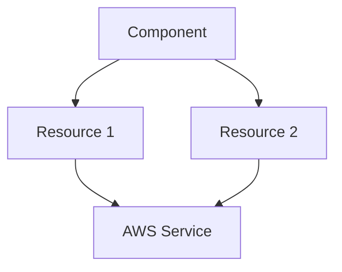

# [Module Name] Component

**Category**: [Foundations | Compute | Data | Integration | Observability | Security]
**Maturity**: [✅ Production | 🔵 Beta | 🟡 Alpha]
**Cost Impact**: [$ Low | $$ Medium | $$$ High]
**Last Updated**: YYYY-MM-DD

---

## Overview

[Brief description of the component in 1-2 sentences]

### Purpose

[Detailed explanation of what problem this component solves and when to use it]

### Key Features

- **Feature 1** - Description
- **Feature 2** - Description
- **Feature 3** - Description
- **Feature 4** - Description
- **Feature 5** - Description

---

## Architecture

### Component Architecture

[Include a Mermaid diagram showing the component's architecture]



### AWS Services Used

| AWS Service | Purpose | Required |
|-------------|---------|----------|
| Service 1 | Purpose | Yes |
| Service 2 | Purpose | No |

### Dependencies

| Component | Relationship | Required |
|-----------|--------------|----------|
| vpc | Provides networking | Yes |
| iam | Provides permissions | Yes |
| securitygroup | Provides firewall rules | No |

---

## Usage

### Prerequisites

List any prerequisites:
- Other components that must be deployed first
- AWS account configuration requirements
- IAM permissions needed
- AWS service quotas to check

### Basic Example

**Minimal configuration for development/testing:**

```yaml
# stacks/catalog/[component-name].yaml
components:
  terraform:
    [component-name]:
      metadata:
        component: [component-name]
      vars:
        enabled: true
        region: us-east-1
        name: "mycompany-dev-[component]"

        # Minimal configuration
        [key-variable-1]: [value]
        [key-variable-2]: [value]
```

**Deployment:**

```bash
# Plan changes
atmos terraform plan [component-name] -s mycompany-dev-use1

# Apply changes
atmos terraform apply [component-name] -s mycompany-dev-use1

# View outputs
atmos terraform output [component-name] -s mycompany-dev-use1
```

### Advanced Example

**Production-ready configuration with advanced features:**

```yaml
# stacks/orgs/mycompany/prod/use1/[component-name].yaml
import:
  - catalog/[component-name]

components:
  terraform:
    [component-name]:
      vars:
        enabled: true
        region: us-east-1
        name: "mycompany-prod-[component]"

        # Advanced configuration
        [advanced-setting-1]: [value]
        [advanced-setting-2]: [value]

        # High availability
        multi_az: true

        # Security
        enable_encryption: true
        kms_key_id: "${kms.key_arn}"

        # Monitoring
        enable_monitoring: true
        alarm_email: "ops-team@example.com"

        # Backup
        enable_backup: true
        backup_retention_days: 30

      tags:
        Environment: "production"
        Team: "platform"
        CostCenter: "engineering-1234"
```

### Production Example

**Full production configuration with all best practices:**

```yaml
# stacks/orgs/mycompany/prod/use1/[component-name].yaml
components:
  terraform:
    [component-name]:
      vars:
        # Identity
        name: "mycompany-prod-[component]"
        region: us-east-1

        # Networking
        vpc_id: "${vpc.vpc_id}"
        subnet_ids: "${vpc.private_subnet_ids}"
        security_group_ids:
          - "${securitygroup.[component]_sg_id}"

        # High Availability
        multi_az: true
        availability_zones:
          - "us-east-1a"
          - "us-east-1b"
          - "us-east-1c"

        # Performance
        [performance-setting]: [value]

        # Security
        enable_encryption: true
        kms_key_id: "${kms.key_arn}"
        enable_access_logging: true

        # Compliance
        enable_audit_logging: true
        enable_compliance_checks: true

        # Monitoring & Alerting
        enable_monitoring: true
        enable_enhanced_monitoring: true
        monitoring_interval: 60
        alarm_email: "ops-team@example.com"

        # Backup & Recovery
        enable_backup: true
        backup_retention_days: 30
        enable_point_in_time_recovery: true

        # Cost Optimization
        auto_scaling_enabled: true
        [cost-optimization-setting]: [value]

      tags:
        Environment: "production"
        Team: "platform"
        CostCenter: "engineering-1234"
        Compliance: "SOC2"
        BackupSchedule: "daily"
```

---

## Requirements

### Terraform Version

| Name | Version |
|------|---------|
| terraform | >= 1.9.0 |
| atmos | >= 1.163.0 |

### Providers

| Provider | Version | Purpose |
|----------|---------|---------|
| aws | ~> 5.74.0 | AWS resources |
| [other-provider] | [version] | [purpose] |

### AWS Service Quotas

| Quota | Default | Recommended | Check Command |
|-------|---------|-------------|---------------|
| [Quota Name] | [default] | [recommended] | `aws service-quotas get-service-quota --service-code [code] --quota-code [code]` |

---

## Configuration

### Input Variables

#### Required Variables

| Name | Description | Type | Example |
|------|-------------|------|---------|
| `name` | Name for the component | `string` | `"mycompany-prod-[component]"` |
| `region` | AWS region | `string` | `"us-east-1"` |
| [required-var] | [description] | [type] | [example] |

#### Optional Variables

| Name | Description | Type | Default | Example |
|------|-------------|------|---------|---------|
| `enabled` | Enable/disable component | `bool` | `true` | `true` |
| `tags` | Additional resource tags | `map(string)` | `{}` | `{"Owner": "team"}` |
| [optional-var] | [description] | [type] | [default] | [example] |

#### High Availability Variables

| Name | Description | Type | Default | Recommended |
|------|-------------|------|---------|-------------|
| `multi_az` | Enable multi-AZ deployment | `bool` | `false` | `true` for prod |
| [ha-var] | [description] | [type] | [default] | [recommendation] |

#### Security Variables

| Name | Description | Type | Default | Recommended |
|------|-------------|------|---------|-------------|
| `enable_encryption` | Enable encryption at rest | `bool` | `true` | `true` |
| `kms_key_id` | KMS key for encryption | `string` | `null` | Custom KMS key |
| [security-var] | [description] | [type] | [default] | [recommendation] |

#### Monitoring Variables

| Name | Description | Type | Default | Recommended |
|------|-------------|------|---------|-------------|
| `enable_monitoring` | Enable CloudWatch monitoring | `bool` | `true` | `true` |
| [monitoring-var] | [description] | [type] | [default] | [recommendation] |

### Variable Validation

The following variables include validation rules:

```hcl
variable "name" {
  validation {
    condition     = can(regex("^[a-z0-9-]+$", var.name))
    error_message = "Name must contain only lowercase letters, numbers, and hyphens."
  }
}

variable "[validated-var]" {
  validation {
    condition     = [validation-condition]
    error_message = "[error-message]"
  }
}
```

---

## Outputs

### Primary Outputs

| Name | Description | Sensitive |
|------|-------------|-----------|
| `id` | Resource ID | No |
| `arn` | Resource ARN | No |
| `name` | Resource name | No |
| [output-name] | [description] | [yes/no] |

### Security Outputs

| Name | Description | Sensitive |
|------|-------------|-----------|
| `security_group_id` | Security group ID | No |
| `iam_role_arn` | IAM role ARN | No |
| [security-output] | [description] | [yes/no] |

### Connectivity Outputs

| Name | Description | Sensitive |
|------|-------------|-----------|
| `endpoint` | Service endpoint URL | No |
| `connection_string` | Connection string | Yes |
| [connectivity-output] | [description] | [yes/no] |

### Using Outputs in Other Components

```yaml
components:
  terraform:
    dependent-component:
      vars:
        [component]_id: "${[component-name].id}"
        [component]_endpoint: "${[component-name].endpoint}"
```

---

## Resources Created

### Primary Resources

- **[Resource Type]** - [Description and purpose]
- **[Resource Type]** - [Description and purpose]

### Supporting Resources

- **IAM Roles** - Service execution roles
- **Security Groups** - Network access control
- **CloudWatch Log Groups** - Logging infrastructure
- **KMS Keys** - Encryption keys (if encryption enabled)

### Resource Naming Convention

All resources follow the naming pattern:

```
${var.name}-[resource-type]-[suffix]
```

Example:
- `mycompany-prod-eks-cluster`
- `mycompany-prod-eks-node-group-001`

---

## Cost Estimation

### Base Costs

| Component | Development | Staging | Production | Notes |
|-----------|------------|---------|------------|-------|
| [Resource 1] | $X/month | $Y/month | $Z/month | [notes] |
| [Resource 2] | $X/month | $Y/month | $Z/month | [notes] |
| **Total** | **$XX/month** | **$YY/month** | **$ZZ/month** | |

### Cost Variables

Factors affecting cost:
- **[Factor 1]** - [Impact description]
- **[Factor 2]** - [Impact description]
- **[Factor 3]** - [Impact description]

### Cost Optimization Strategies

**Development Environment:**
- Use [optimization-strategy-1]
- Disable [expensive-feature]
- Use [cheaper-alternative]

**Production Environment:**
- Use [reserved-instances/savings-plans]
- Enable [auto-scaling]
- Implement [cost-control-feature]

### Cost Monitoring

```yaml
# Enable cost tracking
vars:
  enable_cost_allocation_tags: true
  cost_center: "engineering-1234"
```

**View costs:**
```bash
# Using AWS CLI
aws ce get-cost-and-usage \
  --time-period Start=2025-01-01,End=2025-01-31 \
  --granularity MONTHLY \
  --metrics BlendedCost \
  --filter file://filter.json
```

---

## Performance Characteristics

### Throughput

| Metric | Development | Production | Notes |
|--------|------------|------------|-------|
| [Metric 1] | X ops/sec | Y ops/sec | [notes] |
| [Metric 2] | X MB/sec | Y MB/sec | [notes] |

### Latency

| Operation | P50 | P95 | P99 |
|-----------|-----|-----|-----|
| [Operation 1] | X ms | Y ms | Z ms |
| [Operation 2] | X ms | Y ms | Z ms |

### Scalability

- **Vertical Scaling**: [description and limits]
- **Horizontal Scaling**: [description and limits]
- **Auto-scaling**: [configuration details]

### Performance Tuning

```yaml
# Performance configuration
vars:
  # [Setting 1]
  [performance-var-1]: [optimized-value]

  # [Setting 2]
  [performance-var-2]: [optimized-value]
```

---

## Security Considerations

### Encryption

- **At Rest**: [encryption details]
  - Default: [enabled/disabled]
  - KMS integration: [yes/no]
  - Algorithm: [algorithm]

- **In Transit**: [encryption details]
  - Protocol: [TLS version]
  - Certificate management: [ACM/self-managed]

### Access Control

- **IAM Roles**: [role descriptions]
- **Security Groups**: [security group rules]
- **Network ACLs**: [if applicable]
- **Resource Policies**: [if applicable]

### Compliance

| Standard | Status | Configuration |
|----------|--------|---------------|
| **HIPAA** | [Supported/Not Supported] | [requirements] |
| **PCI-DSS** | [Supported/Not Supported] | [requirements] |
| **SOC 2** | [Supported/Not Supported] | [requirements] |
| **GDPR** | [Supported/Not Supported] | [requirements] |

### Security Best Practices

1. **Enable encryption** for all data
2. **Use private subnets** for workload placement
3. **Implement least privilege** IAM policies
4. **Enable audit logging** for compliance
5. **Regular security scanning** with AWS Security Hub
6. **Rotate credentials** regularly
7. **Use AWS Secrets Manager** for sensitive data

### Security Checklist

- [ ] Encryption at rest enabled
- [ ] Encryption in transit enabled
- [ ] Private subnet deployment
- [ ] Security groups configured
- [ ] IAM roles follow least privilege
- [ ] CloudWatch logging enabled
- [ ] AWS Config rules enabled
- [ ] GuardDuty monitoring enabled
- [ ] Backup and recovery tested

---

## Monitoring & Alerting

### CloudWatch Metrics

| Metric | Description | Threshold | Action |
|--------|-------------|-----------|--------|
| [Metric 1] | [description] | [threshold] | [action] |
| [Metric 2] | [description] | [threshold] | [action] |

### CloudWatch Alarms

```yaml
# Enable monitoring
vars:
  enable_monitoring: true
  alarm_email: "ops-team@example.com"

  # Custom alarm thresholds
  alarm_thresholds:
    [metric-1]: [value]
    [metric-2]: [value]
```

### Dashboard

The component automatically creates a CloudWatch dashboard with:
- [Metric 1] visualization
- [Metric 2] visualization
- [Metric 3] visualization

**Access dashboard:**
```bash
# Get dashboard URL from outputs
atmos terraform output [component-name] -s [stack] | grep dashboard_url
```

### Log Groups

| Log Group | Purpose | Retention |
|-----------|---------|-----------|
| `/aws/[service]/[name]` | [purpose] | [days] |

### Monitoring Best Practices

1. Set appropriate alarm thresholds
2. Configure SNS topics for notifications
3. Enable detailed monitoring for production
4. Create custom dashboards for business metrics
5. Implement log aggregation and analysis

---

## Backup & Disaster Recovery

### Backup Configuration

```yaml
vars:
  # Backup settings
  enable_backup: true
  backup_retention_days: 30
  backup_schedule: "cron(0 2 * * ? *)"  # Daily at 2 AM UTC

  # Point-in-time recovery
  enable_point_in_time_recovery: true
```

### Recovery Procedures

**Restore from backup:**

```bash
# 1. List available backups
aws [service] describe-backups

# 2. Restore from backup
atmos terraform apply [component]-restore -s [stack] \
  -var="backup_id=[backup-id]"
```

### RTO and RPO

| Environment | RTO (Recovery Time Objective) | RPO (Recovery Point Objective) |
|-------------|-------------------------------|-------------------------------|
| Development | 4 hours | 24 hours |
| Staging | 2 hours | 12 hours |
| Production | 1 hour | 1 hour |

### Disaster Recovery Testing

Schedule regular DR tests:
1. Verify backups are created successfully
2. Test restore procedures
3. Validate data integrity
4. Document recovery time
5. Update runbooks

---

## Troubleshooting

### Common Issues

#### Issue 1: [Common Problem]

**Symptoms:**
- [Symptom 1]
- [Symptom 2]

**Cause:**
[Root cause explanation]

**Solution:**
```bash
# Step 1
[command-1]

# Step 2
[command-2]
```

#### Issue 2: [Another Common Problem]

**Symptoms:**
- [Symptom 1]
- [Symptom 2]

**Cause:**
[Root cause explanation]

**Solution:**
1. [Step 1]
2. [Step 2]
3. [Step 3]

### Validation Commands

```bash
# Check component status
atmos terraform output [component-name] -s [stack]

# Validate configuration
atmos terraform validate [component-name] -s [stack]

# Check AWS resources
aws [service] describe-[resource] --[filter]

# View logs
aws logs tail /aws/[service]/[name] --follow
```

### Debug Mode

Enable debug logging:

```yaml
vars:
  enable_debug_logging: true
  log_level: "DEBUG"
```

### Getting Help

1. Check [component documentation](./README.md)
2. Review [troubleshooting guide](../../operations/TROUBLESHOOTING.md)
3. Search [FAQ](../../FAQ.md)
4. Contact platform-team@example.com

---

## Known Issues and Limitations

### Current Limitations

1. **[Limitation 1]**
   - Description
   - Workaround: [workaround]
   - Tracking issue: [link]

2. **[Limitation 2]**
   - Description
   - Workaround: [workaround]
   - Tracking issue: [link]

### Planned Improvements

- [ ] [Improvement 1] - ETA: [date]
- [ ] [Improvement 2] - ETA: [date]
- [ ] [Improvement 3] - ETA: [date]

---

## Migration Guide

### Migrating from [Old Component]

**Compatibility:**
- [Component version] is compatible with [old-component version X.Y.Z]
- Breaking changes: [list breaking changes]

**Migration steps:**

1. **Backup existing resources**
   ```bash
   atmos terraform state pull [old-component] -s [stack] > backup.tfstate
   ```

2. **Update configuration**
   ```yaml
   # Old configuration
   [old-component]:
     vars:
       [old-var]: [value]

   # New configuration
   [new-component]:
     vars:
       [new-var]: [value]
   ```

3. **Import existing resources**
   ```bash
   atmos terraform import [component] [resource-type].[name] [aws-resource-id]
   ```

4. **Verify migration**
   ```bash
   atmos terraform plan [component] -s [stack]
   ```

---

## Examples

### Example 1: [Use Case]

**Scenario:** [Description of scenario]

**Configuration:**
```yaml
[configuration]
```

**Deployment:**
```bash
[deployment commands]
```

**Result:** [Expected outcome]

### Example 2: [Another Use Case]

[Similar structure as Example 1]

### More Examples

See the [examples directory](../../../examples/[component-name]/) for:
- [Example 1]
- [Example 2]
- [Example 3]

---

## Integration Examples

### With [Related Component 1]

```yaml
components:
  terraform:
    [component-name]:
      vars:
        [related-component-1]_id: "${[related-component-1].id}"

    [related-component-1]:
      vars:
        # Configuration
```

### With [Related Component 2]

[Similar structure]

---

## Changelog

### Version 2.0.0 (2025-12-02)

**Added:**
- [New feature 1]
- [New feature 2]

**Changed:**
- [Changed behavior 1]
- [Changed behavior 2]

**Fixed:**
- [Bug fix 1]
- [Bug fix 2]

**Deprecated:**
- [Deprecated feature 1]

### Version 1.5.0 (2025-11-01)

[Previous version changes]

See [CHANGELOG.md](./CHANGELOG.md) for complete history.

---

## Related Components

### Prerequisites

- **[Component 1]** - [Why needed]
- **[Component 2]** - [Why needed]

### Commonly Used Together

- **[Component 3]** - [Use case]
- **[Component 4]** - [Use case]

### Alternative Options

- **[Alternative 1]** - [When to use instead]
- **[Alternative 2]** - [When to use instead]

---

## Contributing

Contributions are welcome! See the [Contributing Guide](../../../LIBRARY_GUIDE.md#contributing) for:
- Code standards
- Testing requirements
- Documentation requirements
- Review process

---

## License

Apache 2.0 - See [LICENSE](../../../LICENSE) file for details.

---

## Additional Resources

- **[Official AWS Documentation](https://docs.aws.amazon.com/[service]/)**
- **[Terraform Provider Documentation](https://registry.terraform.io/providers/hashicorp/aws/latest/docs)**
- **[AWS Well-Architected Framework](https://aws.amazon.com/architecture/well-architected/)**
- **[Component Examples](../../../examples/[component-name]/)**

---

## Support

- **Documentation**: [docs/README.md](../../README.md)
- **Issues**: [GitHub Issues](https://github.com/example/tf-atmos/issues)
- **Slack**: #infrastructure-platform
- **Email**: platform-team@example.com

---

**Last Reviewed**: YYYY-MM-DD
**Maintained By**: Platform Team
**Status**: [Production | Beta | Alpha]
