# Communication Protocols & Success Metrics
## Agent Communication Standards and Performance Tracking

---

## 1. Communication Architecture

### 1.1 Communication Channels
```yaml
channels:
  primary:
    context_files:
      location: .context/
      format: YAML/Markdown
      update_frequency: On change
      retention: Indefinite
    
  asynchronous:
    pull_requests:
      platform: GitHub
      review_required: Yes
      merge_strategy: Squash and merge
    
    documentation:
      location: docs/
      format: Markdown
      versioning: Git tracked
    
  synchronous:
    emergency:
      method: GitHub Issues with @mentions
      response_time: 15 minutes
      escalation: Context Manager
    
  reporting:
    status_updates:
      location: .context/global/status.yaml
      frequency: Every 4 hours
      format: Structured YAML
```

### 1.2 Communication Flow Patterns

```mermaid
graph TD
    subgraph "Normal Operations"
        A[Agent Work] --> B[Update Context]
        B --> C[Git Commit]
        C --> D[PR if needed]
        D --> E[Review]
        E --> F[Merge]
    end
    
    subgraph "Handoff Flow"
        G[Complete Task] --> H[Generate Summary]
        H --> I[Update Handoff File]
        I --> J[Notify Next Agent]
        J --> K[Acknowledge Receipt]
    end
    
    subgraph "Emergency Flow"
        L[Detect Issue] --> M[Create Alert]
        M --> N[Context Manager]
        N --> O[Coordinate Response]
        O --> P[Resolution]
    end
```


---

## 2. Message Standards

### 2.1 Standard Message Templates

#### Task Assignment
```yaml
# .context/agents/agent-XXX/tasks.yaml
task:
  id: TASK-2024-001
  title: "Implement monitoring stack"
  assigned_to: agent-008
  assigned_by: agent-001
  priority: P1
  status: ASSIGNED
  
  description: |
    Set up comprehensive monitoring for all infrastructure components
    using Prometheus, Grafana, and CloudWatch integration.
  
  acceptance_criteria:
    - [ ] Prometheus deployed on EKS
    - [ ] Grafana dashboards created
    - [ ] CloudWatch metrics integrated
    - [ ] Alerts configured
    - [ ] Documentation complete
  
  dependencies:
    - component: eks
      status: COMPLETED
    - component: eks-addons
      status: IN_PROGRESS
  
  deliverables:
    - monitoring component code
    - Grafana dashboard JSON
    - Alert rules YAML
    - Runbook documentation
  
  timeline:
    start: 2024-01-17T09:00:00Z
    due: 2024-01-19T17:00:00Z
    
  notes: |
    Coordinate with kubernetes_specialist for EKS integration
```

#### Status Update
```yaml
# .context/global/status.yaml
status_update:
  timestamp: 2024-01-16T14:00:00Z
  reporter: agent-002
  
  summary: |
    Infrastructure optimization 40% complete.
    VPC and IAM components fully optimized.
    Currently working on EKS configuration.
  
  progress:
    completed:
      - VPC CIDR optimization
      - Security group consolidation
      - IAM role refinement
    
    in_progress:
      - EKS node group optimization
      - Network policy implementation
    
    blocked:
      - RDS optimization (waiting for maintenance window)
    
    upcoming:
      - Lambda function optimization
      - API Gateway configuration
  
  metrics:
    tasks_completed: 12
    tasks_in_progress: 3
    tasks_blocked: 1
    estimated_completion: 2024-01-20
  
  risks:
    - description: EKS upgrade may cause downtime
      mitigation: Schedule maintenance window
      owner: agent-007
```

#### Handoff Document
```yaml
# .context/agents/handoffs/handoff-2024-001.yaml
handoff:
  id: HANDOFF-2024-001
  from: agent-002
  to: agent-005
  timestamp: 2024-01-16T17:00:00Z
  
  component: vpc
  status: COMPLETED
  
  work_completed:
    - Optimized CIDR blocks for better IP utilization
    - Implemented proper subnet segmentation
    - Added VPC flow logs
    - Configured VPC endpoints for AWS services
  
  artifacts:
    - path: components/terraform/vpc/
      status: FINAL
      description: Updated VPC Terraform configuration
    
    - path: docs/network-architecture.md
      status: FINAL
      description: Network design documentation
  
  configuration:
    vpc_cidr: 10.0.0.0/16
    availability_zones: 3
    nat_gateways: 3
    vpc_endpoints: [s3, dynamodb, ecr]
  
  known_issues:
    - issue: VPC peering to legacy network pending
      impact: LOW
      action: Schedule with network team
  
  next_steps:
    - Deploy to staging environment
    - Validate network connectivity
    - Update service configurations
  
  success_verification:
    - [ ] Terraform plan shows no changes
    - [ ] Network connectivity tests pass
    - [ ] VPC flow logs active
    - [ ] Cost within budget
```

---

## 3. Performance Metrics

### 3.1 Agent Performance KPIs

```yaml
agent_metrics:
  productivity:
    tasks_completed_per_day:
      target: 3-5
      measurement: Daily count
      threshold: < 2 triggers review
    
    code_quality_score:
      target: > 4.0/5.0
      measurement: Automated scanning
      components:
        - Terraform validation: 30%
        - Security scanning: 30%
        - Best practices: 20%
        - Documentation: 20%
    
    delivery_timeliness:
      target: 95% on time
      measurement: Due date adherence
      escalation: < 80% requires intervention
  
  collaboration:
    handoff_success_rate:
      target: > 95%
      measurement: Clean handoffs / total
      issues: Rework, clarifications needed
    
    communication_responsiveness:
      target: < 4 hours
      measurement: Time to acknowledge
      critical: < 15 minutes for P0
    
    conflict_resolution:
      target: < 1 per week
      measurement: Escalations required
      review: Pattern analysis monthly
  
  quality:
    defect_rate:
      target: < 5%
      measurement: Issues found post-delivery
      calculation: Defects / Total deliveries
    
    rework_percentage:
      target: < 10%
      measurement: Time on fixes / Total time
      trigger: > 15% requires process review
    
    documentation_completeness:
      target: 100%
      measurement: Required docs present
      enforcement: Automated checks
```

### 3.2 Project Success Metrics

```yaml
project_metrics:
  delivery:
    component_optimization:
      baseline: 17 components
      completed: 0
      target: 17
      timeline: 6 weeks
      current_rate: TBD
    
    platform_features:
      backstage_portal:
        target: Fully operational
        current: 30% complete
        blockers: API development
      
      platform_apis:
        target: REST + GraphQL
        current: Not started
        dependencies: Infrastructure ready
      
      observability:
        target: Full stack monitoring
        current: Basic CloudWatch
        gap: Prometheus, Grafana, Tracing
  
  operational:
    deployment_frequency:
      baseline: 2-3/week
      current: 2-3/week
      target: 10+/day
      improvement: 400%
    
    lead_time:
      baseline: 2-3 days
      current: 2-3 days
      target: < 1 day
      improvement: 66%
    
    mttr:
      baseline: 2-4 hours
      current: 2-4 hours
      target: < 1 hour
      improvement: 75%
    
    change_failure_rate:
      baseline: 15%
      current: 15%
      target: < 5%
      improvement: 67%
  
  business:
    cost_optimization:
      baseline: $X/month
      target: 25% reduction
      current_savings: 0%
      initiatives:
        - Right-sizing: 10% expected
        - Reserved instances: 8% expected
        - Spot instances: 5% expected
        - Resource cleanup: 2% expected
    
    developer_productivity:
      baseline: Current velocity
      target: 40% improvement
      metrics:
        - Time to provision: -50%
        - Self-service ratio: 90%
        - Automation coverage: 95%
    
    security_posture:
      vulnerabilities:
        critical: 0 allowed
        high: < 5
        medium: < 20
      
      compliance:
        soc2: 100% required controls
        iso27001: 100% required controls
        custom: Per organization
```

---

## 4. Communication Effectiveness Tracking

### 4.1 Communication Metrics Dashboard

```yaml
dashboard:
  update_frequency: Real-time
  location: .context/dashboards/communication.yaml
  
  widgets:
    message_volume:
      type: time_series
      metric: Messages per hour by channel
      threshold: > 50/hour indicates overload
    
    response_times:
      type: histogram
      metric: Time to first response
      buckets: [15m, 1h, 4h, 8h, 24h]
      target: 90% within 4h
    
    handoff_quality:
      type: gauge
      metric: Successful handoffs %
      target: > 95%
      calculation: No rework needed / Total
    
    context_completeness:
      type: heatmap
      metric: Context file completeness by agent
      dimensions: [agent, component]
      target: 100% green
    
    escalation_rate:
      type: counter
      metric: Escalations per week
      target: < 3
      breakdown: By type and severity
```

### 4.2 Communication Health Indicators

```yaml
health_indicators:
  green:  # Healthy
    - Response time < 2 hours average
    - Handoff success > 95%
    - Context updates regular
    - No escalations in 48h
    - All agents active
  
  yellow:  # Warning
    - Response time 2-4 hours
    - Handoff success 90-95%
    - Context updates delayed
    - 1-2 escalations in 48h
    - 1 agent inactive
  
  red:  # Critical
    - Response time > 4 hours
    - Handoff success < 90%
    - Context severely outdated
    - 3+ escalations in 48h
    - Multiple agents blocked
```

---

## 5. Escalation Procedures

### 5.1 Escalation Matrix

| Level | Trigger | Response Time | Authority | Action |
|-------|---------|--------------|-----------|---------|
| L0 | Normal operations | Standard | Agent | Continue work |
| L1 | Agent blocked | 4 hours | Peer agents | Collaborate to unblock |
| L2 | Multiple blocks | 2 hours | Context Manager | Prioritize and coordinate |
| L3 | Critical failure | 30 minutes | Technical Lead | Direct intervention |
| L4 | Project risk | 15 minutes | Executive | Strategic decision |

### 5.2 Escalation Triggers

```yaml
automatic_escalation:
  agent_blocked:
    condition: No progress for 4 hours
    action: Notify Context Manager
    level: L2
  
  handoff_failed:
    condition: Handoff rejected or unclear
    action: Original agent clarifies
    level: L1
    timeout: 2 hours then L2
  
  critical_component_down:
    condition: Backend, VPC, or EKS failure
    action: All hands response
    level: L3
  
  security_incident:
    condition: Any security breach
    action: Immediate escalation
    level: L4
  
  cost_overrun:
    condition: > 20% over budget
    action: Review and approval needed
    level: L3
```

---

## 6. Continuous Improvement Process

### 6.1 Retrospective Schedule

```yaml
retrospectives:
  daily_standup:
    time: 09:00 UTC
    duration: 15 minutes
    format: Written update in context
    participants: All active agents
    
  weekly_review:
    time: Friday 15:00 UTC
    duration: 1 hour
    format: Detailed analysis
    topics:
      - Completed work
      - Blockers encountered
      - Process improvements
      - Upcoming priorities
  
  sprint_retrospective:
    frequency: Bi-weekly
    duration: 2 hours
    format: Comprehensive review
    deliverables:
      - Lessons learned
      - Process updates
      - Metric analysis
      - Action items
```

### 6.2 Improvement Metrics

```yaml
improvement_tracking:
  process_efficiency:
    baseline_capture: Week 1
    measurement_frequency: Weekly
    improvements:
      - Automation opportunities
      - Redundancy elimination
      - Handoff optimization
      - Communication streamlining
  
  quality_trends:
    defect_rate_trend:
      target: Decreasing
      review: Weekly
    
    rework_trend:
      target: Decreasing
      review: Weekly
    
    documentation_quality:
      target: Increasing
      review: Bi-weekly
  
  velocity_improvements:
    week_over_week:
      target: 5% improvement
      measurement: Story points completed
    
    cycle_time:
      target: Decreasing
      measurement: Task start to complete
    
    throughput:
      target: Increasing
      measurement: Tasks per agent per day
```

---

## 7. Success Criteria Validation

### 7.1 Project Milestones

```yaml
milestones:
  week_1:
    criteria:
      - [ ] Context Manager operational
      - [ ] All agents onboarded
      - [ ] Communication protocols established
      - [ ] Initial assessments complete
    validation: Review all context files
    
  week_2:
    criteria:
      - [ ] 30% components optimized
      - [ ] Backstage initial setup
      - [ ] API development started
      - [ ] Monitoring framework designed
    validation: Component testing
    
  week_4:
    criteria:
      - [ ] 70% components optimized
      - [ ] Platform APIs functional
      - [ ] Observability stack deployed
      - [ ] Documentation 80% complete
    validation: Integration testing
    
  week_6:
    criteria:
      - [ ] All components optimized
      - [ ] Full platform operational
      - [ ] All workflows automated
      - [ ] Documentation complete
    validation: End-to-end testing
    
  week_8:
    criteria:
      - [ ] Production deployment
      - [ ] Performance targets met
      - [ ] Security audit passed
      - [ ] Handover complete
    validation: Production readiness review
```

### 7.2 Success Validation Framework

```yaml
validation_framework:
  technical_validation:
    automated_tests:
      - Terraform validation
      - Security scanning
      - Integration tests
      - Performance tests
    
    manual_review:
      - Architecture review
      - Security audit
      - Code review
      - Documentation review
  
  business_validation:
    metrics_achievement:
      - Cost targets
      - Productivity improvements
      - Quality metrics
      - Timeline adherence
    
    stakeholder_acceptance:
      - Developer satisfaction
      - Operations approval
      - Security sign-off
      - Executive approval
  
  operational_validation:
    runbook_testing:
      - Deployment procedures
      - Rollback processes
      - Incident response
      - Disaster recovery
    
    knowledge_transfer:
      - Documentation complete
      - Training delivered
      - Handover executed
      - Support established
```

---

## 8. Reporting Structure

### 8.1 Report Types

```yaml
reports:
  daily_status:
    format: YAML
    location: .context/reports/daily/
    contents:
      - Tasks completed
      - Current blockers
      - Tomorrow's plan
      - Risk updates
    
  weekly_summary:
    format: Markdown
    location: docs/reports/weekly/
    contents:
      - Executive summary
      - Progress against plan
      - Metrics dashboard
      - Issues and resolutions
      - Upcoming milestones
    
  milestone_report:
    format: Comprehensive Markdown
    location: docs/reports/milestones/
    contents:
      - Milestone achievement
      - Detailed metrics
      - Lessons learned
      - Risk assessment
      - Recommendations
```

### 8.2 Stakeholder Communication

```yaml
stakeholder_matrix:
  executive:
    frequency: Weekly
    format: Executive summary
    metrics: Business KPIs
    channel: Email report
    
  technical_lead:
    frequency: Daily
    format: Technical details
    metrics: All metrics
    channel: Context files
    
  developers:
    frequency: On change
    format: Documentation
    metrics: Relevant components
    channel: Git repository
    
  operations:
    frequency: Daily
    format: Operational status
    metrics: System health
    channel: Dashboards
```

---

## 9. Communication Best Practices

### 9.1 Guidelines

```yaml
best_practices:
  clarity:
    - Use structured formats
    - Include all context
    - Define success criteria
    - Specify dependencies
    
  timeliness:
    - Update immediately on completion
    - Acknowledge within 1 hour
    - Complete handoffs same day
    - Report blockers immediately
    
  completeness:
    - Include all artifacts
    - Document known issues
    - Provide next steps
    - Include validation criteria
    
  professionalism:
    - Constructive feedback
    - Solution-oriented
    - Respectful communication
    - Collaborative approach
```

### 9.2 Anti-Patterns to Avoid

```yaml
avoid:
  communication:
    - Delayed updates
    - Incomplete handoffs
    - Assuming context
    - Skipping documentation
    
  collaboration:
    - Working in isolation
    - Not asking for help
    - Ignoring dependencies
    - Bypassing processes
    
  quality:
    - Rushing without validation
    - Ignoring feedback
    - Skipping reviews
    - Incomplete testing
```

---

## 10. Monitoring and Alerts

### 10.1 Communication Monitoring

```yaml
monitoring:
  metrics:
    context_update_frequency:
      target: Every 4 hours
      alert: No update in 8 hours
      
    handoff_completion_time:
      target: < 30 minutes
      alert: > 2 hours
      
    response_time:
      target: < 4 hours
      alert: > 8 hours
      
    escalation_rate:
      target: < 1 per day
      alert: > 3 per day
```

### 10.2 Alert Configuration

```yaml
alerts:
  channels:
    critical:
      - GitHub Issues with @mention
      - Context Manager notification
      
    warning:
      - Context file flag
      - Daily report inclusion
      
    info:
      - Weekly summary mention
      - Metrics dashboard
  
  rules:
    agent_inactive:
      condition: No updates in 24h
      severity: WARNING
      action: Check agent status
      
    handoff_stuck:
      condition: Not acknowledged in 4h
      severity: CRITICAL
      action: Context Manager intervenes
      
    project_behind_schedule:
      condition: > 20% behind plan
      severity: WARNING
      action: Review and replan
```

---

**Document Version**: 1.0  
**Last Updated**: 2024-01-16  
**Review Cycle**: Weekly  
**Owner**: Context Manager Agent