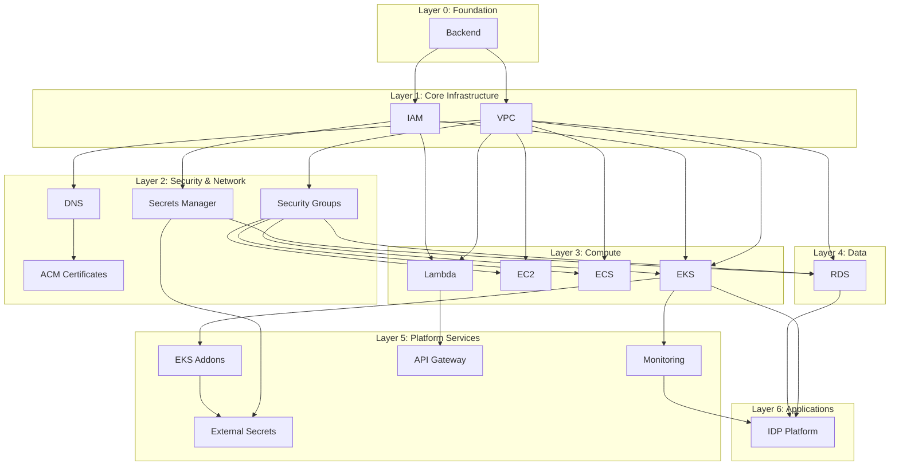
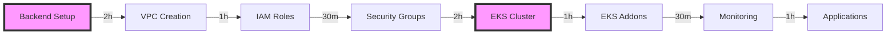
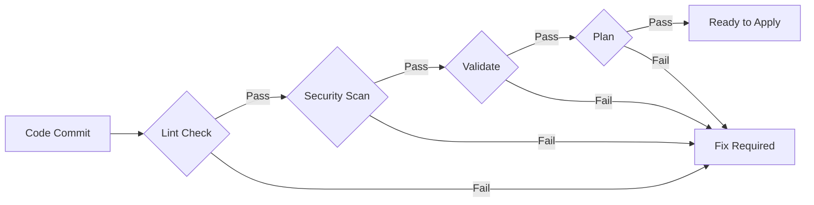

# Dependency Mapping & Risk Analysis
## Critical Dependencies and Risk Mitigation Strategies

---

## 1. Component Dependency Matrix

### Infrastructure Dependencies
| Component | Direct Dependencies | Transitive Dependencies | Criticality | Risk Level |
|-----------|-------------------|------------------------|-------------|------------|
| **backend** | None | All components | CRITICAL | High |
| **vpc** | backend | All network resources | CRITICAL | High |
| **iam** | backend | All AWS resources | CRITICAL | High |
| **securitygroup** | vpc | EC2, EKS, RDS, Lambda | HIGH | Medium |
| **eks** | vpc, iam, securitygroup | eks-addons, idp-platform | HIGH | High |
| **eks-addons** | eks | Application workloads | HIGH | Medium |
| **rds** | vpc, securitygroup, secretsmanager | Applications | MEDIUM | Medium |
| **lambda** | vpc, iam | API Gateway, Events | MEDIUM | Low |
| **ec2** | vpc, securitygroup, iam | Legacy apps | LOW | Low |
| **ecs** | vpc, iam | Container workloads | MEDIUM | Low |
| **monitoring** | eks, vpc | All components | HIGH | Medium |
| **dns** | vpc | All public services | MEDIUM | Low |
| **apigateway** | lambda, vpc | External APIs | MEDIUM | Low |
| **acm** | dns | HTTPS services | MEDIUM | Low |
| **secretsmanager** | iam | RDS, Applications | HIGH | Medium |
| **external-secrets** | eks, secretsmanager | K8s workloads | MEDIUM | Low |
| **idp-platform** | eks, rds, monitoring | Developer portal | MEDIUM | Medium |

### Dependency Chain Visualization


---

## 2. Workflow Dependencies

### Workflow Execution Dependencies
```yaml
workflow_dependencies:
  bootstrap-backend:
    requires: []
    enables: [all_workflows]
    critical: true
    
  apply-backend:
    requires: [bootstrap-backend]
    enables: [environment_workflows]
    critical: true
    
  onboard-environment:
    requires: [apply-backend]
    enables: [create-environment-template]
    critical: true
    
  create-environment-template:
    requires: [onboard-environment]
    enables: [validate, plan-environment]
    critical: false
    
  validate:
    requires: [environment_exists]
    enables: [plan-environment]
    critical: true
    
  lint:
    requires: []
    enables: [validate]
    critical: false
    
  compliance-check:
    requires: [environment_exists]
    enables: [apply-environment]
    critical: true
    
  plan-environment:
    requires: [validate]
    enables: [apply-environment]
    critical: true
    
  apply-environment:
    requires: [plan-environment, compliance-check]
    enables: [operational_workflows]
    critical: true
    
  drift-detection:
    requires: [running_environment]
    enables: [remediation_actions]
    critical: false
    
  rotate-certificate:
    requires: [acm_component]
    enables: []
    critical: false
    
  import:
    requires: [environment_exists]
    enables: [state_consistency]
    critical: false
    
  state-operations:
    requires: [backend_exists]
    enables: [state_recovery]
    critical: true
```

---

## 3. Risk Assessment Matrix

### Technical Risks
| Risk ID | Risk Description | Probability | Impact | Risk Score | Mitigation Strategy | Owner |
|---------|-----------------|------------|--------|------------|-------------------|--------|
| R001 | Backend state corruption | Low (2) | Critical (5) | 10 | Versioning, backups, locks | infrastructure_architect |
| R002 | VPC misconfiguration | Medium (3) | High (4) | 12 | Validation, peer review | network_engineer |
| R003 | IAM privilege escalation | Low (2) | Critical (5) | 10 | Least privilege, audit | security_specialist |
| R004 | EKS cluster failure | Medium (3) | High (4) | 12 | Multi-AZ, backups | kubernetes_specialist |
| R005 | Secret exposure | Low (2) | Critical (5) | 10 | Encryption, rotation | security_specialist |
| R006 | Cost overrun | High (4) | Medium (3) | 12 | Budgets, alerts | cost_optimizer |
| R007 | Monitoring gaps | Medium (3) | Medium (3) | 9 | Full coverage | observability_engineer |
| R008 | API Gateway throttling | Medium (3) | Low (2) | 6 | Rate limits, caching | api_developer |
| R009 | RDS data loss | Low (2) | Critical (5) | 10 | Backups, snapshots | infrastructure_architect |
| R010 | Certificate expiry | Medium (3) | High (4) | 12 | Auto-renewal, monitoring | security_specialist |

### Operational Risks
| Risk ID | Risk Description | Probability | Impact | Risk Score | Mitigation Strategy | Owner |
|---------|-----------------|------------|--------|------------|-------------------|--------|
| R011 | Agent coordination failure | Medium (3) | High (4) | 12 | Clear protocols | context_manager |
| R012 | Documentation drift | High (4) | Low (2) | 8 | Auto-generation | documentation_specialist |
| R013 | Knowledge silos | Medium (3) | Medium (3) | 9 | Cross-training | dx_optimizer |
| R014 | Deployment failures | Medium (3) | High (4) | 12 | Rollback plans | cicd_engineer |
| R015 | Compliance violations | Low (2) | High (4) | 8 | Regular audits | compliance_auditor |

### Risk Scoring Matrix
```
Impact →
     1    2    3    4    5
P  1 1    2    3    4    5
r  2 2    4    6    8    10
o  3 3    6    9    12   15
b  4 4    8    12   16   20
↓  5 5    10   15   20   25

Score Ranges:
1-5:   Low Risk (Monitor)
6-10:  Medium Risk (Plan Mitigation)
11-15: High Risk (Active Mitigation)
16-25: Critical Risk (Immediate Action)
```

---

## 4. Dependency Failure Scenarios

### Scenario 1: Backend Failure
```yaml
scenario: S3 bucket or DynamoDB table unavailable
impact:
  - No Terraform operations possible
  - Complete infrastructure freeze
  - All agents blocked
  
detection:
  - Terraform state lock errors
  - AWS API errors
  - Monitoring alerts
  
recovery:
  immediate:
    - Check AWS service health
    - Verify IAM permissions
    - Check network connectivity
  
  short_term:
    - Restore from backup
    - Recreate backend resources
    - Update configuration
  
  long_term:
    - Implement multi-region backend
    - Add redundancy
    - Improve monitoring
```

### Scenario 2: VPC Deletion/Corruption
```yaml
scenario: VPC accidentally deleted or misconfigured
impact:
  - All resources in VPC unreachable
  - Network isolation
  - Service outage
  
detection:
  - Resource connection failures
  - Network unreachable errors
  - Monitoring alerts
  
recovery:
  immediate:
    - Assess damage scope
    - Prevent further changes
    - Notify stakeholders
  
  short_term:
    - Restore from IaC
    - Recreate network resources
    - Restore connectivity
  
  long_term:
    - Add deletion protection
    - Implement change controls
    - Regular DR testing
```

### Scenario 3: EKS Cluster Failure
```yaml
scenario: EKS control plane failure
impact:
  - Kubernetes API unavailable
  - Workloads continue running
  - No updates possible
  
detection:
  - kubectl connection errors
  - API timeout errors
  - Monitoring alerts
  
recovery:
  immediate:
    - Check AWS EKS status
    - Verify cluster health
    - Check node status
  
  short_term:
    - Wait for AWS recovery
    - Failover to backup cluster
    - Restore from backup
  
  long_term:
    - Multi-cluster setup
    - Cross-region failover
    - Improved monitoring
```

---

## 5. Critical Path Analysis

### Deployment Critical Path


**Total Critical Path Duration**: 8 hours minimum

### Critical Path Components
1. **backend** (2h) - Must exist before any other component
2. **vpc** (1h) - Network foundation required
3. **iam** (30m) - Security permissions needed
4. **eks** (2h) - Container platform required for modern workloads
5. **eks-addons** (1h) - Platform capabilities

### Path Optimization Opportunities
- Parallel execution of independent components
- Pre-staging of configurations
- Automated validation to reduce rework
- Caching of provider plugins

---

## 6. Dependency Breaking Strategies

### Strategy 1: Modular Architecture
```yaml
approach: Break monolithic components into smaller modules
benefits:
  - Reduced blast radius
  - Parallel development
  - Easier testing
  
implementation:
  - Separate network from compute
  - Decouple security from infrastructure
  - Independent service modules
```

### Strategy 2: Interface Contracts
```yaml
approach: Define clear interfaces between components
benefits:
  - Loose coupling
  - Version compatibility
  - Independent updates
  
implementation:
  - Output contracts
  - API versioning
  - Schema validation
```

### Strategy 3: Feature Flags
```yaml
approach: Progressive rollout with feature toggles
benefits:
  - Safe deployments
  - Quick rollback
  - A/B testing
  
implementation:
  - LaunchDarkly integration
  - Environment-specific flags
  - Gradual rollout
```

---

## 7. Monitoring & Alerting

### Dependency Health Monitoring
```yaml
metrics:
  component_health:
    - Terraform state consistency
    - Resource availability
    - Configuration drift
    
  workflow_health:
    - Execution success rate
    - Duration trends
    - Error patterns
    
  integration_health:
    - API availability
    - Response times
    - Error rates

alerts:
  critical:
    - Backend unavailable
    - VPC issues
    - EKS API down
    - IAM errors
    
  warning:
    - High drift detected
    - Slow deployments
    - Cost threshold exceeded
    
  info:
    - Successful deployments
    - Certificate renewals
    - Backup completions
```

### Alert Routing
| Alert Level | Notification Channel | Response Time | Escalation |
|------------|---------------------|---------------|------------|
| Critical | PagerDuty, Slack | 15 min | Immediate |
| Warning | Slack, Email | 1 hour | After 3 occurrences |
| Info | Email, Dashboard | Daily digest | None |

---

## 8. Recovery Time Objectives

### Component RTOs
| Component | RTO | RPO | Backup Strategy | Recovery Method |
|-----------|-----|-----|----------------|-----------------|
| backend | 1h | 0 | Real-time replication | Failover region |
| vpc | 2h | 1h | IaC definitions | Terraform apply |
| eks | 4h | 1h | Velero backups | Restore cluster |
| rds | 1h | 15m | Automated snapshots | Point-in-time recovery |
| lambda | 30m | 0 | Code in Git | Redeploy |
| monitoring | 2h | 1h | Config backups | Recreate stack |

---

## 9. Dependency Validation Framework

### Pre-Deployment Validation
```yaml
validation_checks:
  static:
    - Terraform validate
    - Tflint rules
    - Security scanning
    - Cost estimation
    
  dynamic:
    - Dependency resolution
    - API availability
    - Permission checks
    - Network connectivity
    
  integration:
    - End-to-end testing
    - Cross-component validation
    - Performance testing
```

### Validation Gates


---

## 10. Continuous Improvement

### Dependency Optimization Metrics
```yaml
metrics:
  deployment_velocity:
    baseline: 8 hours
    target: 4 hours
    improvement: 50%
    
  failure_rate:
    baseline: 15%
    target: 5%
    improvement: 67%
    
  recovery_time:
    baseline: 4 hours
    target: 1 hour
    improvement: 75%
    
  dependency_coupling:
    baseline: High
    target: Low
    measurement: Component independence score
```

### Improvement Initiatives
1. **Q1**: Implement multi-region backend
2. **Q2**: Add service mesh for microservices
3. **Q3**: Automate disaster recovery
4. **Q4**: Achieve zero-downtime deployments

---

**Document Version**: 1.0  
**Last Updated**: 2024-01-16  
**Review Frequency**: Bi-weekly  
**Owner**: Context Manager Agent