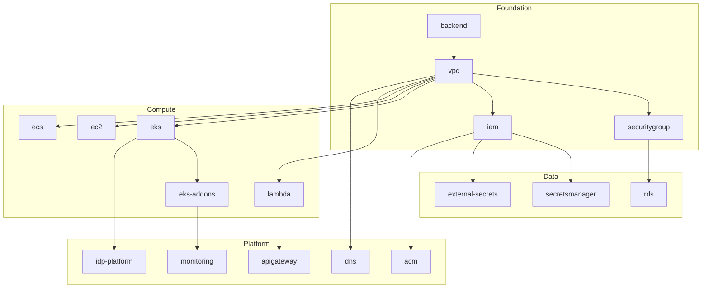

# Project State Assessment Report
## Multi-Agent Terraform/Atmos Infrastructure Coordination

---

## 1. Executive Overview

### Repository Statistics
- **Total Components**: 17 Terraform modules
- **Workflows**: 16 Atmos automation workflows  
- **Stack Configurations**: Multi-tenant (fnx) with dev/staging/prod environments
- **Lines of Code**: ~15,000+ (Terraform, Python, YAML)
- **Documentation**: Comprehensive guides across 25+ markdown files
- **Maturity Level**: 2.3/5.0 (Developing)

### Critical Findings
1. **Strong Foundation**: Well-structured IaC with consistent patterns
2. **Automation Gap**: Limited self-service capabilities for developers
3. **Observability Deficit**: Basic monitoring, no unified platform view
4. **Integration Opportunities**: Backstage IDP partially implemented
5. **Security Posture**: Good baseline, needs runtime protection

---

## 2. Component Dependency Map

### Infrastructure Layer Dependencies


### Critical Path Components
1. **backend** → Must exist before any other component
2. **vpc** → Foundation for all network-dependent resources
3. **iam** → Security foundation for all services
4. **eks** → Container platform for modern workloads
5. **monitoring** → Observability foundation

---

## 3. Workflow Execution Patterns

### Current Workflow Categories

#### Foundation Workflows (Priority 1)
- `bootstrap-backend`: Initialize state management
- `apply-backend`: Configure backend settings
- `onboard-environment`: Set up new environments

#### Operational Workflows (Priority 2)
- `plan-environment`: Review changes
- `apply-environment`: Deploy infrastructure
- `validate`: Configuration validation
- `lint`: Code quality checks

#### Maintenance Workflows (Priority 3)
- `drift-detection`: State consistency
- `rotate-certificate`: Security maintenance
- `state-operations`: State management
- `import`: Resource adoption

### Workflow Dependency Chain
```yaml
execution_order:
  1_foundation:
    - bootstrap-backend
    - apply-backend
  2_environment_setup:
    - onboard-environment
    - create-environment-template
  3_validation:
    - lint
    - validate
    - compliance-check
  4_deployment:
    - plan-environment
    - apply-environment
  5_operations:
    - drift-detection
    - monitoring
```

---

## 4. Integration Points Assessment

### External System Integrations

| System | Status | Integration Type | Priority |
|--------|--------|-----------------|----------|
| GitHub | ✅ Active | Source control, Actions | Critical |
| AWS | ✅ Active | Infrastructure provider | Critical |
| Atlantis | ✅ Active | PR automation | High |
| Jenkins | ✅ Active | CI/CD pipeline | High |
| Backstage | 🟡 Partial | Developer portal | High |
| Prometheus | 🟡 Planned | Metrics collection | Medium |
| Grafana | 🟡 Planned | Visualization | Medium |
| Vault | ❌ Missing | Secret management | High |
| ServiceNow | ❌ Missing | Change management | Low |

### API Surface Area
```yaml
current_apis:
  terraform:
    - State API (S3/DynamoDB)
    - Provider APIs (AWS)
  
  missing_apis:
    - Platform REST API
    - GraphQL Gateway
    - WebSocket Events
    - Webhook Manager
```

---

## 5. Security & Compliance Status

### Security Controls
| Control | Status | Evidence | Risk |
|---------|--------|----------|------|
| IAM Least Privilege | ✅ | Policy templates | Low |
| Encryption at Rest | ✅ | S3, RDS configs | Low |
| Encryption in Transit | 🟡 | Partial TLS | Medium |
| Secret Management | 🟡 | SSM/Secrets Manager | Medium |
| Network Segmentation | ✅ | VPC/Subnets | Low |
| Audit Logging | 🟡 | CloudTrail only | Medium |
| Vulnerability Scanning | ❌ | Not implemented | High |
| Runtime Protection | ❌ | Not implemented | High |

### Compliance Frameworks
- **SOC2**: 60% coverage (missing continuous monitoring)
- **ISO27001**: 55% coverage (missing risk assessments)
- **PCI-DSS**: Not applicable
- **HIPAA**: Not configured

---

## 6. Technical Debt Analysis

### High Priority Debt
1. **No Platform API**: All operations require CLI access
2. **Limited Observability**: No unified logging/metrics platform
3. **Manual Certificate Management**: Despite rotation scripts
4. **Missing Service Mesh**: No traffic management for microservices
5. **No Cost Allocation**: Basic tagging, no chargeback

### Medium Priority Debt
1. **Incomplete Backstage Integration**: Plugins not fully developed
2. **No Progressive Delivery**: Missing canary/blue-green deployments
3. **Limited Disaster Recovery**: Backup scripts exist, not automated
4. **No Policy as Code**: OPA/Sentinel not implemented

### Low Priority Debt
1. **Documentation Gaps**: Some components lack examples
2. **Test Coverage**: No infrastructure tests
3. **Performance Baselines**: No benchmarking data

---

## 7. Agent Coordination Requirements

### Agent Deployment Strategy

#### Phase 1: Foundation Agents (Week 1)
```yaml
foundation_agents:
  context_manager:
    role: Coordinate all agents, maintain state
    priority: P0
    dependencies: none
    
  infrastructure_architect:
    role: Review and optimize Terraform components
    priority: P1
    dependencies: [context_manager]
    
  security_specialist:
    role: Implement security controls
    priority: P1
    dependencies: [context_manager]
```

#### Phase 2: Platform Agents (Week 2)
```yaml
platform_agents:
  backstage_developer:
    role: Complete IDP implementation
    priority: P1
    dependencies: [infrastructure_architect]
    
  api_developer:
    role: Build platform REST/GraphQL APIs
    priority: P1
    dependencies: [backstage_developer]
    
  observability_engineer:
    role: Implement monitoring stack
    priority: P2
    dependencies: [infrastructure_architect]
```

#### Phase 3: Optimization Agents (Week 3)
```yaml
optimization_agents:
  cost_optimizer:
    role: Implement FinOps practices
    priority: P2
    dependencies: [observability_engineer]
    
  performance_engineer:
    role: Optimize resource utilization
    priority: P3
    dependencies: [observability_engineer]
    
  documentation_writer:
    role: Complete documentation
    priority: P3
    dependencies: all_agents
```

### Agent Communication Protocol
```yaml
communication:
  channels:
    primary: Context files in .context/
    updates: Markdown reports
    alerts: TODO.md updates
    
  sync_points:
    - Component completion
    - Workflow modification
    - Security finding
    - Integration point change
    
  handoff_protocol:
    1. Update context file
    2. Create handoff summary
    3. List dependencies
    4. Define success criteria
```

---

## 8. Risk Assessment

### Critical Risks
| Risk | Probability | Impact | Mitigation |
|------|------------|--------|------------|
| State corruption | Low | Critical | Backend versioning, locks |
| Security breach | Medium | Critical | Implement runtime protection |
| Service outage | Medium | High | Add redundancy, monitoring |
| Cost overrun | Medium | Medium | Implement cost controls |
| Compliance failure | Low | High | Automated compliance checks |

### Operational Risks
- **Single point of failure**: Atmos CLI dependency
- **Knowledge concentration**: Complex configuration requires expertise
- **Change management**: No formal approval workflow
- **Rollback complexity**: Manual intervention required

---

## 9. Success Metrics

### Technical Metrics
```yaml
current_baseline:
  deployment_frequency: 2-3 per week
  lead_time: 2-3 days
  mttr: 2-4 hours
  change_failure_rate: ~15%
  
target_state:
  deployment_frequency: 10+ per day
  lead_time: < 1 day
  mttr: < 1 hour
  change_failure_rate: < 5%
```

### Business Metrics
- **Developer Productivity**: 40% improvement target
- **Infrastructure Cost**: 25% reduction target
- **Time to Market**: 50% reduction target
- **Security Incidents**: < 2 per year target

---

## 10. Recommended Action Plan

### Immediate Actions (Week 1)
1. ✅ Deploy Context Manager Agent
2. ⬜ Create agent context files
3. ⬜ Establish communication protocols
4. ⬜ Deploy foundation agents
5. ⬜ Begin security audit

### Short Term (Weeks 2-4)
1. ⬜ Complete Backstage integration
2. ⬜ Build Platform APIs
3. ⬜ Implement observability stack
4. ⬜ Add progressive delivery
5. ⬜ Create golden paths

### Medium Term (Months 2-3)
1. ⬜ Full self-service portal
2. ⬜ Cost optimization implementation
3. ⬜ Disaster recovery automation
4. ⬜ Policy as Code
5. ⬜ Performance optimization

### Long Term (Months 4-6)
1. ⬜ ML-based optimization
2. ⬜ Predictive scaling
3. ⬜ Automated remediation
4. ⬜ Full GitOps implementation
5. ⬜ Platform marketplace

---

## Appendix A: Component Health Matrix

| Component | Code Quality | Documentation | Test Coverage | Security | Overall |
|-----------|-------------|---------------|---------------|----------|---------|
| vpc | ✅ Good | ✅ Complete | ❌ None | ✅ Good | 75% |
| eks | ✅ Good | ✅ Complete | ❌ None | 🟡 Fair | 65% |
| rds | ✅ Good | ✅ Complete | ❌ None | ✅ Good | 75% |
| lambda | ✅ Good | 🟡 Partial | ❌ None | 🟡 Fair | 55% |
| iam | ✅ Good | ✅ Complete | ❌ None | ✅ Good | 75% |
| monitoring | 🟡 Fair | 🟡 Partial | ❌ None | 🟡 Fair | 40% |
| idp-platform | 🟡 WIP | 🟡 Partial | ❌ None | 🟡 Fair | 35% |

## Appendix B: Workflow Execution Statistics

| Workflow | Avg Duration | Success Rate | Last Run | Frequency |
|----------|-------------|--------------|----------|-----------|
| validate | 2 min | 95% | Daily | High |
| lint | 1 min | 98% | Per commit | Very High |
| plan-environment | 5 min | 90% | Daily | High |
| apply-environment | 15 min | 85% | Weekly | Medium |
| drift-detection | 10 min | 100% | Daily | High |

---

**Document Version**: 1.0  
**Last Updated**: 2024-01-16  
**Next Review**: Weekly during implementation  
**Owner**: Context Manager Agent