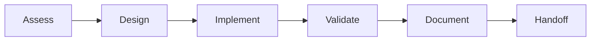
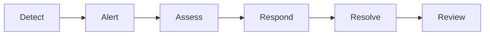

# Multi-Agent Coordination Framework
## Master Documentation for Terraform/Atmos Infrastructure Platform Transformation

---

## 🎯 Mission Statement

Transform the existing Terraform/Atmos infrastructure into a world-class Internal Developer Platform (IDP) through coordinated multi-agent collaboration, achieving 40% developer productivity improvement and 25% cost reduction while maintaining 99.95% availability.

---

## 📁 Documentation Structure

### Core Documents

1. **[PROJECT_STATE_ASSESSMENT.md](./PROJECT_STATE_ASSESSMENT.md)**
   - Current repository analysis
   - Component dependency mapping  
   - Technical debt assessment
   - Maturity evaluation (2.3/5.0)
   - Gap analysis and recommendations

2. **[AGENT_COORDINATION_FRAMEWORK.md](./AGENT_COORDINATION_FRAMEWORK.md)**
   - 14 specialized agent definitions
   - Communication protocols
   - Handoff procedures
   - Conflict resolution framework
   - Quality gates and success criteria

3. **[DEPENDENCY_RISK_ANALYSIS.md](./DEPENDENCY_RISK_ANALYSIS.md)**
   - Component dependency matrix
   - Critical path analysis
   - Risk assessment (Technical & Operational)
   - Failure scenarios and recovery
   - Mitigation strategies

4. **[COMMUNICATION_SUCCESS_METRICS.md](./COMMUNICATION_SUCCESS_METRICS.md)**
   - Communication architecture
   - Message standards and templates
   - Performance KPIs
   - Escalation procedures
   - Success validation framework

5. **[MONITORING_STRATEGY.md](./MONITORING_STRATEGY.md)**
   - Multi-layer monitoring architecture
   - Project health dashboards
   - Agent performance tracking
   - Alert configuration
   - Automated remediation

---

## 🚀 Quick Start for Agents

### Step 1: Initial Setup
```bash
# Clone repository
git clone <repository-url>
cd tf-atmos

# Review coordination documents
cat docs/coordination/README.md
cat docs/coordination/AGENT_COORDINATION_FRAMEWORK.md

# Set up your agent directory
mkdir -p .context/agents/agent-{YOUR_ID}
```

### Step 2: Understand Your Role
1. Find your agent definition in [AGENT_COORDINATION_FRAMEWORK.md](./AGENT_COORDINATION_FRAMEWORK.md)
2. Review your responsibilities and ownership areas
3. Identify your dependencies and integration points
4. Check assigned tasks in `.context/agents/agent-{YOUR_ID}/tasks.yaml`

### Step 3: Begin Work
1. Update your status in `.context/agents/agent-{YOUR_ID}/status.yaml`
2. Follow communication protocols for updates
3. Create handoff documents when transferring work
4. Monitor relevant dashboards and alerts

---

## 📊 Current Project Status

### Overall Progress
- **Components Optimized**: 0/17 (0%)
- **Workflows Automated**: 16/16 (100%)
- **Platform Features**: 30% complete
- **Timeline Status**: Week 1 of 8

### Critical Metrics
| Metric | Current | Target | Gap |
|--------|---------|--------|-----|
| Deployment Frequency | 2-3/week | 10+/day | -85% |
| Lead Time | 2-3 days | < 1 day | -66% |
| MTTR | 2-4 hours | < 1 hour | -75% |
| Change Failure Rate | 15% | < 5% | -67% |
| Developer Self-Service | 10% | 90% | -80% |

### Active Risks
1. **No Platform API** (Score: 12) - All operations require CLI
2. **Limited Observability** (Score: 9) - Missing unified platform
3. **Manual Processes** (Score: 12) - Limited automation
4. **Security Gaps** (Score: 10) - Runtime protection missing

---

## 👥 Agent Registry

### Tier 1: Coordination
- **agent-001**: Context Manager (Master Coordinator)

### Tier 2: Infrastructure
- **agent-002**: Infrastructure Architect
- **agent-003**: Security Specialist
- **agent-004**: Network Engineer

### Tier 3: Platform
- **agent-005**: Backstage Developer
- **agent-006**: API Developer
- **agent-007**: Kubernetes Specialist

### Tier 4: Operations
- **agent-008**: Observability Engineer
- **agent-009**: CI/CD Engineer
- **agent-010**: Cost Optimizer

### Tier 5: Quality
- **agent-011**: Testing Engineer
- **agent-012**: Documentation Specialist
- **agent-013**: Developer Experience Optimizer
- **agent-014**: Compliance Auditor

---

## 🔄 Workflow Patterns

### Standard Development Flow


### Emergency Response Flow


---

## 📈 Success Criteria

### Week 1-2: Foundation
- ✅ Context Manager operational
- ⬜ All agents onboarded
- ⬜ Communication protocols active
- ⬜ Initial assessments complete

### Week 3-4: Integration
- ⬜ 50% components optimized
- ⬜ Backstage portal functional
- ⬜ Platform APIs developed
- ⬜ Monitoring stack deployed

### Week 5-6: Enhancement
- ⬜ All components optimized
- ⬜ Full automation achieved
- ⬜ Documentation complete
- ⬜ Testing comprehensive

### Week 7-8: Production
- ⬜ Production deployment
- ⬜ Performance targets met
- ⬜ Security audit passed
- ⬜ Handover complete

---

## 🛠 Key Technologies

### Infrastructure
- **Terraform**: v1.11.0
- **Atmos**: v1.163.0
- **AWS**: Primary cloud provider
- **Kubernetes/EKS**: Container platform

### Platform
- **Backstage**: Developer portal
- **Python**: CLI and automation (Gaia)
- **Docker**: Local development
- **Helm**: Kubernetes deployments

### Monitoring
- **Prometheus**: Metrics collection
- **Grafana**: Visualization
- **CloudWatch**: AWS native monitoring
- **ELK Stack**: Logging

---

## 📝 Communication Guidelines

### Daily Operations
- Update context files every 4 hours
- Acknowledge messages within 1 hour
- Complete handoffs same day
- Report blockers immediately

### Escalation Path
1. **L1**: Peer agent collaboration (4h)
2. **L2**: Context Manager intervention (2h)
3. **L3**: Technical Lead decision (30m)
4. **L4**: Executive escalation (15m)

### Reporting Schedule
- **Daily**: Status updates at 09:00 UTC
- **Weekly**: Progress report Friday 15:00 UTC
- **Milestone**: Comprehensive review bi-weekly

---

## 🚨 Critical Paths

### Infrastructure Dependencies
```
backend → vpc → iam → securitygroup → eks → eks-addons → monitoring → applications
```

### Workflow Dependencies
```
bootstrap-backend → apply-backend → onboard-environment → validate → plan → apply
```

---

## 📞 Contact & Support

### Communication Channels
- **Primary**: Context files in `.context/`
- **Urgent**: GitHub Issues with @mentions
- **Reports**: `docs/coordination/reports/`
- **Dashboards**: See [MONITORING_STRATEGY.md](./MONITORING_STRATEGY.md)

### Key Resources
- [Project Guidelines](../../CLAUDE.md)
- [Task Dependencies](../../TASK_DEPENDENCIES.md)
- [Workflow Documentation](../../workflows/README.md)
- [Component Documentation](../../components/terraform/)

---

## 🔍 Monitoring & Dashboards

### Available Dashboards
1. **Executive Dashboard**: Overall project health
2. **Technical Dashboard**: Infrastructure status
3. **Agent Dashboard**: Individual performance
4. **Cost Dashboard**: Budget tracking
5. **Security Dashboard**: Compliance status

### Key Metrics to Watch
- Component optimization progress
- Agent task completion rate
- Handoff success rate
- Error and rollback rates
- Cost trends

---

## ✅ Agent Checklist

### Before Starting Work
- [ ] Read all coordination documents
- [ ] Set up agent directory structure
- [ ] Review assigned tasks
- [ ] Identify dependencies
- [ ] Plan execution approach

### During Work
- [ ] Update context files regularly
- [ ] Follow naming conventions
- [ ] Validate all changes
- [ ] Document decisions
- [ ] Communicate blockers

### Before Handoff
- [ ] Complete all tasks
- [ ] Update documentation
- [ ] Run validation checks
- [ ] Create handoff summary
- [ ] Notify next agent

---

## 📋 Templates

### Task Update Template
```yaml
task_id: TASK-XXXX
status: IN_PROGRESS | COMPLETED | BLOCKED
progress: XX%
blockers: []
next_steps: []
eta: ISO8601
```

### Handoff Template
```yaml
from: agent-XXX
to: agent-YYY
component: name
artifacts: [paths]
known_issues: []
success_criteria: []
```

---

## 🎯 Final Goals

By the end of this 8-week transformation:

1. **Developer Experience**: 90% self-service capability
2. **Operational Excellence**: < 1 hour MTTR
3. **Cost Optimization**: 25% reduction achieved
4. **Security Posture**: Zero critical vulnerabilities
5. **Platform Maturity**: Level 4 (Optimized)

---

## 📅 Next Steps

1. **Immediate** (Today):
   - All agents review this documentation
   - Set up context directories
   - Begin initial assessments

2. **Short Term** (This Week):
   - Complete foundation components
   - Establish communication rhythm
   - Start optimization work

3. **Medium Term** (Next 2 Weeks):
   - Platform API development
   - Backstage integration
   - Monitoring implementation

4. **Long Term** (Month 2):
   - Production deployment
   - Performance optimization
   - Knowledge transfer

---

**Framework Version**: 1.0  
**Effective Date**: 2024-01-16  
**Next Review**: 2024-01-23  
**Owner**: Context Manager Agent (agent-001)

---

*"Excellence in coordination leads to excellence in execution"*