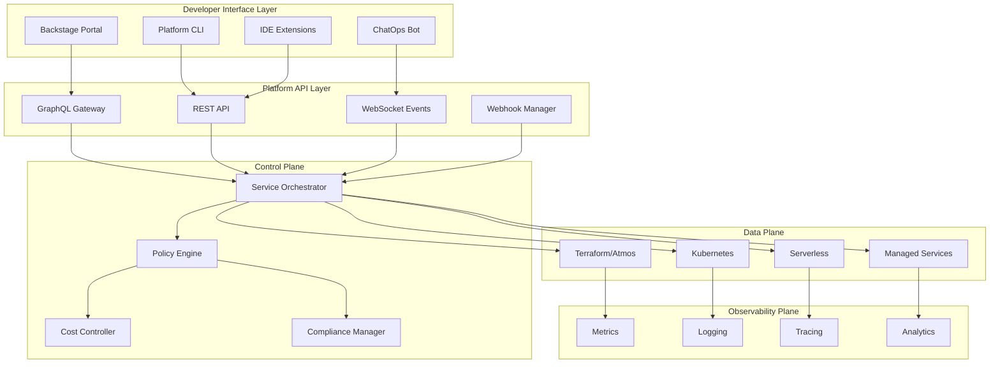

# Internal Developer Platform (IDP) Coordination Framework & Architectural Vision

## Executive Summary

This document establishes the coordination framework and architectural vision for implementing a comprehensive Internal Developer Platform (IDP) using Backstage, building upon your existing Terraform/Atmos infrastructure foundation. The platform will support both local dockerized deployment and enterprise-grade cloud deployment while maintaining accessibility, security, and developer experience as core principles.

## 1. Architectural Vision

### 1.1 Platform Philosophy

**"Developer Experience First, Infrastructure Excellence Second"**

The platform operates on three core principles:
1. **Self-Service by Default**: Developers should never need to understand infrastructure complexity
2. **Golden Paths, Not Golden Cages**: Provide optimal paths while allowing escape hatches
3. **Progressive Disclosure**: Simple things simple, complex things possible

### 1.2 High-Level Architecture



### 1.3 Deployment Models

#### Local Development Mode
- **Stack**: Docker Compose based
- **Components**: PostgreSQL, Redis, MinIO, LocalStack
- **Purpose**: Development, testing, demos
- **Resource Requirements**: 8GB RAM, 4 CPU cores

#### Enterprise Production Mode
- **Stack**: Kubernetes/EKS based
- **Components**: RDS, ElastiCache, S3, AWS Services
- **Purpose**: Production workloads
- **Scalability**: Horizontal auto-scaling

## 2. Agent Coordination Matrix

### 2.1 Agent Responsibilities & Interfaces

| Agent | Primary Domain | Key Deliverables | Dependencies | Success Metrics |
|-------|---------------|------------------|--------------|-----------------|
| **backend-architect** | System design, APIs, data models | - API specifications<br>- Database schemas<br>- Integration patterns | cloud-architect outputs | API response time < 200ms |
| **frontend-developer** | UI/UX, accessibility, client apps | - Component library<br>- Accessibility standards<br>- Mobile responsiveness | backend-architect APIs | WCAG 2.1 AA compliance |
| **deployment-engineer** | CI/CD, containers, automation | - Deployment pipelines<br>- Container images<br>- Rollback strategies | All agent outputs | Deploy time < 5 minutes |
| **cloud-architect** | Infrastructure, security, scalability | - Infrastructure patterns<br>- Security policies<br>- Cost models | backend-architect requirements | 99.95% uptime SLA |
| **dx-optimizer** | Developer workflows, documentation | - Golden paths<br>- Developer docs<br>- Onboarding guides | All agent outputs | Onboarding < 1 day |

### 2.2 Communication Protocol

```yaml
agent_communication:
  sync_points:
    - daily_standup: 09:00 UTC
    - weekly_architecture_review: Monday 14:00 UTC
    - sprint_planning: Bi-weekly Friday 15:00 UTC
  
  decision_escalation:
    level_1: Agent consensus (2+ agents agree)
    level_2: Technical lead review
    level_3: Platform steering committee
  
  artifact_sharing:
    repository: github.com/company/idp-platform
    documentation: confluence.company.com/idp
    designs: figma.com/company-idp
    api_specs: api.company.com/idp/specs
```

### 2.3 Conflict Resolution Framework

```yaml
conflict_resolution:
  technical_conflicts:
    process:
      1. Document both approaches
      2. POC implementation (timeboxed 2 days)
      3. Performance/security comparison
      4. Team vote with technical lead tiebreak
    
  priority_conflicts:
    process:
      1. Business value assessment
      2. Risk analysis
      3. Resource availability check
      4. Product owner decision
  
  design_conflicts:
    process:
      1. User research data review
      2. A/B testing proposal
      3. Accessibility impact assessment
      4. UX team recommendation
```

## 3. Technical Architecture Details

### 3.1 Core Platform Components

#### 3.1.1 Backstage Core Configuration

```typescript
// Platform Core Services
interface PlatformCore {
  // Service Catalog
  catalog: {
    providers: ['github', 'gitlab', 'terraform'];
    processors: ['atmos', 'kubernetes', 'aws'];
    validators: ['schema', 'security', 'cost'];
  };
  
  // Software Templates
  templates: {
    categories: ['microservice', 'serverless', 'database', 'frontend'];
    engines: ['cookiecutter', 'yeoman', 'copier'];
    validation: ['pre-flight', 'post-creation'];
  };
  
  // Tech Docs
  techDocs: {
    builder: 'external';
    storage: 's3';
    search: 'elasticsearch';
  };
}
```

#### 3.1.2 Platform API Gateway

```yaml
api_gateway:
  graphql:
    endpoint: /graphql
    schema_stitching:
      - service_catalog
      - infrastructure
      - cost_management
      - compliance
    rate_limiting:
      per_user: 1000/hour
      per_team: 10000/hour
  
  rest:
    base_path: /api/v1
    versioning: header
    authentication: oauth2
    authorization: rbac
  
  websocket:
    endpoint: /ws
    events:
      - deployment.status
      - cost.alert
      - compliance.violation
      - resource.provisioned
```

### 3.2 Security Architecture

#### 3.2.1 Authentication & Authorization

```yaml
security:
  authentication:
    providers:
      - type: oauth2
        provider: okta
        mfa: required
      - type: saml
        provider: azure_ad
      - type: oidc
        provider: auth0
  
  authorization:
    model: rbac_with_abac
    roles:
      - platform_admin
      - developer
      - viewer
      - cost_manager
    attributes:
      - department
      - project
      - environment
      - cost_center
  
  secrets_management:
    provider: hashicorp_vault
    encryption: aes_256_gcm
    rotation: automated_30_days
```

#### 3.2.2 Network Security

```yaml
network_security:
  ingress:
    waf: aws_waf
    ddos_protection: cloudflare
    rate_limiting: nginx
  
  service_mesh:
    provider: istio
    mtls: enforced
    circuit_breaking: enabled
  
  egress:
    proxy: squid
    allowed_domains: whitelist
    data_loss_prevention: enabled
```

### 3.3 Multi-Tenant Architecture

```yaml
multi_tenancy:
  isolation_model: namespace_per_tenant
  
  resource_quotas:
    compute:
      cpu: 100_cores
      memory: 400Gi
    storage:
      persistent: 10Ti
      object: 100Ti
    network:
      load_balancers: 10
      ingresses: 50
  
  billing:
    model: usage_based
    granularity: hourly
    chargeback: automated
  
  data_isolation:
    database: schema_per_tenant
    storage: bucket_per_tenant
    encryption: key_per_tenant
```

## 4. Accessibility Framework

### 4.1 Core Requirements

```yaml
accessibility:
  standards:
    compliance: WCAG_2.1_AA
    testing: automated_and_manual
    documentation: required
  
  implementation:
    component_library:
      - aria_labels: mandatory
      - keyboard_navigation: full_support
      - screen_reader: tested_with_nvda_jaws
      - color_contrast: 4.5:1_minimum
    
    testing_tools:
      - axe_devtools
      - pa11y
      - lighthouse
      - manual_audit_quarterly
  
  monitoring:
    metrics:
      - accessibility_score
      - keyboard_navigation_coverage
      - screen_reader_compatibility
    alerts:
      - regression_detection
      - compliance_violation
```

### 4.2 Inclusive Design Patterns

```typescript
interface AccessibilityPatterns {
  navigation: {
    skipLinks: boolean;
    breadcrumbs: boolean;
    landmarks: ARIALandmark[];
  };
  
  forms: {
    errorHandling: 'inline' | 'summary';
    fieldDescriptions: boolean;
    progressIndicators: boolean;
  };
  
  feedback: {
    liveRegions: ARIALive[];
    notifications: 'toast' | 'banner' | 'modal';
    confirmations: boolean;
  };
  
  alternatives: {
    images: 'alt_text';
    videos: 'captions' | 'transcripts';
    audio: 'transcripts';
  };
}
```

## 5. Plugin Architecture

### 5.1 Plugin Framework

```typescript
interface PluginArchitecture {
  // Plugin Types
  types: {
    frontend: ReactComponent;
    backend: ExpressRouter;
    processor: CatalogProcessor;
    scaffolder: ScaffolderAction;
  };
  
  // Plugin Lifecycle
  lifecycle: {
    install: () => Promise<void>;
    configure: (config: PluginConfig) => void;
    start: () => Promise<void>;
    stop: () => Promise<void>;
    uninstall: () => Promise<void>;
  };
  
  // Plugin Registry
  registry: {
    discover: () => Plugin[];
    register: (plugin: Plugin) => void;
    validate: (plugin: Plugin) => ValidationResult;
    enable: (pluginId: string) => void;
    disable: (pluginId: string) => void;
  };
}
```

### 5.2 Key Platform Plugins

```yaml
platform_plugins:
  core:
    - catalog: Service and component discovery
    - scaffolder: Template-based provisioning
    - techdocs: Documentation platform
    - kubernetes: K8s resource viewer
  
  infrastructure:
    - terraform_viewer: State visualization
    - atmos_integration: Stack management
    - cost_insights: Cloud spend analysis
    - drift_detector: Configuration drift
  
  developer_experience:
    - api_explorer: Interactive API testing
    - dependency_graph: Service dependencies
    - oncall_scheduler: PagerDuty integration
    - feature_flags: LaunchDarkly integration
  
  compliance:
    - policy_validator: OPA integration
    - security_scanner: Vulnerability scanning
    - audit_logger: Compliance tracking
    - certificate_manager: TLS automation
```

## 6. Observability Strategy

### 6.1 Metrics Architecture

```yaml
metrics:
  collection:
    infrastructure:
      provider: prometheus
      interval: 15s
      retention: 90d
    
    application:
      provider: opentelemetry
      sampling: adaptive
      cardinality: controlled
    
    business:
      provider: custom_events
      storage: timeseries_db
      aggregation: real_time
  
  visualization:
    dashboards:
      - platform_health
      - developer_productivity
      - cost_optimization
      - security_posture
    
    alerts:
      channels: [slack, pagerduty, email]
      severity: [critical, warning, info]
      escalation: tiered
```

### 6.2 Logging Strategy

```yaml
logging:
  collection:
    agents: [fluentbit, filebeat]
    formats: [json, structured]
    enrichment: [trace_id, user_id, tenant_id]
  
  processing:
    pipeline: logstash
    parsing: grok_patterns
    filtering: security_sensitive
  
  storage:
    hot: elasticsearch_7d
    warm: s3_30d
    cold: glacier_1y
  
  analysis:
    search: kibana
    ml: anomaly_detection
    correlation: trace_to_log
```

## 7. Implementation Roadmap

### 7.1 Phase 1: Foundation (Weeks 1-4)

```yaml
phase_1:
  week_1:
    - Setup local development environment
    - Configure Backstage basic installation
    - Integrate with GitHub/GitLab
    - Setup PostgreSQL and Redis
  
  week_2:
    - Implement authentication (OAuth2/SAML)
    - Configure service catalog
    - Import existing Terraform components
    - Setup basic RBAC
  
  week_3:
    - Create first software templates
    - Integrate with Atmos workflows
    - Setup TechDocs
    - Implement basic API gateway
  
  week_4:
    - Deploy to development environment
    - Setup monitoring and logging
    - Conduct security audit
    - Create user documentation
```

### 7.2 Phase 2: Integration (Weeks 5-8)

```yaml
phase_2:
  week_5_6:
    - Integrate with existing CI/CD (Jenkins/Atlantis)
    - Connect to AWS services
    - Implement cost insights
    - Setup compliance checking
  
  week_7_8:
    - Build custom plugins for Atmos
    - Implement drift detection
    - Create golden path templates
    - Setup developer onboarding flow
```

### 7.3 Phase 3: Enhancement (Weeks 9-12)

```yaml
phase_3:
  week_9_10:
    - Implement advanced RBAC with ABAC
    - Setup multi-tenant isolation
    - Deploy service mesh (Istio)
    - Implement progressive delivery
  
  week_11_12:
    - Launch developer portal
    - Conduct accessibility audit
    - Performance optimization
    - Production deployment
```

## 8. Success Metrics & KPIs

### 8.1 Platform Metrics

```yaml
platform_kpis:
  adoption:
    - active_users: > 80% of developers
    - services_onboarded: > 100 in 6 months
    - templates_used: > 500 provisions/month
  
  performance:
    - api_latency_p99: < 200ms
    - ui_load_time: < 2s
    - availability: > 99.95%
  
  developer_experience:
    - time_to_first_deploy: < 30 minutes
    - self_service_ratio: > 90%
    - satisfaction_score: > 4.5/5
  
  operational:
    - mttr: < 1 hour
    - deployment_frequency: > 10/day
    - change_failure_rate: < 5%
    - lead_time: < 1 day
```

### 8.2 Business Metrics

```yaml
business_kpis:
  cost:
    - infrastructure_optimization: 25% reduction
    - developer_productivity: 40% increase
    - operational_overhead: 50% reduction
  
  compliance:
    - policy_violations: < 1%
    - audit_findings: zero_critical
    - security_incidents: < 2/year
  
  innovation:
    - new_services_launched: 2x increase
    - experimentation_velocity: 3x increase
    - time_to_market: 50% reduction
```

## 9. Risk Management

### 9.1 Technical Risks

```yaml
technical_risks:
  - risk: Platform complexity
    mitigation: Incremental rollout, extensive documentation
    owner: backend-architect
  
  - risk: Performance degradation
    mitigation: Load testing, horizontal scaling
    owner: cloud-architect
  
  - risk: Security vulnerabilities
    mitigation: Regular audits, automated scanning
    owner: cloud-architect
  
  - risk: Integration failures
    mitigation: Circuit breakers, fallback mechanisms
    owner: backend-architect
```

### 9.2 Organizational Risks

```yaml
organizational_risks:
  - risk: Adoption resistance
    mitigation: Developer champions, gradual migration
    owner: dx-optimizer
  
  - risk: Skills gap
    mitigation: Training programs, documentation
    owner: dx-optimizer
  
  - risk: Budget overrun
    mitigation: Phased approach, cost monitoring
    owner: cloud-architect
```

## 10. Agent Coordination Guidelines

### 10.1 Handoff Protocol

```yaml
handoff_protocol:
  artifact_requirements:
    - specification: OpenAPI/AsyncAPI/GraphQL schema
    - documentation: README, API docs, examples
    - tests: Unit, integration, contract tests
    - deployment: Dockerfile, Helm charts, CI/CD
  
  review_process:
    - peer_review: Required from 2 agents
    - security_review: Required for all changes
    - accessibility_review: Required for UI changes
    - performance_review: Required for critical paths
```

### 10.2 Integration Points

```yaml
integration_matrix:
  backend_frontend:
    - API contracts via OpenAPI
    - GraphQL schema stitching
    - WebSocket event definitions
  
  backend_deployment:
    - Container specifications
    - Environment variables
    - Health check endpoints
    - Rollback procedures
  
  frontend_deployment:
    - Build artifacts
    - CDN configuration
    - Feature flags
    - A/B test configuration
  
  cloud_all:
    - Infrastructure requirements
    - Security policies
    - Network topology
    - Cost constraints
```

## 11. Quality Assurance Framework

### 11.1 Testing Strategy

```yaml
testing_pyramid:
  unit_tests:
    coverage: > 80%
    frameworks: [jest, pytest, go_test]
  
  integration_tests:
    coverage: > 70%
    tools: [postman, cypress, selenium]
  
  contract_tests:
    provider: pact
    consumer_driven: true
  
  e2e_tests:
    coverage: critical_paths
    environments: [dev, staging]
  
  performance_tests:
    tools: [k6, gatling, jmeter]
    benchmarks: defined_per_service
  
  security_tests:
    sast: sonarqube
    dast: owasp_zap
    dependency: snyk
```

### 11.2 Accessibility Testing

```yaml
accessibility_testing:
  automated:
    - axe_core: Every build
    - pa11y: Nightly
    - lighthouse: Weekly
  
  manual:
    - screen_reader: Monthly
    - keyboard_only: Monthly
    - user_testing: Quarterly
  
  compliance:
    - wcag_audit: Quarterly
    - vpat_update: Annually
```

## 12. Documentation Standards

### 12.1 Documentation Types

```yaml
documentation:
  developer:
    - Getting started guide
    - API reference
    - Plugin development guide
    - Troubleshooting guide
  
  operator:
    - Deployment guide
    - Configuration reference
    - Monitoring guide
    - Disaster recovery procedures
  
  end_user:
    - User manual
    - Video tutorials
    - FAQ
    - Best practices
```

### 12.2 Documentation Maintenance

```yaml
documentation_process:
  ownership:
    - Each agent owns their domain docs
    - dx-optimizer coordinates overall docs
  
  review:
    - Technical accuracy: Domain expert
    - Clarity: Technical writer
    - Completeness: QA team
  
  updates:
    - API changes: Automated from OpenAPI
    - Screenshots: Quarterly refresh
    - Examples: With each release
```

## Conclusion

This coordination framework provides a comprehensive blueprint for implementing your Internal Developer Platform using Backstage. The architecture supports both local development and enterprise deployment while maintaining focus on accessibility, security, and developer experience.

Key success factors:
1. **Clear agent responsibilities** with defined interfaces
2. **Progressive implementation** with measurable milestones
3. **Accessibility-first design** throughout the platform
4. **Robust plugin architecture** for extensibility
5. **Comprehensive observability** for operational excellence

Each agent should use this framework as their north star while implementing their specific domain, ensuring consistency and cohesion across the entire platform.