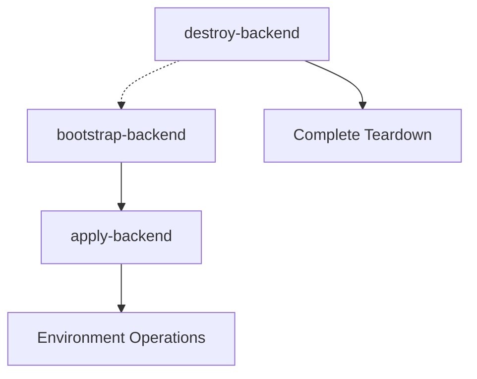
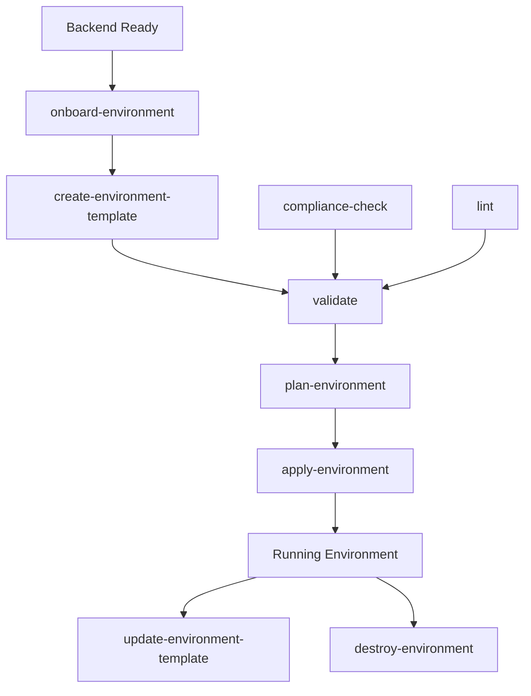
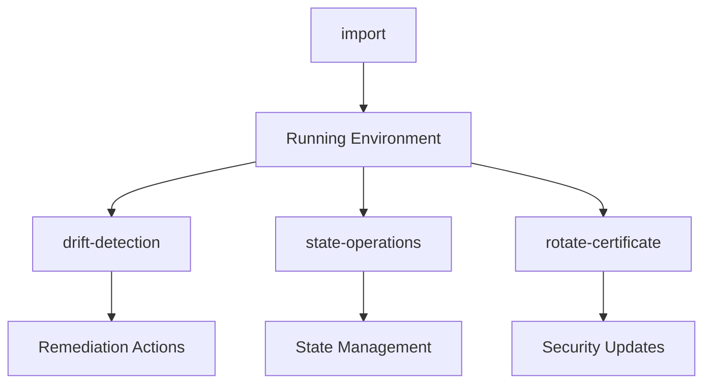

# Task Dependencies and Execution Order

## Workflow Dependencies Map

### Backend Infrastructure (Foundation Layer)


**Execution Order:**
1. `bootstrap-backend` - Initialize S3 bucket and DynamoDB table
2. `apply-backend` - Configure backend settings
3. Ready for environment operations

**Dependencies:**
- AWS credentials with admin permissions
- Unique bucket naming strategy
- DynamoDB table region consistency

### Environment Lifecycle


**Execution Order:**
1. `onboard-environment` - Set up environment structure
2. `create-environment-template` - Generate initial configuration
3. `validate` - Validate all configurations
4. `lint` - Code quality checks
5. `compliance-check` - Security and compliance validation
6. `plan-environment` - Generate execution plans
7. `apply-environment` - Deploy infrastructure

**Dependencies:**
- Backend infrastructure must be ready
- Environment-specific variables configured
- Network CIDR blocks allocated
- IAM roles and policies in place

### Operations and Maintenance


**Execution Order:**
- `drift-detection` - Daily/weekly monitoring
- `import` - As needed for existing resources  
- `state-operations` - When state issues occur
- `rotate-certificate` - Quarterly security maintenance

**Dependencies:**
- Environment must be deployed and accessible
- Monitoring tools configured
- Certificate management system in place

## Parameter Dependencies

### Required Parameters by Workflow

| Workflow | tenant | account | environment | region | component | Notes |
|----------|--------|---------|-------------|--------|-----------|-------|
| bootstrap-backend | ✅ | ✅ | - | ✅ | - | Creates global backend |
| apply-backend | ✅ | ✅ | - | ✅ | - | Updates backend config |
| onboard-environment | ✅ | ✅ | ✅ | ✅ | - | Full environment setup |
| create-environment-template | ✅ | ✅ | ✅ | - | - | Template generation |
| validate | ✅ | ✅ | ✅ | ✅ | ✅ | Component validation |
| lint | - | - | - | - | - | Global code quality |
| compliance-check | ✅ | ✅ | ✅ | ✅ | - | Environment compliance |
| plan-environment | ✅ | ✅ | ✅ | ✅ | - | All components |
| apply-environment | ✅ | ✅ | ✅ | ✅ | - | All components |
| drift-detection | ✅ | ✅ | ✅ | ✅ | - | Compare state |
| import | ✅ | ✅ | ✅ | ✅ | ✅ | Resource import |
| state-operations | ✅ | ✅ | ✅ | ✅ | - | State management |
| rotate-certificate | ✅ | ✅ | ✅ | ✅ | - | Certificate rotation |
| update-environment-template | ✅ | ✅ | ✅ | - | - | Template updates |
| destroy-environment | ✅ | ✅ | ✅ | ✅ | - | Environment teardown |
| destroy-backend | ✅ | ✅ | - | ✅ | - | Backend teardown |

### Common Parameter Patterns

**Standard Environment Parameters:**
```bash
tenant="fnx"
account="dev|staging|prod"
environment="testenv-01|staging|production"
region="us-west-2|us-east-1"
```

**Component-Specific Parameters:**
```bash
component="vpc|eks|rds|lambda|..."  # For single component operations
vpc_cidr="10.0.0.0/16"             # Network allocation
```

## Execution Contexts

### Development Context
```bash
# Quick iteration cycle
lint → validate → plan-environment → apply-environment
```

### Staging Context
```bash
# Full validation cycle  
compliance-check → validate → lint → plan-environment → manual-approval → apply-environment
```

### Production Context
```bash
# Maximum safety cycle
drift-detection → compliance-check → validate → plan-environment → change-control-board → apply-environment → post-deployment-validation
```

## Resource Dependencies

### Network Dependencies
- VPC must exist before subnets
- Subnets required for EKS, RDS
- Security groups depend on VPC
- Route tables need internet gateways

### Security Dependencies  
- IAM roles created before resource assignment
- KMS keys before encrypted resources
- Certificate manager before HTTPS services
- Secrets manager before application deployment

### Platform Dependencies
- EKS cluster before node groups
- Node groups before application workloads
- Load balancers after target resources
- DNS records after load balancers

## Error Recovery Procedures

### Backend Recovery
1. Check S3 bucket accessibility
2. Verify DynamoDB table status
3. Validate state lock operations
4. Restore from backup if needed

### Environment Recovery
1. Run drift-detection to assess current state
2. Use state-operations to unlock if needed
3. Re-run validation workflows
4. Apply incremental fixes or full rebuild

### Component Recovery
1. Import existing resources if needed
2. Validate component configuration
3. Plan and apply specific component
4. Verify integration with dependent components

## Automation Guidelines

### CI/CD Integration
- Validation workflows in PR checks
- Staging deployment in merge pipeline
- Production deployment with manual gates
- Drift detection in scheduled jobs

### Monitoring Integration
- Workflow execution tracking
- Resource state monitoring
- Compliance status reporting
- Certificate expiration alerts

## Security Considerations

### Access Controls
- Backend workflows: Platform admin access
- Environment workflows: Account-specific access
- Component workflows: Resource-specific permissions
- Operations workflows: Read-only where possible

### Audit Requirements
- All workflow executions logged
- Parameter values recorded (excluding secrets)
- State changes tracked
- Approval workflows for production changes