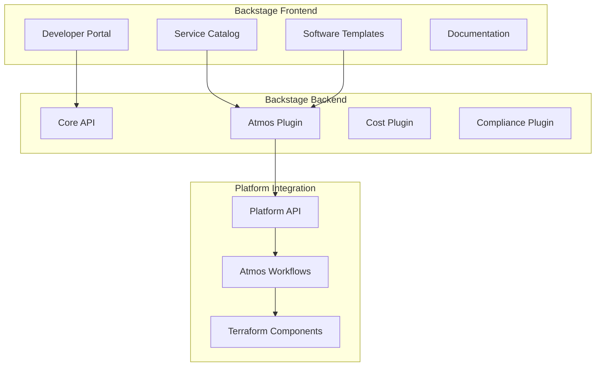

# Backstage Platform - Developer Portal

This directory contains the Backstage-based Internal Developer Platform that provides self-service capabilities and comprehensive tooling for developers working with infrastructure and applications.

## 🏗️ **Architecture Overview**



## 📁 **Directory Structure**

```
platform/backstage/
├── app-config.yaml              # Main Backstage configuration
├── app-config.production.yaml   # Production-specific configuration
├── atmos.yaml                   # Atmos configuration for Backstage
├── package.json                 # Root package.json with workspaces
├── packages/
│   ├── backend/                 # Backstage backend application
│   │   ├── Dockerfile          # Production container image
│   │   ├── package.json        # Backend dependencies
│   │   └── src/
│   │       └── index.ts        # Backend entry point with custom plugins
│   └── app/                     # Backstage frontend application (to be created)
├── plugins/                     # Custom platform-specific plugins
│   ├── atmos/                  # Atmos integration plugin
│   │   ├── package.json        # Plugin dependencies
│   │   └── src/
│   │       ├── index.ts        # Plugin entry point
│   │       ├── service/        # Atmos service integration
│   │       ├── types.ts        # TypeScript type definitions
│   │       └── router.ts       # API routes
│   ├── cost-tracking/          # Cost analysis plugin (to be created)
│   └── compliance/             # Compliance checking plugin (to be created)
├── catalog/                    # Backstage catalog definitions
│   ├── all.yaml               # Main catalog discovery file
│   ├── components/            # Platform component definitions
│   ├── systems/               # System definitions
│   └── org/                   # Organization structure
└── README.md                  # This file
```

## 🚀 **Getting Started**

### Prerequisites

- Node.js 18 or 20
- Docker and Docker Compose
- Terraform >= 1.6.0
- Atmos CLI >= 1.48.0
- Access to AWS environment

### Local Development Setup

1. **Install dependencies:**
   ```bash
   yarn install
   ```

2. **Set up environment variables:**
   ```bash
   # Copy example environment file
   cp .env.example .env
   
   # Edit environment variables
   vim .env
   ```

3. **Start development servers:**
   ```bash
   # Start both frontend and backend
   yarn dev
   
   # Or start individually
   yarn start-backend  # Backend on :7007
   yarn start          # Frontend on :3000
   ```

4. **Access the platform:**
   - Frontend: http://localhost:3000
   - Backend API: http://localhost:7007
   - Health check: http://localhost:7007/api/platform/atmos/health

### Production Deployment

1. **Build the application:**
   ```bash
   yarn build
   yarn build-image
   ```

2. **Deploy using provided Terraform component:**
   ```bash
   # From repository root
   atmos terraform apply backstage -s fnx-prod-us-west-2
   ```

## 🔌 **Platform Integrations**

### Atmos Integration

The Backstage platform provides deep integration with your existing Atmos infrastructure:

- **Stack Discovery**: Automatically discovers all Atmos stacks and components
- **Workflow Execution**: Execute Atmos workflows directly from the UI
- **Component Validation**: Validate Terraform components before deployment
- **State Management**: View and manage Terraform state information

### Example API Usage

```typescript
// Get all Atmos stacks
const stacks = await fetch('/api/platform/atmos/stacks');

// Execute a workflow
const result = await fetch('/api/platform/atmos/workflows/execute', {
  method: 'POST',
  headers: { 'Content-Type': 'application/json' },
  body: JSON.stringify({
    workflow: 'onboard-environment',
    parameters: {
      tenant: 'acme',
      account: 'dev',
      environment: 'sandbox-01'
    }
  })
});
```

### Service Catalog Integration

Services are automatically discovered from:
- Atmos component definitions
- Service catalog YAML files in `/catalog/services/`
- Software templates in `/catalog/templates/`

Example service definition:
```yaml
apiVersion: backstage.io/v1alpha1
kind: Component
metadata:
  name: vpc-service
  title: Virtual Private Cloud
  description: Secure network foundation for AWS workloads
  annotations:
    atmos.tools/component: vpc
    cost.platform.com/monthly-estimate: "$45-90"
spec:
  type: infrastructure-service
  lifecycle: production
  owner: platform-team
  system: networking
```

## 🛠️ **Custom Plugins**

### Atmos Plugin

Provides comprehensive integration with Atmos CLI and workflows:

**Features:**
- Stack and component discovery
- Workflow execution with real-time status
- Validation and compliance checking
- Infrastructure state visualization

**API Endpoints:**
- `GET /api/platform/atmos/stacks` - List all stacks
- `GET /api/platform/atmos/components` - List all components  
- `POST /api/platform/atmos/workflows/execute` - Execute workflows
- `POST /api/platform/atmos/services/provision` - Provision services

### Cost Tracking Plugin (Planned)

Will provide cost analysis and FinOps capabilities:
- Real-time cost estimation for infrastructure changes
- Budget tracking and alerts
- Cost optimization recommendations
- Chargeback and showback reporting

### Compliance Plugin (Planned)

Will provide security and compliance automation:
- Policy as code validation
- Security posture assessment
- Compliance reporting and dashboards
- Remediation recommendations

## 🔧 **Configuration**

### Environment Variables

Key environment variables for production deployment:

```bash
# Database Configuration
POSTGRES_HOST=backstage-db.company.com
POSTGRES_PORT=5432
POSTGRES_USER=backstage
POSTGRES_PASSWORD=<secure-password>
POSTGRES_DB=backstage

# Authentication
AUTH_GITHUB_CLIENT_ID=<github-app-client-id>
AUTH_GITHUB_CLIENT_SECRET=<github-app-client-secret>
GITHUB_TOKEN=<github-personal-access-token>

# AWS Configuration  
AWS_DEFAULT_REGION=us-west-2
AWS_ROLE_ARN=arn:aws:iam::123456789012:role/backstage-role

# Platform Integration
PLATFORM_API_TOKEN=<api-token>
ARGOCD_TOKEN=<argocd-token>
GRAFANA_TOKEN=<grafana-token>

# Application URLs
BACKSTAGE_BASE_URL=https://platform.company.com
BACKSTAGE_BACKEND_URL=https://api.platform.company.com
```

### Atmos Configuration

The `atmos.yaml` file configures Atmos behavior within Backstage:

```yaml
components:
  terraform:
    base_path: "infrastructure/components/terraform"
    apply_auto_approve: false
    deploy_run_init: true

stacks:
  base_path: "infrastructure/stacks"
  name_pattern: "{tenant}-{account}-{environment}"

workflows:
  base_path: "infrastructure/workflows"
```

## 📊 **Monitoring & Observability**

### Health Checks

- **Application Health**: `/health`
- **Atmos Plugin Health**: `/api/platform/atmos/health`
- **Database Health**: Automatic connection monitoring
- **External Services**: Periodic connectivity checks

### Metrics Collection

The platform exposes metrics on port 9090:
- Request rates and response times
- Authentication success/failure rates
- Atmos workflow execution metrics
- Database connection pool status

### Logging

Structured JSON logging with configurable levels:
- **Development**: Pretty-printed logs to console
- **Production**: JSON logs with correlation IDs
- **Audit**: Separate audit log for security events

## 🔐 **Security**

### Authentication & Authorization

- **GitHub OAuth**: Primary authentication method
- **AWS IAM**: Service-to-service authentication
- **RBAC**: Role-based access control for different user types

### Security Headers

Production deployment includes comprehensive security headers:
- Content Security Policy (CSP)
- HTTP Strict Transport Security (HSTS)
- X-Frame-Options
- X-Content-Type-Options

### Secrets Management

- Environment variables for runtime secrets
- AWS Secrets Manager integration for sensitive data
- Kubernetes secrets for container deployment

## 🧪 **Testing**

### Running Tests

```bash
# Unit tests
yarn test

# Integration tests
yarn test:all

# End-to-end tests
yarn test:e2e

# Linting and type checking
yarn lint
yarn tsc
```

### Test Structure

- **Unit Tests**: Plugin and service logic
- **Integration Tests**: API endpoints and database operations
- **E2E Tests**: Full user workflows with Playwright
- **Performance Tests**: Load testing for critical paths

## 🚢 **Deployment**

### Docker Deployment

```bash
# Build production image
yarn build-image

# Run with docker-compose
docker-compose up -d
```

### Kubernetes Deployment

The platform is deployed via the Terraform `backstage` component:

```bash
# Deploy to development
atmos terraform apply backstage -s fnx-dev-testenv-01

# Deploy to production
atmos terraform apply backstage -s fnx-prod-us-west-2
```

### CI/CD Pipeline

The platform integrates with your existing CI/CD processes:
- **GitHub Actions**: Automated testing and deployment
- **Atlantis**: Infrastructure change management
- **ArgoCD**: Application deployment and GitOps

## 🤝 **Contributing**

### Development Workflow

1. **Create feature branch** from main
2. **Implement changes** with tests
3. **Run quality checks**: `yarn lint && yarn test`
4. **Create pull request** with description
5. **Deploy to development** environment for testing

### Plugin Development

To create a new plugin:

```bash
# Generate plugin scaffold
yarn new --select plugin

# Follow the prompts to create your plugin structure
```

### Code Standards

- **TypeScript**: Strict mode with comprehensive type coverage
- **ESLint**: Backstage recommended configuration
- **Prettier**: Automatic code formatting
- **Conventional Commits**: Semantic commit messages

## 📚 **Additional Resources**

- **Backstage Documentation**: https://backstage.io/docs
- **Atmos Documentation**: https://atmos.tools/
- **Platform API Documentation**: https://api.platform.company.com/docs
- **Internal Runbooks**: `/docs/platform/runbooks/`

## 🆘 **Support**

- **Platform Team**: #platform-support in Discord
- **Documentation Issues**: Create issue in repository
- **Feature Requests**: Platform team office hours (Fridays 2-4 PM)
- **Emergency Support**: On-call rotation via PagerDuty

---

**Happy Platform Engineering! 🚀**