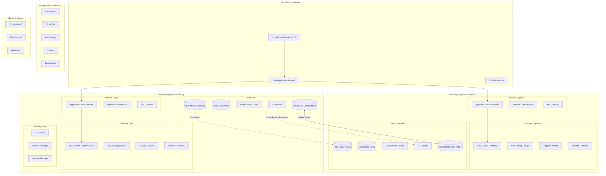

# Enterprise Internal Developer Platform (IDP) - Cloud Architecture

## Executive Summary

This document outlines the enterprise-grade cloud architecture for an Internal Developer Platform designed to support 1000+ developers across multiple teams and organizations, with 99.9% uptime SLA, multi-region deployment, and comprehensive security and compliance requirements.

## 1. High-Level Cloud Architecture



## 2. Multi-Region Deployment Strategy

### Primary-Secondary Architecture
- **Primary Region**: US-East-1 (N. Virginia) - Active
- **Secondary Region**: EU-West-1 (Ireland) - Warm Standby
- **Tertiary Region**: AP-Southeast-1 (Singapore) - Cold Standby

### Data Replication Strategy
```yaml
replication_strategy:
  databases:
    postgresql:
      type: "Aurora Global Database"
      rpo: "1 second"
      rto: "< 1 minute"
      failover: "Automated with manual approval"
    
    dynamodb:
      type: "Global Tables"
      consistency: "Eventually consistent"
      replication_lag: "< 1 second"
    
    redis:
      type: "Cross-region snapshots"
      backup_frequency: "Every 6 hours"
      rto: "15 minutes"
    
    opensearch:
      type: "Cross-cluster replication"
      sync_type: "Continuous"
      lag: "< 5 seconds"
  
  object_storage:
    s3:
      type: "Cross-Region Replication"
      replication_time: "15 minutes (99.99% SLA)"
      storage_class: "Intelligent-Tiering"
```

### Traffic Distribution
```yaml
traffic_routing:
  global_accelerator:
    health_check_interval: 30
    threshold: 3
    endpoint_weights:
      primary: 100
      secondary: 0  # Increases during failover
    
  route53:
    routing_policy: "Geolocation with failover"
    health_checks:
      - type: "HTTPS"
        interval: 30
        failure_threshold: 3
    
  cdn_distribution:
    providers:
      - cloudfront:
          origins:
            - us-east-1
            - eu-west-1
          cache_behaviors:
            static_content: 86400
            api_responses: 60
            user_content: 3600
```

## 3. Security Architecture & Zero-Trust Implementation

### Network Security Architecture
```yaml
network_security:
  vpc_design:
    cidr_blocks:
      production:
        us-east-1: "10.0.0.0/16"
        eu-west-1: "10.1.0.0/16"
        ap-southeast-1: "10.2.0.0/16"
    
    subnets:
      public:
        - purpose: "Load Balancers, NAT Gateways"
        - cidr: "/24 per AZ"
      
      private:
        - purpose: "Application workloads"
        - cidr: "/23 per AZ"
      
      data:
        - purpose: "Databases, Cache"
        - cidr: "/24 per AZ"
        - no_internet: true
    
    security_groups:
      web_tier:
        ingress:
          - protocol: "HTTPS"
            port: 443
            source: "WAF"
      
      app_tier:
        ingress:
          - protocol: "HTTP"
            port: 8080
            source: "web_tier"
      
      data_tier:
        ingress:
          - protocol: "PostgreSQL"
            port: 5432
            source: "app_tier"
```

### Zero-Trust Architecture
```yaml
zero_trust:
  principles:
    - never_trust_always_verify
    - least_privilege_access
    - assume_breach
    - verify_explicitly
  
  implementation:
    identity_verification:
      mfa_required: true
      session_timeout: 8_hours
      device_trust: "Managed devices only"
      
    network_segmentation:
      microsegmentation: true
      east_west_firewall: true
      service_mesh: "Istio with mTLS"
      
    application_access:
      rbac: true
      abac: true
      just_in_time_access: true
      privileged_access_management: true
    
    data_protection:
      encryption_at_rest: "AES-256"
      encryption_in_transit: "TLS 1.3"
      tokenization: true
      dlp_policies: true
```

### IAM & Access Control
```yaml
iam_strategy:
  identity_providers:
    primary: "Okta/Azure AD"
    federation: "SAML 2.0"
    protocols:
      - OIDC
      - OAuth 2.0
      - LDAP
  
  role_hierarchy:
    platform_admin:
      permissions: ["*"]
      mfa: "Hardware token"
      approval: "2-person rule"
    
    team_lead:
      permissions: ["team:*", "read:*"]
      mfa: "App-based"
      
    developer:
      permissions: ["namespace:own", "read:shared"]
      mfa: "App-based"
    
    viewer:
      permissions: ["read:public"]
      mfa: "SMS/App"
  
  service_accounts:
    rotation: "90 days"
    vault_integration: true
    workload_identity: true
```

## 4. Scalability Patterns & Auto-Scaling Policies

### Compute Scaling
```yaml
auto_scaling:
  kubernetes:
    hpa:  # Horizontal Pod Autoscaler
      metrics:
        - cpu: 70%
        - memory: 80%
        - custom: "requests_per_second > 1000"
      min_replicas: 3
      max_replicas: 100
      scale_down_delay: 300
    
    vpa:  # Vertical Pod Autoscaler
      mode: "Auto"
      resource_policy:
        container_policies:
          - container_name: "*"
            min_allowed:
              cpu: "100m"
              memory: "128Mi"
            max_allowed:
              cpu: "2"
              memory: "8Gi"
    
    cluster_autoscaler:
      min_nodes: 3
      max_nodes: 50
      scale_down_delay: 600
      skip_nodes_with_system_pods: true
  
  serverless:
    lambda:
      reserved_concurrency: 100
      provisioned_concurrency: 10
      max_concurrency: 1000
    
    fargate:
      task_min: 2
      task_max: 20
      target_value: 70  # CPU utilization
```

### Database Scaling
```yaml
database_scaling:
  aurora:
    writer_instance:
      instance_class: "r6g.2xlarge"
      auto_minor_upgrade: true
    
    read_replicas:
      min: 1
      max: 15
      auto_scaling:
        target_metric: "CPU"
        target_value: 70
        scale_in_cooldown: 300
        scale_out_cooldown: 60
    
    aurora_serverless_v2:
      min_acu: 0.5
      max_acu: 128
      
  connection_pooling:
    pgbouncer:
      pool_mode: "transaction"
      max_client_conn: 10000
      default_pool_size: 25
      max_db_connections: 100
  
  caching_strategy:
    redis:
      cluster_mode: true
      num_node_groups: 3
      replicas_per_node_group: 2
      automatic_failover: true
      multi_az: true
      
    cache_patterns:
      - pattern: "Read-through"
        ttl: 3600
      - pattern: "Write-behind"
        write_delay: 5
      - pattern: "Cache-aside"
        lazy_loading: true
```

### API & Traffic Management
```yaml
api_management:
  rate_limiting:
    global:
      requests_per_second: 10000
      burst: 15000
    
    per_client:
      requests_per_minute: 1000
      requests_per_hour: 50000
      requests_per_day: 1000000
    
    tier_based:
      free:
        rpm: 100
        daily: 10000
      standard:
        rpm: 1000
        daily: 100000
      enterprise:
        rpm: 10000
        daily: "unlimited"
  
  throttling:
    algorithm: "Token bucket"
    refill_rate: 1000
    bucket_size: 5000
    
  circuit_breaker:
    failure_threshold: 5
    success_threshold: 2
    timeout: 30
    half_open_requests: 3
```

## 5. Disaster Recovery & Business Continuity Plan

### RTO/RPO Targets
```yaml
recovery_objectives:
  tiers:
    tier_0_critical:
      services: ["Authentication", "API Gateway", "Core Database"]
      rto: "15 minutes"
      rpo: "1 minute"
      
    tier_1_essential:
      services: ["CI/CD", "Git", "Container Registry"]
      rto: "1 hour"
      rpo: "15 minutes"
      
    tier_2_standard:
      services: ["Monitoring", "Logging", "Documentation"]
      rto: "4 hours"
      rpo: "1 hour"
      
    tier_3_non_critical:
      services: ["Analytics", "Reporting", "Training"]
      rto: "24 hours"
      rpo: "24 hours"
```

### Backup Strategy
```yaml
backup_strategy:
  databases:
    frequency:
      full: "Daily at 2 AM UTC"
      incremental: "Every hour"
      transaction_log: "Every 5 minutes"
    
    retention:
      daily: 7
      weekly: 4
      monthly: 12
      yearly: 7
    
    testing:
      restore_test: "Weekly"
      full_dr_drill: "Quarterly"
  
  object_storage:
    s3_lifecycle:
      current: 30_days
      infrequent_access: 90_days
      glacier: 365_days
      deep_archive: 7_years
    
    versioning: true
    mfa_delete: true
    object_lock: "Governance mode"
```

### Failover Procedures
```yaml
failover_runbook:
  detection:
    automated_monitors:
      - health_checks: "Every 30 seconds"
      - synthetic_transactions: "Every minute"
      - multi_region_checks: true
    
    alerting:
      channels:
        - pagerduty: "Critical alerts"
        - slack: "All alerts"
        - email: "Summary reports"
  
  decision_tree:
    level_1:
      condition: "Single service degradation"
      action: "Auto-scale and reroute traffic"
      approval: "Automatic"
      
    level_2:
      condition: "Multiple services affected"
      action: "Partial failover to secondary"
      approval: "On-call engineer"
      
    level_3:
      condition: "Complete region failure"
      action: "Full failover to secondary region"
      approval: "Engineering manager + CTO"
  
  rollback:
    validation_checks:
      - data_consistency
      - transaction_integrity
      - user_session_continuity
    
    rollback_window: "4 hours"
    data_reconciliation: "Required"
```

## 6. Compliance & Audit Framework

### Compliance Standards
```yaml
compliance_frameworks:
  certifications:
    - SOC2_Type_II:
        audit_frequency: "Annual"
        scope: "Full platform"
    
    - ISO_27001:
        certification_body: "External"
        renewal: "Every 3 years"
    
    - GDPR:
        data_residency: "EU data in EU regions"
        right_to_erasure: "Automated"
        
    - HIPAA:
        encryption: "AES-256"
        audit_logs: "7 year retention"
```

### Audit Logging
```yaml
audit_configuration:
  cloudtrail:
    multi_region: true
    log_file_validation: true
    event_selectors:
      - read_write_type: "All"
        include_management_events: true
        data_resources:
          - type: "AWS::S3::Object"
          - type: "AWS::RDS::DBCluster"
          - type: "AWS::Lambda::Function"
  
  application_logs:
    format: "JSON"
    required_fields:
      - timestamp
      - user_id
      - session_id
      - action
      - resource
      - result
      - ip_address
    
    retention:
      hot: 30_days
      warm: 90_days
      cold: 7_years
  
  log_analysis:
    siem: "Splunk/ELK"
    anomaly_detection: true
    threat_intelligence: true
```

## 7. Cost Optimization Strategies

### Resource Optimization
```yaml
cost_optimization:
  compute:
    spot_instances:
      percentage: 70
      diversification: "10 instance types"
      on_demand_base: 30
    
    savings_plans:
      compute: "3-year, All Upfront"
      coverage_target: 75
    
    rightsizing:
      review_frequency: "Monthly"
      automation: true
      recommendations: "AWS Compute Optimizer"
  
  storage:
    s3_intelligent_tiering: true
    ebs_gp3_migration: true
    snapshot_lifecycle: 
      retention: 30_days
      
  database:
    aurora_serverless: "Non-prod environments"
    reserved_instances: "Production"
    dev_shutdown: "Nights and weekends"
```

### Cost Allocation
```yaml
cost_allocation:
  tagging_strategy:
    mandatory_tags:
      - Environment
      - Team
      - Project
      - CostCenter
      - Owner
      - Application
    
    enforcement: "AWS Organizations SCP"
    compliance_check: "AWS Config Rules"
  
  chargeback_model:
    allocation_method: "Tags + Usage"
    billing_frequency: "Monthly"
    reports:
      - team_level: "Detailed with recommendations"
      - executive: "Summary with trends"
    
  budgets:
    alerts:
      - 80%: "Warning"
      - 90%: "Critical"
      - 100%: "Prevent new resources"
    
    forecasting: "ML-based prediction"
```

## 8. Operational Runbooks

### Deployment Procedures
```yaml
deployment_runbook:
  blue_green:
    steps:
      1: "Deploy to green environment"
      2: "Run smoke tests"
      3: "Run integration tests"
      4: "Gradual traffic shift (10%, 50%, 100%)"
      5: "Monitor for 30 minutes"
      6: "Keep blue for quick rollback"
    
    rollback_trigger:
      - error_rate: "> 1%"
      - latency_p99: "> 1000ms"
      - availability: "< 99.9%"
  
  canary:
    initial_traffic: 5%
    increment: 20%
    interval: 10_minutes
    analysis:
      - error_rates
      - latency_metrics
      - business_metrics
```

### Incident Response
```yaml
incident_response:
  severity_levels:
    sev1:
      definition: "Complete platform outage"
      response_time: "5 minutes"
      escalation: "Immediate to CTO"
      
    sev2:
      definition: "Major feature unavailable"
      response_time: "15 minutes"
      escalation: "Engineering Manager"
      
    sev3:
      definition: "Minor feature degradation"
      response_time: "1 hour"
      escalation: "Team Lead"
  
  war_room:
    communication: "Dedicated Slack channel"
    roles:
      - incident_commander
      - technical_lead
      - communications_lead
      - scribe
    
    documentation:
      - timeline
      - actions_taken
      - impact_assessment
      - root_cause
      - prevention_measures
```

### Monitoring & Alerting
```yaml
monitoring_stack:
  metrics:
    prometheus:
      retention: 90_days
      scrape_interval: 30s
      federation: true
    
    custom_metrics:
      - business_kpis
      - user_experience
      - cost_metrics
  
  dashboards:
    grafana:
      - executive_dashboard
      - technical_operations
      - security_overview
      - cost_analytics
    
  alerting:
    alert_manager:
      routing:
        - match: {severity: critical}
          receiver: pagerduty
        - match: {severity: warning}
          receiver: slack
      
      inhibit_rules:
        - source_match: {severity: critical}
          target_match: {severity: warning}
```

## 9. Performance Optimization

### Application Performance
```yaml
performance_optimization:
  cdn_strategy:
    static_content:
      cache_control: "public, max-age=31536000"
      compression: "gzip, brotli"
      
    dynamic_content:
      cache_control: "private, max-age=60"
      edge_computing: "CloudFront Functions"
  
  database_performance:
    query_optimization:
      - indexes: "Automated recommendations"
      - query_cache: true
      - prepared_statements: true
    
    connection_pooling:
      min_connections: 10
      max_connections: 100
      idle_timeout: 300
  
  api_optimization:
    graphql:
      query_depth_limit: 10
      query_complexity_limit: 1000
      batching: true
      
    rest:
      pagination: "Cursor-based"
      filtering: "Server-side"
      compression: true
```

## 10. Security Operations

### Threat Detection
```yaml
security_operations:
  threat_detection:
    guardduty:
      enabled: true
      threat_intel_feeds: true
      s3_protection: true
      
    security_hub:
      standards:
        - aws_foundational_security
        - cis_aws_foundations
        - pci_dss
    
    macie:
      s3_scanning: "All buckets"
      sensitive_data_discovery: true
  
  vulnerability_management:
    scanning:
      containers: "Trivy, Clair"
      dependencies: "Snyk, Dependabot"
      infrastructure: "Prowler, ScoutSuite"
    
    patching:
      critical: "24 hours"
      high: "7 days"
      medium: "30 days"
      low: "90 days"
```

## Implementation Timeline

### Phase 1: Foundation (Months 1-3)
- Setup multi-region infrastructure
- Implement core networking and security
- Deploy primary region services
- Establish monitoring and logging

### Phase 2: Scaling (Months 4-6)
- Implement auto-scaling policies
- Deploy secondary region
- Setup disaster recovery
- Implement cost optimization

### Phase 3: Hardening (Months 7-9)
- Complete security certifications
- Implement compliance controls
- Full DR testing
- Performance optimization

### Phase 4: Operations (Months 10-12)
- Complete automation
- Advanced monitoring
- Cost optimization refinement
- Full platform launch

## Conclusion

This enterprise IDP architecture provides a robust, scalable, and secure platform capable of supporting 1000+ developers with 99.9% uptime SLA. The multi-region deployment, comprehensive security controls, and operational excellence practices ensure business continuity and compliance with enterprise requirements.